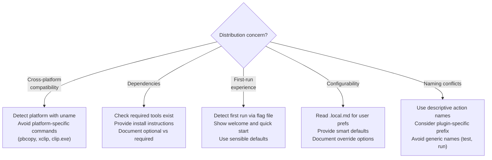

# Plugin Command Patterns

Features and patterns specific to commands bundled in Claude Code plugins.

## Plugin Command Discovery

Claude Code auto-discovers commands in the plugin's `commands/` directory:

```text
plugin-name/
├── commands/              # Auto-discovered
│   ├── foo.md            # /foo (plugin:plugin-name)
│   └── bar.md            # /bar (plugin:plugin-name)
└── plugin.json
```

No manual registration required. Commands appear in `/help` with
`(plugin:plugin-name)` label.

### Namespaced Commands

Organize in subdirectories for logical grouping:

```text
commands/
├── review/
│   ├── security.md    # /security (plugin:plugin-name:review)
│   └── style.md       # /style (plugin:plugin-name:review)
└── deploy/
    ├── staging.md     # /staging (plugin:plugin-name:deploy)
    └── prod.md        # /prod (plugin:plugin-name:deploy)
```

Use namespaces when the plugin has 5+ commands.

### Naming Conventions

- Be descriptive and action-oriented
- Avoid conflicts with common command names (`test`, `run`)
- Use hyphens for multi-word names
- Consider prefixing with plugin name for uniqueness

## CLAUDE_PLUGIN_ROOT

`${CLAUDE_PLUGIN_ROOT}` resolves to the absolute path of the plugin directory.
It enables portable paths within plugin commands.

### Basic Usage

```markdown
---
description: Analyze using plugin script
allowed-tools: Bash(node:*), Read
---

Run analysis: !`node ${CLAUDE_PLUGIN_ROOT}/scripts/analyze.js $1`

Read template: @${CLAUDE_PLUGIN_ROOT}/templates/report.md
```

### Common Patterns

**Execute plugin scripts:**

```markdown
!`node ${CLAUDE_PLUGIN_ROOT}/scripts/lint.js $1`
!`bash ${CLAUDE_PLUGIN_ROOT}/scripts/build.sh`
```

**Load plugin configuration:**

```markdown
@${CLAUDE_PLUGIN_ROOT}/config/deploy-config.json
@${CLAUDE_PLUGIN_ROOT}/config/$1.json
```

**Use plugin templates:**

```markdown
@${CLAUDE_PLUGIN_ROOT}/templates/api-report.md
```

**Multi-step plugin workflows:**

```markdown
Step 1: !`bash ${CLAUDE_PLUGIN_ROOT}/scripts/prepare.sh $1`
Step 2: @${CLAUDE_PLUGIN_ROOT}/config/$1.json
Step 3: !`${CLAUDE_PLUGIN_ROOT}/bin/execute $1`
```

### CLAUDE_PLUGIN_ROOT Best Practices

1. **Always use for plugin-internal paths** — never use relative paths like `./templates/foo.md` (resolves relative to cwd, not plugin)
2. **Validate file existence** before use:

   ```markdown
   !`test -f ${CLAUDE_PLUGIN_ROOT}/config.json && echo "exists" || echo "missing"`
   ```

3. **Combine with arguments** for dynamic paths:

   ```markdown
   !`${CLAUDE_PLUGIN_ROOT}/bin/process.sh $1 $2`
   @${CLAUDE_PLUGIN_ROOT}/config/$1-deploy.json
   ```

### Troubleshooting

- **Variable not expanding** — ensure command is loaded from a plugin (not project/user commands)
- **File not found** — verify file exists in plugin directory, check path relative to plugin root
- **Path with spaces** — bash execution handles spaces automatically, no special quoting needed

## Integration with Plugin Components

### Launching Plugin Agents

```markdown
---
description: Deep code review
argument-hint: [file-path]
---

Initiate comprehensive review of @$1 using the code-reviewer agent.

The agent will analyze code structure, security, performance.

Agent uses: ${CLAUDE_PLUGIN_ROOT}/config/rules.json
```

The agent must exist in the plugin's `agents/` directory. Claude uses the
Task tool to launch it.

### Leveraging Plugin Skills

```markdown
---
description: Document API with standards
argument-hint: [api-file]
---

Document API in @$1 following the api-docs-standards skill.

The skill provides standard templates, best practices, and
quality validation criteria.
```

Mention the skill by name in the command body. The skill must exist in the
plugin's `skills/` directory.

### Coordinating with Hooks

Commands can prepare state for hooks to process:

- Commands write files or trigger events
- Hooks execute automatically on tool events (PreToolUse, PostToolUse)
- Document expected hook behavior in the command

### Multi-Component Workflows

Combine scripts, agents, skills, and templates:

```markdown
---
description: Comprehensive review workflow
argument-hint: [file-path]
allowed-tools: Bash(node:*), Read
---

Target: @$1

Phase 1 — Static Analysis:
!`node ${CLAUDE_PLUGIN_ROOT}/scripts/analyze.js $1`

Phase 2 — Deep Review:
Launch code-reviewer agent for detailed analysis.

Phase 3 — Standards Check:
Use coding-standards skill for validation.

Phase 4 — Report:
@${CLAUDE_PLUGIN_ROOT}/templates/review.md
Compile findings into report following template.
```

## Validation Patterns

### Input Validation

```markdown
Validate environment: !`echo "$1" | grep -E "^(dev|staging|prod)$" || echo "INVALID"`

If valid: deploy to $1.
If invalid: explain valid environments (dev, staging, prod).
```

### Plugin Resource Validation

```markdown
---
allowed-tools: Bash(test:*)
---

Validate plugin setup:
- Config: !`test -f ${CLAUDE_PLUGIN_ROOT}/config.json && echo "Y" || echo "N"`
- Scripts: !`test -d ${CLAUDE_PLUGIN_ROOT}/scripts && echo "Y" || echo "N"`
- Tools: !`test -x ${CLAUDE_PLUGIN_ROOT}/bin/analyze && echo "Y" || echo "N"`

If all pass, proceed. Otherwise, report missing components.
```

### Error Handling

```markdown
Execute: !`bash ${CLAUDE_PLUGIN_ROOT}/scripts/build.sh 2>&1 || echo "BUILD_FAILED"`

If succeeded: report success and output location.
If failed: analyze error output, suggest causes, provide troubleshooting steps.
```

## Marketplace Distribution Guidelines

Commands distributed via marketplace must work across environments:



### Key Distribution Principles

1. **Self-contained** — minimal external dependencies
2. **Graceful degradation** — reduced functionality when optional tools missing
3. **Forgiving** — anticipate and handle user mistakes
4. **Discoverable** — clear name, good description, searchable keywords
5. **Idempotent** — safe to run multiple times
6. **Versioned** — track changes, support deprecation notices

Source: Adapted from Anthropic's plugin-dev command-development
references/plugin-features-reference.md, references/marketplace-considerations.md,
examples/simple-commands.md, and examples/plugin-commands.md.
