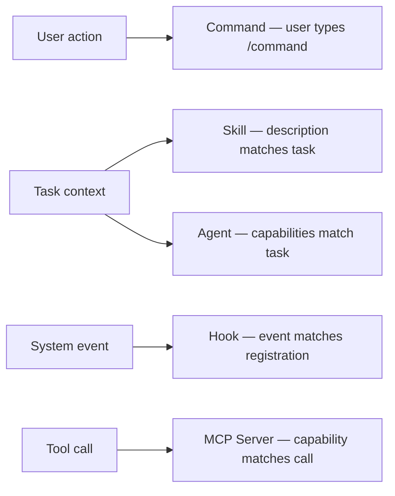
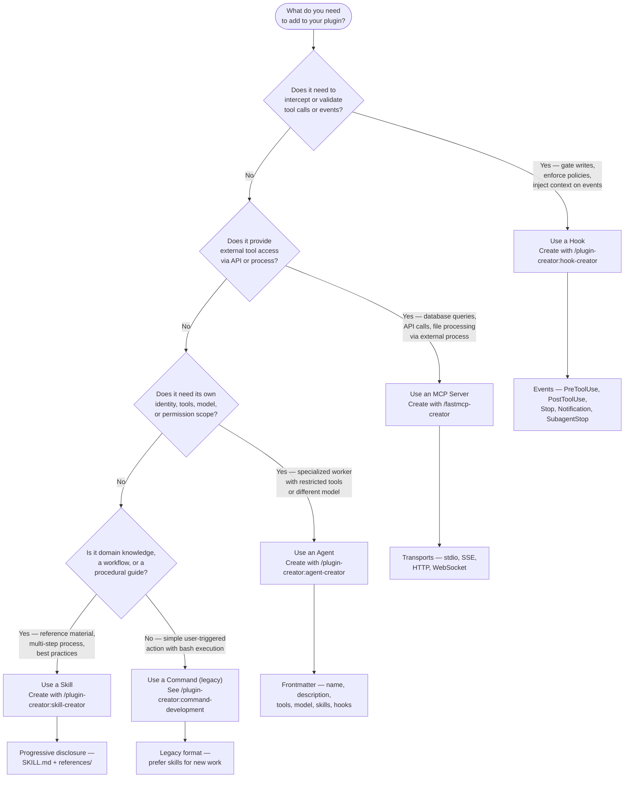
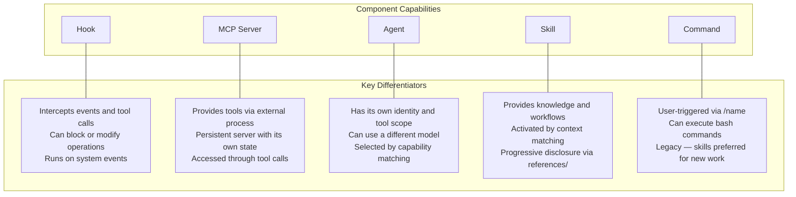
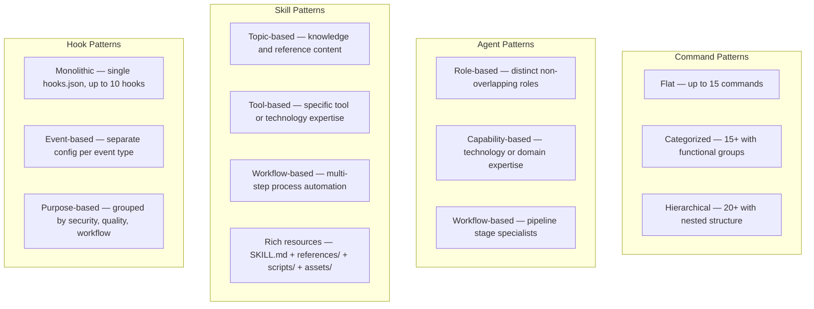

## Component Lifecycle

Every plugin component goes through two phases — discovery at startup and activation at runtime.

### Discovery Phase

When Claude Code starts, it processes each enabled plugin:

1. Scan enabled plugins — read `.claude-plugin/plugin.json`
2. Discover components — search default and custom paths
3. Parse definitions — read YAML frontmatter and configuration files
4. Register components — make available to Claude Code
5. Initialize — start MCP servers, register hooks

Discovery happens once during Claude Code initialization, not continuously. Components added after startup require a session restart to become available.

### Activation Phase

Each component type activates through a different mechanism:



SOURCE: Adapted from `../claude-plugins-official/plugins/plugin-dev/skills/plugin-structure/references/component-patterns.md` lines 1-27

## Component Selection Framework

Use this decision tree to select the right component type for a given need.



### Quick Reference



SOURCE: Decision framework derived from component capabilities documented in `../claude-plugins-official/plugins/plugin-dev/skills/plugin-structure/references/component-patterns.md` and `/plugin-creator:claude-plugins-reference-2026`

### Agent Security Profile — Plugin vs. Direct Install

Agents shipped inside a plugin have a restricted security profile compared to agents installed directly. Factor this into the decision framework above — not every agent capability works in every install path.

**Plugin-shipped agents have a restricted security profile:**

- `hooks` declared in frontmatter: silently ignored at runtime
- `mcpServers` declared in frontmatter: not supported
- `permissionMode` declared in frontmatter: not supported; agent will not start correctly

Directly-installed agents (`.claude/agents/` or `~/.claude/agents/`) support all frontmatter fields.

**Decision rule**: If an agent requires hooks for lifecycle automation, MCP server declarations, or custom permission modes — it must be directly installed, not shipped inside a plugin.

SOURCE: [Claude Code Plugins Reference](https://code.claude.com/docs/en/plugins-reference.md) line 182 (accessed 2026-04-23)

## Organization Patterns by Component Type

For detailed organization patterns (directory structures, scaling strategies, when-to-use guidance) for each component type, see [component organization reference](./references/organization-patterns.md).

Summary of available patterns:



## Cross-Component Patterns

When plugins grow beyond simple single-component designs, these patterns help manage complexity.

### Shared Resources

Components can share common utilities via a `lib/` directory at the plugin root:

```text
plugin/
├── commands/
│   └── test.md        # references lib/test-utils.sh
├── agents/
│   └── tester.md      # references lib/test-utils.sh
├── hooks/
│   └── scripts/
│       └── pre-test.sh # sources lib/test-utils.sh
└── lib/
    ├── test-utils.sh
    └── deploy-utils.sh
```

Access shared resources via `${CLAUDE_PLUGIN_ROOT}/lib/` in scripts.

### Layered Architecture

Separate concerns into layers for large plugins (100+ files):

```text
plugin/
├── commands/          # User interface layer
├── agents/            # Orchestration layer
├── skills/            # Knowledge layer
└── lib/
    ├── core/          # Core business logic
    ├── integrations/  # External service adapters
    └── utils/         # Shared helper functions
```

### Modular Extensions

Optional features as self-contained modules within the plugin:

```text
plugin/
├── .claude-plugin/
│   └── plugin.json
├── core/
│   ├── commands/
│   └── agents/
└── extensions/
    ├── extension-a/
    │   ├── commands/
    │   └── agents/
    └── extension-b/
        ├── commands/
        └── agents/
```

Register extension paths in `plugin.json` under `commands` and `agents` arrays. Note that listing paths explicitly overrides auto-discovery — all paths must be listed or unlisted components become invisible.

SOURCE: Cross-component patterns adapted from `../claude-plugins-official/plugins/plugin-dev/skills/plugin-structure/references/component-patterns.md` lines 448-535

## Best Practices

- **Start simple** — use flat structures, reorganize when growth demands it
- **Consistent naming** — match file names to component purpose using full descriptive words
- **Minimize nesting** — deep directory structures slow discovery and increase configuration burden
- **Use defaults** — rely on auto-discovery paths (`commands/`, `agents/`, `skills/`) before adding custom paths to `plugin.json`
- **Separate concerns** — do not mix unrelated functionality in the same component
- **Plan for growth** — choose structures that scale without requiring full reorganization

## Related Skills

- For creating hooks — `/plugin-creator:hook-creator`
- For creating agents — `/plugin-creator:agent-creator`
- For creating skills — `/plugin-creator:skill-creator`
- For MCP server creation — `/fastmcp-creator`
- For command development (legacy) — `/plugin-creator:command-development`
- For full plugin lifecycle — `/plugin-creator:plugin-lifecycle`
- For plugin structure and plugin.json schema — `/plugin-creator:claude-plugins-reference-2026`
- For plugin settings and .local.md patterns — `/plugin-creator:plugin-settings`
