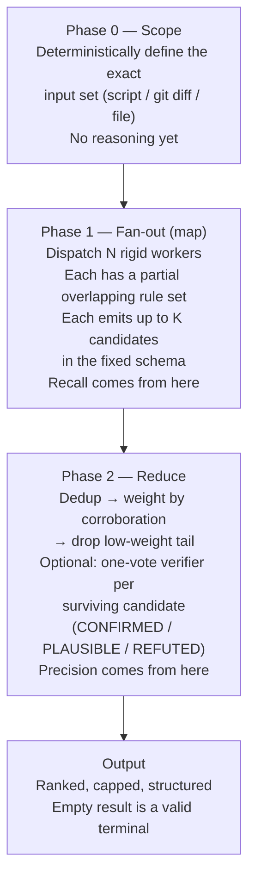

# Ensemble Rule Review

A skill-design pattern for rule-following work. Instead of one agent holding the whole ruleset
in a single pass, partition the ruleset across multiple cheap, rigid, parallel sub-agents whose
coverage deliberately overlaps. Collect findings in a fixed schema, then weight by
cross-agent corroboration and drop the low-weight tail.

## The Problem It Solves

A single agent holding a large ruleset (10+ criteria) and reviewing non-trivial input:

- Is slow (it reasons across the whole rubric serially).
- Silently drops criteria — attention degrades as the rule list grows, so coverage is
  incomplete and you cannot tell which rules were actually applied.

This is the same failure mode as instruction bloat: more rules in one context window means
higher probability each individual rule is under-applied.

## The Mechanism (6 Parts)

1. **Control header.** One line at the top compiles an effort/scale parameter into concrete
   knobs: worker count, candidates per worker, verify policy, output cap. The same skill body
   scales rigor by the parameter.

2. **Deliberate overlap, not just partition.** Worker scenarios are engineered so their goals
   INTERSECT. A genuine finding falls inside multiple workers' coverage and is reported more
   than once. A hallucination falls inside one worker's blank-filling and is reported once.
   Overlap converts N cheap opinions into a signal-to-noise instrument. Pure non-overlapping
   partition gives speed but NOT denoising. For the overlap construction, use a balanced rotating
   assignment (cyclic block design — N groups, N agents, each agent a window of w groups) so every
   rule gets equal redundancy; see the playbook's "Balanced rotating overlap" section.

3. **Zero-creativity workers.** Each sub-agent gets a rigid, explicit process and a PARTIAL
   rule set — stated methodology, fixed output schema, no interpretation latitude. Shrink each
   worker's job until it is mechanical matching, which is the band where a cheap model is
   reliable.

4. **Cheap/fast model on purpose.** Haiku (or cheapest tier) is unreliable when forced to
   infer or fill blanks — so the design removes the inference. Cheap and fast is what makes
   running several workers over the same input affordable.

5. **Fixed candidate schema.** Every worker emits the same shape (e.g., `rule_id, location,
   verdict, evidence`). This contract makes dedup, corroboration counting, and merge possible.

6. **Corroboration weighting + drop the tail (the reducer).** The orchestrator collects all
   findings, deduplicates near-identical ones, raises weight for findings corroborated across
   overlapping workers and sinks lone-worker findings, trashes the low-weight tail, keeps the
   high-weight set. A single worker's hallucination sinks below the keep threshold.

## Why It Works

More total facts pass through cheap/fast workers; corroboration weighting cancels the noise;
the surviving set is MORE reliable than one expensive agent, not less. This is bagging /
majority-vote ensembling applied to LLM rule-checking.

SOURCE: User-reported result (conversation 2026-05-30, not independently reproduced): a
scientific-journal review skill — one Sonnet agent holding the full ruleset took 14-18 minutes
on a 300-line file and returned 13 findings. Splitting the rules into 4 categories and running
4 Haiku agents (each with a partial rule list) on the same file returned 14 findings in
25 seconds — comparable recall, ~35x faster.

## Pipeline Phases

## Degrees of Freedom

| Component | Freedom | Reason |
|-----------|---------|--------|
| Workers | HIGH rigidity / LOW freedom | Rigid rule list, fixed schema; shrinks job to mechanical matching |
| Reducer + output contract | LOW freedom | Fixed verdict set, fixed schema, hard cap |

## Model and Effort Guidance

- **Workers:** cheapest tier (haiku), effort low. The job is reduced to mechanical matching
  and the overlap denoises single-worker errors.
- **Reducer / orchestrator:** mid tier (sonnet), effort medium. It weights and merges.
- Do NOT run an expensive model on a job a rigid cheap worker can do.

SOURCE: `/plugin-creator:agentskills` — degrees-of-freedom guidance and model selection by
task cognitive requirement.

## When to Use / When Not to Use

**Use when:**

- Rule-following / checklist / rubric work with 10+ independent criteria.
- A single agent currently applies the whole ruleset in one pass (slow + silent drops).
- The ruleset can be split into scenario-bound jobs with some overlap.

**Do NOT use when:**

- Single-pass transforms with no ruleset (map-reduce overhead exceeds the return).
- Tasks needing one coherent creative judgment that cannot be partitioned without losing whole-picture context.
- Rulesets under ~5 criteria (splitting yields little).

**Multi-phase / sequential workflows are NOT disqualified.** Do not score the whole pipeline as
one unit — score each phase. A sequential workflow is the conductor; each rule-following phase
becomes its own internal ensemble and each independent-work phase becomes a work-partition
fan-out, while the phase ordering stays sequential. There are two fan-out flavors:

- **Ensemble-denoising** (this skill's core) — same input, overlapping rule slices, corroboration
  weighting. For checking / review / rubric phases.
- **Work-partition** — disjoint independent work items in parallel, no corroboration, pure
  speedup. For generative phases (implement N functions, write N test files, scan N docs).

See [./references/composing-in-workflows.md](./references/composing-in-workflows.md) for the
per-phase classification rule and a worked map of a 9-phase workflow.

## How to Partition the Ruleset

**Explicit lists — partition is free.** When the ruleset already names its categories, those
categories ARE the worker boundaries. Examples:

- Named principle frameworks: the 12 factors of twelve-factor; the 5 SOLID principles;
  OWASP categories for a security review; WCAG criteria for accessibility; Nielsen's 10
  usability heuristics for a UI critique.
- An enumerated `## Checklist` or `## Quality Criteria` section.

**Implicit lists — enumerate first, then partition.** A rubric is named but not enumerated;
make it explicit, then split. Examples:

- "look for modernization opportunities" → an explicit PEP roster (585 generics, 604 unions,
  572 walrus, 634 match, 673 Self, StrEnum, tomllib, pathlib, dataclasses) → buckets.
- "ensure it's pythonic / idiomatic" → comprehensions, context managers, EAFP,
  enumerate/zip, mutable-default-arg, truthiness.
- "review for quality" → correctness / error-handling / naming / dead-code / structure.
- "follow best practices" / "avoid anti-patterns" → enumerate the named patterns.

**The tell:** any instruction containing "ensure … follows", "review for", "look for …
opportunities", or a named framework is an implicit (or pre-partitioned) checklist.

For the full typology of implicit-checklist patterns grouped by partition-readiness — named
principle sets, "modernization / idiomatic / pythonic", "review X for quality", and
prompt-engineering / skill-quality self-review (with per-pattern examples) — load
[./references/partitioning-patterns.md](./references/partitioning-patterns.md).

## Operational Use

Two procedures and one reusable contract turn this pattern from concept into action:

- **Convert an existing single-pass skill into the ensemble form** — follow
  [./references/conversion-workflow.md](./references/conversion-workflow.md). (Also the recipe for
  standardizing the `multi-perspective-review` prior art below.)
- **Run an ensemble ad hoc, mid-task, as an orchestrator** — follow
  [./references/orchestrator-playbook.md](./references/orchestrator-playbook.md): the
  recognize → decompose → dispatch → reduce loop, the partition knobs, and the
  corroboration-weighting reducer algorithm.
- **Reusable worker contract** — copy
  [./assets/worker-prompt-skeleton.md](./assets/worker-prompt-skeleton.md): the rigid worker
  prompt and the fixed candidate schema both procedures share.
- **Planner script** — run `./scripts/plan_ensemble.py RULES.json --report-dir /abs/dir` (tested;
  `./scripts/test_plan_ensemble.py`) to compute the rotating-overlap assignment deterministically.
  It assigns each worker its groups + an absolute OUTFILE, tags rules per-group, verifies uniform
  redundancy, and prints the recommended `--keep-threshold` — removing the manual bookkeeping that
  caused this session's bugs (wrong paths, drifted group ids, ad-hoc overlap, per-worker tagging).
- **Reducer script** — run `./scripts/reduce.py` (tested; `./scripts/test_reduce.py`) over the
  worker output files to dedup, corroboration-weight on `(group, location)`, drop the tail, and
  rank. Workers emit a stable `group` id (the corroboration key) plus a free-form `rule` slug
  (descriptive only) — keying on the slug would never corroborate, since workers name rules
  differently.

The two scripts are deterministic bookends around the only fuzzy step (the LLM workers' rule
matching): **plan_ensemble.py → spawn focused-reviewer ×N → reduce.py**.

### The worker agent

Spawn the `plugin-creator:focused-reviewer` agent as each map worker — a lean haiku agent with
minimal tools (`Read, Grep, Glob, Bash, Write`) and no inherited skills, built to apply one rule
slice and emit the fixed schema. Do NOT use `general-purpose` workers: they inherit every skill
and MCP tool description, adding a large constant token cost to every one of the N parallel
workers. For web/API targets, the spawner adds the one specific MCP tool to the worker's tools.

### Partition the ruleset, not the input

Every worker reviews the SAME input; only its rule slice differs. The denoising comes from
overlapping rule coverage on shared input — multiple workers independently reaching the same
finding, which the reducer counts as corroboration. Sharding the input instead (different files
per worker) buys speed but NOT denoising, because no two workers can corroborate the same
location. Shard input only as a secondary axis when one worker cannot hold the whole input, and
keep rule-overlap within each shard.

## Prior Art and Reference Implementation

The pattern is already running in-repo as a partial implementation:

- `plugins/development-harness/skills/multi-perspective-review/SKILL.md` — a working 4-worker
  parallel review fan-out (Security, Performance, Quality, Accessibility) with per-worker SOPs
  and a merge gate.
- `plugins/development-harness/agents/reviewer-{security,quality,performance,accessibility}.md`
  — the rigid worker agents.

It lacks two pieces vs the full pattern: a fixed candidate schema and an explicit
corroboration-weight reducer (it merges by any-REJECT, not corroboration weighting).

The control-header + finder-angles + constrained-verdict-verify + capped-output structure
originates in the Anthropic-bundled `/code-review` built-in skill.

SOURCE: `/plugin-creator:agentskills` — progressive disclosure, lean SKILL.md, skill packaging
discipline.

For the ranked catalog of in-repo conversion candidates (Tier 0-3, clusters C1-C9), load
[./references/conversion-candidates.md](./references/conversion-candidates.md).
