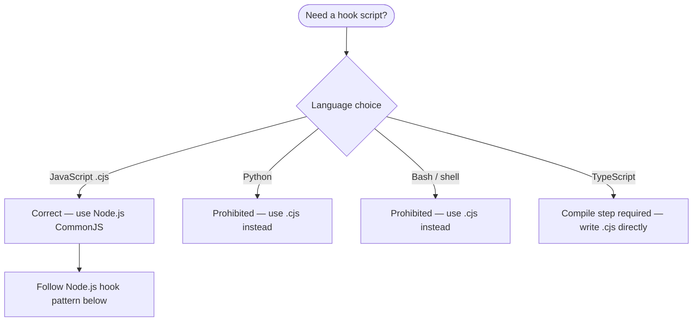
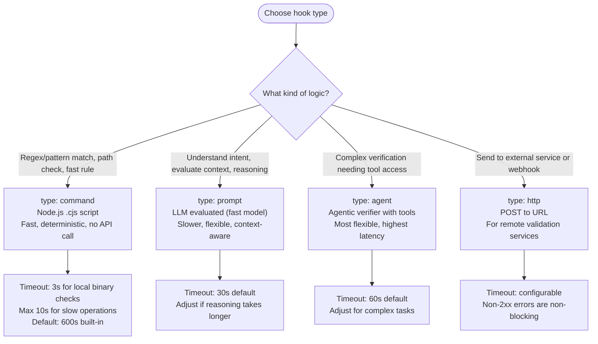

# Hook Creator for Claude Code Plugins

Create hooks that integrate with the Claude Code event system. Hooks automate validation, enforcement, and context injection across the session lifecycle.

For the complete hooks I/O API and JSON schemas, load: `Skill(skill: "plugin-creator:hooks-io-api")`
For working code examples and plugin hook configuration patterns, load: `Skill(skill: "plugin-creator:hooks-patterns")`
For all hook events, matchers, and environment variables, load: `Skill(skill: "plugin-creator:hooks-core-reference")`

---

## Language Constraint — Node.js Only

Hook scripts in this repository use **Node.js `.cjs` exclusively**.



**Evidence**: `orchestrator-discipline` plugin hooks (`pre-tool-orchestrator-read-warning.cjs`, `pre-tool-diagnostic-command-gate.cjs`), `.claude/hooks/session-start-backlog.cjs`, `.claude/hooks/session-start-rtica.cjs`, `.claude/hooks/stop-backlog-reminder.cjs`.

SOURCE: Repository observation 2026-02-21 — all hooks use `.cjs` (Node.js CommonJS).

---

## Node.js Hook Template

All hooks follow this structure:

```javascript
#!/usr/bin/env node
/**
 * Brief description of what this hook does.
 * Fires on: EventName — ToolMatcher
 * Action: blocking | non-blocking — what it does
 */

const { execFileSync } = require('node:child_process');
const fs = require('node:fs');

let input = '';
process.stdin.setEncoding('utf8');
process.stdin.on('data', (chunk) => { input += chunk; });
process.stdin.on('end', () => {
  let data = {};
  try {
    data = JSON.parse(input);
  } catch {
    process.stdout.write(JSON.stringify({}));
    process.exit(0);
  }

  // Extract fields
  const toolName = data.tool_name || '';
  const toolInput = data.tool_input || {};

  // Guard: exit early if this hook does not apply
  if (toolName !== 'Write') {
    process.stdout.write(JSON.stringify({}));
    process.exit(0);
  }

  // Hook logic here
  const output = {
    hookSpecificOutput: {
      hookEventName: 'PreToolUse',
      additionalContext: 'Context injected into Claude.',
    },
  };

  process.stdout.write(JSON.stringify(output));
  process.exit(0);
});
```

**Critical rules:**

- Use `process.stdin.on('data')` / `process.stdin.on('end')` — not synchronous stdin reads
- Exit with `process.exit(0)` for success, `process.exit(2)` for blocking error
- Write JSON to stdout via `process.stdout.write(JSON.stringify(output))`
- Suppress stderr — use `stdio: ['ignore', 'pipe', 'ignore']` when calling child processes via `execFileSync`
- Output empty `{}` on early exit paths, not nothing

---

## hooks.json Structure

Plugin hooks live in `hooks/hooks.json` inside the plugin directory.

**Empty state (hooks file exists but no active hooks):**

```json
{"hooks": {}}
```

The file must exist. Remove entries to disable hooks. Remove the file only when decommissioning the plugin.

**Active hooks format:**

```json
{
  "description": "Brief explanation of what these hooks enforce",
  "hooks": {
    "PreToolUse": [
      {
        "matcher": "Write|Edit",
        "hooks": [
          {
            "type": "command",
            "command": "node \"${CLAUDE_PLUGIN_ROOT}/hooks/my-hook.cjs\"",
            "timeout": 3
          }
        ]
      }
    ],
    "Stop": [
      {
        "hooks": [
          {
            "type": "prompt",
            "prompt": "Verify the task is complete. Return {\"ok\": true} or {\"ok\": false, \"reason\": \"...\"}.",
            "timeout": 30
          }
        ]
      }
    ]
  }
}
```

**Path rule**: Always use `${CLAUDE_PLUGIN_ROOT}/hooks/filename.cjs` — never hardcoded paths.

SOURCE: `plugins/orchestrator-discipline/hooks.json` (lines 1-25), verified 2026-02-19.

---

## Event Selection

```mermaid
flowchart TD
    Start([What should the hook do?]) --> Q1{When does it act?}
    Q1 -->|Before a tool runs — can block| PreToolUse[PreToolUse + tool name matcher]
    Q1 -->|After a tool succeeds| PostToolUse[PostToolUse + tool name matcher]
    Q1 -->|After a tool fails| PostToolUseFailure[PostToolUseFailure + tool name matcher]
    Q1 -->|Before Claude stops responding| Stop[Stop — no matcher]
    Q1 -->|When subagent spawned| SubagentStart[SubagentStart — matcher: agent type name]
    Q1 -->|When subagent finishes| SubagentStop[SubagentStop — matcher: agent type name]
    Q1 -->|Agent team teammate going idle| TeammateIdle[TeammateIdle — no matcher]
    Q1 -->|Task being marked complete| TaskCompleted[TaskCompleted — no matcher]
    Q1 -->|CLAUDE.md or rules file loaded| InstructionsLoaded[InstructionsLoaded — no matcher]
    Q1 -->|Config file changes| ConfigChange[ConfigChange — matcher: config source]
    Q1 -->|Worktree being created| WorktreeCreate[WorktreeCreate — no matcher]
    Q1 -->|Worktree being removed| WorktreeRemove[WorktreeRemove — no matcher]
    Q1 -->|MCP server requests user input| Elicitation[Elicitation — matcher: MCP server name]
    Q1 -->|User responds to MCP elicitation| ElicitationResult[ElicitationResult — matcher: MCP server name]
    Q1 -->|When user submits a prompt| UserPromptSubmit[UserPromptSubmit — no matcher]
    Q1 -->|When session starts| SessionStart[SessionStart — matcher: startup|resume|clear|compact]
    Q1 -->|When session ends| SessionEnd[SessionEnd — matcher: exit reason]
    Q1 -->|Before context compaction| PreCompact[PreCompact — matcher: manual|auto]
    Q1 -->|After context compaction| PostCompact[PostCompact — matcher: manual|auto]
    Q1 -->|On repo setup or maintenance| Setup[Setup — matcher: init|maintenance]
    Q1 -->|When Claude sends notifications| Notification[Notification — notification matcher]
    PreToolUse --> HookType[Choose hook type]
    PostToolUse --> HookType
    PostToolUseFailure --> HookType
    Stop --> HookType
    SubagentStart --> HookType
    SubagentStop --> HookType
    TeammateIdle --> HookType
    TaskCompleted --> HookType
    InstructionsLoaded --> HookType
    ConfigChange --> HookType
    WorktreeCreate --> HookType
    WorktreeRemove --> HookType
    Elicitation --> HookType
    ElicitationResult --> HookType
    UserPromptSubmit --> HookType
    SessionStart --> HookType
    SessionEnd --> HookType
    PreCompact --> HookType
    PostCompact --> HookType
    Setup --> HookType
    Notification --> HookType
    HookType --> Q2{Decision logic complexity?}
    Q2 -->|Deterministic rule — fast| Command[type: command — Node.js .cjs]
    Q2 -->|Context-aware — needs reasoning| Prompt[type: prompt — LLM-evaluated]
    Q2 -->|Complex verification with tools| Agent[type: agent — agentic verifier]
    Q2 -->|Send to external service| HTTP[type: http — POST to URL]
```

**Events with matchers (non-tool)**: `SubagentStart`/`SubagentStop` match agent type name; `SessionEnd` matches exit reason; `ConfigChange` matches config source; `Elicitation`/`ElicitationResult` match MCP server name.

**Events without matchers**: `Stop`, `UserPromptSubmit`, `TeammateIdle`, `TaskCompleted`, `InstructionsLoaded`, `WorktreeCreate`, `WorktreeRemove` — omit the `matcher` field entirely.

---

## Hook Type Selection



**Prompt hook response schema** (LLM must return):

```json
{"ok": true}
```

or:

```json
{"ok": false, "reason": "Explanation shown to Claude"}
```

---

## Timeout Sizing

| Operation type | Timeout |
|----------------|---------|
| Local file check, regex match | 3s |
| External binary (linter, formatter) | 5–10s |
| Network call | 15–30s |
| Prompt hook (LLM evaluation) | 30s default |

**Default**: 600s for command hooks, 30s for prompt hooks, 60s for agent hooks (Claude Code built-in).
Set explicit timeouts to reflect actual operation time — oversized timeouts mask runaway scripts.

Note: The Agent tool was renamed from Task in Claude Code v2.1.63. Use `Agent` as the matcher name for `PreToolUse`/`PostToolUse` hooks targeting subagent-spawning tool calls.

SOURCE: `hooks-core-reference` — timeout defaults verified from official docs.

---

## Matchers

**Tool name matchers** (case-sensitive):

```json
"matcher": "Write"
"matcher": "Write|Edit"
"matcher": "Bash"
"matcher": "mcp__.*__write.*"
"matcher": "*"
```

**SessionStart matchers**: `startup`, `resume`, `clear`, `compact`

**PreCompact matchers**: `manual`, `auto`

**Notification matchers**: `permission_prompt`, `idle_prompt`, `auth_success`, `elicitation_dialog`

**Events without matchers** — omit the field: `Stop`, `UserPromptSubmit`, `TeammateIdle`, `TaskCompleted`, `InstructionsLoaded`, `WorktreeCreate`, `WorktreeRemove`

---

## Stdio Suppression

When calling external processes from a hook, suppress stderr to prevent noise in the transcript:

```javascript
const { execFileSync } = require('node:child_process');

// Correct — stderr suppressed
try {
  const result = execFileSync('/usr/bin/node', ['--version'], {
    stdio: ['ignore', 'pipe', 'ignore'],
    timeout: 3000,
  });
} catch (err) {
  // Handle failure without leaking stderr
}
```

Use `execFileSync` (not `execSync`) for binary calls — prevents shell injection.

---

## Exit Codes

| Exit code | Behavior |
|-----------|----------|
| 0 | Success — stdout JSON processed |
| 2 | Blocking error — stderr fed to Claude as error message |
| Other | Non-blocking error — stderr shown in verbose mode only |

Exit code 2 blocks the triggering action. Exit code 0 with `{"ok": false, "reason": "..."}` blocks via prompt hook protocol.

---

## JSON Output by Event

**All events — common fields:**

```json
{
  "continue": true,
  "suppressOutput": false,
  "systemMessage": "Optional message shown to user"
}
```

**PreToolUse — allow or deny:**

```json
{
  "hookSpecificOutput": {
    "hookEventName": "PreToolUse",
    "permissionDecision": "allow",
    "permissionDecisionReason": "Auto-approved read-only file",
    "additionalContext": "Context for Claude"
  }
}
```

**Stop / SubagentStop — block or allow:**

```json
{"decision": "block", "reason": "Task not complete — tests not run"}
```

**UserPromptSubmit — add context or block:**

```json
{
  "hookSpecificOutput": {
    "hookEventName": "UserPromptSubmit",
    "additionalContext": "Additional context prepended to prompt"
  }
}
```

**SessionStart — inject context:**

```json
{
  "hookSpecificOutput": {
    "hookEventName": "SessionStart",
    "additionalContext": "Project state loaded"
  }
}
```

---

## Implementation Workflow

```mermaid
flowchart TD
    A([Start: add a hook to a plugin]) --> B[Identify event and behavior]
    B --> C{Hook type?}
    C -->|Command — deterministic| D[Create hooks/myhook.cjs]
    C -->|Prompt — LLM-evaluated| E[Write prompt string directly in hooks.json]
    D --> F[Test script directly: echo input-json | node hooks/myhook.cjs]
    F --> G{Output valid JSON?}
    G -->|No| D
    G -->|Yes| H[Add entry to hooks/hooks.json using correct event + matcher]
    E --> H
    H --> I[Verify hooks.json is valid JSON: python3 -m json.tool hooks/hooks.json]
    I --> J[Restart Claude Code session — hooks snapshot at startup]
    J --> K[Test in session with claude --debug]
    K --> L{Hook fires correctly?}
    L -->|No| M[Check matcher case-sensitivity, event name, JSON syntax]
    M --> H
    L -->|Yes| N[Done]
```

**Testing directly before wiring:**

```bash
# Test with minimal input
echo '{"tool_name":"Write","tool_input":{"file_path":"/tmp/test.txt"}}' | node ./hooks/my-hook.cjs

# Validate JSON output
echo '{"tool_name":"Write","tool_input":{"file_path":"/tmp/test.txt"}}' | node ./hooks/my-hook.cjs | python3 -m json.tool
```

---

## Plugin hooks.json Registration

After writing a hook script, register it in `hooks/hooks.json`:

```json
{
  "description": "What these hooks enforce",
  "hooks": {
    "PreToolUse": [
      {
        "matcher": "Write",
        "hooks": [
          {
            "type": "command",
            "command": "node \"${CLAUDE_PLUGIN_ROOT}/hooks/validate-write.cjs\"",
            "timeout": 3
          }
        ]
      }
    ]
  }
}
```

All parallel hooks within one event run **simultaneously** — each is independent.

---

## Security Rules

- Quote all variable expansions: `toolInput.file_path || ''`
- Check for path traversal before acting on file paths: reject paths containing `..`
- Use `execFileSync` with explicit argv arrays — never `execSync` with shell string interpolation
- Skip sensitive file paths: `.env`, `.git/`, `*.pem`, `*credentials*`

---

## Debugging

```bash
# Enable hook debug output
claude --debug
claude --debug "hooks"

# Check loaded hooks in session
/hooks
```

Common issues:

| Problem | Cause | Fix |
|---------|-------|-----|
| Hook not firing | Wrong matcher case | Matchers are case-sensitive — `Write` not `write` |
| Hook fires but no effect | Non-zero exit without exit code 2 | Use exit 2 for blocking errors |
| JSON not parsed | Empty stdout | Always write `{}` on early-exit paths |
| Timeout exceeded | Slow operation | Reduce timeout or optimize script |
| Path not found | Missing `${CLAUDE_PLUGIN_ROOT}` | Use variable for all plugin script paths |

---

## Sources

- `plugins/orchestrator-discipline/hooks.json` — verified plugin hooks.json format (lines 1-25, 2026-02-19)
- `.claude/hooks/session-start-backlog.cjs` — verified Node.js hook pattern (lines 1-69, 2026-02-19)
- `plugins/orchestrator-discipline/hooks/pre-tool-orchestrator-read-warning.cjs` — verified stdin handling pattern (lines 28-85, 2026-02-19)
- `Skill(skill: "plugin-creator:hooks-core-reference")` — event reference, matchers, environment variables (accessed 2026-01-28)
- `Skill(skill: "plugin-creator:hooks-io-api")` — JSON input/output schemas (accessed 2026-01-28)
- `Skill(skill: "plugin-creator:hooks-patterns")` — prompt-based hooks, code examples (accessed 2026-01-28)
- Official hooks docs: <https://code.claude.com/docs/en/hooks.md> (accessed 2026-01-28)
