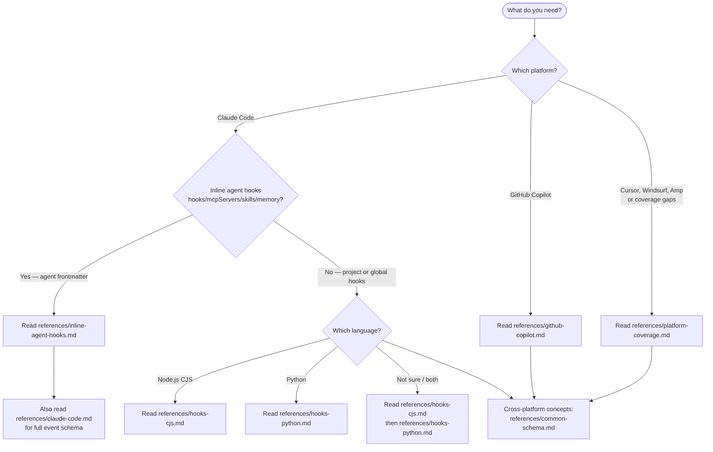

## Route to Reference



## Specialist Skills

For deeper Claude Code coverage, these focused skills are available:

- **hooks-core-reference** — Hook system fundamentals: events, configuration, matchers, environment variables, execution, security, debugging. Use `Skill(skill: "plugin-creator:hooks-core-reference")` for configuration and troubleshooting.
- **hooks-io-api** — JSON input/output API: what data hooks receive via stdin and what JSON they return to control Claude. Use `Skill(skill: "plugin-creator:hooks-io-api")` for writing hook scripts that process input or produce JSON output.
- **hooks-patterns** — Recipes and working examples: plugin hooks, frontmatter hooks, prompt-based hooks, complete code examples in Python/Node.js. Use `Skill(skill: "plugin-creator:hooks-patterns")` for implementation patterns and examples.

## Reference Files

- [common-schema.md](./references/common-schema.md) — shared concepts, cross-platform comparison, JSON I/O, exit codes
- [claude-code.md](./references/claude-code.md) — Claude Code hooks full reference (events, matchers, configuration)
- [inline-agent-hooks.md](./references/inline-agent-hooks.md) — hooks, mcpServers, skills, and memory in agent frontmatter
- [github-copilot.md](./references/github-copilot.md) — GitHub Copilot coding agent hooks
- [hooks-cjs.md](./references/hooks-cjs.md) — Node.js CJS authoring guide and templates
- [hooks-python.md](./references/hooks-python.md) — Python authoring guide and templates
- [best-practices.md](./references/best-practices.md) — cross-platform conventions and anti-patterns
- [platform-coverage.md](./references/platform-coverage.md) — known platforms, fetch URLs, coverage status
- [hooks-lifecycle.png](./references/hooks-lifecycle.png) — visual diagram of the full hook event sequence

## Refresh Docs

Re-fetch all platform docs and re-run the rwr:doc-to-skill transform on each:

```bash
bash plugins/plugin-creator/skills/hooks-guide/scripts/fetch-and-transform-hooks-docs.sh
```

This updates reference files from official sources. Run when upstream docs change.

## Sources

- Claude Code hooks: `https://docs.anthropic.com/en/docs/claude-code/hooks.md` (accessed 2026-02-27)
- Claude Code agent frontmatter: `https://docs.anthropic.com/en/docs/claude-code/sub-agents.md` (accessed 2026-02-27)
- GitHub Copilot coding agent: `https://docs.github.com/en/copilot/using-github-copilot/using-claude-as-your-copilot-llm` (accessed 2026-02-27)
