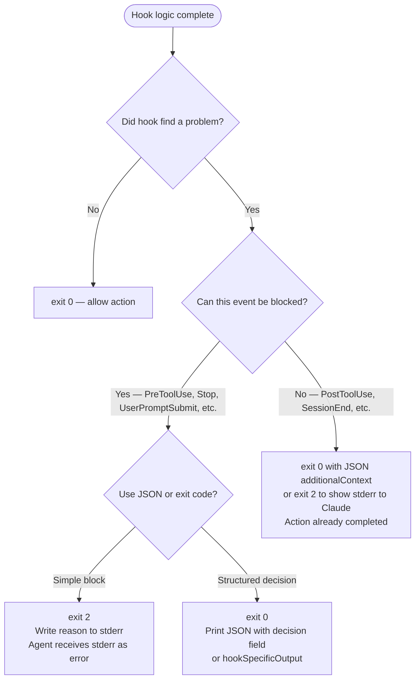
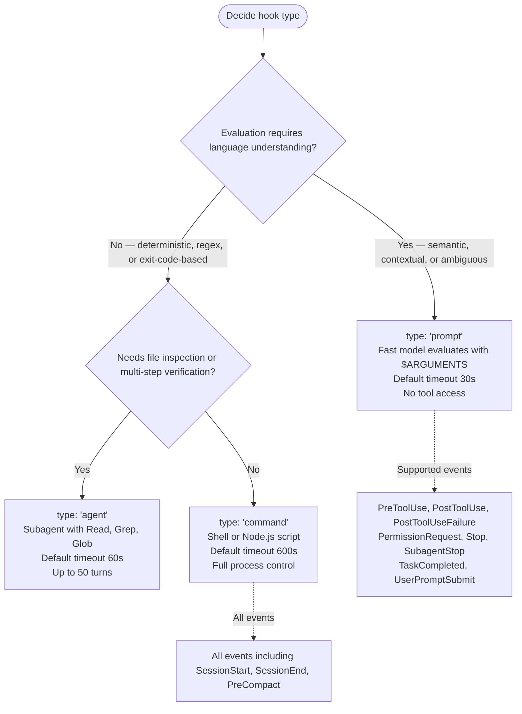

# Cross-Platform Hooks Best Practices

> AI-facing guide for writing robust, portable hook scripts across Claude Code (Node.js) and GitHub Copilot (bash/PowerShell).

## Table of Contents

1. [Set timeout values by operation type](#set-timeout-values-by-operation-type)
2. [Write idempotent hooks](#write-idempotent-hooks)
3. [Wrap stdin parsing in error handling](#wrap-stdin-parsing-in-error-handling)
4. [Write only error messages to stderr](#write-only-error-messages-to-stderr)
5. [Write only JSON to stdout](#write-only-json-to-stdout)
6. [Check binary availability before shelling out](#check-binary-availability-before-shelling-out)
7. [Choose exit codes deliberately](#choose-exit-codes-deliberately)
8. [Use async hooks for long-running operations](#use-async-hooks-for-long-running-operations)
9. [Choose prompt hooks over command hooks for semantic evaluation](#choose-prompt-hooks-over-command-hooks-for-semantic-evaluation)
10. [Test hooks locally before wiring](#test-hooks-locally-before-wiring)
11. [Anti-patterns](#anti-patterns)

---

## Set timeout values by operation type

Always set `timeout` explicitly in hook configuration. Claude Code defaults to 600 seconds for command hooks, which is far too long for most operations. GitHub Copilot defaults to 30 seconds. Neither default is appropriate as a universal value — set the timeout to the expected operation time plus a 1-second margin.

Guidance by operation type:

| Operation | Claude Code `timeout` (seconds) | GitHub Copilot `timeoutSec` (seconds) |
| :-------- | :----------------------------: | :----------------------------------: |
| Binary availability check | 3 | 5 |
| Filesystem read | 5 | 10 |
| Local process (lint, format) | 10–30 | 15–30 |
| Test suite | 60–300 | 60–120 |
| Network operation | Do not implement | Do not implement |

Network operations are inappropriate for hooks. Hooks execute synchronously in the agent loop by default — a network call with latency or failure modes stalls every tool call that triggers the hook. Implement network-dependent logic as a background process invoked via an async hook (Claude Code) or exclude it from hooks entirely.

**Claude Code — explicit timeout:**

```json
{
  "hooks": {
    "PostToolUse": [
      {
        "matcher": "Write|Edit",
        "hooks": [
          {
            "type": "command",
            "command": "${CLAUDE_PLUGIN_ROOT}/hooks/lint.cjs",
            "timeout": 15
          }
        ]
      }
    ]
  }
}
```

**GitHub Copilot — explicit timeoutSec:**

```json
{
  "version": 1,
  "hooks": {
    "postToolUse": [
      {
        "type": "command",
        "bash": "./hooks/lint.sh",
        "powershell": "./hooks/lint.ps1",
        "timeoutSec": 15
      }
    ]
  }
}
```

SOURCE: hook-creator.md mandatory constraints — "Set timeout to operation time + 1s margin"; hooks-doc.md — default timeout table; github-copilot.md — `timeoutSec` field.

---

## Write idempotent hooks

Hooks fire on every occurrence of the matching event. A `PostToolUse` hook with matcher `Write` fires on every file write — including writes performed by the hook's own side effects if they trigger additional tool calls. Design hooks so running them twice produces the same result as running them once.

Patterns that achieve idempotency:

- Use `--fix` or `--write` flags on formatters and linters rather than accumulating state
- Check existence before creating files; skip creation if the target already exists
- Use atomic file operations (write to temp file, rename) so partial writes do not leave inconsistent state
- Avoid appending to log files inside hooks that fire on every tool call — use a dedicated logging hook (for example, `SessionEnd`) or timestamp-delimited entries

**Wrong — appends unconditionally on every Write:**

```javascript
// BAD: every tool write appends a duplicate entry
const fs = require('node:fs');
fs.appendFileSync('/tmp/writes.log', `${toolInput.file_path}\n`);
```

**Correct — deduplicated append using a Set:**

```javascript
// GOOD: only appends if path is new in this session
const fs = require('node:fs');
const seen = new Set();
if (!seen.has(toolInput.file_path)) {
  seen.add(toolInput.file_path);
  fs.appendFileSync('/tmp/writes.log', `${toolInput.file_path}\n`);
}
```

---

## Wrap stdin parsing in error handling

Hook scripts receive JSON on stdin. The JSON may be absent, malformed, or empty when a hook is invoked in an unexpected context (testing, CI, manual debugging). A crash on bad input is a non-blocking error (exit code 1) and produces noise in logs. Exit cleanly on parse failure.

**Node.js (Claude Code):**

```javascript
'use strict';

let input;
try {
  input = JSON.parse(require('node:fs').readFileSync('/dev/stdin', 'utf8'));
} catch {
  process.exit(0);
}
```

**Bash (GitHub Copilot or project hooks):**

```bash
#!/bin/bash
INPUT=$(cat 2>/dev/null)
if [ -z "$INPUT" ]; then
  exit 0
fi

# Validate JSON before using jq
if ! echo "$INPUT" | jq . > /dev/null 2>&1; then
  exit 0
fi
```

**Python (Claude Code project hooks):**

```python
#!/usr/bin/env python3
import json
import sys

try:
    data = json.loads(sys.stdin.read())
except (json.JSONDecodeError, ValueError):
    sys.exit(0)
```

---

## Write only error messages to stderr

stderr content reaches different audiences depending on exit code:

- Exit 2 — stderr text is fed back to Claude or the agent as an error message
- Other non-zero exit — stderr is shown in verbose mode (`Ctrl+O`) to the user, not to Claude
- Exit 0 — stderr is suppressed (Claude Code), or logged (GitHub Copilot with `set -x`)

Write to stderr only when you have information a human or the agent needs. Debug noise on stderr contaminates the feedback channel.

**Wrong — debug output on stderr:**

```javascript
// BAD: debug noise reaches agent context on exit 2
process.stderr.write(`DEBUG: input = ${JSON.stringify(input)}\n`);
process.stderr.write(`DEBUG: toolName = ${toolName}\n`);
process.exit(2);
```

**Correct — single actionable message on exit 2:**

```javascript
// GOOD: one clear message for the agent
process.stderr.write(`Hook blocked ${toolName}: destructive path detected\n`);
process.exit(2);
```

For child process calls, suppress stderr from the child to prevent leakage:

```javascript
// GOOD: child stderr suppressed via stdio config
const { execFileSync } = require('node:child_process');
execFileSync('git', ['status'], {
  stdio: ['ignore', 'pipe', 'ignore'],
  timeout: 5000,
});
```

---

## Write only JSON to stdout

Claude Code reads stdout as structured JSON on exit 0. Any non-JSON text on stdout breaks parsing and causes Claude Code to treat the hook output as invalid. GitHub Copilot similarly expects compact single-line JSON from hooks that return output.

Shell profile scripts (`.bashrc`, `.zshrc`) that print text on startup contaminate stdout. To prevent this, invoke hook scripts directly rather than through a login shell, or redirect profile output to stderr.

**Wrong — raw text on stdout:**

```bash
# BAD: echo produces non-JSON text on stdout
echo "Lint passed"
exit 0
```

**Correct — JSON on stdout:**

```bash
# GOOD: JSON object on stdout
echo '{"suppressOutput": true}'
exit 0
```

**Wrong — mixed output in Node.js:**

```javascript
// BAD: console.log raw string contaminates JSON channel
console.log('Processing complete');
console.log(JSON.stringify({ suppressOutput: true }));
```

**Correct — single JSON.stringify call:**

```javascript
// GOOD: only one output, always JSON
console.log(JSON.stringify({ suppressOutput: true }));
process.exit(0);
```

If a hook produces no structured output, exit 0 with no stdout. Claude Code interprets empty stdout on exit 0 as "allow and continue."

---

## Check binary availability before shelling out

A hook that calls an external binary silently fails if the binary is absent on the target machine. Check availability before calling, and exit cleanly when the binary is missing rather than producing a parse error.

**Node.js with execFileSync:**

```javascript
const { execFileSync } = require('node:child_process');

function binaryAvailable(name) {
  try {
    execFileSync('which', [name], {
      stdio: ['ignore', 'pipe', 'ignore'],
      timeout: 3000,
    });
    return true;
  } catch {
    return false;
  }
}

if (!binaryAvailable('ruff')) {
  // exit 0: hook is a no-op if the tool is not installed
  process.exit(0);
}

execFileSync('ruff', ['check', filePath], {
  stdio: ['ignore', 'pipe', 'ignore'],
  timeout: 15000,
});
```

**Bash:**

```bash
#!/bin/bash
if ! command -v ruff &>/dev/null; then
  exit 0
fi

ruff check "$FILE_PATH" 2>/dev/null
```

**Windows/cross-platform (GitHub Copilot):**

Provide both `bash` and `powershell` entries. Each entry checks availability for its own platform:

```json
{
  "type": "command",
  "bash": "command -v ruff &>/dev/null && ruff check \"$FILE\" || exit 0",
  "powershell": "if (Get-Command ruff -ErrorAction SilentlyContinue) { ruff check $env:FILE }"
}
```

---

## Choose exit codes deliberately

Exit codes are the primary signaling mechanism between a hook and the host agent.

| Exit code | Meaning | When to use |
| :-------: | :------ | :---------- |
| 0 | Success — allow and continue | Hook passed, no blocking decision needed |
| 1 | Non-blocking error | Script error (unhandled exception, bad config); logged in verbose mode only |
| 2 | Blocking error | Hook intentionally prevents the triggering action; stderr shown to agent |

Exit 2 is only effective for events that can be blocked. For events that fire after an action has already completed (`PostToolUse`, `PostToolUseFailure`, `SessionEnd`), exit 2 shows stderr to Claude but cannot reverse the action.



For `PreToolUse`, use JSON output rather than exit 2 when you need `permissionDecision: "deny"` with a reason shown to Claude:

```javascript
// Preferred for PreToolUse — structured denial
console.log(JSON.stringify({
  hookSpecificOutput: {
    hookEventName: 'PreToolUse',
    permissionDecision: 'deny',
    permissionDecisionReason: 'Write to /etc/ is not permitted',
  },
}));
process.exit(0);
```

---

## Use async hooks for long-running operations

By default, hooks block Claude's execution until they complete. For test suites, build steps, or any operation taking more than a few seconds, set `"async": true` on command hooks. Claude continues working immediately; the hook result is delivered as context on the next conversation turn.

Async hooks (`"async": true`) are available only on `type: "command"` hooks in Claude Code. They cannot block or return permission decisions — the triggering action has already proceeded by the time the hook completes.

**When to use async:**

- Test suite runs triggered after every file write
- Build artifact generation
- Notification pipelines (Slack, webhook)
- Any operation where latency is acceptable and blocking is undesirable

**When to use synchronous (default):**

- Pre-flight validation that must block if it fails
- Security checks on tool inputs
- Formatter runs that should complete before the next tool call

```json
{
  "hooks": {
    "PostToolUse": [
      {
        "matcher": "Write|Edit",
        "hooks": [
          {
            "type": "command",
            "command": "${CLAUDE_PLUGIN_ROOT}/hooks/run-tests.cjs",
            "async": true,
            "timeout": 300
          }
        ]
      }
    ]
  }
}
```

Async hook output fields `systemMessage` and `additionalContext` are delivered to Claude on the next turn. Decision fields (`decision`, `permissionDecision`, `continue`) have no effect in async mode.

SOURCE: hooks-doc.md — "Run hooks in the background" section.

---

## Choose prompt hooks over command hooks for semantic evaluation

Use `type: "prompt"` when the evaluation requires language understanding rather than deterministic rule application. Prompt hooks send the hook input and your prompt to a Claude model (Haiku by default), which returns `{ "ok": true }` or `{ "ok": false, "reason": "..." }`.

Use `type: "command"` when evaluation is deterministic — string matching, exit code checking, file existence.



Prompt hooks are only supported on the events listed above. Events like `SessionStart`, `SessionEnd`, `PreCompact`, `Notification`, `ConfigChange`, `SubagentStart`, `TeammateIdle`, `WorktreeCreate`, and `WorktreeRemove` require `type: "command"`.

**Prompt hook example — semantic stop evaluation:**

```json
{
  "hooks": {
    "Stop": [
      {
        "hooks": [
          {
            "type": "prompt",
            "prompt": "Evaluate if Claude should stop working. Context: $ARGUMENTS\n\nCheck: 1. All user-requested tasks are complete. 2. No unresolved errors remain. 3. No follow-up work is pending.\n\nRespond with JSON: {\"ok\": true} to allow stopping, or {\"ok\": false, \"reason\": \"explanation\"} to continue.",
            "timeout": 30
          }
        ]
      }
    ]
  }
}
```

**Command hook example — deterministic stop evaluation:**

```javascript
// GOOD for deterministic checks — read a status file
'use strict';
const fs = require('node:fs');

let input;
try {
  input = JSON.parse(fs.readFileSync('/dev/stdin', 'utf8'));
} catch {
  process.exit(0);
}

const statusFile = process.env.CLAUDE_PROJECT_DIR + '/.task-status';
if (!fs.existsSync(statusFile)) {
  process.exit(0);
}

const status = fs.readFileSync(statusFile, 'utf8').trim();
if (status !== 'COMPLETE') {
  process.stderr.write(`Task not complete: status is ${status}\n`);
  process.exit(2);
}

process.exit(0);
```

Prompt hook timeout includes model invocation latency. The 30-second default is appropriate for most evaluations. Increase it only if the prompt is complex and requires extended reasoning.

SOURCE: hooks-doc.md — "Prompt-based hooks" and "Agent-based hooks" sections.

---

## Test hooks locally before wiring

Test every hook by piping representative stdin before adding it to configuration. Verify three properties: stdout is valid JSON or empty, stderr is empty on the success path, and exit code matches the expected value.

**Node.js hook test pattern:**

```bash
# Test a PreToolUse hook with a Bash tool call
echo '{"hook_event_name":"PreToolUse","tool_name":"Bash","tool_input":{"command":"npm test"},"session_id":"test","cwd":"/tmp"}' \
  | node ./hooks/validate-bash.cjs

# Check exit code
echo "Exit: $?"

# Validate JSON output
echo '{"hook_event_name":"PreToolUse","tool_name":"Bash","tool_input":{"command":"npm test"},"session_id":"test","cwd":"/tmp"}' \
  | node ./hooks/validate-bash.cjs | jq .
```

**Bash hook test pattern (GitHub Copilot):**

```bash
# Create test input
echo '{"timestamp":1704614400000,"cwd":"/tmp","toolName":"bash","toolArgs":"{\"command\":\"ls\"}"}' \
  | ./hooks/my-hook.sh

# Check exit code
echo "Exit: $?"

# Validate JSON output
echo '{"timestamp":1704614400000,"cwd":"/tmp","toolName":"bash","toolArgs":"{\"command\":\"ls\"}"}' \
  | ./hooks/my-hook.sh | jq .
```

**Verification checklist before wiring:**

- [ ] `jq .` parses stdout without error (or stdout is empty)
- [ ] stderr is empty when running on a valid success-path input
- [ ] exit code is 0 on success path, 2 on intentional block
- [ ] hook exits cleanly on empty stdin (`echo '' | node hook.cjs` exits 0)
- [ ] hook exits cleanly on invalid JSON (`echo 'not json' | node hook.cjs` exits 0)

After wiring to configuration, validate with the plugin validator (Claude Code plugins):

```bash
uvx skilllint@latest ./path/to/plugin
```

---

## Anti-patterns

### Shell injection via execSync

**Wrong — string command passed to execSync:**

```javascript
// BAD: userInput in a string command allows injection
const { execSync } = require('node:child_process');
execSync(`git log --oneline ${userInput}`);
```

**Correct — execFileSync with array args:**

```javascript
// GOOD: args are array elements, never interpreted as shell
const { execFileSync } = require('node:child_process');
execFileSync('git', ['log', '--oneline', userInput], {
  stdio: ['ignore', 'pipe', 'ignore'],
  timeout: 5000,
});
```

The `execSync` function passes the string to the shell, where unvalidated input can inject additional commands. `execFileSync` invokes the binary directly with arguments as discrete array elements, eliminating shell interpretation.

---

### stderr leak from child processes

**Wrong — child process stderr flows to hook stderr:**

```javascript
// BAD: child stderr leaks to hook stderr channel
execFileSync('binary', ['arg'], { stdio: 'inherit' });
```

**Correct — child stderr suppressed:**

```javascript
// GOOD: child stderr suppressed, only capture stdout
execFileSync('binary', ['arg'], {
  stdio: ['ignore', 'pipe', 'ignore'],
  timeout: 5000,
});
```

Child process stderr on `stdio: 'inherit'` passes through to the hook's stderr. On exit 2, that output reaches Claude as error context, polluting the error message with tool-internal debug output.

---

### Deleting the hooks configuration file when unused

**Wrong — hooks configuration file removed:**

```text
(no hooks/hooks.json present in plugin directory)
```

**Correct — empty configuration file retained:**

```json
{ "hooks": {} }
```

Plugin structure expects `hooks/hooks.json` to be present. Removing it breaks plugin validation and leaves the plugin structure incomplete. Keep an empty configuration file when no hooks are needed.

---

### Using the `.js` extension in ESM projects

**Wrong — `.js` extension in a project with `"type": "module"` in package.json:**

```text
hooks/validate-bash.js
```

**Correct — `.cjs` extension for explicit CommonJS:**

```text
hooks/validate-bash.cjs
```

Node.js treats `.js` files as ESM modules when the nearest `package.json` declares `"type": "module"`. CommonJS `require()` calls fail in ESM context. The `.cjs` extension explicitly identifies the file as CommonJS regardless of the project's module type.

SOURCE: hook-creator.md — "Language — .cjs ONLY" mandatory constraint.

---

### Ignoring platform differences in GitHub Copilot hooks

**Wrong — bash-only hook that fails on Windows:**

```json
{
  "type": "command",
  "bash": "./hooks/run-check.sh"
}
```

**Correct — both bash and PowerShell provided:**

```json
{
  "type": "command",
  "bash": "./hooks/run-check.sh",
  "powershell": "./hooks/run-check.ps1",
  "timeoutSec": 15
}
```

GitHub Copilot agents may run on Windows, macOS, or Linux. Providing only `bash` causes the hook to silently skip on Windows agents. Provide both `bash` and `powershell` entries for hooks that must run on all platforms.

SOURCE: github-copilot.md — Command Entry Fields section.

---

## References

- Claude Code Hooks Reference — hooks-doc.md (fetched 2026-03-01)
  SOURCE: `https://code.claude.com/docs/en/hooks.md`
- GitHub Copilot Hooks Reference — [./github-copilot.md](./github-copilot.md)
  SOURCE: `https://docs.github.com/en/copilot/how-tos/use-copilot-agents/coding-agent/using-hooks-with-github-copilot-agents` (accessed 2026-03-01)
- Hook Creator Agent — `plugins/plugin-creator/agents/hook-creator.md`
