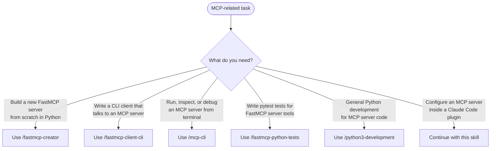
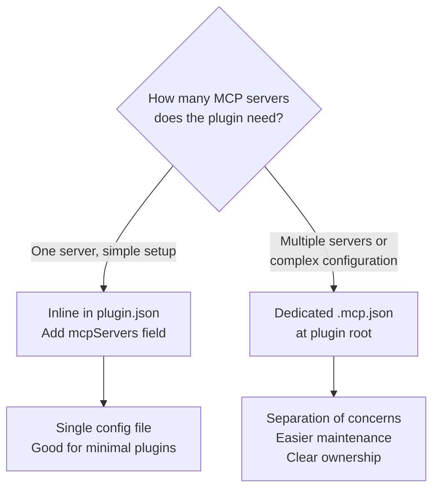
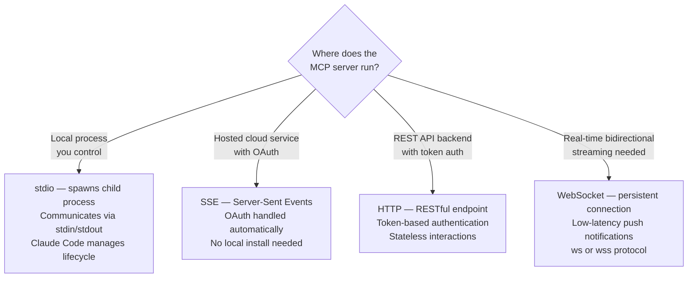
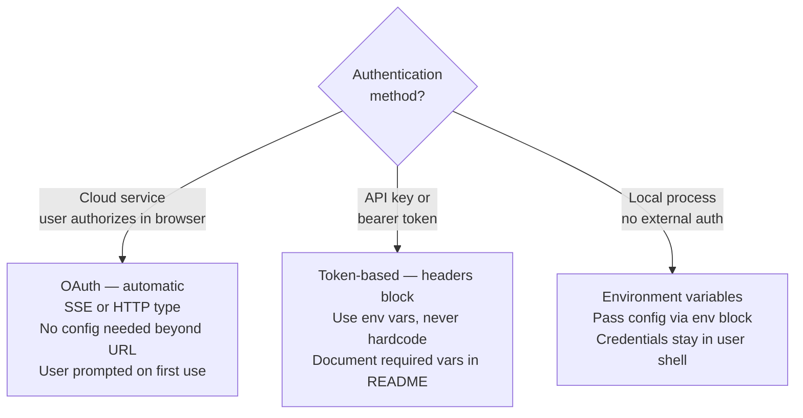

# MCP Integration for Claude Code Plugins

Model Context Protocol (MCP) enables Claude Code plugins to expose external service capabilities as tools. Use this skill when adding MCP server configuration to a plugin, choosing transport types, or debugging MCP tool discovery.

## MCP Skill Routing



For building FastMCP servers from scratch, use `/fastmcp-creator`. For writing CLI clients that communicate with MCP servers, use `/fastmcp-client-cli`. For terminal-based MCP server inspection and debugging, use `/mcp-cli`. For writing pytest test suites for FastMCP tools, use `/fastmcp-python-tests`. For general Python development of MCP server code, use `/python3-development`.

## Configuration Methods

Plugins bundle MCP servers via one of two methods.



### Dedicated .mcp.json (Recommended)

Create `.mcp.json` at the plugin root directory. Each top-level key is a server name.

```json
{
  "database-tools": {
    "command": "${CLAUDE_PLUGIN_ROOT}/servers/db-server",
    "args": ["--config", "${CLAUDE_PLUGIN_ROOT}/config.json"],
    "env": {
      "DB_URL": "${DB_URL}"
    }
  }
}
```

### Inline in plugin.json

Add an `mcpServers` field to the existing `plugin.json`.

```json
{
  "name": "my-plugin",
  "version": "1.0.0",
  "mcpServers": {
    "plugin-api": {
      "command": "${CLAUDE_PLUGIN_ROOT}/servers/api-server",
      "args": ["--port", "8080"]
    }
  }
}
```

## Server Types



For detailed configuration examples, type-specific fields, and advanced options for each server type, read [Server Types Reference](./references/server-types-and-patterns.md).

## Environment Variable Expansion

All MCP configurations support variable substitution.

`${CLAUDE_PLUGIN_ROOT}` resolves to the plugin's installed directory. Always use this for paths to bundled scripts and configs — never hardcode absolute paths.

```json
{
  "command": "${CLAUDE_PLUGIN_ROOT}/servers/my-server",
  "env": {
    "API_KEY": "${MY_API_KEY}",
    "DATABASE_URL": "${DB_URL}"
  }
}
```

User environment variables (from the user's shell) are available in the `env` block. Document all required environment variables in the plugin README.

## Tool Naming Convention

MCP tools are automatically prefixed when registered.

Format: `mcp__plugin_<plugin-name>_<server-name>__<tool-name>`

Example with plugin `asana`, server `asana`, tool `create_task`:

```text
mcp__plugin_asana_asana__asana_create_task
```

Pre-allow specific MCP tools in skill or command frontmatter:

```yaml
allowed-tools: mcp__plugin_asana_asana__asana_create_task, mcp__plugin_asana_asana__asana_search_tasks
```

Avoid wildcard patterns (`mcp__plugin_asana_asana__*`) — pre-allow specific tools for security.

## Authentication Patterns



OAuth example (SSE):

```json
{
  "type": "sse",
  "url": "https://mcp.example.com/sse"
}
```

Token example (HTTP):

```json
{
  "type": "http",
  "url": "https://api.example.com/mcp",
  "headers": {
    "Authorization": "Bearer ${API_TOKEN}"
  }
}
```

## Lifecycle and Testing

MCP servers start when the plugin loads. Connection is established before first tool use.

Lifecycle sequence: plugin loads, MCP configuration parsed, server process started (stdio) or connection established (SSE/HTTP/WS), tools discovered and registered, tools available as `mcp__plugin_...`.

### Testing Workflow

1. Configure MCP server in `.mcp.json`
2. Install plugin locally or use `claude --plugin-dir ./my-plugin`
3. Run `/mcp` to verify the server appears
4. Test tool calls from skills or commands
5. Use `claude --debug` to inspect connection attempts, tool discovery, and errors

### Debugging Common Issues

**Server not connecting** — verify URL, confirm server process is running (stdio), check network connectivity, review auth config.

**Tools not available** — verify server connected via `/mcp`, check tool names match exactly (including prefix), restart Claude Code after config changes.

**Authentication failing** — clear cached OAuth tokens and re-authenticate, verify environment variables are set, check token scopes and permissions.

## Security Checklist

- Use HTTPS/WSS for all remote connections — never HTTP/WS
- Store tokens in environment variables — never hardcode in config
- Pre-allow specific MCP tools — avoid wildcard `__*` patterns
- Document all required environment variables in the plugin README
- Test authentication flows during development, not after publishing

## Additional Resources

For complete server type configurations (stdio, SSE, HTTP, WebSocket) with full examples, integration patterns (tool wrappers, autonomous agents, multi-server plugins), and performance considerations, read [Server Types and Patterns Reference](./references/server-types-and-patterns.md).

SOURCE: Adapted from Anthropic plugin-dev mcp-integration skill (`../claude-plugins-official/plugins/plugin-dev/skills/mcp-integration/SKILL.md`). Tool naming format and environment variable expansion per Claude Code plugin documentation.
