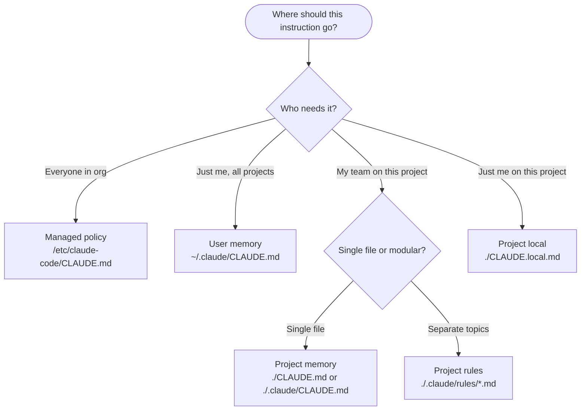

# Claude Code Memory and Rules Reference

Claude Code has two kinds of persistent memory:

- **Auto memory** — Claude's self-written notes at `~/.claude/projects/<project>/memory/`
- **CLAUDE.md files** — User-written instructions at multiple hierarchy levels

Both load into context at session start. More specific instructions take precedence over broader ones.

---

## Memory Hierarchy

Memory locations load in priority order (highest priority first):

1. **Managed policy** — Organization-wide (deployed by IT)
   - macOS: `/Library/Application Support/ClaudeCode/CLAUDE.md`
   - Linux: `/etc/claude-code/CLAUDE.md`
2. **User memory** — Personal, all projects: `~/.claude/CLAUDE.md`
3. **User rules** — Personal modular rules: `~/.claude/rules/*.md`
4. **Project memory** — Team-shared: `./CLAUDE.md` or `./.claude/CLAUDE.md`
5. **Project rules** — Modular project rules: `./.claude/rules/*.md`
6. **Project local** — Personal project-specific: `./CLAUDE.local.md` (auto-gitignored)
7. **Auto memory** — Claude's notes: `~/.claude/projects/<project>/memory/MEMORY.md` (first 200 lines)
8. **Child directory** — Nested `.claude/CLAUDE.md` files load on demand when Claude reads files in those directories

**Loading behavior**: Files in the directory hierarchy above the working directory load in full at launch. Files in child directories load on demand. Auto memory loads only the first 200 lines of `MEMORY.md`.

---

## Decision Tree — Which Memory Location?



---

## CLAUDE.md Files

### Writing Effective Instructions

- Be specific — "Use 2-space indentation" over "Format code properly"
- Use bullet points grouped under descriptive markdown headings
- Include frequently used commands (build, test, lint)
- Document code style, naming conventions, architectural patterns

### Bootstrap Project Memory

```bash
/init
```

Generates a starter `CLAUDE.md` for the current project.

### Imports

CLAUDE.md files can import additional files using `@path/to/import` syntax:

```markdown
See @README for project overview and @package.json for npm commands.

# Additional Instructions
- git workflow @docs/git-instructions.md
```

**Import rules**:
- Relative paths resolve relative to the file containing the import (not cwd)
- Absolute paths and `~` paths supported
- Max recursion depth: 5 hops
- Not evaluated inside code spans or code blocks
- First encounter in a project triggers an approval dialog

**Cross-worktree sharing**: Use home-directory import so all worktrees share personal instructions:

```markdown
# Individual Preferences
- @~/.claude/my-project-instructions.md
```

### Edit Memory Files

Use `/memory` during a session to open any memory file in your system editor. This includes CLAUDE.md files, rules, and auto memory.

---

## Modular Rules (.claude/rules/)

For larger projects, organize instructions into separate focused files instead of one large CLAUDE.md.

### Structure

```text
.claude/
├── CLAUDE.md              # Main project instructions
└── rules/
    ├── code-style.md      # Code style guidelines
    ├── testing.md         # Testing conventions
    ├── security.md        # Security requirements
    └── frontend/
        ├── react.md       # React-specific rules
        └── styles.md      # CSS/styling rules
```

All `.md` files in `.claude/rules/` are automatically loaded as project memory. Files are discovered recursively through subdirectories. Symlinks are resolved (circular symlinks handled gracefully).

### Path-Specific Rules (Conditional Loading)

Scope rules to specific files using YAML frontmatter with the `paths` field:

```yaml
---
paths:
  - "src/api/**/*.ts"
---

# API Development Rules

- All API endpoints must include input validation
- Use the standard error response format
```

Rules without a `paths` field load unconditionally.

**Supported glob patterns**:

- `**/*.ts` — All TypeScript files in any directory
- `src/**/*` — All files under src/
- `*.md` — Markdown files in project root only
- `src/components/*.tsx` — React components in specific directory
- `src/**/*.{ts,tsx}` — Brace expansion for multiple extensions
- `{src,lib}/**/*.ts` — Brace expansion for multiple directories

**Multiple patterns**:

```yaml
---
paths:
  - "src/**/*.ts"
  - "lib/**/*.ts"
  - "tests/**/*.test.ts"
---
```

### User-Level Rules

Personal rules at `~/.claude/rules/` apply to all projects. Project rules have higher priority than user rules.

---

## Auto Memory

Claude's self-written notes that persist across sessions. Unlike CLAUDE.md (instructions you write for Claude), auto memory contains notes Claude writes for itself.

### Storage Location

Each project gets its own memory directory at `~/.claude/projects/<project>/memory/`. The `<project>` path derives from the git repository root. Git worktrees get separate memory directories. Outside git repos, the working directory is used.

```text
~/.claude/projects/<project>/memory/
├── MEMORY.md          # Index file — first 200 lines loaded at session start
├── debugging.md       # Topic file — loaded on demand
├── api-conventions.md # Topic file — loaded on demand
└── ...
```

### How It Works

- First 200 lines of `MEMORY.md` load into system prompt at session start
- Topic files (e.g., `debugging.md`) load on demand when Claude needs them
- Claude reads and writes memory files during the session
- Keep `MEMORY.md` concise — move detailed notes to topic files

### Managing Auto Memory

- Edit files directly — they are standard markdown
- Use `/memory` to open the file selector
- Tell Claude directly: "remember that we use pnpm" or "save to memory that API tests require Redis"
- Ask Claude to forget: "stop remembering X" — Claude will find and remove the entry

### Environment Variable Control

```bash
export CLAUDE_CODE_DISABLE_AUTO_MEMORY=1  # Force off
export CLAUDE_CODE_DISABLE_AUTO_MEMORY=0  # Force on
# When unset: follows gradual rollout
```

---

## Additional Directory Memory

The `--add-dir` flag gives Claude access to additional directories. By default, CLAUDE.md files from those directories are NOT loaded. To also load their memory:

```bash
CLAUDE_CODE_ADDITIONAL_DIRECTORIES_CLAUDE_MD=1 claude --add-dir ../shared-config
```

---

## Common Tasks

### Set Up Memory for a New Project

1. Run `/init` to bootstrap `CLAUDE.md`
2. Add build/test/lint commands
3. Document code style, architecture patterns, naming conventions
4. For monorepos, add nested `.claude/CLAUDE.md` in subdirectories

### Organize a Growing CLAUDE.md

When a single CLAUDE.md becomes unwieldy:

1. Create `.claude/rules/` directory
2. Split by topic: `code-style.md`, `testing.md`, `api-design.md`
3. Use `paths` frontmatter for language/directory-specific rules
4. Keep main `CLAUDE.md` for high-level project overview

### Share Rules Across Projects

Symlink shared rules:

```bash
# Symlink a shared rules directory
ln -s ~/shared-claude-rules .claude/rules/shared

# Symlink individual rule files
ln -s ~/company-standards/security.md .claude/rules/security.md
```

### Debug Memory Loading Issues

1. Run `/memory` to see which files are loaded
2. Check file locations match the hierarchy
3. Verify `paths` frontmatter glob patterns match target files
4. Check import `@` references resolve correctly (relative to containing file)
5. For auto memory: verify `MEMORY.md` is under 200 lines for guaranteed loading

### Detailed Reference

For comprehensive details on all memory types, import behavior, glob patterns, and configuration options, see [memory-reference.md](./references/memory-reference.md).

SOURCE: [Claude Code Memory Documentation](https://code.claude.com/docs/en/memory.md) (accessed 2026-02-17)
