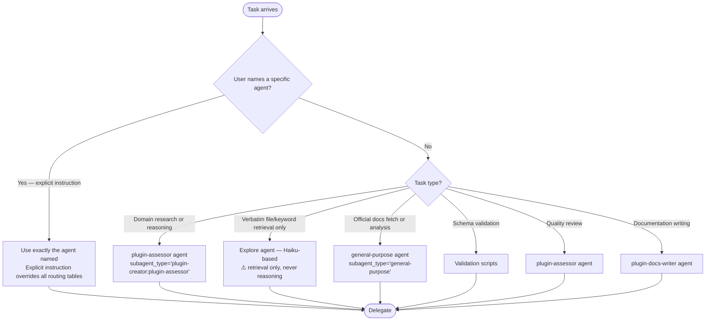

> When editing files in `plugins/`, `.claude/`, `AGENTS.md`, or `CLAUDE.md` — delegate to `subagent_type="plugin-creator:contextual-ai-documentation-optimizer"`.

# Claude Code Plugin Creator — Agentic Orchestration Workflow

This skill orchestrates specialized agents through a comprehensive plugin creation workflow. The orchestrator (you) delegates to sub-agents for research, discovery, validation, and implementation — never performing these tasks directly.

**Workflow Diagram**: See [workflow-diagram.md](./references/workflow-diagram.md) for mermaid flowcharts of the complete plugin creation flow.

---

## Orchestration Principles

<orchestration_rules>

**The orchestrator delegates — it does not execute.**



**Explore agent constraint (hard rule from CLAUDE.md):** Explore uses Haiku internally. Validated failure rate ~50% for reasoning tasks (2026-02-02). Use Explore ONLY for verbatim retrieval — exact file contents, directory listings, keyword searches with no interpretation required. Any task requiring analysis, comparison, or judgment goes to plugin-creator:plugin-assessor or general-purpose.

**How to spawn agents:**

- **Task tool** (`subagent_type=...`) — for focused, isolated work where only the result matters
- **TeamCreate** — for multi-agent coordination where agents need to communicate

**Why delegation matters:**

1. Sub-agents have focused context and specialized prompts
2. Delegation creates audit trails of verified information
3. Prevents hallucination by requiring source verification
4. Enables parallel work and thoroughness

</orchestration_rules>

---

## Artifact System

<artifact_system>

**Maintain structured artifacts for crash recovery, audit trails, and context management.**

Create a work directory for each plugin project:

```text
.claude/plan/{plugin-name}/
├── PROJECT.md                # Vision and goals (always loaded)
├── REQUIREMENTS.md           # Scoped deliverables
├── STATE.md                  # Decisions, blockers, current position
├── discuss-CONTEXT.md        # User preferences captured in discussion
├── research-FINDINGS.md      # 4-way parallel research results
├── design-PLAN.md            # Architecture with XML task specs
├── validation-REPORT.md      # Multi-layer verification results
└── SUMMARY.md                # Completion record
```

**STATE.md format** (persists across sessions):

```markdown
# Plugin State: {plugin-name}
Last Updated: {ISO timestamp}

## Decisions Made
- {decision}: {rationale}

## Current Position
- Phase: {current phase}
- Status: IN_PROGRESS | BLOCKED | COMPLETE

## Blockers
- {blocker}: {what's needed}

## Deviations from Plan
- {change}: {why}
```

**Recovery:** Read STATE.md to restore context after session crash.

</artifact_system>

---

## Parallel Agent Spawning

<parallel_execution>

**Spawn independent agents simultaneously to maximize throughput.**

**4-Way Parallel Research Pattern:**

```text
# Spawn all four researchers in a single message:

Task(subagent_type="plugin-creator:plugin-assessor", prompt="EXISTING PLUGINS: Search plugins/ and ~/.claude/skills/ for similar functionality...")
Task(subagent_type="plugin-creator:plugin-assessor", prompt="CLAUDE CODE FEATURES: What plugin capabilities exist? Dynamic context, hooks, MCP, LSP...")
Task(subagent_type="plugin-creator:plugin-assessor", prompt="ARCHITECTURE PATTERNS: How do well-structured plugins organize skills, agents, references...")
Task(agent="general-purpose", prompt="PITFALLS: Fetch official docs, identify common mistakes, schema gotchas...")
```

**All four run concurrently. Merge results into research-FINDINGS.md before planning.**

**Parallelization opportunities:**

| Phase         | Parallel Tasks                                             |
| ------------- | ---------------------------------------------------------- |
| Research      | 4 researchers (existing, features, architecture, pitfalls) |
| Validation    | Scripts + docs verification + quality assessment           |
| Documentation | README + skills.md + config guide                          |

**Sequential requirements:**

- Discussion phase captures preferences BEFORE research
- Design phase depends on merged research findings
- Implementation depends on approved design
- Plan checker must pass BEFORE execution

</parallel_execution>

---

## Phase 0: RT-ICA Prerequisite Check

<prerequisite_checkpoint>

**STOP. Before creating any plugin, perform RT-ICA assessment.**

Invoke the `rt-ica` skill to verify prerequisites:

```text
RT-ICA SUMMARY
==============

Goal:
- Create a Claude Code plugin for [purpose]

Success Output:
- Functional plugin that [specific outcome]

Conditions (reverse prerequisites):
1. Purpose clarity | Requires: Clear problem statement | Why: Determines plugin scope
2. Target users | Requires: Who will use this | Why: Shapes UX decisions
3. Component selection | Requires: Skills vs Agents vs Hooks | Why: Architecture
4. Existing solutions | Requires: Check for similar plugins | Why: Avoid duplication
5. Source material | Requires: Documentation/APIs to encode | Why: Content accuracy
6. Verification method | Requires: How to test the plugin works | Why: Quality gate

Verification:
- [Check each condition: AVAILABLE / DERIVABLE / MISSING]

Decision:
- [APPROVED / BLOCKED]
```

**IF BLOCKED**: Request missing information before proceeding.

**IF APPROVED**: Continue to Discussion phase.

</prerequisite_checkpoint>

---

## Phase 0.5: Discussion (Capture Preferences)

<discussion_phase>

**BEFORE research, identify gray areas and capture user preferences.**

Ask targeted questions to eliminate ambiguity:

**For skill-focused plugins:**

- Activation triggers: When should Claude auto-load vs user-invoke?
- Tool restrictions: Full access or limited tools?
- Output format: Verbose explanations or terse instructions?
- Reference structure: Inline content or progressive disclosure?

**For agent-focused plugins:**

- Delegation scope: What tasks should agents handle?
- Return format: Summaries or detailed reports?
- Error handling: Retry, escalate, or fail fast?

**For hook-focused plugins:**

- Trigger events: Which tool/session events matter?
- Hook type: Command, prompt, or agent verification?
- Timeout handling: Fail silently or block?

**Save preferences to `discuss-CONTEXT.md`:**

```markdown
# Plugin Discussion: {plugin-name}
Date: {ISO timestamp}

## Scope Decisions
- {question}: {user preference}

## UX Preferences
- Invocation: {user-invoked | model-invoked | both}
- Verbosity: {terse | balanced | verbose}

## Technical Choices
- {choice}: {preference with rationale}
```

**These preferences guide all subsequent research and planning.**

</discussion_phase>

---

## Phase 1: Research (4-Way Parallel)

<research_phase>

**Spawn 4 parallel researchers in a single message.** Each investigates a different domain:

```text
# Launch all four simultaneously:

Task(subagent_type="plugin-creator:plugin-assessor", prompt="
RESEARCHER 1: EXISTING SOLUTIONS
Search for plugins/skills similar to {plugin-name}:
- plugins/ directory
- ~/.claude/skills/
- GitHub repos with Claude Code plugins
REPORT: What exists, gaps to fill, patterns to follow/avoid
Write findings to .claude/plan/{plugin-name}/research-1-existing.md")

Task(subagent_type="plugin-creator:plugin-assessor", prompt="
RESEARCHER 2: CLAUDE CODE FEATURES
What capabilities should this plugin use?
- Dynamic context injection (!command)
- Subagent execution (context: fork)
- Hooks (which events?)
- MCP/LSP integration opportunities
REPORT: Recommended features with rationale
Write findings to .claude/plan/{plugin-name}/research-2-features.md")

Task(subagent_type="plugin-creator:plugin-assessor", prompt="
RESEARCHER 3: ARCHITECTURE PATTERNS
How do well-structured plugins organize?
- Skill directory structure
- Reference file patterns
- Agent definitions
- Hook configurations
REPORT: Recommended structure based on similar plugins
Write findings to .claude/plan/{plugin-name}/research-3-architecture.md")

Task(agent="general-purpose", prompt="
RESEARCHER 4: PITFALLS & OFFICIAL DOCS
Fetch https://code.claude.com/docs/en/plugins-reference.md
Fetch https://code.claude.com/docs/en/skills.md
IDENTIFY:
- Schema requirements (comma-separated strings NOT arrays)
- Common mistakes
- Deprecations or new features
REPORT: Gotchas to avoid, schema requirements
Write findings to .claude/plan/{plugin-name}/research-4-pitfalls.md")
```

**Merge all 4 reports into `research-FINDINGS.md` before proceeding to Design.**

### Research Findings Format

```markdown
# Research Findings: {plugin-name}
Date: {ISO timestamp}

## 1. Existing Solutions
{Researcher 1 findings}

## 2. Recommended Features
{Researcher 2 findings}

## 3. Architecture Patterns
{Researcher 3 findings}

## 4. Pitfalls & Requirements
{Researcher 4 findings}

## Synthesis
- Key insights: {combined learnings}
- Recommended approach: {synthesis}
```

</research_phase>

---

## Phase 2: Design (Plan + Verify Loop)

<design_phase>

**Design phase uses a PLAN → CHECK → ITERATE loop until verification passes.**

### 2a. Generate Plan with XML Task Specs

**Delegate to Plan agent:**

```
Task(
  agent="Plan",
  prompt="Design plugin: {plugin-name}

  INPUTS:
  - User preferences: {from discuss-CONTEXT.md}
  - Research findings: {from research-FINDINGS.md}

  OUTPUT: XML task specifications for atomic implementation:

  <task id='1' type='auto'>
    <name>Create plugin.json manifest</name>
    <files>.claude-plugin/plugin.json</files>
    <action>Create manifest with name, version, description, skills array</action>
    <verify>jq '.name' .claude-plugin/plugin.json returns plugin name</verify>
    <done>Valid plugin.json exists with all required fields</done>
  </task>

  <task id='2' type='auto'>
    <name>Create main SKILL.md</name>
    <files>skills/{skill-name}/SKILL.md</files>
    <action>Create skill with frontmatter and core instructions</action>
    <verify>grep -q '^---' skills/{skill-name}/SKILL.md</verify>
    <done>SKILL.md has valid frontmatter and passes token-count validation</done>
  </task>

  Generate 2-5 atomic tasks. Each task must have:
  - Single responsibility
  - Testable <verify> command
  - Clear <done> criteria"
)
```

### 2b. Plan Checker Verification

**BEFORE execution, verify the plan achieves goals:**

```
Task(
  agent="general-purpose",
  prompt="PLAN CHECKER: Verify this plan achieves the plugin goals.

  PLAN: {generated XML tasks}
  REQUIREMENTS: {from discuss-CONTEXT.md}
  RESEARCH: {key findings}

  VERIFY:
  1. Do tasks cover all required components?
  2. Are tasks truly atomic (single responsibility)?
  3. Are <verify> commands actually testable?
  4. Are there gaps between tasks?
  5. Does sequence respect dependencies?

  OUTPUT:
  - PASS: Plan is ready for execution
  - FAIL: {specific issues to fix}

  If FAIL, return to planner with feedback."
)
```

**Loop until plan checker returns PASS.**

### 2c. Save Approved Plan

Save to `design-PLAN.md`:

```markdown
# Design Plan: {plugin-name}
Date: {ISO timestamp}
Status: APPROVED

## Tasks

<task id='1'>...</task>
<task id='2'>...</task>

## Verification
Plan checker: PASS
Reviewer: {agent ID}
```

</design_phase>

---

## Phase 3: Implementation (Atomic Execution)

<implementation_phase>

**Execute each XML task atomically with per-task commits.**

### 3a. Task Execution Pattern

For each `<task>` in the approved plan:

```
Task(
  agent="general-purpose",
  prompt="EXECUTOR: Implement this single task.

  <task id='{N}'>
    <name>{task name}</name>
    <files>{target files}</files>
    <action>{implementation instructions}</action>
    <verify>{test command}</verify>
    <done>{success criteria}</done>
  </task>

  CONTEXT:
  - User preferences: {from discuss-CONTEXT.md}
  - Research findings: {relevant sections}

  EXECUTE:
  1. Implement the <action>
  2. Run the <verify> command
  3. Confirm <done> criteria met

  OUTPUT:
  - Files created/modified
  - Verification result: PASS/FAIL
  - If FAIL: what went wrong"
)
```

### 3b. Atomic Git Commits

**Each task gets its own commit immediately after completion:**

```bash
git add {files from task}
git commit -m "task-{N}: {task name}"
```

**Benefits:**

- `git bisect` locates exact failing task
- Individual tasks revertable
- Clear history for debugging

### 3c. Parallel vs Sequential Execution

**Independent tasks** (no shared files): Execute in parallel

```text
# Tasks 1, 2, 3 have no dependencies — spawn all:
Task(prompt="EXECUTOR: task 1...")
Task(prompt="EXECUTOR: task 2...")
Task(prompt="EXECUTOR: task 3...")
```

**Dependent tasks** (task 2 needs task 1's output): Execute sequentially

### 3d. Scaffolding Script Option

For simple plugins, use the scaffolding script:

```bash
uv run scripts/create_plugin.py create my-plugin -d "Description" -s my-skill -o ./plugins
```

The script self-validates created files.

### 3e. Advanced Features

See [Advanced Plugin Features Reference](./references/advanced-features.md) for:

- Dynamic context injection (`!`command`` syntax)
- String substitutions (`$ARGUMENTS`, `${CLAUDE_SESSION_ID}`, `${CLAUDE_PLUGIN_ROOT}`)
- Running skills in subagents (`context: fork`)
- Visual output via bundled scripts
- Hook configuration (all event types with examples)
- MCP and LSP server integration
- Plugin caching behavior and path rules
- Skill invocation control (`disable-model-invocation`, `user-invocable`)
- Extended thinking (`ultrathink`)

### Manual Implementation Structure

<implementation_structure>

**Directory structure:**

```text
my-plugin/
├── .claude-plugin/           # REQUIRED: metadata directory
│   └── plugin.json          # REQUIRED: only file in .claude-plugin/
├── agents/                   # Optional: agent definitions (.md)
├── skills/                   # Optional: skill directories
│   └── my-skill/
│       ├── SKILL.md
│       └── references/      # Optional: detailed reference docs
├── hooks/                    # Optional: hook configurations
│   └── hooks.json
├── .mcp.json                # Optional: MCP server definitions
├── scripts/                 # Optional: helper scripts
├── LICENSE
└── README.md
```

**Critical Rules:**

1. `.claude-plugin/` contains ONLY `plugin.json`
2. All components go at plugin root, NOT inside `.claude-plugin/`
3. Commands in plugins are deprecated — use skills instead

</implementation_structure>

### plugin.json Schema

```json
{
  "name": "my-plugin",
  "version": "1.0.0",
  "description": "What this plugin does and trigger keywords",
  "author": {
    "name": "Your Name",
    "email": "you@example.com"
  },
  "repository": "https://github.com/you/my-plugin",
  "license": "MIT",
  "keywords": ["keyword1", "keyword2"],
  "skills": ["./skills/my-skill"]
}
```

| Field          | Type           | Required | Purpose                                  |
| -------------- | -------------- | -------- | ---------------------------------------- |
| `name`         | string         | Yes      | Kebab-case identifier, max 64 chars      |
| `version`      | string         | No       | Semantic versioning (X.Y.Z)              |
| `description`  | string         | No       | Max 1024 chars, include trigger keywords |
| `author`       | object         | No       | `{name, email?, url?}`                   |
| `keywords`     | array          | No       | Discovery tags (JSON array)              |
| `agents`       | string\|array  | No       | Path(s) to agent files                   |
| `skills`       | string\|array  | No       | Path(s) to skill directories             |
| `hooks`        | string\|object | No       | Hook config path or inline               |
| `mcpServers`   | string\|object | No       | MCP config path or inline                |
| `lspServers`   | string\|object | No       | LSP config path or inline                |
| `outputStyles` | string\|array  | No       | Path(s) to output style files            |

**Source**: <https://code.claude.com/docs/en/plugins-reference.md#plugin-manifest-schema>

### SKILL.md Frontmatter

```yaml
---
description: 'Detailed description including trigger keywords. Use when [situation].'
allowed-tools: Read, Grep, Glob
---
```

| Field                      | Type                   | Default         | Purpose                                    |
| -------------------------- | ---------------------- | --------------- | ------------------------------------------ |
| `name`                     | string                 | directory name  | Display name (lowercase, hyphens, max 64)  |
| `description`              | string                 | first paragraph | When to use; for auto-invocation           |
| `argument-hint`            | string                 | none            | Autocomplete hint (e.g., `[issue-number]`) |
| `allowed-tools`            | comma-separated string | none            | Tools without permission prompts           |
| `model`                    | string                 | default         | Model when skill is active                 |
| `context`                  | string                 | none            | `fork` for isolated subagent               |
| `agent`                    | string                 | general-purpose | Subagent type when `context: fork`         |
| `user-invocable`           | boolean                | true            | `false` hides from `/` menu                |
| `disable-model-invocation` | boolean                | false           | `true` prevents Claude auto-loading        |

**CRITICAL**: YAML frontmatter fields like `allowed-tools` MUST be comma-separated strings, NOT arrays.

**Source**: <https://code.claude.com/docs/en/skills.md>

</implementation_phase>

---

## Phase 4: Validation (Multi-Layer Verification)

<validation_phase>

**Four verification layers prevent bugs from reaching completion.**

### Layer 1: Automated Script Validation

```bash
# Run in parallel:
uv run scripts/create_plugin.py validate ./plugins/my-plugin
uv run scripts/plugin_validator.py batch ./plugins/my-plugin
```

### Layer 2: Official Docs Verification

```
Task(
  agent="general-purpose",
  prompt="VERIFIER: Check plugin against official docs.

  FETCH:
  - https://code.claude.com/docs/en/plugins-reference.md
  - https://code.claude.com/docs/en/skills.md

  COMPARE ./plugins/my-plugin against schema requirements.

  REPORT:
  - PASS: All files compliant
  - FAIL: {specific violations with file:line}"
)
```

### Layer 3: Quality Assessment

```
Task(
  agent="plugin-assessor",
  prompt="Assess ./plugins/my-plugin for marketplace readiness.

  CHECK:
  - Structural correctness
  - Frontmatter optimization
  - Documentation completeness
  - Cross-reference integrity

  SCORE: 1-10 with specific issues"
)
```

### Layer 4: Automatic Debugging (if failures)

**If any layer returns FAIL, spawn debugger:**

```
Task(
  agent="general-purpose",
  prompt="DEBUGGER: Diagnose validation failure.

  FAILURE: {failure details from verifier}
  PLUGIN: ./plugins/my-plugin

  INVESTIGATE:
  1. Read the failing file(s)
  2. Identify root cause
  3. Generate fix plan

  OUTPUT:
  <fix>
    <file>{path}</file>
    <issue>{what's wrong}</issue>
    <action>{how to fix}</action>
  </fix>

  Return fix plan for re-execution."
)
```

**Loop: Fix → Re-validate → until all layers PASS.**

### Save Validation Report

Save to `validation-REPORT.md`:

```markdown
# Validation Report: {plugin-name}
Date: {ISO timestamp}

## Layer 1: Scripts
Status: PASS/FAIL
Output: {script output}

## Layer 2: Official Docs
Status: PASS/FAIL
Findings: {compliance details}

## Layer 3: Quality
Score: {N}/10
Issues: {list}

## Layer 4: Debug Cycles
Iterations: {N}
Fixes applied: {list}

## Final Status: PASS
```

</validation_phase>

---

## Phase 5: Documentation (Delegate to Docs Agent)

<documentation_phase>

**Delegate to plugin-docs-writer agent:**

```
Task(
  agent="plugin-docs-writer",
  prompt="Generate comprehensive documentation for the plugin at ./plugins/my-plugin.

  CREATE:
  - README.md with installation, usage, and examples
  - docs/skills.md if multiple skills
  - Configuration guide if hooks or MCP servers included

  ENSURE:
  - All features documented
  - Installation instructions accurate
  - Examples are runnable"
)
```

</documentation_phase>

---

## Phase 6: Final Verification

<final_checkpoint>

**STOP. Before claiming complete, verify with evidence.**

### Invoke verify Skill

```text
VERIFICATION SUMMARY:
Task Type: FEATURE
Works Check: [PASS/FAIL] - Evidence: validation script output
Quality Gates: [PASS/FAIL] - Evidence: plugin-assessor report
Docs Check: [PASS/FAIL] - Evidence: README.md exists and accurate
Honesty Check: [PASS/FAIL] - Evidence: all claims cite sources

VERDICT: [COMPLETE / NOT COMPLETE - reason]
```

**Mark complete only when:**

1. All automated validation scripts pass
2. plugin-assessor reports no critical issues
3. Official docs verification found no schema violations
4. All factual claims in skills cite sources

</final_checkpoint>

---

## Quick Reference: Agent Delegation

Use **Task tool** (`subagent_type=...`) for single-agent tasks. Use **TeamCreate** when agents need to coordinate directly with each other.

| Phase    | Agent Type                  | Purpose                                                                       |
| -------- | --------------------------- | ----------------------------------------------------------------------------- |
| Research | `plugin-creator:plugin-assessor` | Domain research, code pattern discovery, architecture analysis           |
| Research | `Explore`                   | Verbatim file retrieval only — exact contents, directory listings, no reasoning |
| Research | `general-purpose`           | Fetch and analyze official documentation                                      |
| Design   | `Plan`                      | Architecture decisions, content structure                                     |
| Validate | validation scripts          | Schema and structure validation                                               |
| Validate | `plugin-assessor`           | Quality assessment                                                            |
| Document | `plugin-docs-writer`        | README and documentation generation                                           |

---

## Tooling

| Script                              | Purpose                             |
| ----------------------------------- | ----------------------------------- |
| `scripts/create_plugin.py create`   | Scaffold new plugin with validation |
| `scripts/create_plugin.py validate` | Check existing plugin structure     |
| `scripts/plugin_validator.py`       | Validate frontmatter against schema |

Scripts use PEP 723 inline metadata — dependencies install automatically via `uv run`.

---

## Sources

Official Claude Code documentation (verified January 2026):

- [Plugins Reference](https://code.claude.com/docs/en/plugins-reference) — Complete schema
- [Skills Documentation](https://code.claude.com/docs/en/skills) — SKILL.md format
- [Hooks Reference](https://code.claude.com/docs/en/hooks) — Hook configuration
- [Plugin Marketplaces](https://code.claude.com/docs/en/plugin-marketplaces) — Distribution
- [Documentation Index](https://code.claude.com/docs/llms.txt) — Check for new features
