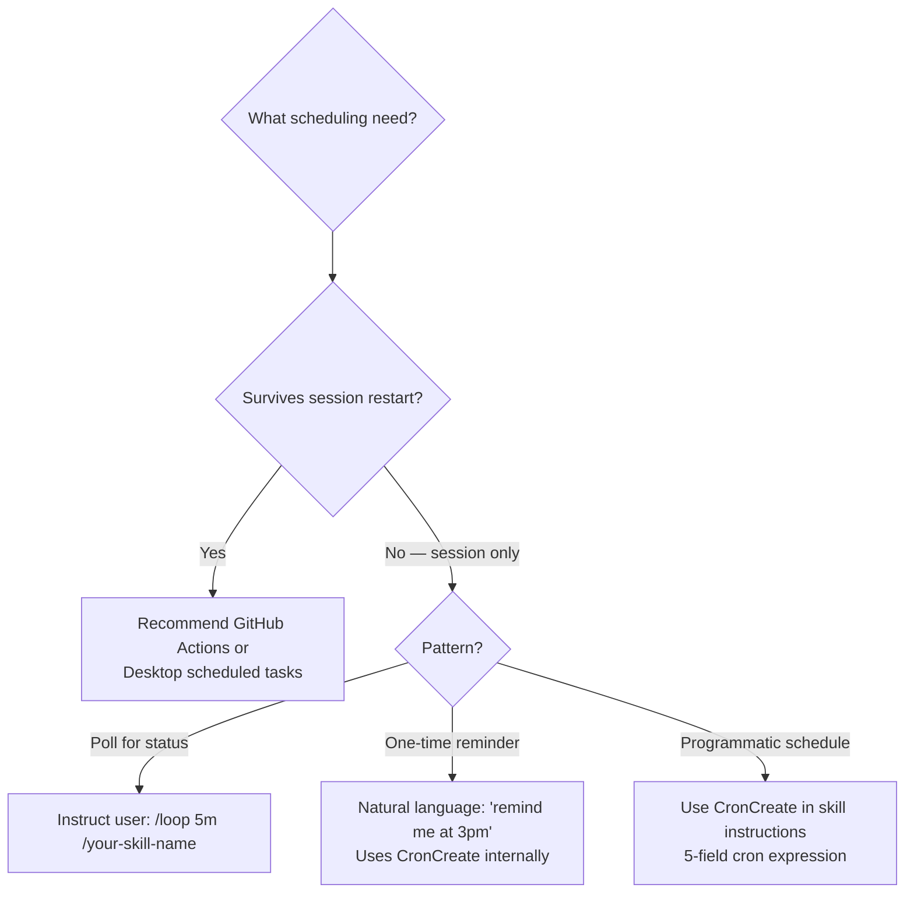

# Advanced Plugin Features Reference

This reference documents powerful plugin capabilities to consider when designing plugins. These features can transform a basic plugin into an exceptional one.

---

## Dynamic Context Injection

The !`command` syntax runs shell commands BEFORE skill content is sent to Claude. Output replaces the placeholder.

**How it works:**

1. Each !`command` executes immediately (before Claude sees anything)
2. Output replaces the placeholder in skill content
3. Claude receives fully-rendered prompt with actual data

**Use cases:**

- Inject git status, branch info, or PR details
- Include current date/time or environment info
- Fetch live API data for context
- Run diagnostics before a task

**Source**: <https://code.claude.com/docs/en/skills.md#inject-dynamic-context>

---

## String Substitutions

Skills support these variables:

| Variable                | Description                                          |
| ----------------------- | ---------------------------------------------------- |
| `$ARGUMENTS`            | Text passed when invoking the skill                  |
| `${CLAUDE_SESSION_ID}`  | Current session ID (for logging, correlating output) |
| `${CLAUDE_PLUGIN_ROOT}` | Absolute path to plugin directory                    |

**Example:**

```yaml
---
description: Log activity for this session
---

Log the following to logs/${CLAUDE_SESSION_ID}.log:

$ARGUMENTS
```

---

## Running Skills in Subagents

Add `context: fork` to run a skill in an isolated subagent. The skill content becomes the subagent's prompt.

```yaml
---
description: Research a topic thoroughly
context: fork
agent: general-purpose
---

Research $ARGUMENTS thoroughly:

1. Find relevant files using Glob and Grep
2. Read and analyze the code
3. Summarize findings with specific file references
```

**When to use:**

- Long-running research tasks
- Tasks that need isolation from main conversation
- Read-only exploration (use Plan agent for reasoning; Explore only for verbatim retrieval)
- Complex planning (use Plan agent)

**Available agent types:**

- `Explore` — Read-only tools, verbatim file retrieval only (Haiku-based, no reasoning tasks)
- `Plan` — Architecture and planning tasks with reasoning
- `general-purpose` — Full tool access with reasoning

**Source**: <https://code.claude.com/docs/en/skills.md#run-skills-in-a-subagent>

---

## Visual Output — Bundled Scripts

Skills can bundle scripts in ANY language to generate visual output (HTML files that open in browser).

**Example: Codebase Visualizer**

```text
my-skill/
├── SKILL.md
└── scripts/
    └── visualize.py
```

**SKILL.md:**

```yaml
---
description: Generate interactive tree visualization of codebase
allowed-tools: Bash(python:*)
---

# Codebase Visualizer

Run the visualization script from project root:

\`\`\`bash
python ~/.claude/skills/codebase-visualizer/scripts/visualize.py .
\`\`\`

Creates codebase-map.html and opens it in browser.
```

**Pattern:** Script does heavy lifting, Claude orchestrates.

**Use cases:**

- Dependency graphs
- Test coverage reports
- API documentation
- Database schema visualizations
- Performance dashboards

**Source**: <https://code.claude.com/docs/en/skills.md#generate-visual-output>

---

## Hook Configuration

Plugins can provide event handlers that respond to Claude Code events.

**Hook types:**

| Type      | Purpose                           |
| --------- | --------------------------------- |
| `command` | Execute shell commands or scripts |
| `prompt`  | Evaluate a prompt with LLM        |
| `agent`   | Run agentic verifier with tools   |

**Available events:**

| Event                | When                      | Has Matcher |
| -------------------- | ------------------------- | ----------- |
| `PreToolUse`         | Before tool executes      | Yes         |
| `PostToolUse`        | After tool succeeds       | Yes         |
| `PostToolUseFailure` | After tool fails          | Yes         |
| `Stop`               | Claude finishes           | No          |
| `UserPromptSubmit`   | User submits prompt       | No          |
| `SessionStart`       | Session begins/resumes    | Yes         |
| `SessionEnd`         | Session ends              | No          |
| `SubagentStart`      | Subagent starts           | Yes         |
| `SubagentStop`       | Subagent stops            | Yes         |
| `Setup`              | Maintenance/init flags    | No          |
| `PreCompact`         | Before context compaction | No          |

**Example hooks/hooks.json:**

```json
{
  "hooks": {
    "PostToolUse": [
      {
        "matcher": "Write|Edit",
        "hooks": [
          {
            "type": "command",
            "command": "${CLAUDE_PLUGIN_ROOT}/scripts/format.sh",
            "timeout": 30
          }
        ]
      }
    ]
  }
}
```

Always use `${CLAUDE_PLUGIN_ROOT}` for script paths — it resolves to the correct cached location.

**Source**: <https://code.claude.com/docs/en/hooks.md>

---

## MCP Server Integration

Plugins can bundle MCP servers for external tool integration.

**Location:** `.mcp.json` at plugin root or inline in plugin.json

```json
{
  "mcpServers": {
    "plugin-database": {
      "command": "${CLAUDE_PLUGIN_ROOT}/servers/db-server",
      "args": ["--config", "${CLAUDE_PLUGIN_ROOT}/config.json"],
      "env": {
        "DB_PATH": "${CLAUDE_PLUGIN_ROOT}/data"
      }
    }
  }
}
```

**Source**: <https://code.claude.com/docs/en/mcp.md>

---

## LSP Server Integration

Plugins can provide Language Server Protocol servers for code intelligence.

**Location:** `.lsp.json` at plugin root

```json
{
  "go": {
    "command": "gopls",
    "args": ["serve"],
    "extensionToLanguage": {
      ".go": "go"
    }
  }
}
```

**LSP provides:**

- Instant diagnostics (errors/warnings after each edit)
- Code navigation (go to definition, find references)
- Type information and documentation

Users must install the language server binary separately.

**Source**: <https://code.claude.com/docs/en/plugins-reference.md#lsp-servers>

---

## Plugin Caching Behavior

Claude Code COPIES plugins to a cache directory rather than using them in-place.

**Implications:**

1. External files outside plugin directory are NOT copied
2. Use symlinks if you need external dependencies (symlinks are followed during copy)
3. `${CLAUDE_PLUGIN_ROOT}` always points to correct cached location

**Source**: <https://code.claude.com/docs/en/plugins-reference.md#plugin-caching-and-file-resolution>

---

## Path Behavior Rules

Custom paths SUPPLEMENT default directories, they don't REPLACE them.

```json
{
  "skills": ["./custom/skills/"]
}
```

This adds custom skills IN ADDITION TO `skills/` directory.

- All paths must be relative and start with `./`
- Multiple paths can be arrays for flexibility
- Same naming/namespacing rules apply

---

## Skill Invocation Control

Control who can invoke skills:

| Frontmatter                      | User | Claude | Use Case                    |
| -------------------------------- | ---- | ------ | --------------------------- |
| (default)                        | Yes  | Yes    | Most skills                 |
| `disable-model-invocation: true` | Yes  | No     | Workflows with side effects |
| `user-invocable: false`          | No   | Yes    | Background knowledge only   |

**Example — deploy skill only user can trigger:**

```yaml
---
description: Deploy application to production
disable-model-invocation: true
---
```

---

## Extended Thinking

Include "ultrathink" anywhere in skill content to enable extended thinking mode.

---

## Scheduled Tasks in Plugins

Plugins can use Claude Code's scheduled task system to enable periodic work within a session.

**Tools available**: `CronCreate`, `CronList`, `CronDelete`
**Bundled skill**: `/loop` — schedules a recurring prompt

**When to use in plugin design**:



**CronCreate usage in skill instructions**:

```yaml
---
description: Monitor deployment and notify when complete
---

Schedule a monitoring task:

Use CronCreate with expression `*/5 * * * *` and prompt
"Check if the deployment at $ARGUMENTS has completed and report status."

The task will fire every 5 minutes. Use CronDelete with the returned
task ID to cancel when deployment completes.
```

**Limitations to document in plugin README**:
- Tasks are session-scoped — lost when Claude Code exits
- Max 50 tasks per session
- No catch-up for missed fires
- All times in local timezone

**Source**: <https://code.claude.com/docs/en/scheduled-tasks.md> (accessed 2026-03-07)

---

## Output Styles in Plugins

Plugins can ship custom output styles via the `outputStyles` field in `plugin.json`.

**What output styles do**: Modify Claude Code's system prompt to change how Claude responds — tone, format, behavior. Active for the entire session once selected.

**plugin.json field**:

```json
{
  "name": "my-plugin",
  "outputStyles": ["./output-styles/my-style.md"]
}
```

**Output style file format** (place in `output-styles/` directory at plugin root):

```markdown
---
name: My Plugin Style
description: Focused mode for [plugin purpose]
keep-coding-instructions: false
---

# Style Instructions

[Custom system prompt additions here]
```

**Frontmatter fields**:

| Field | Purpose | Default |
|-------|---------|---------|
| `name` | Display name in /output-style menu | File name |
| `description` | Shown in /output-style UI | None |
| `keep-coding-instructions` | Preserve coding-related system prompt sections | false |

**When to ship an output style vs a skill**:
- Output style: changes persistent behavior (tone, format, role persona)
- Skill: task-specific workflow invoked on demand

**Source**: <https://code.claude.com/docs/en/output-styles.md> (accessed 2026-03-07)
