# Plugin-Creator vs Gastown Comparison

This document compares the plugin-creator agentic workflow with the [Gastown MEOW methodology](https://github.com/steveyegge/gastown).

---

## Executive Summary

| Aspect          | Plugin-Creator              | Gastown MEOW                        |
| --------------- | --------------------------- | ----------------------------------- |
| **Focus**       | Single plugin creation task | Multi-agent workspace orchestration |
| **Scale**       | 1-6 agents per task         | 20-30+ agents across projects       |
| **Persistence** | None (session-based)        | Git worktrees survive restarts      |
| **Coordinator** | Ephemeral orchestrator      | Persistent Mayor                    |
| **Work Items**  | Phases/tasks                | Beads/issues in convoys             |
| **Best For**    | Focused creation workflow   | Long-running distributed work       |

---

## Workflow Phase Comparison

### Plugin-Creator (7 Phases)

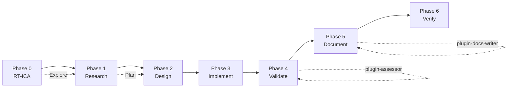

### Gastown MEOW (7 Phases)

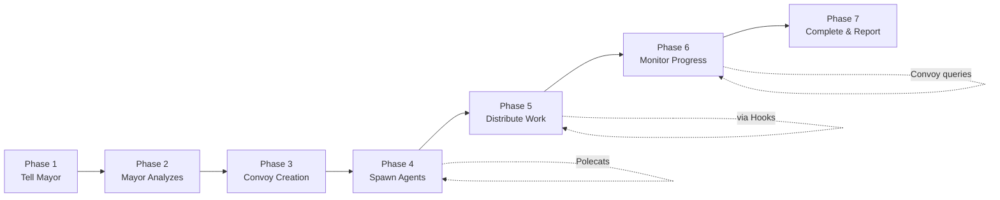

---

## Conceptual Mapping

| Plugin-Creator Concept | Gastown Equivalent | Notes                                         |
| ---------------------- | ------------------ | --------------------------------------------- |
| Orchestrator           | Mayor              | Both coordinate work, but Mayor is persistent |
| Explore/Plan agents    | Polecats           | Ephemeral workers that complete tasks         |
| Phases (0-6)           | Convoys            | Bundled related work items                    |
| Individual tasks       | Beads/Issues       | Atomic work units                             |
| SKILL.md output        | Hook artifacts     | Persistent deliverables                       |
| RT-ICA checkpoint      | "Tell Mayor"       | Initial work decomposition                    |
| verify skill           | Completion report  | Final synthesis                               |

---

## Key Architectural Differences

### 1. Persistence Model

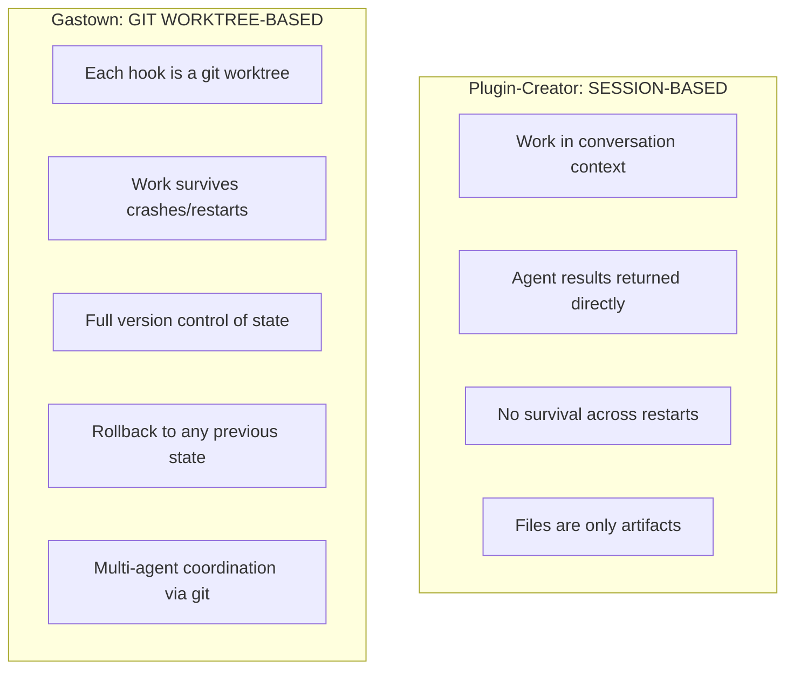

### 2. Coordinator Role

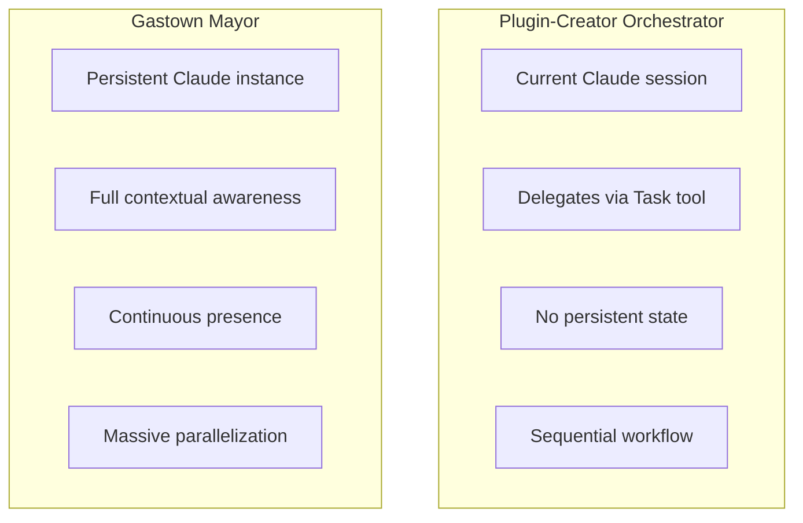

### 3. Work Tracking

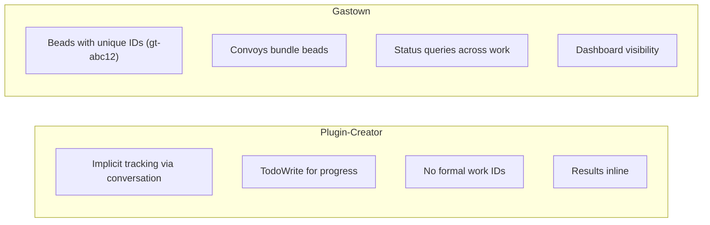

---

## What Plugin-Creator Could Learn from Gastown

### 1. Persistence Layer

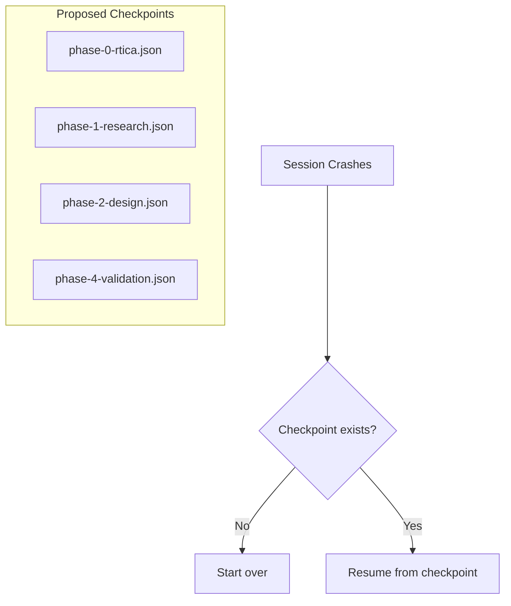

### 2. Formal Work Items

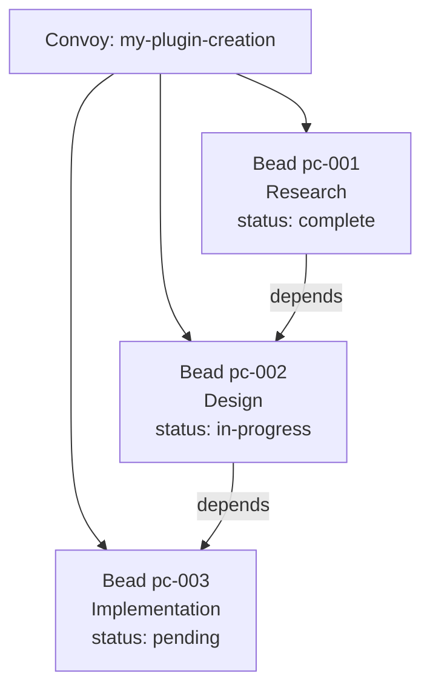

### 3. Parallel Agent Spawning

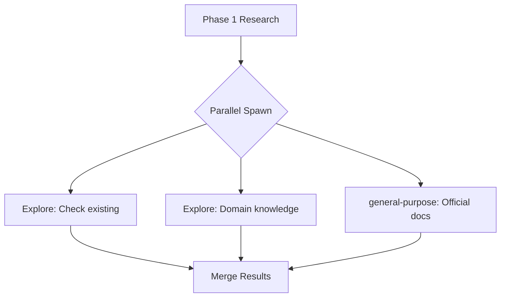

---

## What Gastown Could Learn from Plugin-Creator

### 1. Domain-Specific Agents

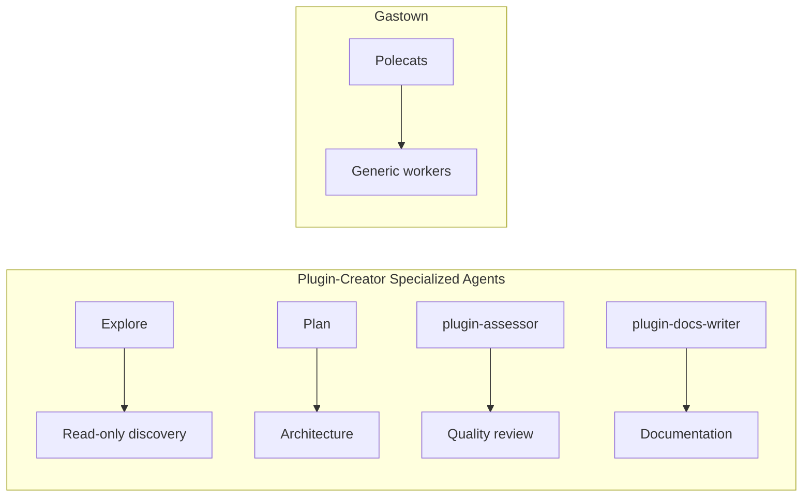

### 2. Verification Integration

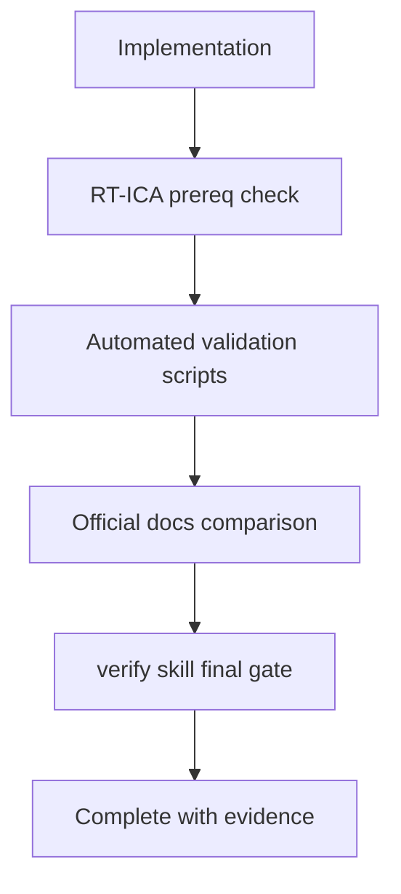

---

## Hybrid Approach

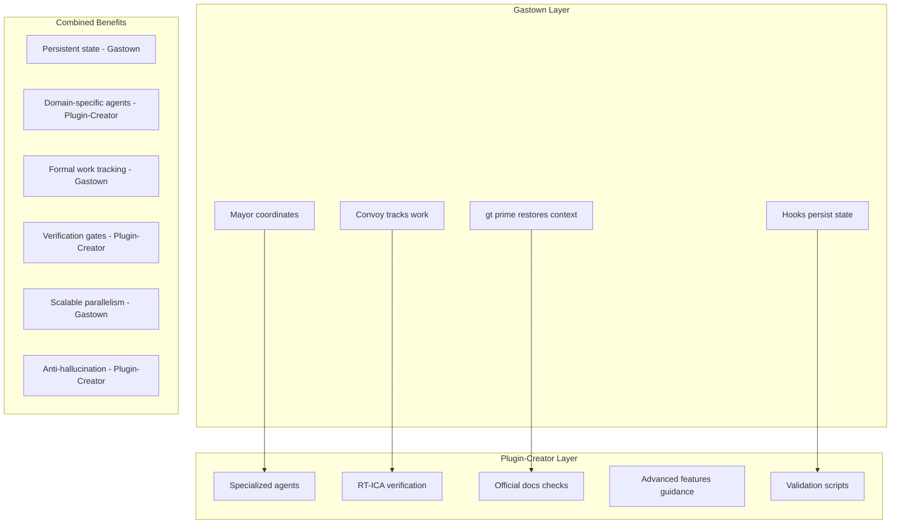

---

## Recommendation

| Use Case                                         | Recommended Approach    |
| ------------------------------------------------ | ----------------------- |
| Single plugin creation                           | Plugin-Creator workflow |
| Large-scale plugin dev (multiple plugins, teams) | Gastown integration     |
| Critical plugins                                 | Hybrid approach         |

**Single plugin**: Plugin-Creator provides focused guidance, verification, no infrastructure overhead.

**Large-scale**: Gastown provides persistence, parallel coordination, work tracking across projects.

**Critical**: Hybrid combines Gastown's persistence with Plugin-Creator's verification and specialized agents.

---

## Sources

- [Gastown Repository](https://github.com/steveyegge/gastown)
- [Plugin-Creator SKILL.md](../SKILL.md)
- [Plugin-Creator Workflow Diagram](./workflow-diagram.md)
