# Plugin Creator Workflow Diagram

<!-- Converted from mixed ASCII + sparse mermaid: complete agentic plugin creation workflow -->

This diagram set covers the full agentic workflow for creating Claude Code plugins.
Each diagram corresponds to a named phase in [SKILL.md](../SKILL.md).

---

## High-Level Flow

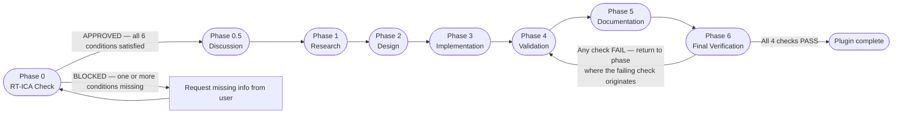

---

## Phase 0 — RT-ICA Prerequisite Check

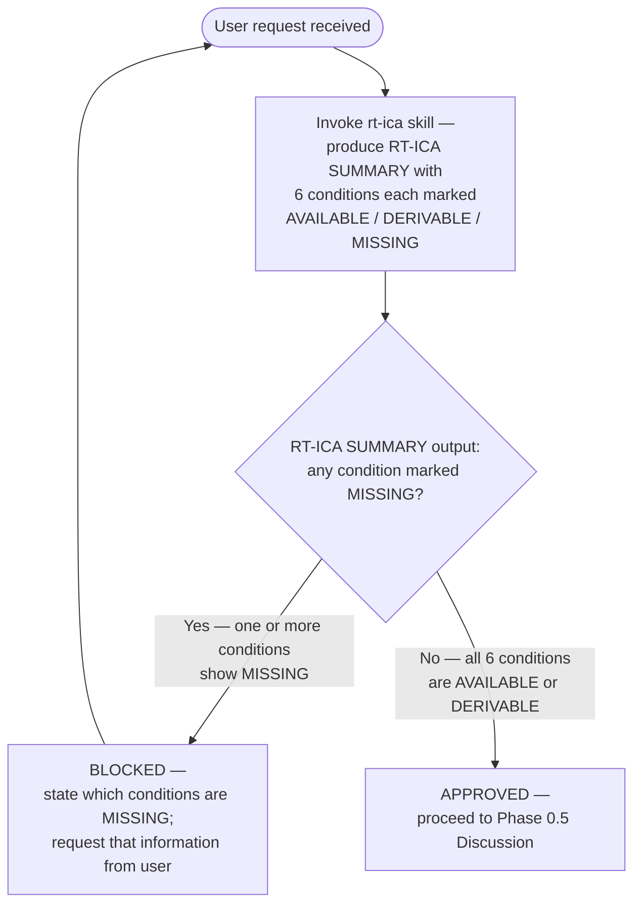

---

## Phase 0.5 — Discussion (Capture Preferences)

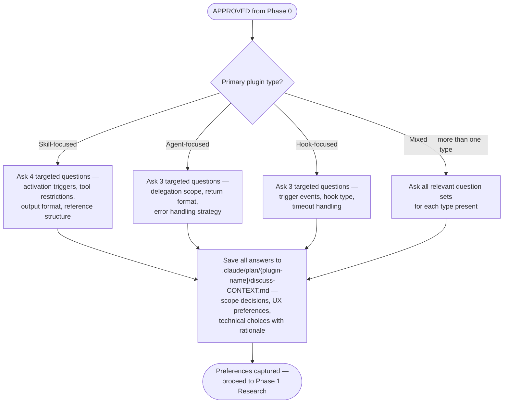

---

## Phase 1 — Research (4-Way Parallel)

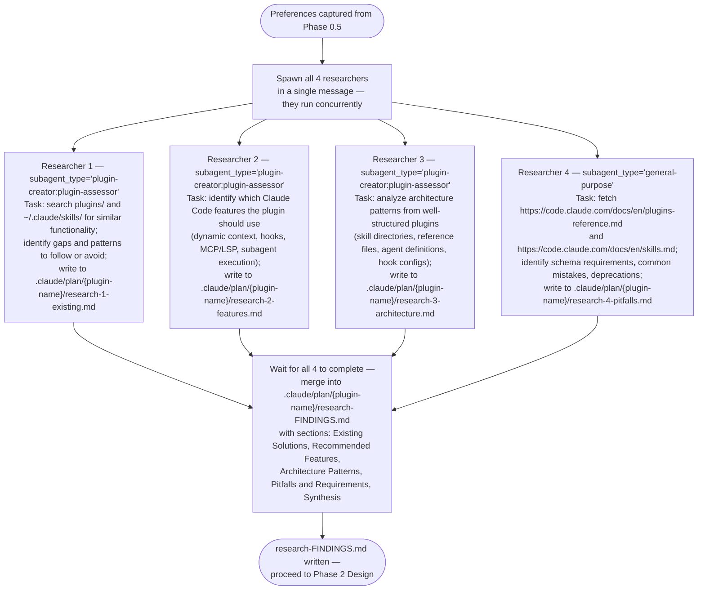

---

## Phase 2 — Design (Plan + Verify Loop)

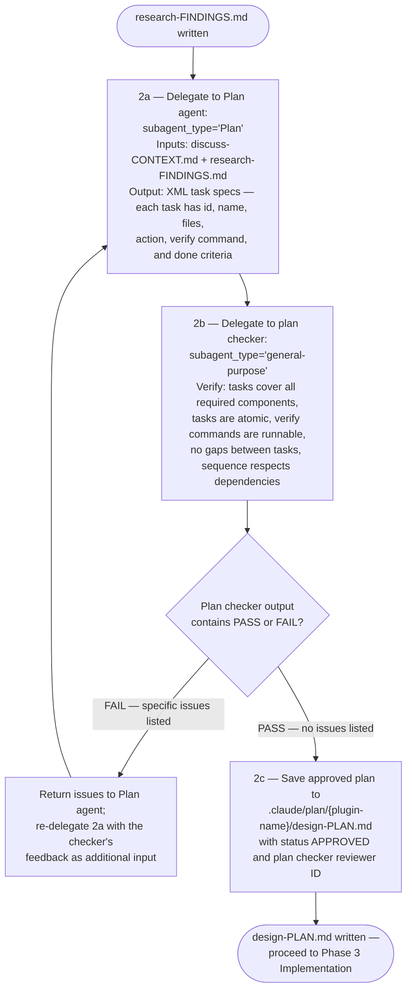

---

## Phase 3 — Implementation (Atomic Execution)

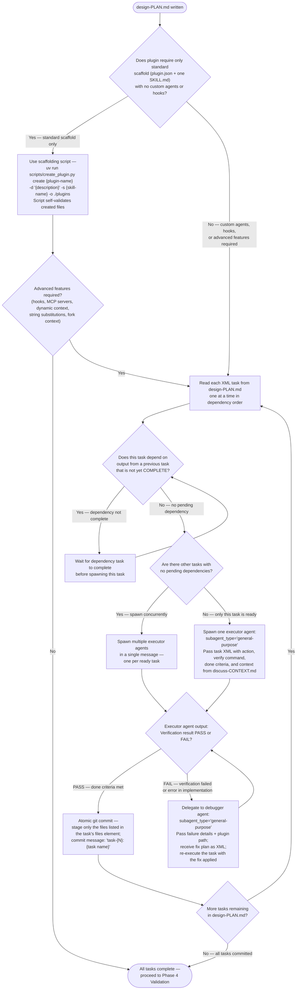

---

## Phase 4 — Validation (Multi-Layer)

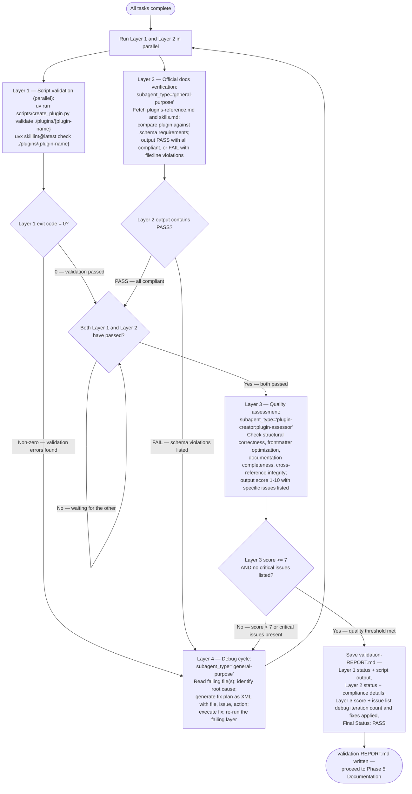

---

## Phase 5 — Documentation

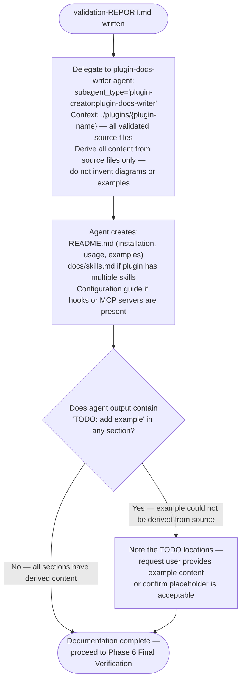

---

## Phase 6 — Final Verification

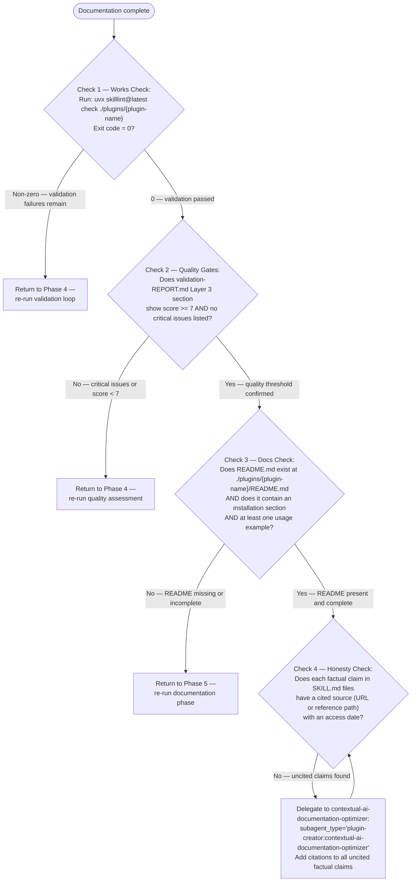

Routing within `contextual-ai-documentation-optimizer`:
- Optimize existing content (improve clarity, fix structure, apply Anthropic prompt engineering principles) → `plugin-creator:contextual-ai-documentation-optimizer`
- Audit quality (read-only, no writes, score against completeness categories) → `/plugin-creator:audit-skill-completeness` skill directly
- Sync content against upstream docs (add NEW/fix STALE from live sources) → general-purpose agent with drift report until `skill-content-updater` lands (backlog #1899)
- Write/rewrite description field only → `/plugin-creator:write-frontmatter-description` skill directly

```mermaid

    Check4 -->|"Yes — all claims cited"| Complete(["COMPLETE —<br>plugin validated, documented, and ready<br>for marketplace submission"])
```

---

## Agent Delegation Routing

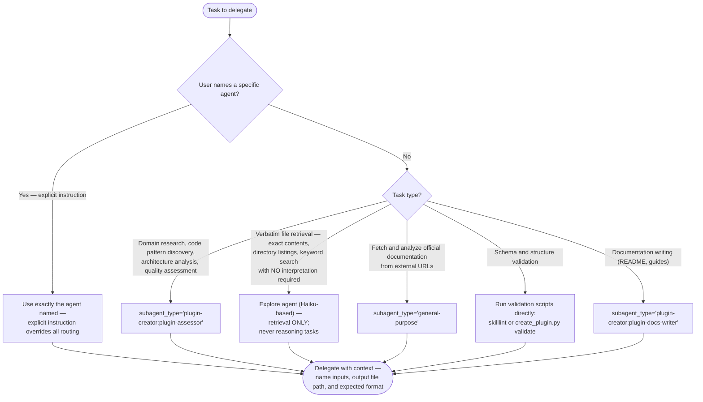

---

## Failure Recovery Paths

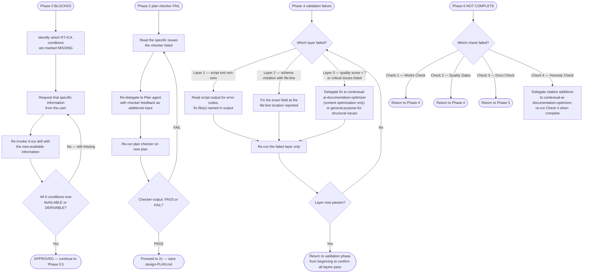

Routing within `contextual-ai-documentation-optimizer`:
- Optimize existing content (improve clarity, fix structure, apply Anthropic prompt engineering principles) → `plugin-creator:contextual-ai-documentation-optimizer`
- Audit quality (read-only, no writes, score against completeness categories) → `/plugin-creator:audit-skill-completeness` skill directly
- Sync content against upstream docs (add NEW/fix STALE from live sources) → general-purpose agent with drift report until `skill-content-updater` lands (backlog #1899)
- Write/rewrite description field only → `/plugin-creator:write-frontmatter-description` skill directly

---

## Tool and Agent Reference

### Built-in Claude Code Agents

| Agent name | Model | Use for |
|---|---|---|
| `general-purpose` | inherits | Reasoning, analysis, implementation, debugging |
| `Explore` | haiku | Verbatim retrieval only — no reasoning tasks |
| `Plan` | inherits | Architecture planning, content structure decisions |

SOURCE: CLAUDE.md global instructions (accessed 2026-01-28)

### Plugin-Specific Agents

| Agent | subagent_type | Use for |
|---|---|---|
| `plugin-assessor` | `plugin-creator:plugin-assessor` | Domain research, code discovery, quality assessment |
| `plugin-docs-writer` | `plugin-creator:plugin-docs-writer` | README and documentation generation |
| `contextual-ai-documentation-optimizer` | `plugin-creator:contextual-ai-documentation-optimizer` | Content optimization, citation addition, AI-facing docs |

SOURCE: Verified from plugin-creator agents directory

Routing within `contextual-ai-documentation-optimizer`:
- Optimize existing content (improve clarity, fix structure, apply Anthropic prompt engineering principles) → `plugin-creator:contextual-ai-documentation-optimizer`
- Audit quality (read-only, no writes, score against completeness categories) → `/plugin-creator:audit-skill-completeness` skill directly
- Sync content against upstream docs (add NEW/fix STALE from live sources) → general-purpose agent with drift report until `skill-content-updater` lands (backlog #1899)
- Write/rewrite description field only → `/plugin-creator:write-frontmatter-description` skill directly

### Validation Scripts

| Script | Command | Output |
|---|---|---|
| `skilllint` | `uvx skilllint@latest check {path}` | Exit code 0 = pass; non-zero = error codes with file:line |
| `create_plugin.py validate` | `uv run scripts/create_plugin.py validate {plugin-path}` | Pass/fail with structural issues |

SOURCE: Verified from plugin-creator scripts directory

### MCP Tools for Documentation

| Tool | Use for |
|---|---|
| `mcp__Ref__ref_read_url` | Fetch official docs by URL |
| `mcp__Ref__ref_search_documentation` | Search documentation by keyword |

SOURCE: Lines 9–12 of claude-plugins-reference-2026/SKILL.md

---

## Source

This workflow diagram documents the agentic plugin creation process defined in [SKILL.md](../SKILL.md).
Last updated: 2026-03-02
