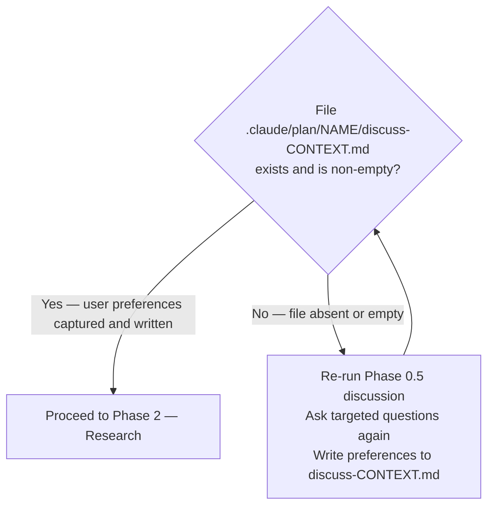
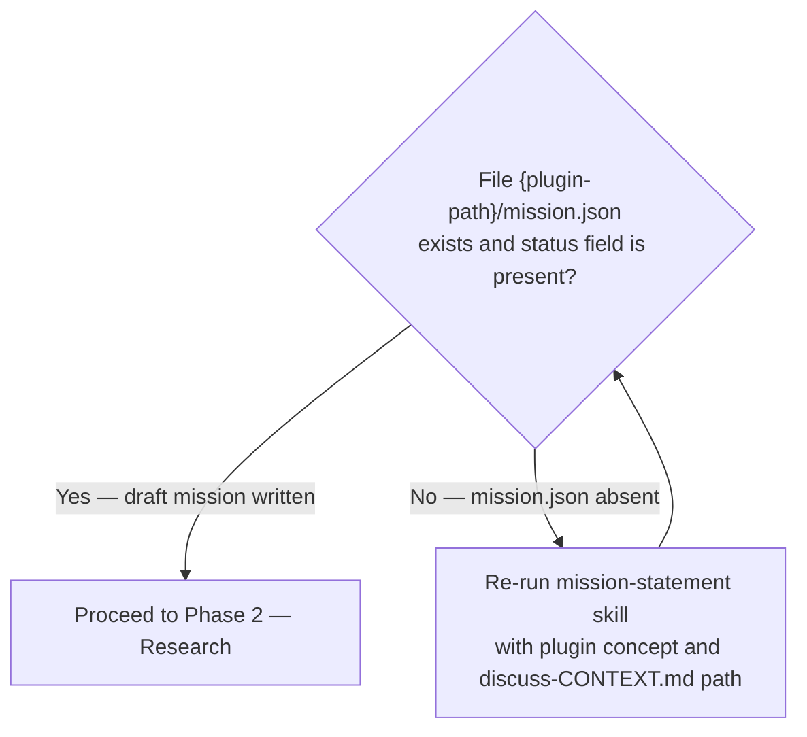
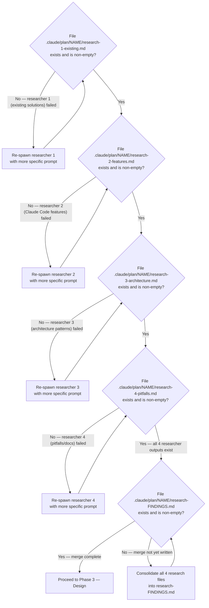
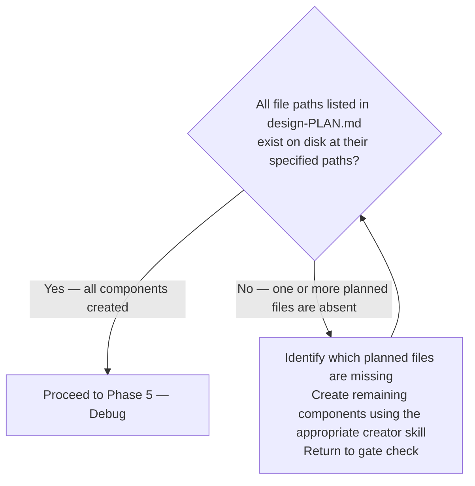
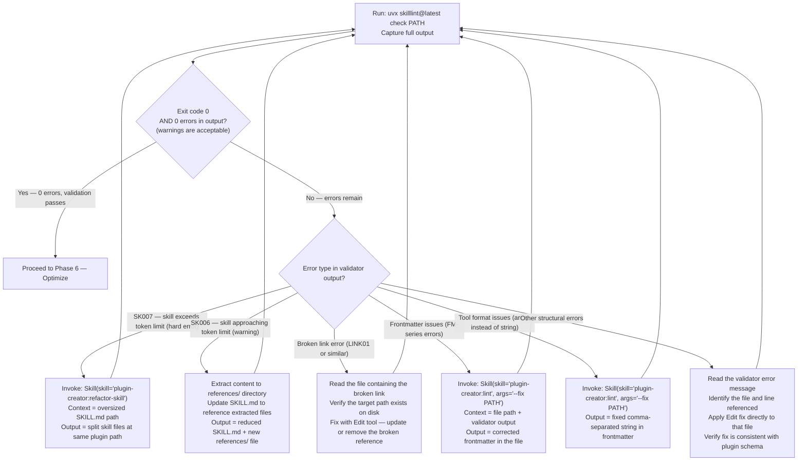
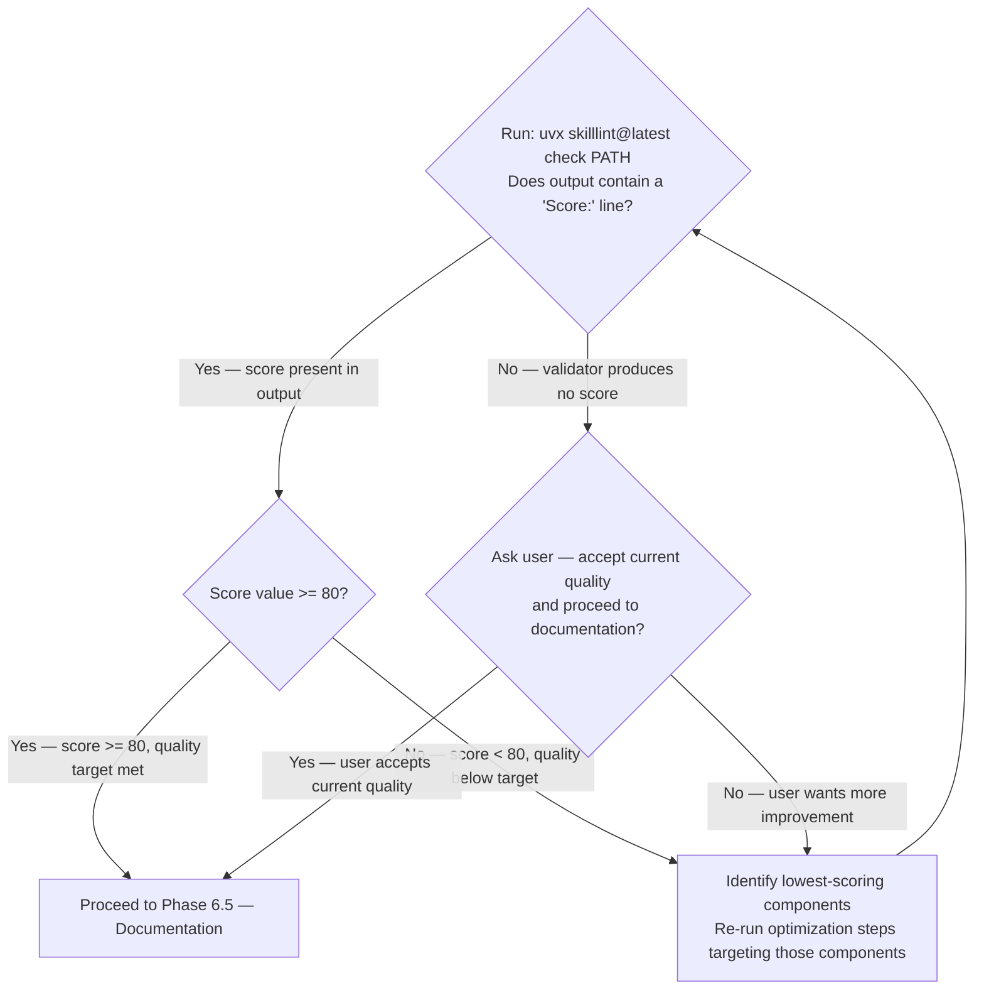
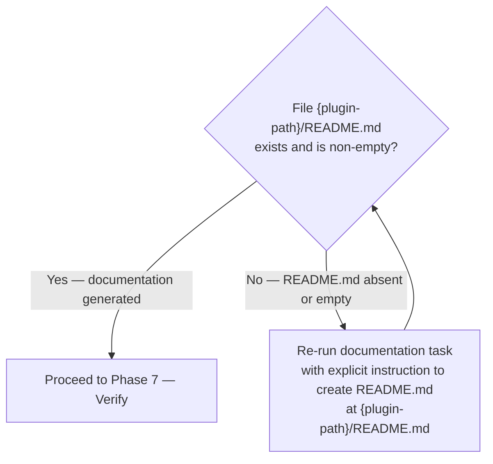
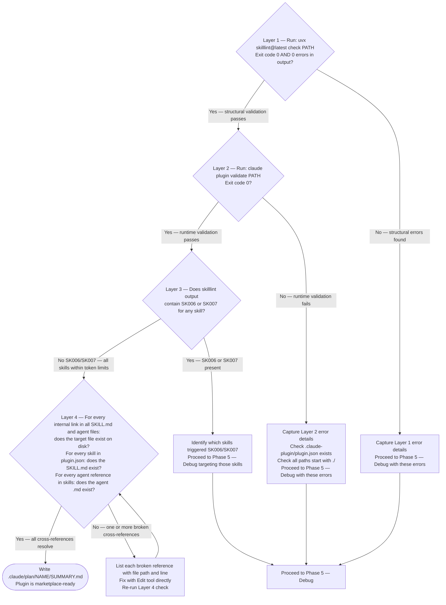

<plugin_mode>$0</plugin_mode>
<plugin_target>$1</plugin_target>
<invocation_args>$ARGUMENTS</invocation_args>

> When editing files in `plugins/`, `.claude/`, `AGENTS.md`, or `CLAUDE.md` — delegate to `subagent_type="plugin-creator:contextual-ai-documentation-optimizer"`.

> [!IMPORTANT]
> When provided a process map or Mermaid diagram, treat it as the authoritative procedure. Execute steps in the exact order shown, including branches, decision points, and stop conditions.
> A Mermaid process diagram is an executable instruction set. Follow it exactly as written: respect sequence, conditions, loops, parallel paths, and terminal states. Do not improvise, reorder, or skip steps. If any node is ambiguous or missing required detail, pause and ask a clarifying question before continuing.
> When interacting with a user, report before acting the interpreted path you will follow from the diagram, then execute.

# Plugin Lifecycle Orchestration

Orchestrate plugin development through seven phases. This skill composes existing plugin-creator skills and agents — it does not re-implement their logic.

Arguments: `<invocation_args/>`

- `new <concept>` — Create a plugin from scratch. Enters at Phase 0 (RT-ICA Prerequisite Check).
- `existing <plugin-path>` — Improve an existing plugin. Enters at Phase 1 (Assess).

## Domain Knowledge Prerequisites

Load these skills at session start before executing any phase. Full skill descriptions and what each provides: [domain-knowledge-prerequisites.md](./references/domain-knowledge-prerequisites.md).

Required — load at session start:

1. `Skill(skill="plugin-creator:claude-plugins-reference-2026")` — plugin.json schema, component types, environment variables, installation scopes, path rules
2. `Skill(skill="plugin-creator:claude-skills-overview-2026")` — SKILL.md format, all 14 frontmatter fields, YAML multiline bug, allowed-tools string format, context fork behavior

Required for phases involving hooks (Phase 4: Create, Phase 5: Debug):

3. `Skill(skill="plugin-creator:hooks-guide")` — 13 hook event types, exit codes, tool denial mechanisms, agent frontmatter fields

## Workflow Overview

The following diagram is the authoritative procedure for plugin lifecycle routing. Execute steps in the exact order shown, including branches, decision points, and stop conditions.

```mermaid
flowchart TD
    Start(["/plugin-lifecycle <invocation_args/>"]) --> Q1{"First argument is?"}
    Q1 -->|"new — create from scratch"| RTICA["Phase 0 — RT-ICA Prerequisite Check"]
    Q1 -->|"existing — improve existing plugin"| Assess["Phase 1 — Assess"]

    %% New path: RT-ICA gate
    RTICA --> RTICAGate{"RT-ICA decision?"}
    RTICAGate -->|"BLOCKED — one or more conditions MISSING"| RTICABlock(["STOP — present missing inputs to user<br>Do not proceed until resolved"])
    RTICAGate -->|"APPROVED — all conditions available or derivable"| Discuss["Phase 0.5 — Discussion"]

    %% New path: Discussion gate — file must exist before Research
    Discuss --> DiscussGate{"File .claude/plan/NAME/discuss-CONTEXT.md<br>exists and is non-empty?"}
    DiscussGate -->|"Yes — preferences captured"| Mission["Phase 0.6 — Draft Mission Statement"]
    Mission --> Research["Phase 2 — Research"]
    DiscussGate -->|"No — file absent or empty"| Discuss

    %% Existing path: Assess then validator
    Assess --> AssessFile{"File .claude/plan/NAME/assessment-REPORT.md<br>exists and is non-empty?"}
    AssessFile -->|"No — assessor did not complete"| Assess
    AssessFile -->|"Yes — assessment written"| AssessGate{"Run: uvx skilllint@latest check PATH<br>Exit code?"}
    AssessGate -->|"0 — no validation errors"| Optimize["Phase 6 — Optimize"]
    AssessGate -->|"non-zero — errors found"| Debug["Phase 5 — Debug"]

    %% New path: Research gate
    Research --> ResearchGate{"File .claude/plan/NAME/research-FINDINGS.md<br>exists and is non-empty?"}
    ResearchGate -->|"Yes — all 4 researcher outputs merged"| Design["Phase 3 — Design"]
    ResearchGate -->|"No — merge incomplete or file absent"| Research

    %% New path: Design gate with iteration limit
    Design --> DesignGate{"design-PLAN.md exists<br>AND plan-checker returns PASS?"}
    DesignGate -->|"PASS — plan complete and verified"| Create["Phase 4 — Create"]
    DesignGate -->|"FAIL — iteration count < 3"| Design
    DesignGate -->|"FAIL — iteration count = 3 (limit reached)"| DesignEscalate(["STOP — escalate to user<br>Plan checker has failed 3 times"])

    %% New path: Create gate
    Create --> CreateGate{"All files listed in design-PLAN.md<br>exist at their specified paths?"}
    CreateGate -->|"Yes — all components created"| Debug
    CreateGate -->|"No — one or more files missing"| Create

    %% Shared Debug phase (both paths converge here)
    Debug --> DebugGate{"Run: uvx skilllint@latest check PATH<br>Exit code 0 AND 0 errors?<br>(warnings acceptable)"}
    DebugGate -->|"Yes — 0 errors, validation passes"| Optimize
    DebugGate -->|"No — errors remain"| Debug

    %% Optimize gate
    Optimize --> OptGate{"Run: uvx skilllint@latest check PATH<br>Output contains 'Score:' line?"}
    OptGate -->|"Score >= 80 — quality target met"| Docs["Phase 6.5 — Documentation"]
    OptGate -->|"Score < 80 — quality below target"| Optimize
    OptGate -->|"No score in output — user acceptance required"| OptUser{"User accepts current quality?"}
    OptUser -->|"Yes — user accepts"| Docs
    OptUser -->|"No — continue improving"| Optimize

    %% Documentation gate
    Docs --> DocsGate{"File {plugin-path}/README.md<br>exists and is non-empty?"}
    DocsGate -->|"Yes — documentation complete"| Verify["Phase 7 — Verify"]
    DocsGate -->|"No — README.md absent or empty"| Docs

    %% Verify: 4 discrete layers
    Verify --> VL1{"Layer 1 — Run: uvx skilllint@latest check PATH<br>Exit code 0?"}
    VL1 -->|"Yes — structural validation passes"| VL2{"Layer 2 — Run: claude plugin validate PATH<br>Exit code 0?"}
    VL1 -->|"No — structural errors found"| VerifyFail["Return to Phase 5 — Debug<br>with Layer 1 error details"]
    VL2 -->|"Yes — runtime validation passes"| VL3{"Layer 3 — skilllint output<br>contains SK006 or SK007 for any skill?"}
    VL2 -->|"No — runtime validation fails"| VerifyFail
    VL3 -->|"No SK006/SK007 — all skills within token limits"| VL4{"Layer 4 — all internal links resolve,<br>all plugin.json skill paths exist,<br>all agent references point to existing files?"}
    VL3 -->|"Yes — SK006 or SK007 present"| VerifyFail
    VL4 -->|"Yes — cross-reference integrity confirmed"| Done(["Write .claude/plan/NAME/SUMMARY.md<br>Plugin is marketplace-ready"])
    VL4 -->|"No — broken cross-references found"| VerifyFail
    VerifyFail --> Debug
```



## Artifact System

All work artifacts are stored in `.claude/plan/{plugin-name}/`:

```text
.claude/plan/{plugin-name}/
├── PROJECT.md                # Vision and goals
├── STATE.md                  # Current phase, decisions, blockers
├── discuss-CONTEXT.md        # Phase 0.5 output — user preferences (new path only)
├── research-FINDINGS.md      # Phase 2 output (new path only)
├── design-PLAN.md            # Phase 3 output (new path only)
├── assessment-REPORT.md      # Phase 1 output (existing path only)
├── validation-REPORT.md      # Phase 7 output
└── SUMMARY.md                # Completion record
```

`{plugin-path}/mission.json` — Phase 0.6 output — plugin mission statement with `status: "draft"` (new path); created by `mission-statement` skill at the plugin root (not inside `.claude/plan/`).

Before starting any phase, read `STATE.md` if it exists to determine current progress. After completing each phase, update `STATE.md` with the phase completed and any decisions made.

---

## Phase 0: RT-ICA Prerequisite Check (New Plugin Only)

Entry condition: User provides `new <concept>`.

Before creating any plugin, verify all prerequisites are in place. Perform this RT-ICA assessment:

```text
RT-ICA SUMMARY

Goal:
- Create a Claude Code plugin for [purpose]

Success Output:
- Functional plugin that [specific outcome]

Conditions (reverse prerequisites):
1. Purpose clarity     | Requires: Clear problem statement   | Why: Determines plugin scope
2. Target users        | Requires: Who will use this         | Why: Shapes UX decisions
3. Component selection | Requires: Skills vs Agents vs Hooks | Why: Architecture
4. Existing solutions  | Requires: Check for similar plugins | Why: Avoid duplication
5. Source material     | Requires: Documentation/APIs to encode | Why: Content accuracy
6. Verification method | Requires: How to test the plugin works | Why: Quality gate

Verification:
- [Check each condition: AVAILABLE / DERIVABLE / MISSING]

Decision:
- [APPROVED / BLOCKED]
```

The following diagram is the authoritative procedure for Phase 0 RT-ICA decision gate. Execute steps in the exact order shown, including branches, decision points, and stop conditions.


---

## Phase 0.5: Discussion — Capture User Preferences (New Plugin Only)

Entry condition: RT-ICA gate returned APPROVED.

Before research, identify gray areas and capture user preferences to guide all subsequent phases.

Ask targeted questions to eliminate ambiguity:

For skill-focused plugins:

- Activation triggers: When should Claude auto-load vs user-invoke?
- Tool restrictions: Full access or limited tools?
- Output format: Verbose explanations or terse instructions?
- Reference structure: Inline content or progressive disclosure?

For agent-focused plugins:

- Delegation scope: What tasks should agents handle?
- Return format: Summaries or detailed reports?
- Error handling: Retry, escalate, or fail fast?

For hook-focused plugins:

- Trigger events: Which tool/session events matter?
- Hook type: Command, prompt, or agent verification?
- Timeout handling: Fail silently or block?

Save preferences to `.claude/plan/{plugin-name}/discuss-CONTEXT.md`:

```markdown
# Plugin Discussion: {plugin-name}
Date: {ISO timestamp}

## Scope Decisions
- {question}: {user preference}

## UX Preferences
- Invocation: {user-invoked | model-invoked | both}
- Verbosity: {terse | balanced | verbose}

## Technical Choices
- {choice}: {preference with rationale}
```

These preferences guide all subsequent research and planning phases.

The following diagram is the authoritative procedure for Phase 0.5 discussion completion gate. Execute steps in the exact order shown, including branches, decision points, and stop conditions.



---

## Phase 1: Assess (Existing Plugin Only)

Entry condition: User provides `existing <plugin-path>`.

1. Task is plugin assessment with Skill(skill="plugin-creator:assessor")
   Context to include in the prompt: plugin directory path from `<plugin_target/>`
   Output: `.claude/plan/{plugin-name}/assessment-REPORT.md` — assessment report with design map and task file

The following diagram is the authoritative procedure for Phase 1 Assess decision gate. Execute steps in the exact order shown, including branches, decision points, and stop conditions.


---

## Phase 0.6: Mission Statement Draft (New Plugin Only)

Entry condition: Discussion phase completed and discuss-CONTEXT.md written.

Before research begins, draft an initial mission statement for the plugin. This anchors all subsequent phases to the plugin's purpose and values and creates a backlog interview task for async human refinement.

1. Task is mission statement drafting with Skill(skill="plugin-creator:mission-statement")
   Context to include in the prompt: plugin concept from `<plugin_target/>`, path to discuss-CONTEXT.md
   Output: `{plugin-path}/mission.json` with `status: "draft"` — a GitHub backlog interview task is created automatically by the skill

The mission statement is never a blocker. Research and all subsequent phases proceed without waiting for the interview. The `[draft]` status on `mission.json` signals this is a hypothesis, not a decision.

The following diagram is the authoritative procedure for Phase 0.6 completion gate.



---

## Phase 2: Research (New Plugin Only)

Entry condition: Discussion phase completed and discuss-CONTEXT.md written.

Spawn all four researchers in a single message to run concurrently. Merge results into `research-FINDINGS.md` before proceeding to Design.

1. Task is feature discovery with Skill(skill="plugin-creator:feature-discovery")
   Context to include in the prompt: plugin concept from `<plugin_target/>` (everything after "new"), discuss-CONTEXT.md
   Output: `.claude/plan/{plugin-name}/feature-context-{slug}.md` — feature context document

2. Task is existing solutions research with subagent_type="plugin-creator:plugin-assessor"
   Context to include in the prompt: plugin concept, feature context from step 1
   Prompt for researcher: Search `plugins/` and `~/.claude/skills/` for similar functionality. Report what exists, gaps to fill, patterns to follow or avoid.
   Output: `.claude/plan/{plugin-name}/research-1-existing.md`

3. Task is Claude Code features research with subagent_type="plugin-creator:plugin-assessor"
   Context to include in the prompt: plugin concept, feature context from step 1
   Prompt for researcher: What capabilities should this plugin use — dynamic context injection (`!command`), subagent execution (`context: fork`), hooks (which events?), MCP/LSP integration opportunities? Report recommended features with rationale.
   Output: `.claude/plan/{plugin-name}/research-2-features.md`

4. Task is architecture patterns research with subagent_type="plugin-creator:plugin-assessor"
   Context to include in the prompt: plugin concept, feature context from step 1
   Prompt for researcher: How do well-structured plugins organize — skill directory structure, reference file patterns, agent definitions, hook configurations? Report recommended structure based on similar plugins.
   Output: `.claude/plan/{plugin-name}/research-3-architecture.md`

5. Task is pitfalls and official docs research with subagent_type="general-purpose"
   Context to include in the prompt: plugin concept, feature context from step 1
   Prompt for researcher: Fetch `https://code.claude.com/docs/en/plugins-reference.md` and `https://code.claude.com/docs/en/skills.md`. Identify schema requirements (comma-separated strings NOT arrays), common mistakes, deprecations or new features. Report gotchas to avoid.
   Output: `.claude/plan/{plugin-name}/research-4-pitfalls.md`

After all four researchers complete, consolidate into `research-FINDINGS.md`:

```markdown
# Research Findings: {plugin-name}
Date: {ISO timestamp}

## 1. Existing Solutions
{Researcher 1 findings}

## 2. Recommended Features
{Researcher 2 findings}

## 3. Architecture Patterns
{Researcher 3 findings}

## 4. Pitfalls & Requirements
{Researcher 4 findings}

## Synthesis
- Key insights: {combined learnings}
- Recommended approach: {synthesis}
```

The following diagram is the authoritative procedure for Phase 2 Research decision gate. Execute steps in the exact order shown, including branches, decision points, and stop conditions.



---

## Phase 3: Design (New Plugin Only)

Entry condition: Research gate passed.

1. Task is prerequisite check with Skill(skill="plugin-creator:rt-ica")
   Context to include in the prompt: research-FINDINGS.md, plugin concept, user requirements from discuss-CONTEXT.md
   Output: APPROVED or BLOCKED verdict — if BLOCKED, resolve blockers before proceeding

2. Task is design plan creation with subagent_type="general-purpose"
   Context to include in the prompt: research-FINDINGS.md, rt-ica output, discuss-CONTEXT.md
   Output: `.claude/plan/{plugin-name}/design-PLAN.md` — design plan with XML task specs defining every skill, agent, and hook to create. Each task must have: single responsibility, testable `<verify>` command, clear `<done>` criteria.

3. Task is plan verification with subagent_type="general-purpose"
   Context to include in the prompt: design-PLAN.md, discuss-CONTEXT.md, research-FINDINGS.md key sections
   Prompt: Verify this plan achieves the plugin goals. Check: (1) do tasks cover all required components? (2) are tasks truly atomic? (3) are `<verify>` commands testable? (4) are there gaps between tasks? (5) does sequence respect dependencies? Return PASS or FAIL with specific issues.
   Output: PASS verdict (proceed) or FAIL with feedback (return to step 2)

The following diagram is the authoritative procedure for Phase 3 Design decision gate. Execute steps in the exact order shown, including branches, decision points, and stop conditions.


---

## Phase 4: Create (New Plugin Only)

Entry condition: Design gate passed.

For each component defined in `design-PLAN.md`, invoke the appropriate creator skill:

1. Task is skill creation with Skill(skill="plugin-creator:skill-creator")
   Context to include in the prompt: design-PLAN.md task spec for this skill, plugin path
   Output: `{plugin-path}/skills/{skill-name}/SKILL.md` and any bundled resources

2. Task is agent creation with Skill(skill="plugin-creator:agent-creator")
   Context to include in the prompt: design-PLAN.md task spec for this agent, plugin path
   Output: `{plugin-path}/agents/{agent-name}.md`

3. Task is hook creation with Skill(skill="plugin-creator:hook-creator")
   Context to include in the prompt: design-PLAN.md task spec for this hook, plugin path
   Output: hook scripts and hooks.json configuration

Repeat for each planned component. Create `plugin.json` via `uv run plugins/plugin-creator/scripts/create_plugin.py` if it does not exist.

The following diagram is the authoritative procedure for Phase 4 Create decision gate. Execute steps in the exact order shown, including branches, decision points, and stop conditions.



---

## Phase 5: Debug (Both Paths)

Entry condition: Create gate passed (new path) OR Assess gate failed (existing path).

Debug fixes validation errors. Run the validator first to identify issues:

```bash
uvx skilllint@latest check <plugin-path>
```

The following diagram is the authoritative procedure for Phase 5 Debug error routing and completion gate. Execute steps in the exact order shown, including branches, decision points, and stop conditions.



---

## Phase 6: Optimize (Both Paths)

Entry condition: Debug gate passed OR Assess gate passed with no errors.

Optimize improves quality — descriptions, progressive disclosure, agent prompts, documentation. This phase is not about fixing errors (that is Debug) but about raising quality.

1. Task is structural plugin improvement with Skill(skill="plugin-creator:refactor-plugin")
   Context to include in the prompt: plugin path, assessment-REPORT.md (if available from Phase 1)
   Output: improved plugin structure, updated SKILL.md files, better progressive disclosure

2. Task is content quality optimization with subagent_type="plugin-creator:contextual-ai-documentation-optimizer"
   Context to include in the prompt: SKILL.md or CLAUDE.md files needing improvement, assessment findings
   Output: optimized documentation with better Claude comprehension

3. Task is agent prompt optimization with subagent_type="plugin-creator:subagent-refactorer"
   Context to include in the prompt: agent .md files needing improvement
   Output: optimized agent prompts using Anthropic best practices

The following diagram is the authoritative procedure for Phase 6 Optimize completion gate. Execute steps in the exact order shown, including branches, decision points, and stop conditions.



---

## Phase 6.5: Documentation (Both Paths)

Entry condition: Optimize phase complete.

Generate comprehensive documentation for the plugin:

1. Task is plugin documentation generation with subagent_type="plugin-creator:plugin-assessor"
   Context to include in the prompt: plugin path, all SKILL.md files, agent files, plugin.json, assess-REPORT.md or design-PLAN.md (whichever is available)
   Prompt: Generate comprehensive documentation. Create: README.md with installation, usage, and examples; `docs/skills.md` if multiple skills exist; configuration guide if hooks or MCP servers are included. Ensure all features are documented, installation instructions are accurate, and examples are runnable.
   Output: `{plugin-path}/README.md` and any additional documentation files

The following diagram is the authoritative procedure for Phase 6.5 Documentation completion gate. Execute steps in the exact order shown, including branches, decision points, and stop conditions.



---

## Phase 7: Verify (Both Paths)

Entry condition: Documentation phase complete.

Run multi-layer validation:

1. Task is recursive validation with Skill(skill="plugin-creator:ensure-complete")
   Context to include in the prompt: plugin path, task file (if applicable)
   Output: `.claude/plan/{plugin-name}/validation-REPORT.md`

2. Layer 1 — Structural validation:

   ```bash
   uvx skilllint@latest check <plugin-path>
   ```

3. Layer 2 — Runtime validation:

   ```bash
   claude plugin validate <plugin-path>
   ```

4. Layer 3 — Token complexity: Check `skilllint` output for SK006/SK007 warnings on all skills.

5. Layer 4 — Cross-reference integrity: Verify all internal links resolve, all skills referenced in plugin.json exist, all agent references in skills point to existing agent files.

The following diagram is the authoritative procedure for Phase 7 Verify 4-layer validation gate. Execute steps in the exact order shown, including branches, decision points, and stop conditions.



---

## Phase-to-Skill Mapping

Full lookup table with exact invocation syntax for all 18 phase-skill pairings: [phase-skill-mapping.md](./references/phase-skill-mapping.md).

Key invocations:
- Phase 1: `Skill(skill="plugin-creator:assessor")`
- Phase 2: `Skill(skill="plugin-creator:feature-discovery")` + 4-way parallel researchers via subagent_type
- Phase 4: skill-creator, agent-creator, hook-creator (one Skill call per component type)
- Phase 5: lint, refactor-skill (one Skill call per error type)
- Phase 7: `Skill(skill="plugin-creator:ensure-complete")`

---

## Error Handling

14 failure modes with recovery actions: [error-handling.md](./references/error-handling.md).

Key rules:
- SK007 (token limit exceeded) — run `/plugin-creator:refactor-skill`; editing alone is not sufficient
- SK006 (approaching limit) — extract content to `references/` and re-validate
- RT-ICA BLOCKED — do not proceed to Discussion or Research until all conditions resolve
- STATE.md absent — read all `.claude/plan/{plugin-name}/` artifacts to reconstruct phase

---

## Example Sessions

Two complete walkthroughs (new plugin full lifecycle + existing plugin with validation errors): [example-sessions.md](./references/example-sessions.md).

---

## Sources

- Plugin-creator CLAUDE.md: [plugins/plugin-creator/CLAUDE.md](./../../CLAUDE.md)
- GitHub Issue: #427
