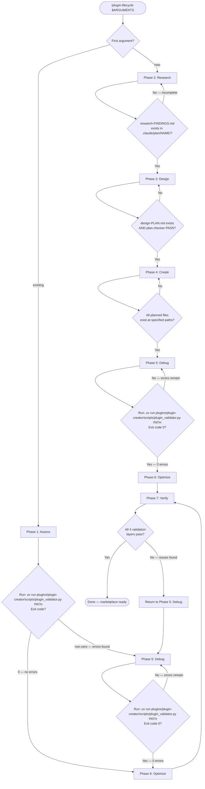
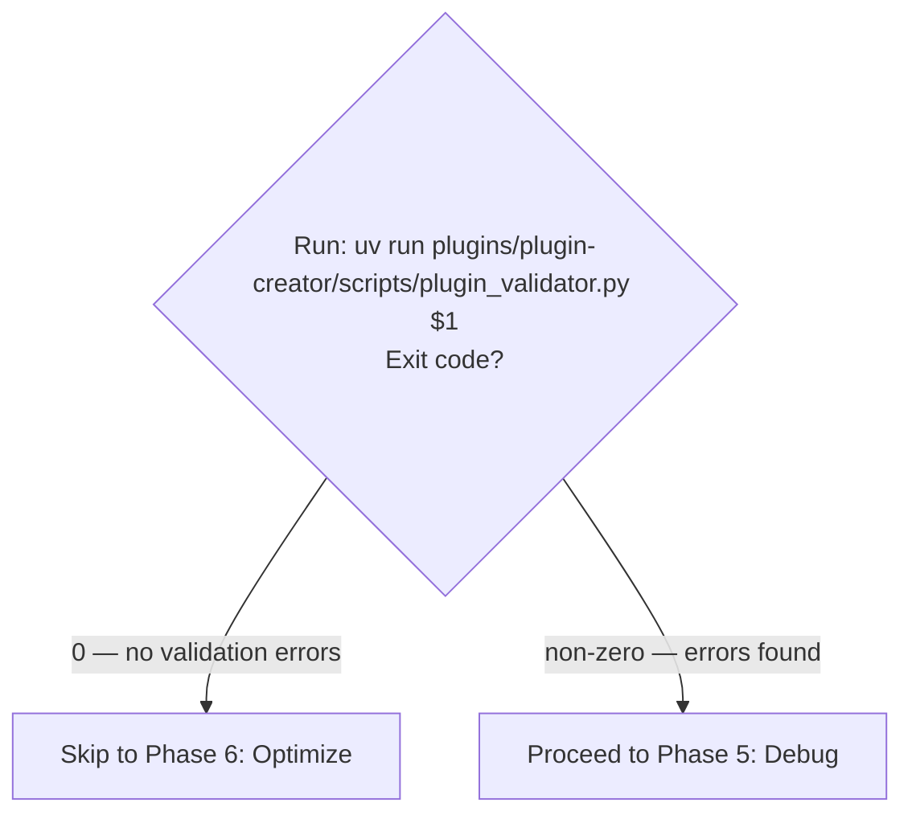
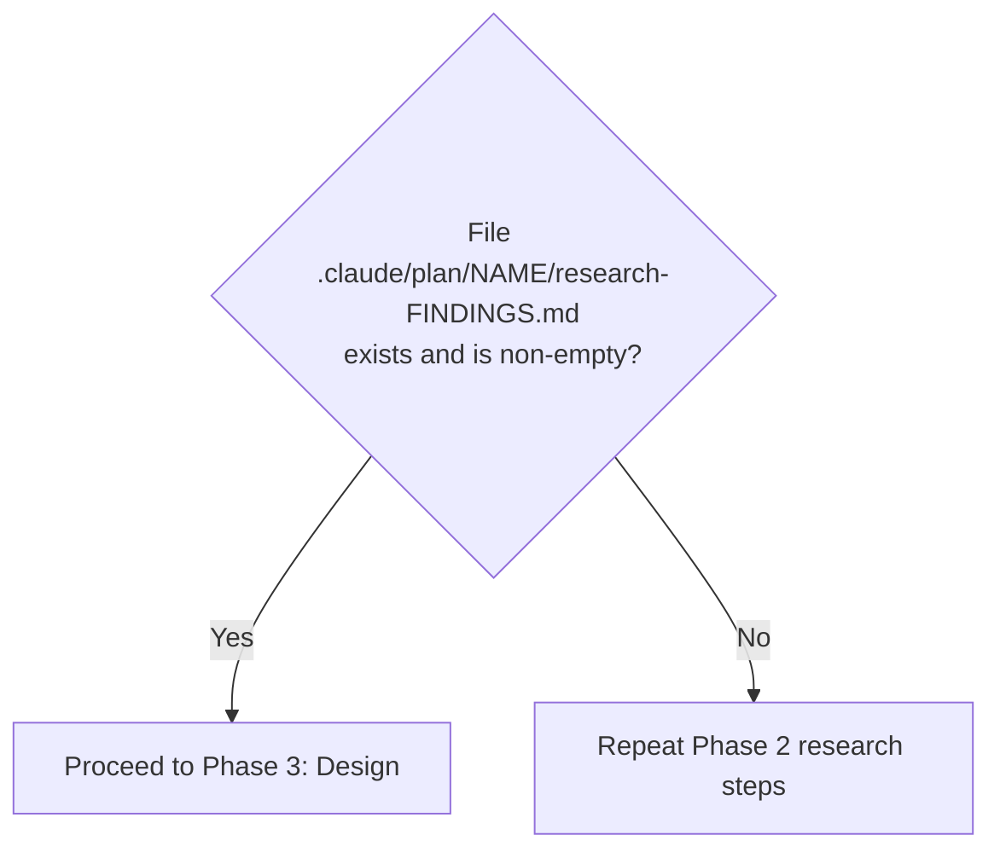
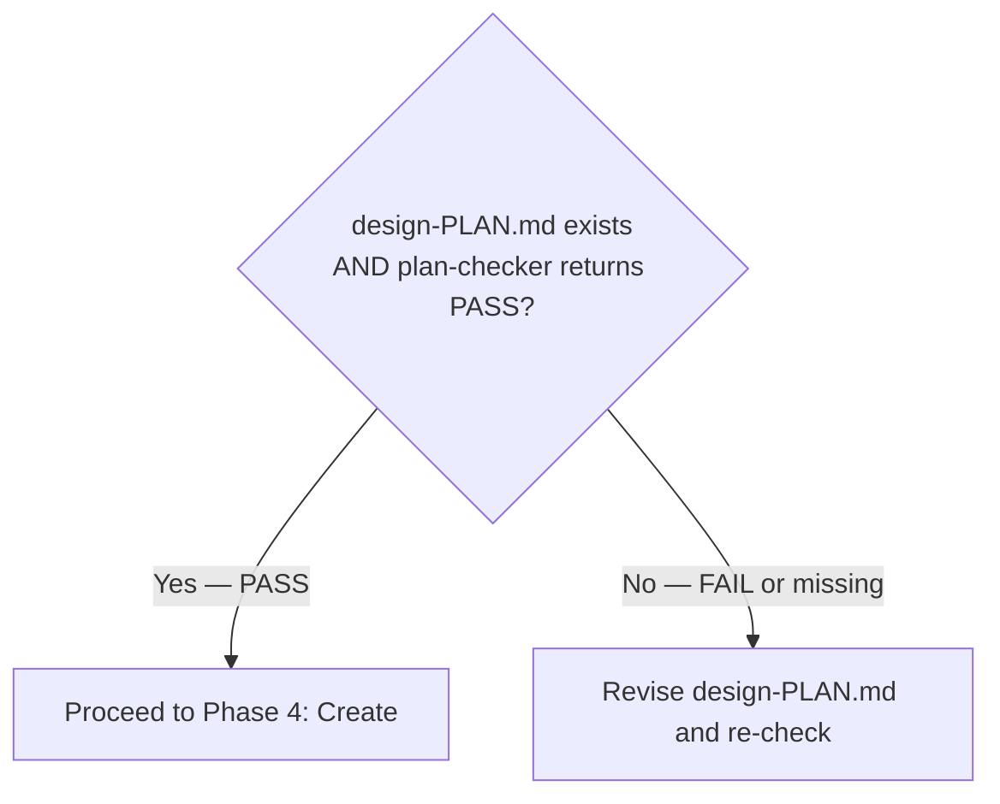
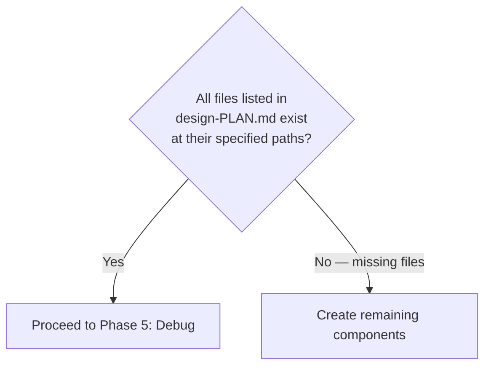
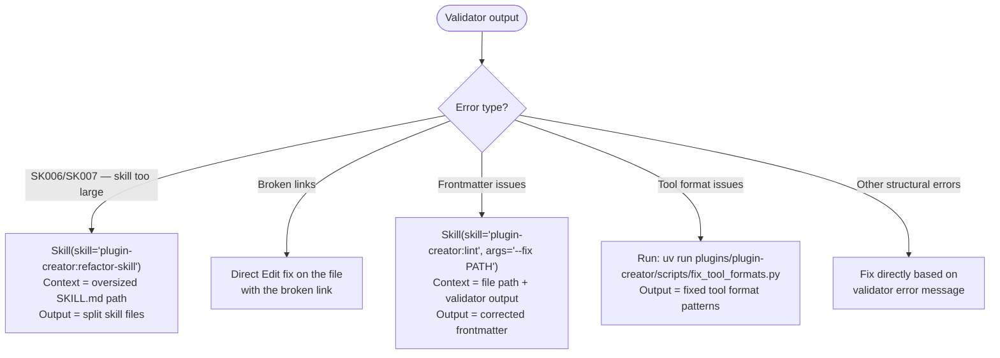
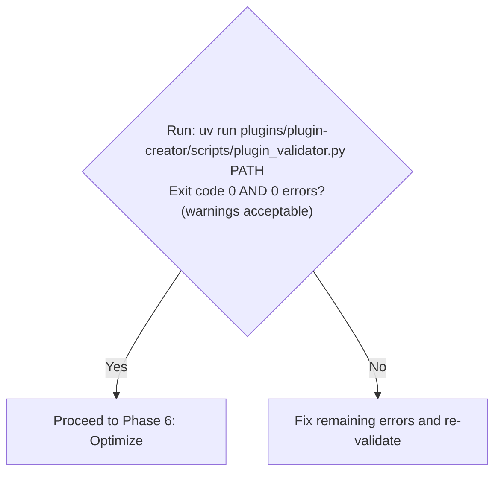
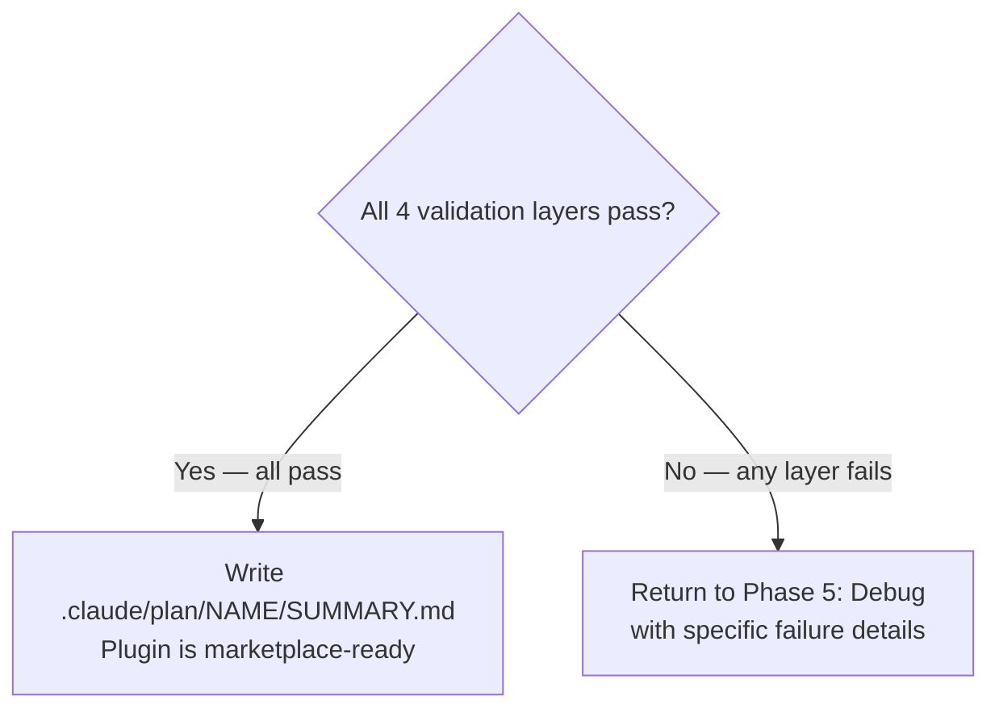

# Plugin Lifecycle Orchestration

Orchestrate plugin development through seven phases. This skill composes existing plugin-creator skills and agents — it does not re-implement their logic.

**Arguments**: `$ARGUMENTS`

- `new <concept>` — Create a plugin from scratch. Enters at Phase 2 (Research).
- `existing <plugin-path>` — Improve an existing plugin. Enters at Phase 1 (Assess).

## Workflow Overview



## Artifact System

All work artifacts are stored in `.claude/plan/{plugin-name}/`:

```text
.claude/plan/{plugin-name}/
├── PROJECT.md                # Vision and goals
├── STATE.md                  # Current phase, decisions, blockers
├── research-FINDINGS.md      # Phase 2 output (new path only)
├── design-PLAN.md            # Phase 3 output (new path only)
├── assessment-REPORT.md      # Phase 1 output (existing path only)
├── validation-REPORT.md      # Phase 7 output
└── SUMMARY.md                # Completion record
```

Before starting any phase, read `STATE.md` if it exists to determine current progress. After completing each phase, update `STATE.md` with the phase completed and any decisions made.

---

## Phase 1: Assess (Existing Plugin Only)

**Entry condition**: User provides `existing <plugin-path>`.

1. Task is plugin assessment with Skill(skill="plugin-creator:assessor")
   Context to include in the prompt: plugin directory path from `$1`
   Output: `.claude/plan/{plugin-name}/assessment-REPORT.md` — assessment report with design map and task file

**Decision gate**:



---

## Phase 2: Research (New Plugin Only)

**Entry condition**: User provides `new <concept>`.

1. Task is feature discovery with Skill(skill="plugin-creator:feature-discovery")
   Context to include in the prompt: plugin concept from `$1` (everything after "new")
   Output: `.claude/plan/{plugin-name}/feature-context-{slug}.md` — feature context document

2. Task is ecosystem and pattern research with parallel research agents (inherited from `/plugin-creator:plugin-creator` Phase 1 pattern — 4-way parallel research covering ecosystem survey, Claude docs review, existing pattern analysis, reference implementations)
   Context to include in the prompt: feature context from step 1, plugin concept description
   Output: `.claude/plan/{plugin-name}/research-FINDINGS.md` — consolidated research findings

**Decision gate**:



---

## Phase 3: Design (New Plugin Only)

**Entry condition**: Research gate passed.

1. Task is prerequisite check with Skill(skill="plugin-creator:rt-ica")
   Context to include in the prompt: research-FINDINGS.md, plugin concept, user requirements
   Output: APPROVED or BLOCKED verdict — if BLOCKED, resolve blockers before proceeding

2. Task is design plan creation (inherited from `/plugin-creator:plugin-creator` Phase 2 pattern)
   Context to include in the prompt: research-FINDINGS.md, rt-ica output, user discussion notes
   Output: `.claude/plan/{plugin-name}/design-PLAN.md` — design plan with XML task specs defining every skill, agent, and hook to create

**Decision gate**:



---

## Phase 4: Create (New Plugin Only)

**Entry condition**: Design gate passed.

For each component defined in `design-PLAN.md`, invoke the appropriate creator skill:

1. Task is skill creation with Skill(skill="plugin-creator:skill-creator")
   Context to include in the prompt: design-PLAN.md task spec for this skill, plugin path
   Output: `{plugin-path}/skills/{skill-name}/SKILL.md` and any bundled resources

2. Task is agent creation with Skill(skill="plugin-creator:agent-creator")
   Context to include in the prompt: design-PLAN.md task spec for this agent, plugin path
   Output: `{plugin-path}/agents/{agent-name}.md`

3. Task is hook creation with Skill(skill="plugin-creator:hook-creator")
   Context to include in the prompt: design-PLAN.md task spec for this hook, plugin path
   Output: hook scripts and hooks.json configuration

Repeat for each planned component. Create `plugin.json` via `uv run plugins/plugin-creator/scripts/create_plugin.py` if it does not exist.

**Decision gate**:



---

## Phase 5: Debug (Both Paths)

**Entry condition**: Create gate passed (new path) OR Assess gate failed (existing path).

Debug fixes validation errors. Run the validator first to identify issues:

```bash
uv run plugins/plugin-creator/scripts/plugin_validator.py <plugin-path>
```

Route each error type to the correct fix:



**Decision gate**:



---

## Phase 6: Optimize (Both Paths)

**Entry condition**: Debug gate passed OR Assess gate passed with no errors.

Optimize improves quality — descriptions, progressive disclosure, agent prompts, documentation. This phase is not about fixing errors (that is Debug) but about raising quality.

1. Task is structural plugin improvement with Skill(skill="plugin-creator:refactor-plugin")
   Context to include in the prompt: plugin path, assessment-REPORT.md (if available from Phase 1)
   Output: improved plugin structure, updated SKILL.md files, better progressive disclosure

2. Task is content quality optimization with subagent_type="plugin-creator:contextual-ai-documentation-optimizer"
   Context to include in the prompt: SKILL.md or CLAUDE.md files needing improvement, assessment findings
   Output: optimized documentation with better Claude comprehension

3. Task is agent prompt optimization with subagent_type="plugin-creator:subagent-refactorer"
   Context to include in the prompt: agent .md files needing improvement
   Output: optimized agent prompts using Anthropic best practices

**Decision gate**: Assessment score meets target threshold (default 80/100) OR user accepts current quality. Proceed to Phase 7: Verify.

---

## Phase 7: Verify (Both Paths)

**Entry condition**: Optimize gate passed.

Run multi-layer validation:

1. Task is recursive validation with Skill(skill="plugin-creator:ensure-complete")
   Context to include in the prompt: plugin path, task file (if applicable)
   Output: `.claude/plan/{plugin-name}/validation-REPORT.md`

2. **Layer 1 — Structural validation**:

   ```bash
   uv run plugins/plugin-creator/scripts/plugin_validator.py <plugin-path>
   ```

3. **Layer 2 — Runtime validation**:

   ```bash
   claude plugin validate <plugin-path>
   ```

4. **Layer 3 — Token complexity**: Check `plugin_validator.py` output for SK006/SK007 warnings on all skills.

5. **Layer 4 — Cross-reference integrity**: Verify all internal links resolve, all skills referenced in plugin.json exist, all agent references in skills point to existing agent files.

**Decision gate**:



---

## Phase-to-Skill Mapping

| Phase | Skill/Agent | Invocation |
|-------|-------------|------------|
| 1: Assess | `/plugin-creator:assessor` | `Skill(skill="plugin-creator:assessor")` |
| 2: Research | `/plugin-creator:feature-discovery` | `Skill(skill="plugin-creator:feature-discovery")` |
| 2: Research | Parallel research agents | Inherited from plugin-creator Phase 1 |
| 3: Design | `/plugin-creator:rt-ica` | `Skill(skill="plugin-creator:rt-ica")` |
| 4: Create | `/plugin-creator:skill-creator` | `Skill(skill="plugin-creator:skill-creator")` |
| 4: Create | `/plugin-creator:agent-creator` | `Skill(skill="plugin-creator:agent-creator")` |
| 4: Create | `/plugin-creator:hook-creator` | `Skill(skill="plugin-creator:hook-creator")` |
| 5: Debug | `/plugin-creator:lint` | `Skill(skill="plugin-creator:lint")` |
| 5: Debug | `/plugin-creator:refactor-skill` | `Skill(skill="plugin-creator:refactor-skill")` |
| 5: Debug | `fix_tool_formats.py` | `uv run plugins/plugin-creator/scripts/fix_tool_formats.py` |
| 6: Optimize | `/plugin-creator:refactor-plugin` | `Skill(skill="plugin-creator:refactor-plugin")` |
| 6: Optimize | `@contextual-ai-documentation-optimizer` | subagent_type="plugin-creator:contextual-ai-documentation-optimizer" |
| 6: Optimize | `@subagent-refactorer` | subagent_type="plugin-creator:subagent-refactorer" |
| 7: Verify | `/plugin-creator:ensure-complete` | `Skill(skill="plugin-creator:ensure-complete")` |
| 7: Verify | `plugin_validator.py` | `uv run plugins/plugin-creator/scripts/plugin_validator.py` |

---

## Sources

- Architecture spec: [plan/architect-plugin-lifecycle.md](./../../../../plan/architect-plugin-lifecycle.md)
- Feature context: [plan/feature-context-plugin-lifecycle.md](./../../../../plan/feature-context-plugin-lifecycle.md)
- Plugin-creator CLAUDE.md: [plugins/plugin-creator/CLAUDE.md](./../../CLAUDE.md)
- GitHub Issue: #427
