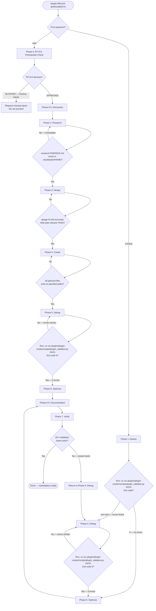
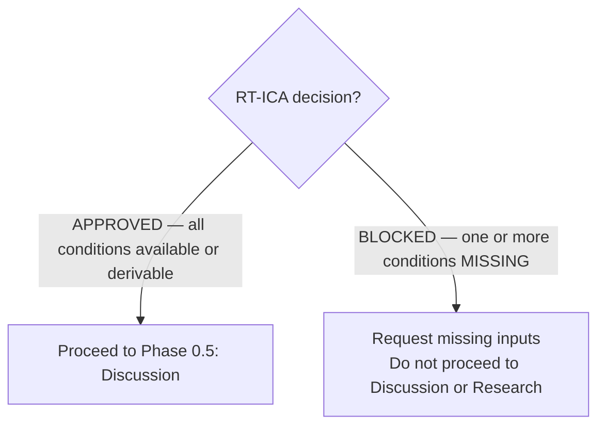
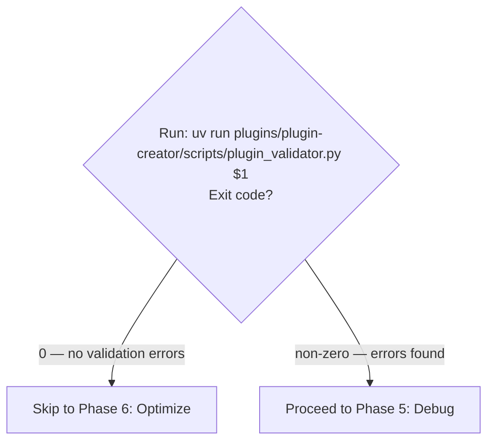
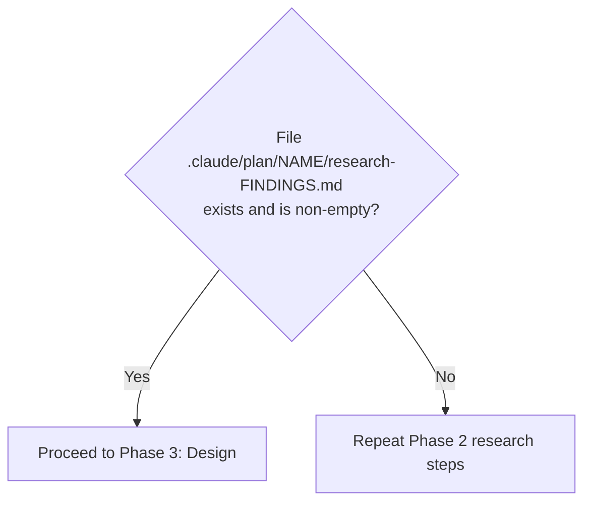
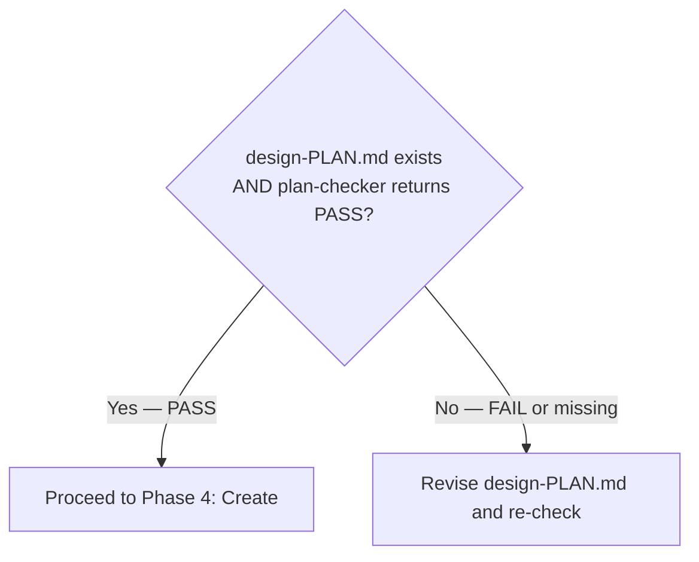
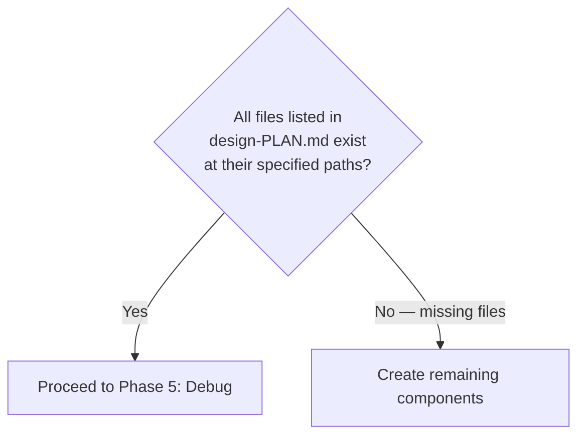
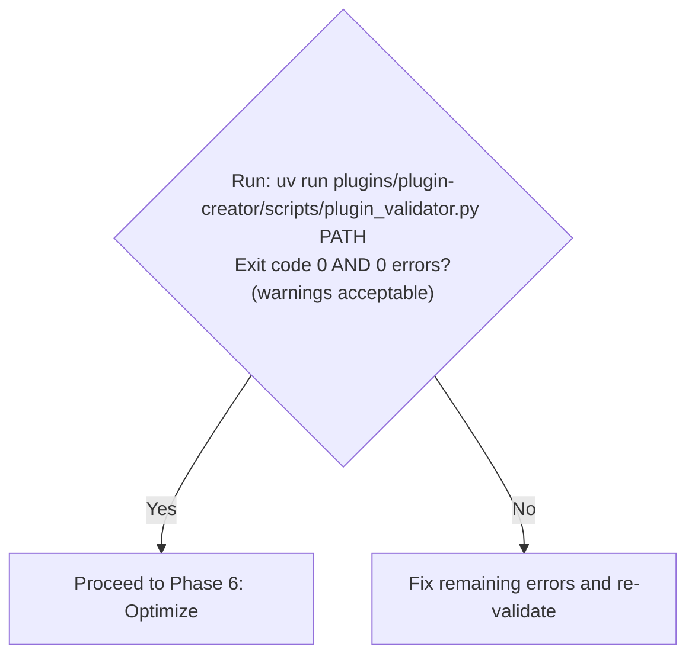
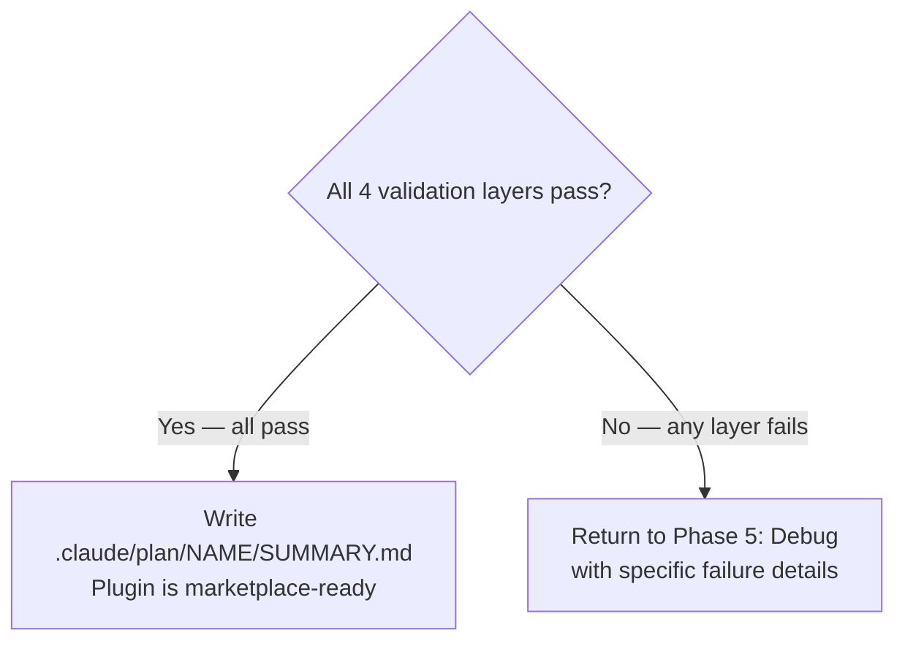

> When editing files in `plugins/`, `.claude/`, `AGENTS.md`, or `CLAUDE.md` — delegate to `subagent_type="plugin-creator:contextual-ai-documentation-optimizer"`.

# Plugin Lifecycle Orchestration

Orchestrate plugin development through seven phases. This skill composes existing plugin-creator skills and agents — it does not re-implement their logic.

**Arguments**: `$ARGUMENTS`

- `new <concept>` — Create a plugin from scratch. Enters at Phase 0 (RT-ICA Prerequisite Check).
- `existing <plugin-path>` — Improve an existing plugin. Enters at Phase 1 (Assess).

## Domain Knowledge Prerequisites

Before executing any phase, load these reference skills to ensure the agent has foundational plugin domain knowledge. Without these, the agent cannot make informed decisions about plugin structure, component design, or validation requirements.

**Required — load at session start:**

1. Skill(skill="plugin-creator:claude-plugins-reference-2026")
   Provides: plugin definition, directory structure, plugin.json schema (all field types and constraints), component types (skills, agents, hooks, MCP servers, LSP servers, output styles), plugin caching mechanics, environment variables (`${CLAUDE_PLUGIN_ROOT}`, `${CLAUDE_PROJECT_DIR}`), installation scopes (user, project, local, managed), marketplace configuration, path behavior rules, CLI commands

2. Skill(skill="plugin-creator:claude-skills-overview-2026")
   Provides: SKILL.md format, all 14 frontmatter fields (name, description, allowed-tools, model, context, agent, user-invocable, disable-model-invocation, hooks, argument-hint), YAML multiline bug (do not use `>-` or `|` in descriptions), skill tokenomics and progressive disclosure, string substitutions (`$ARGUMENTS`, `${CLAUDE_SESSION_ID}`), dynamic context injection (`!` backtick syntax), invocation control, tool assignment via allowed-tools (comma-separated string, not array), context fork behavior and tool restrictions

**Required for phases involving hooks (Phase 4: Create, Phase 5: Debug):**

3. Skill(skill="plugin-creator:hooks-guide")
   Provides: hook event types (13 events), hook types (command, prompt, agent), hook authoring guides for Python and Node.js (CommonJS), exit codes for PreToolUse decision control, PermissionRequest hooks, tool denial mechanisms (disallowedTools, permission rules, hook-based denial), pre-approval mechanisms (allowed-tools, permissionMode, hook auto-allow), agent frontmatter fields (allowedTools, disallowedTools, mcpServers, permissionMode, background)

These skills contain the answers to fundamental questions: what is a plugin, what are its capabilities, how are tools assigned/hidden/denied, how is the namespace defined, what environment variables exist, how are MCP servers configured, and what scripting languages to prefer. The lifecycle phases below orchestrate the workflow — the reference skills above provide the domain expertise.

## Workflow Overview



## Artifact System

All work artifacts are stored in `.claude/plan/{plugin-name}/`:

```text
.claude/plan/{plugin-name}/
├── PROJECT.md                # Vision and goals
├── STATE.md                  # Current phase, decisions, blockers
├── discuss-CONTEXT.md        # Phase 0.5 output — user preferences (new path only)
├── research-FINDINGS.md      # Phase 2 output (new path only)
├── design-PLAN.md            # Phase 3 output (new path only)
├── assessment-REPORT.md      # Phase 1 output (existing path only)
├── validation-REPORT.md      # Phase 7 output
└── SUMMARY.md                # Completion record
```

Before starting any phase, read `STATE.md` if it exists to determine current progress. After completing each phase, update `STATE.md` with the phase completed and any decisions made.

---

## Phase 0: RT-ICA Prerequisite Check (New Plugin Only)

**Entry condition**: User provides `new <concept>`.

Before creating any plugin, verify all prerequisites are in place. Perform this RT-ICA assessment:

```text
RT-ICA SUMMARY

Goal:
- Create a Claude Code plugin for [purpose]

Success Output:
- Functional plugin that [specific outcome]

Conditions (reverse prerequisites):
1. Purpose clarity     | Requires: Clear problem statement   | Why: Determines plugin scope
2. Target users        | Requires: Who will use this         | Why: Shapes UX decisions
3. Component selection | Requires: Skills vs Agents vs Hooks | Why: Architecture
4. Existing solutions  | Requires: Check for similar plugins | Why: Avoid duplication
5. Source material     | Requires: Documentation/APIs to encode | Why: Content accuracy
6. Verification method | Requires: How to test the plugin works | Why: Quality gate

Verification:
- [Check each condition: AVAILABLE / DERIVABLE / MISSING]

Decision:
- [APPROVED / BLOCKED]
```

**Decision gate**:



---

## Phase 0.5: Discussion — Capture User Preferences (New Plugin Only)

**Entry condition**: RT-ICA gate returned APPROVED.

Before research, identify gray areas and capture user preferences to guide all subsequent phases.

Ask targeted questions to eliminate ambiguity:

**For skill-focused plugins:**

- Activation triggers: When should Claude auto-load vs user-invoke?
- Tool restrictions: Full access or limited tools?
- Output format: Verbose explanations or terse instructions?
- Reference structure: Inline content or progressive disclosure?

**For agent-focused plugins:**

- Delegation scope: What tasks should agents handle?
- Return format: Summaries or detailed reports?
- Error handling: Retry, escalate, or fail fast?

**For hook-focused plugins:**

- Trigger events: Which tool/session events matter?
- Hook type: Command, prompt, or agent verification?
- Timeout handling: Fail silently or block?

Save preferences to `.claude/plan/{plugin-name}/discuss-CONTEXT.md`:

```markdown
# Plugin Discussion: {plugin-name}
Date: {ISO timestamp}

## Scope Decisions
- {question}: {user preference}

## UX Preferences
- Invocation: {user-invoked | model-invoked | both}
- Verbosity: {terse | balanced | verbose}

## Technical Choices
- {choice}: {preference with rationale}
```

These preferences guide all subsequent research and planning phases.

---

## Phase 1: Assess (Existing Plugin Only)

**Entry condition**: User provides `existing <plugin-path>`.

1. Task is plugin assessment with Skill(skill="plugin-creator:assessor")
   Context to include in the prompt: plugin directory path from `$1`
   Output: `.claude/plan/{plugin-name}/assessment-REPORT.md` — assessment report with design map and task file

**Decision gate**:



---

## Phase 2: Research (New Plugin Only)

**Entry condition**: Discussion phase completed and discuss-CONTEXT.md written.

Spawn all four researchers in a single message to run concurrently. Merge results into `research-FINDINGS.md` before proceeding to Design.

1. Task is feature discovery with Skill(skill="plugin-creator:feature-discovery")
   Context to include in the prompt: plugin concept from `$1` (everything after "new"), discuss-CONTEXT.md
   Output: `.claude/plan/{plugin-name}/feature-context-{slug}.md` — feature context document

2. Task is existing solutions research with subagent_type="plugin-creator:plugin-assessor"
   Context to include in the prompt: plugin concept, feature context from step 1
   Prompt for researcher: Search `plugins/` and `~/.claude/skills/` for similar functionality. Report what exists, gaps to fill, patterns to follow or avoid.
   Output: `.claude/plan/{plugin-name}/research-1-existing.md`

3. Task is Claude Code features research with subagent_type="plugin-creator:plugin-assessor"
   Context to include in the prompt: plugin concept, feature context from step 1
   Prompt for researcher: What capabilities should this plugin use — dynamic context injection (`!command`), subagent execution (`context: fork`), hooks (which events?), MCP/LSP integration opportunities? Report recommended features with rationale.
   Output: `.claude/plan/{plugin-name}/research-2-features.md`

4. Task is architecture patterns research with subagent_type="plugin-creator:plugin-assessor"
   Context to include in the prompt: plugin concept, feature context from step 1
   Prompt for researcher: How do well-structured plugins organize — skill directory structure, reference file patterns, agent definitions, hook configurations? Report recommended structure based on similar plugins.
   Output: `.claude/plan/{plugin-name}/research-3-architecture.md`

5. Task is pitfalls and official docs research with subagent_type="general-purpose"
   Context to include in the prompt: plugin concept, feature context from step 1
   Prompt for researcher: Fetch `https://code.claude.com/docs/en/plugins-reference.md` and `https://code.claude.com/docs/en/skills.md`. Identify schema requirements (comma-separated strings NOT arrays), common mistakes, deprecations or new features. Report gotchas to avoid.
   Output: `.claude/plan/{plugin-name}/research-4-pitfalls.md`

After all four researchers complete, consolidate into `research-FINDINGS.md`:

```markdown
# Research Findings: {plugin-name}
Date: {ISO timestamp}

## 1. Existing Solutions
{Researcher 1 findings}

## 2. Recommended Features
{Researcher 2 findings}

## 3. Architecture Patterns
{Researcher 3 findings}

## 4. Pitfalls & Requirements
{Researcher 4 findings}

## Synthesis
- Key insights: {combined learnings}
- Recommended approach: {synthesis}
```

**Decision gate**:



---

## Phase 3: Design (New Plugin Only)

**Entry condition**: Research gate passed.

1. Task is prerequisite check with Skill(skill="plugin-creator:rt-ica")
   Context to include in the prompt: research-FINDINGS.md, plugin concept, user requirements from discuss-CONTEXT.md
   Output: APPROVED or BLOCKED verdict — if BLOCKED, resolve blockers before proceeding

2. Task is design plan creation with subagent_type="general-purpose"
   Context to include in the prompt: research-FINDINGS.md, rt-ica output, discuss-CONTEXT.md
   Output: `.claude/plan/{plugin-name}/design-PLAN.md` — design plan with XML task specs defining every skill, agent, and hook to create. Each task must have: single responsibility, testable `<verify>` command, clear `<done>` criteria.

3. Task is plan verification with subagent_type="general-purpose"
   Context to include in the prompt: design-PLAN.md, discuss-CONTEXT.md, research-FINDINGS.md key sections
   Prompt: Verify this plan achieves the plugin goals. Check: (1) do tasks cover all required components? (2) are tasks truly atomic? (3) are `<verify>` commands testable? (4) are there gaps between tasks? (5) does sequence respect dependencies? Return PASS or FAIL with specific issues.
   Output: PASS verdict (proceed) or FAIL with feedback (return to step 2)

**Decision gate**:



---

## Phase 4: Create (New Plugin Only)

**Entry condition**: Design gate passed.

For each component defined in `design-PLAN.md`, invoke the appropriate creator skill:

1. Task is skill creation with Skill(skill="plugin-creator:skill-creator")
   Context to include in the prompt: design-PLAN.md task spec for this skill, plugin path
   Output: `{plugin-path}/skills/{skill-name}/SKILL.md` and any bundled resources

2. Task is agent creation with Skill(skill="plugin-creator:agent-creator")
   Context to include in the prompt: design-PLAN.md task spec for this agent, plugin path
   Output: `{plugin-path}/agents/{agent-name}.md`

3. Task is hook creation with Skill(skill="plugin-creator:hook-creator")
   Context to include in the prompt: design-PLAN.md task spec for this hook, plugin path
   Output: hook scripts and hooks.json configuration

Repeat for each planned component. Create `plugin.json` via `uv run plugins/plugin-creator/scripts/create_plugin.py` if it does not exist.

**Decision gate**:



---

## Phase 5: Debug (Both Paths)

**Entry condition**: Create gate passed (new path) OR Assess gate failed (existing path).

Debug fixes validation errors. Run the validator first to identify issues:

```bash
uv run plugins/plugin-creator/scripts/plugin_validator.py <plugin-path>
```

Route each error type to the correct fix:


**Decision gate**:



---

## Phase 6: Optimize (Both Paths)

**Entry condition**: Debug gate passed OR Assess gate passed with no errors.

Optimize improves quality — descriptions, progressive disclosure, agent prompts, documentation. This phase is not about fixing errors (that is Debug) but about raising quality.

1. Task is structural plugin improvement with Skill(skill="plugin-creator:refactor-plugin")
   Context to include in the prompt: plugin path, assessment-REPORT.md (if available from Phase 1)
   Output: improved plugin structure, updated SKILL.md files, better progressive disclosure

2. Task is content quality optimization with subagent_type="plugin-creator:contextual-ai-documentation-optimizer"
   Context to include in the prompt: SKILL.md or CLAUDE.md files needing improvement, assessment findings
   Output: optimized documentation with better Claude comprehension

3. Task is agent prompt optimization with subagent_type="plugin-creator:subagent-refactorer"
   Context to include in the prompt: agent .md files needing improvement
   Output: optimized agent prompts using Anthropic best practices

**Decision gate**: Assessment score meets target threshold (default 80/100) OR user accepts current quality. Proceed to Phase 6.5: Documentation.

---

## Phase 6.5: Documentation (Both Paths)

**Entry condition**: Optimize phase complete.

Generate comprehensive documentation for the plugin:

1. Task is plugin documentation generation with subagent_type="plugin-creator:plugin-assessor"
   Context to include in the prompt: plugin path, all SKILL.md files, agent files, plugin.json, assess-REPORT.md or design-PLAN.md (whichever is available)
   Prompt: Generate comprehensive documentation. Create: README.md with installation, usage, and examples; `docs/skills.md` if multiple skills exist; configuration guide if hooks or MCP servers are included. Ensure all features are documented, installation instructions are accurate, and examples are runnable.
   Output: `{plugin-path}/README.md` and any additional documentation files

---

## Phase 7: Verify (Both Paths)

**Entry condition**: Documentation phase complete.

Run multi-layer validation:

1. Task is recursive validation with Skill(skill="plugin-creator:ensure-complete")
   Context to include in the prompt: plugin path, task file (if applicable)
   Output: `.claude/plan/{plugin-name}/validation-REPORT.md`

2. **Layer 1 — Structural validation**:

   ```bash
   uv run plugins/plugin-creator/scripts/plugin_validator.py <plugin-path>
   ```

3. **Layer 2 — Runtime validation**:

   ```bash
   claude plugin validate <plugin-path>
   ```

4. **Layer 3 — Token complexity**: Check `plugin_validator.py` output for SK006/SK007 warnings on all skills.

5. **Layer 4 — Cross-reference integrity**: Verify all internal links resolve, all skills referenced in plugin.json exist, all agent references in skills point to existing agent files.

**Decision gate**:



---

## Phase-to-Skill Mapping

| Phase | Skill/Agent | Invocation |
|-------|-------------|------------|
| 0: RT-ICA | `rt-ica` skill (inline procedure) | Inline — see Phase 0 |
| 0.5: Discussion | Direct — capture to discuss-CONTEXT.md | Inline — see Phase 0.5 |
| 1: Assess | `/plugin-creator:assessor` | `Skill(skill="plugin-creator:assessor")` |
| 2: Research | `/plugin-creator:feature-discovery` | `Skill(skill="plugin-creator:feature-discovery")` |
| 2: Research | 4-way parallel researchers | subagent_type="plugin-creator:plugin-assessor" x3 + "general-purpose" x1 |
| 3: Design | `/plugin-creator:rt-ica` | `Skill(skill="plugin-creator:rt-ica")` |
| 4: Create | `/plugin-creator:skill-creator` | `Skill(skill="plugin-creator:skill-creator")` |
| 4: Create | `/plugin-creator:agent-creator` | `Skill(skill="plugin-creator:agent-creator")` |
| 4: Create | `/plugin-creator:hook-creator` | `Skill(skill="plugin-creator:hook-creator")` |
| 5: Debug | `/plugin-creator:lint` | `Skill(skill="plugin-creator:lint")` |
| 5: Debug | `/plugin-creator:refactor-skill` | `Skill(skill="plugin-creator:refactor-skill")` |
| 5: Debug | `fix_tool_formats.py` | `uv run plugins/plugin-creator/scripts/fix_tool_formats.py` |
| 6: Optimize | `/plugin-creator:refactor-plugin` | `Skill(skill="plugin-creator:refactor-plugin")` |
| 6: Optimize | `@contextual-ai-documentation-optimizer` | subagent_type="plugin-creator:contextual-ai-documentation-optimizer" |
| 6: Optimize | `@subagent-refactorer` | subagent_type="plugin-creator:subagent-refactorer" |
| 6.5: Documentation | `@plugin-assessor` | subagent_type="plugin-creator:plugin-assessor" |
| 7: Verify | `/plugin-creator:ensure-complete` | `Skill(skill="plugin-creator:ensure-complete")` |
| 7: Verify | `plugin_validator.py` | `uv run plugins/plugin-creator/scripts/plugin_validator.py` |

---

## Error Handling

| Failure | Recovery |
|---------|----------|
| RT-ICA returns BLOCKED | Present missing inputs to user; do not proceed to Discussion or Research until resolved |
| Discussion phase skipped (user provides no answers) | Use defaults: user-invocable=true, balanced verbosity, no tool restrictions; note assumptions in discuss-CONTEXT.md |
| Researcher subagent returns empty output | Re-spawn that researcher with more specific prompt; do not proceed to Design with incomplete findings |
| research-FINDINGS.md merge incomplete (one researcher missing) | Identify which research-N file is absent; re-run that researcher; do not proceed to Design until all 4 are present |
| Plan checker returns FAIL | Return design-PLAN.md and FAIL feedback to planner; iterate up to 3 times before escalating to user |
| plugin_validator.py not found | Verify path `plugins/plugin-creator/scripts/plugin_validator.py`; check git status; the script must exist before Debug phase can run |
| SK007 error (skill exceeds token limit) | Run `/plugin-creator:refactor-skill` — this error requires splitting, not editing |
| SK006 warning (skill approaching limit) | Extract content to `references/` directory; re-validate after extraction |
| Broken link errors after Create phase | Read the file containing the link; verify the target path exists; fix with Edit tool directly |
| claude plugin validate fails with path error | Confirm `.claude-plugin/plugin.json` exists at the plugin root; path must start with `./` |
| Documentation phase produces no README.md | Re-run documentation task with explicit instruction to create README.md; verify file exists before proceeding |
| Verify phase passes Layers 1–3 but fails Layer 4 | Read each broken cross-reference; fix with Edit tool; re-run Layer 4 check manually before returning to Phase 5 |
| STATE.md absent (session resumed) | Read all artifact files in `.claude/plan/{plugin-name}/` to reconstruct current phase; create STATE.md from inferred state |
| Validator output is ambiguous (warnings only, no errors) | Treat as passing — warnings do not block progression; note warnings in STATE.md for future optimization |

---

## Example Sessions

### New plugin (full lifecycle)

```text
> /plugin-lifecycle new git-workflow-helper

Loading domain knowledge skills...
  ✓ claude-plugins-reference-2026 loaded
  ✓ claude-skills-overview-2026 loaded

Phase 0: RT-ICA Prerequisite Check
  Purpose clarity:     AVAILABLE — "git workflow helper" defined
  Target users:        DERIVABLE — developers using Claude Code
  Component selection: DERIVABLE — likely skills + hooks
  Existing solutions:  MISSING — need to check plugins/
  Source material:     AVAILABLE — git documentation exists
  Verification method: DERIVABLE — validator scripts available

  RT-ICA: BLOCKED
  Missing: Existing solutions check (must search before designing to avoid duplication)

Searching plugins/ and ~/.claude/skills/ for git workflow functionality...
  Found: no similar plugin exists
  RT-ICA: APPROVED

Phase 0.5: Discussion
  Activation triggers: Auto-load on git operations? [yes/no]
  > yes — hook on PreToolUse:Bash for git commands
  Tool restrictions: Read-only or full access?
  > full access needed (creates commits)
  Verbosity: terse or explanatory?
  > terse — just the commands

  Preferences saved to .claude/plan/git-workflow-helper/discuss-CONTEXT.md

Phase 2: Research
  Spawning 4 parallel researchers...
    Researcher 1 (existing solutions) → research-1-existing.md ✓
    Researcher 2 (Claude Code features) → research-2-features.md ✓
    Researcher 3 (architecture patterns) → research-3-architecture.md ✓
    Researcher 4 (pitfalls/official docs) → research-4-pitfalls.md ✓
  Merging findings → research-FINDINGS.md ✓

Phase 3: Design
  RT-ICA on design inputs: APPROVED
  Generating design plan...
  Plan checker: PASS (3 tasks, all atomic, all verifiable)
  Saved: .claude/plan/git-workflow-helper/design-PLAN.md

Phase 4: Create
  Creating skill: git-commit-helper/SKILL.md ✓
  Creating hook: PreToolUse:Bash configuration ✓
  Creating plugin.json ✓
  All 3 planned files exist ✓

Phase 5: Debug
  Running validator...
  Exit code: 0 — 0 errors, 1 warning (SK006 — skill approaching limit)
  Warning noted in STATE.md for Phase 6 attention

Phase 6: Optimize
  Refactor-plugin: extracted 2 sections to references/ — SK006 resolved ✓
  Documentation optimizer: improved 3 descriptions ✓
  Agent prompt check: no agents in this plugin

Phase 6.5: Documentation
  Generating README.md...
  README.md created with installation, usage, and 3 examples ✓

Phase 7: Verify
  Layer 1 (validator): 0 errors ✓
  Layer 2 (claude plugin validate): PASS ✓
  Layer 3 (token complexity): all skills within limits ✓
  Layer 4 (cross-references): all links resolve ✓

  Wrote .claude/plan/git-workflow-helper/SUMMARY.md
  Plugin is marketplace-ready.
```

### Existing plugin with validation errors

```text
> /plugin-lifecycle existing plugins/my-data-tool

Loading domain knowledge skills...
  ✓ claude-plugins-reference-2026 loaded
  ✓ claude-skills-overview-2026 loaded

Phase 1: Assess
  Running assessor...
  Assessment saved: .claude/plan/my-data-tool/assessment-REPORT.md

  Running validator: uv run plugins/plugin-creator/scripts/plugin_validator.py plugins/my-data-tool
  Exit code: 1

  Errors found:
    SK007: skills/main-skill/SKILL.md exceeds token limit (8,200 tokens)
    LINK01: skills/main-skill/SKILL.md:45 → references/missing-file.md (file not found)
    FM003: skills/helper-skill/SKILL.md — allowed-tools uses array format, not comma-separated string

  → Proceeding to Phase 5: Debug

Phase 5: Debug — Iteration 1
  SK007 (skill too large):
    Invoking refactor-skill for skills/main-skill/SKILL.md...
    Split into main-skill/ (3,200 tokens) + references/advanced-usage.md ✓

  LINK01 (broken link):
    skills/main-skill/SKILL.md:45 references ./references/missing-file.md
    File does not exist — removing stale link ✓

  FM003 (array format):
    Running fix_tool_formats.py on skills/helper-skill/SKILL.md...
    Fixed: allowed-tools array → comma-separated string ✓

  Re-validating...
  Exit code: 0 — 0 errors ✓

Phase 6: Optimize
  Refactor-plugin: structure looks good — 2 minor description improvements ✓
  Documentation optimizer: optimized main-skill description trigger keywords ✓
  Agent optimizer: 1 agent prompt improved ✓

Phase 6.5: Documentation
  README.md exists — updating for new skill structure ✓

Phase 7: Verify
  Layer 1 (validator): 0 errors ✓
  Layer 2 (claude plugin validate): PASS ✓
  Layer 3 (token complexity): all within limits ✓
  Layer 4 (cross-references): all links resolve ✓

  Plugin is marketplace-ready.
```

---

## Sources

- Architecture spec: [plan/architect-plugin-lifecycle.md](./../../../../plan/architect-plugin-lifecycle.md)
- Feature context: [plan/feature-context-plugin-lifecycle.md](./../../../../plan/feature-context-plugin-lifecycle.md)
- Plugin-creator CLAUDE.md: [plugins/plugin-creator/CLAUDE.md](./../../CLAUDE.md)
- GitHub Issue: #427
