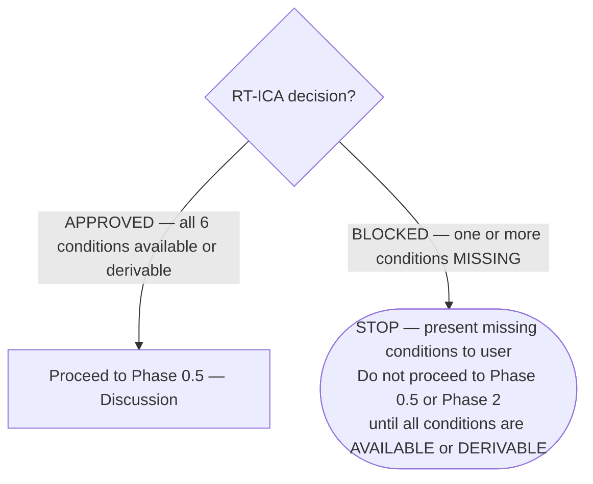
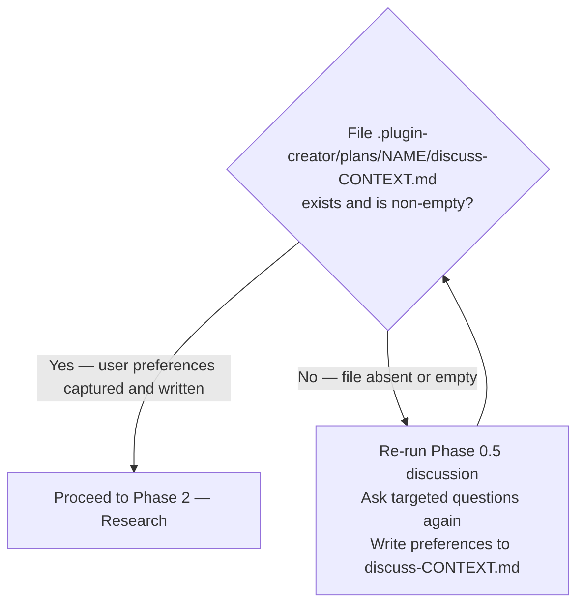
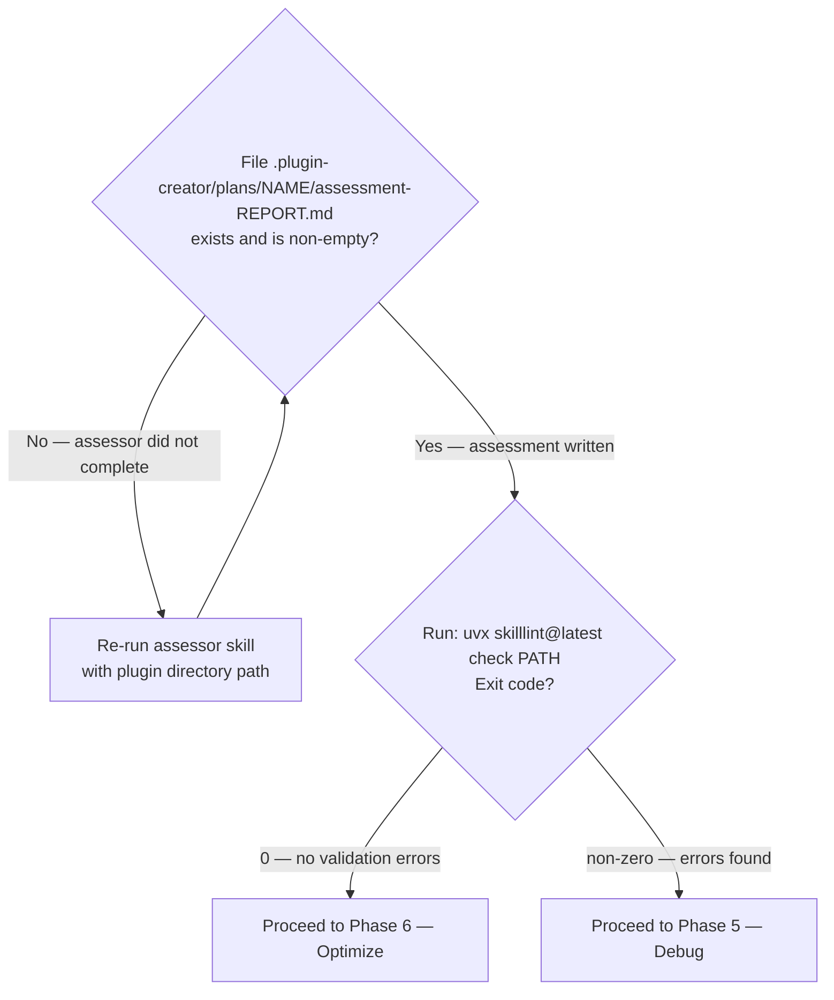
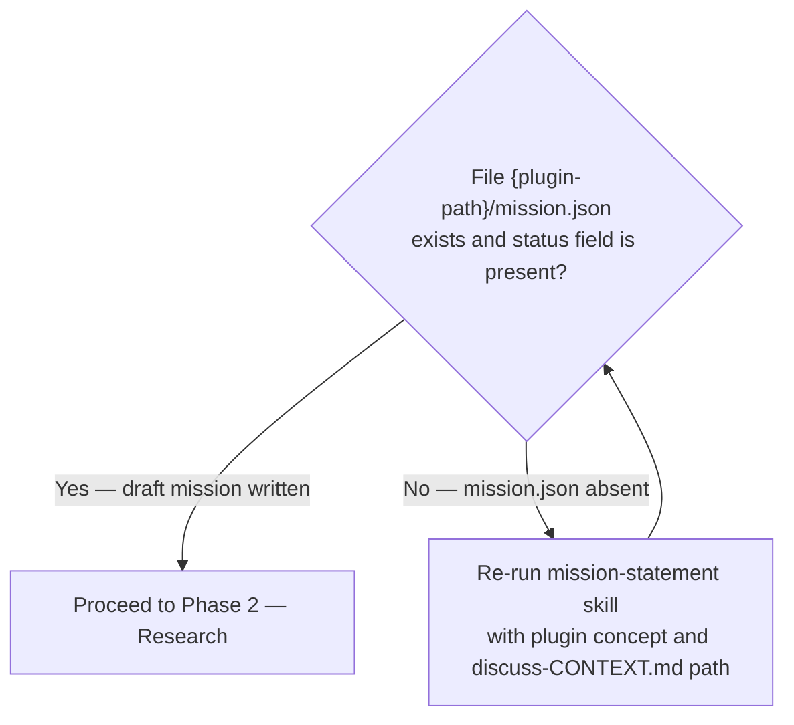
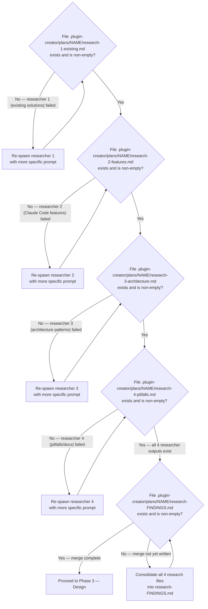
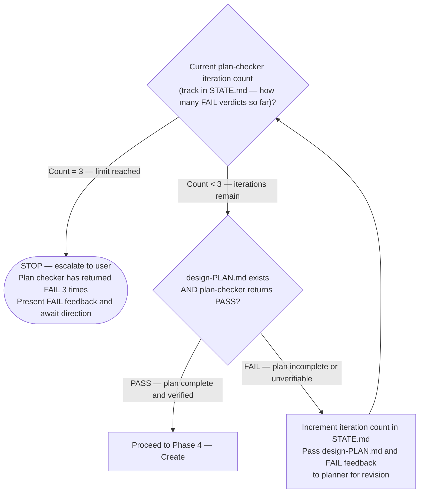
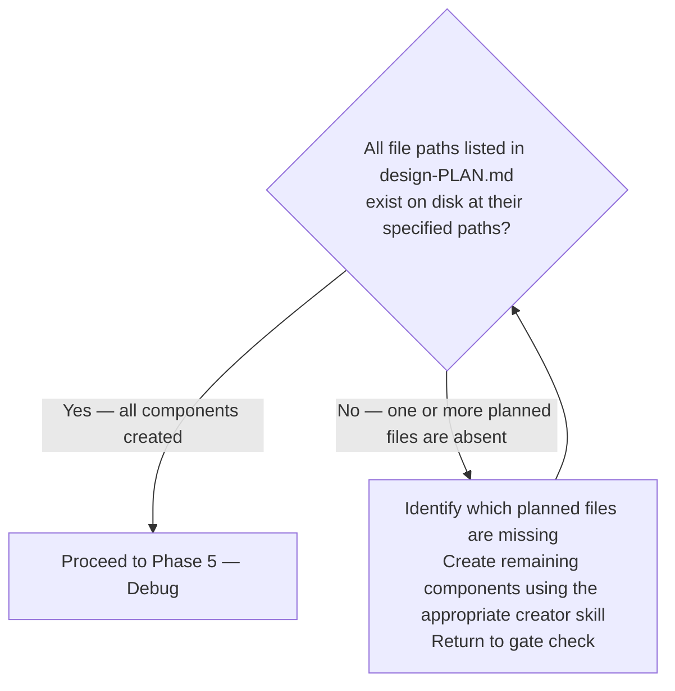
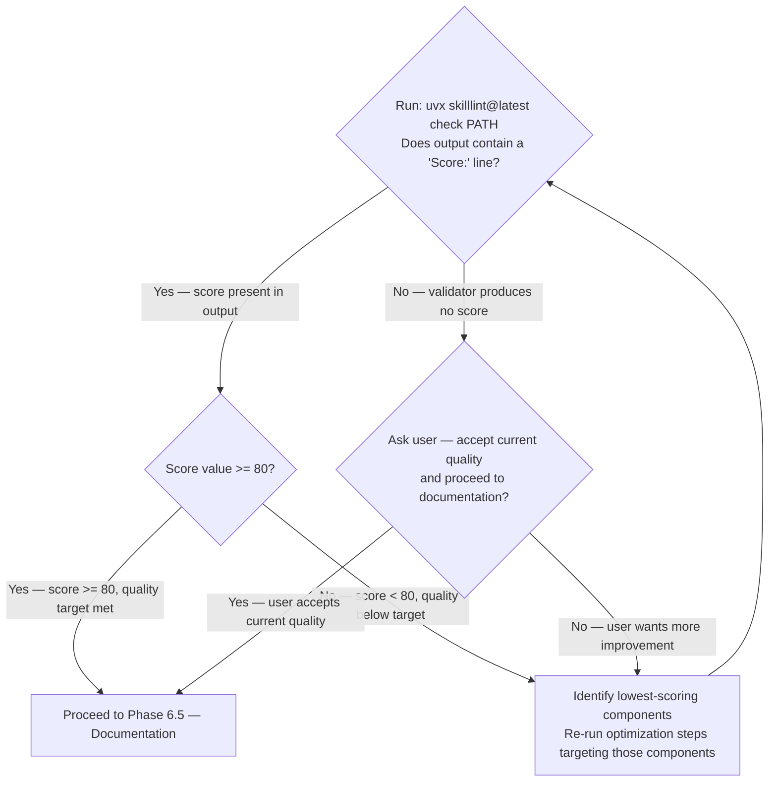
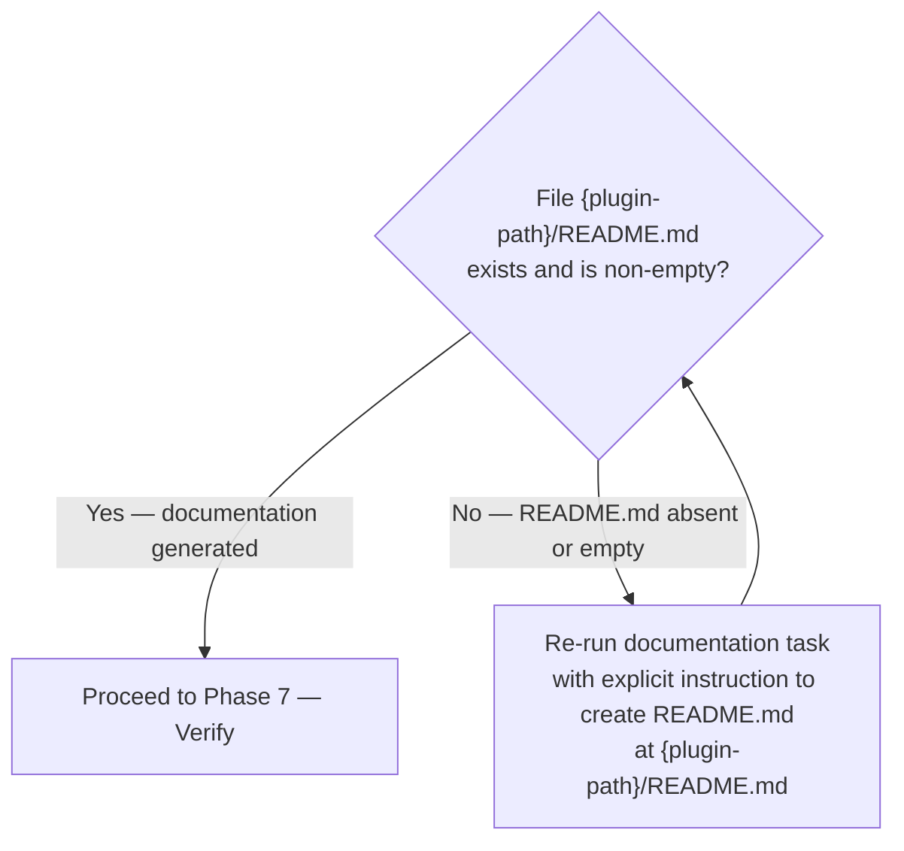

<plugin_mode>$0</plugin_mode>
<plugin_target>$1</plugin_target>
<plugin_intent>$2</plugin_intent>
<invocation_args>$ARGUMENTS</invocation_args>

> When editing files in `plugins/`, `.claude/`, `AGENTS.md`, or `CLAUDE.md` for content optimization, route to the appropriate subagent. Full routing-by-concern table in `references/phase-dispatch-details.md` → "Phase 6 — Optimize".

> [!IMPORTANT]
> When provided a process map or Mermaid diagram, treat it as the authoritative procedure. Execute steps in the exact order shown, including branches, decision points, and stop conditions.
> A Mermaid process diagram is an executable instruction set. Follow it exactly as written: respect sequence, conditions, loops, parallel paths, and terminal states. Do not improvise, reorder, or skip steps. If any node is ambiguous or missing required detail, pause and ask a clarifying question before continuing.
> When interacting with a user, report before acting the interpreted path you will follow from the diagram, then execute.

# Plugin Lifecycle Orchestration

Orchestrate plugin development through seven phases. This skill composes existing plugin-creator skills and agents — it does not re-implement their logic.

Arguments: `<invocation_args/>`

- `new <concept>` — Create a plugin from scratch. Enters at Phase 0 (RT-ICA Prerequisite Check).
- `existing <plugin-path>` — Improve an existing plugin. Enters at Phase 1 (Assess).

## Domain Knowledge Prerequisites

Load these skills at session start before executing any phase. Full skill descriptions and what each provides: `references/domain-knowledge-prerequisites.md`.

Required — load at session start:

1. `Skill(skill="plugin-creator:claude-plugins-reference-2026")` — plugin.json schema, component types, environment variables, installation scopes, path rules
2. `Skill(skill="plugin-creator:claude-skills-overview-2026")` — SKILL.md format, all 14 frontmatter fields, YAML multiline bug, allowed-tools string format, context fork behavior

Required for phases involving hooks (Phase 4: Create, Phase 5: Debug):

3. `Skill(skill="plugin-creator:hooks-guide")` — 13 hook event types, exit codes, tool denial mechanisms, agent frontmatter fields

Required for phases involving agents (Phase 4: Create):

4. `Skill(skill="plugin-creator:claude-subagent-reference")` — all 16 agent frontmatter fields with descriptions, built-in agents, scope and file locations, tool restrictions, permission modes, hooks and memory configuration, fork mode, agent teams

Recommended for component selection and plugin configuration decisions:

5. `Skill(skill="plugin-creator:component-patterns")` — component lifecycle, discovery and activation phases, decision framework for choosing commands vs skills vs agents vs hooks vs MCP servers
6. `Skill(skill="plugin-creator:plugin-settings")` — .local.md per-project configuration pattern, YAML frontmatter parsing from hooks, configuration-driven behavior

## Workflow Overview

The authoritative top-level routing diagram lives in `references/master-workflow-diagram.md`. Load it once at session start to determine the entry phase from `<invocation_args>`. After routing, each Phase section below carries its own authoritative gate diagram for in-phase behavior.

Argument-to-phase routing summary:

- `new <concept>` → Phase 0 (RT-ICA Prerequisite Check)
- `existing <plugin-path>` with no intent → ask user for intent, then route by intent
- `existing` + `validate` / `fix-bugs` / `debug` → Phase 5 (Debug)
- `existing` + `audit` / `assess` → Phase 1 (Assess), then Phase 5 or Phase 6 based on validator exit code
- `existing` + `refactor` / `optimize` / `evaluate` → Phase 6 (Optimize)
- `existing` + `create` / `skill` / `agent` / `workflow` / `hooks` → Phase 4 (Create)
- `existing` + `test` / `verify` → Phase 7 (Verify)

## Artifact System

All work artifacts are stored in `.plugin-creator/plans/{plugin-name}/`. The full directory layout, per-artifact descriptions, and `STATE.md` read/update protocol live in `references/artifact-templates.md` → "Artifact Directory Layout".

Before starting any phase, read `STATE.md` if it exists to determine current progress. After completing each phase, update `STATE.md` with the phase completed and any decisions made.

---

## Phase 0: RT-ICA Prerequisite Check (New Plugin Only)

Entry condition: User provides `new <concept>`.

Before creating any plugin, verify all prerequisites are in place. Perform an RT-ICA assessment using the `RT-ICA SUMMARY` template in `references/artifact-templates.md`. The assessment checks 6 conditions (purpose clarity, target users, component selection, existing solutions, source material, verification method) and returns APPROVED or BLOCKED.

The following diagram is the authoritative procedure for Phase 0 RT-ICA decision gate. Execute steps in the exact order shown, including branches, decision points, and stop conditions.

---

## Phase 0.5: Discussion — Capture User Preferences (New Plugin Only)

Entry condition: RT-ICA gate returned APPROVED.

Before research, identify gray areas and capture user preferences to guide all subsequent phases.

Ask targeted questions to eliminate ambiguity. The full question set (skill-focused / agent-focused / hook-focused plugins) and the `discuss-CONTEXT.md` artifact template live in `references/artifact-templates.md`. For agent-focused plugin decisions (tools, model, permissionMode, memory, hooks), also load `/plugin-creator:claude-subagent-reference`.

Save preferences to `.plugin-creator/plans/{plugin-name}/discuss-CONTEXT.md` using the template from the artifact-templates file. These preferences guide all subsequent research and planning phases.

The following diagram is the authoritative procedure for Phase 0.5 discussion completion gate. Execute steps in the exact order shown, including branches, decision points, and stop conditions.

---

## Phase 1: Assess (Existing Plugin Only)

Entry condition: User provides `existing <plugin-path>`.

Dispatch the assessor with the plugin directory path. Full task spec (context, output) in `references/phase-dispatch-details.md` → "Phase 1 — Assess".

The following diagram is the authoritative procedure for Phase 1 Assess decision gate. Execute steps in the exact order shown, including branches, decision points, and stop conditions.

---

## Phase 0.6: Mission Statement Draft (New Plugin Only)

Entry condition: Discussion phase completed and discuss-CONTEXT.md written.

Before research begins, draft an initial mission statement for the plugin. This anchors all subsequent phases to the plugin's purpose and values and creates a backlog interview task for async human refinement.

Dispatch the mission-statement skill. Full task spec in `references/phase-dispatch-details.md` → "Phase 0.6 — Mission Statement Draft".

The following diagram is the authoritative procedure for Phase 0.6 completion gate.

---

## Phase 2: Research (New Plugin Only)

Entry condition: Discussion phase completed and discuss-CONTEXT.md written.

First run Researcher 0 (feature discovery) to produce the feature context. Then spawn Researchers 1–4 in a single message to run concurrently with that context as input. Merge results into `research-FINDINGS.md` before proceeding to Design.

Full prompts, contexts, and outputs for all five researchers live in `references/phase-2-researcher-prompts.md`. Summary:

- Researcher 0 — Feature discovery → `feature-context-{slug}.md`
- Researcher 1 — Existing solutions → `research-1-existing.md`
- Researcher 2 — Claude Code features → `research-2-features.md`
- Researcher 3 — Architecture patterns → `research-3-architecture.md`
- Researcher 4 — Pitfalls and official docs → `research-4-pitfalls.md`

After all four parallel researchers complete, consolidate into `.plugin-creator/plans/{plugin-name}/research-FINDINGS.md` using the template in `references/artifact-templates.md`.

The following diagram is the authoritative procedure for Phase 2 Research decision gate. Execute steps in the exact order shown, including branches, decision points, and stop conditions.

---

## Phase 3: Design (New Plugin Only)

Entry condition: Research gate passed.

Execute three dispatch steps: (1) prerequisite check via `dh:rt-ica`, (2) design plan creation, (3) plan verification. Full task specs in `references/phase-dispatch-details.md` → "Phase 3 — Design". Track plan-checker iteration count in `STATE.md`; escalate to user on the third FAIL.

The following diagram is the authoritative procedure for Phase 3 Design decision gate. Execute steps in the exact order shown, including branches, decision points, and stop conditions.

---

## Phase 4: Create

Entry condition: Design gate passed (new plugin path) OR user selected a create intent on the existing plugin path (no design plan required — use the user's stated component description directly).

For each component defined in `design-PLAN.md`, invoke the appropriate creator skill (skill-creator, agent-creator, or hook-creator). Full task specs in `references/phase-dispatch-details.md` → "Phase 4 — Create". For agent-frontmatter decisions during agent creation, also load `/plugin-creator:claude-subagent-reference`. Create `plugin.json` via `uv run plugins/plugin-creator/scripts/create_plugin.py` if it does not exist.

The following diagram is the authoritative procedure for Phase 4 Create decision gate. Execute steps in the exact order shown, including branches, decision points, and stop conditions.

---

## Phase 5: Debug (Both Paths)

Entry condition: Create gate passed (new path) OR Assess gate failed (existing path).

Debug fixes validation errors. Run `uvx skilllint@latest check <plugin-path>` first to identify issues. The authoritative Phase 5 error-routing diagram lives in `references/phase-gate-diagrams.md` — load it when entering this phase. It routes SK007, SK006, broken links, frontmatter errors, tool format errors, and other structural errors to their specific fix and loops back to re-validate.

---

## Phase 6: Optimize (Both Paths)

Entry condition: Debug gate passed OR Assess gate passed with no errors.

Optimize improves quality — descriptions, progressive disclosure, agent prompts, documentation. This phase is not about fixing errors (that is Debug) but about raising quality.

Execute three dispatches: (1) structural plugin improvement via `refactor-plugin`, (2) content quality optimization via `ai-doc-optimizer`, (3) agent prompt optimization via `subagent-refactorer`. Full task specs in `references/phase-dispatch-details.md` → "Phase 6 — Optimize".

The following diagram is the authoritative procedure for Phase 6 Optimize completion gate. Execute steps in the exact order shown, including branches, decision points, and stop conditions.

---

## Phase 6.5: Documentation (Both Paths)

Entry condition: Optimize phase complete.

Generate comprehensive documentation for the plugin by dispatching `plugin-assessor` with the full set of plugin artifacts. Full task spec (context, prompt, output) in `references/phase-dispatch-details.md` → "Phase 6.5 — Documentation".

The following diagram is the authoritative procedure for Phase 6.5 Documentation completion gate. Execute steps in the exact order shown, including branches, decision points, and stop conditions.

---

## Phase 7: Verify (Both Paths)

Entry condition: Documentation phase complete.

Run multi-layer validation. Full task spec in `references/phase-dispatch-details.md` → "Phase 7 — Verify". The authoritative 4-layer validation gate diagram lives in `references/phase-gate-diagrams.md` — load it when entering this phase. Any layer failure routes to Phase 5 (Debug).

---

## Phase-to-Skill Mapping

Full lookup table with exact invocation syntax for all 18 phase-skill pairings: `references/phase-skill-mapping.md`.

Key invocations:
- Phase 1: `Skill(skill="plugin-creator:assessor")`
- Phase 2: `Skill(skill="plugin-creator:feature-discovery")` + 4-way parallel researchers via subagent_type
- Phase 4: skill-creator, agent-creator, hook-creator (one Skill call per component type)
- Phase 5: lint, refactor-skill (one Skill call per error type)
- Phase 7: `Skill(skill="plugin-creator:ensure-complete")`

---

## Error Handling

14 failure modes with recovery actions: `references/error-handling.md`.

Key rules:
- SK007 (token limit exceeded) — run `/plugin-creator:refactor-skill`; editing alone is not sufficient
- SK006 (approaching limit) — extract content to `references/` and re-validate
- RT-ICA BLOCKED — do not proceed to Discussion or Research until all conditions resolve
- STATE.md absent — read all `.plugin-creator/plans/{plugin-name}/` artifacts to reconstruct phase

---

## Example Sessions

Two complete walkthroughs (new plugin full lifecycle + existing plugin with validation errors): `references/example-sessions.md`.

---

## Sources

- Architecture spec: `../../../../plan/architect-plugin-lifecycle.md`
- Feature context: `../../../../plan/feature-context-plugin-lifecycle.md`
- Plugin-creator CLAUDE.md: `../../CLAUDE.md`
- GitHub Issue: #427
