# Plugin Lifecycle — Master Workflow Diagram

This is the authoritative top-level routing diagram for the entire plugin-lifecycle workflow. The orchestrator consults this diagram once at session start to route from the user's invocation arguments to the correct entry phase. After routing, each individual phase section in `SKILL.md` carries its own authoritative gate diagram for the per-phase behavior.

```mermaid
flowchart TD
    Start(["/plugin-lifecycle <invocation_args>"]) --> Q1{"First argument is?"}
    Q1 -->|"new — create from scratch"| RTICA["Phase 0 — RT-ICA Prerequisite Check"]
    Q1 -->|"existing — improve existing plugin"| IntentQ{"Intent from plugin_intent<br>or stated in conversation?"}

    %% Existing path: intent routing
    IntentQ -->|"blank — not provided"| AskIntent["Ask the user:<br>What do you want to do with this plugin?<br>validate · fix bugs · audit · refactor ·<br>create component skill/agent/hook ·<br>adjust workflow · add hooks · change hooks ·<br>test capabilities · evaluate/optimize ·<br>something else"]
    AskIntent --> IntentQ
    IntentQ -->|"validate / fix-bugs / debug"| Debug["Phase 5 — Debug"]
    IntentQ -->|"audit / assess"| Assess["Phase 1 — Assess"]
    IntentQ -->|"refactor / optimize / evaluate"| Optimize["Phase 6 — Optimize"]
    IntentQ -->|"create / skill / agent / workflow / hooks"| Create["Phase 4 — Create"]
    IntentQ -->|"test / verify"| Verify["Phase 7 — Verify"]
    IntentQ -->|"something else"| AskMore["Ask a clarifying question<br>to determine appropriate entry phase"]
    AskMore --> IntentQ

    %% Existing path: Assess then route (reached from audit intent)
    Assess --> AssessFile{"File .plugin-creator/plans/NAME/assessment-REPORT.md<br>exists and is non-empty?"}
    AssessFile -->|"No — assessor did not complete"| Assess
    AssessFile -->|"Yes — assessment written"| AssessGate{"Run: uvx skilllint@latest check PATH<br>Exit code?"}
    AssessGate -->|"0 — no validation errors"| Optimize["Phase 6 — Optimize"]
    AssessGate -->|"non-zero — errors found"| Debug["Phase 5 — Debug"]

    %% New path: RT-ICA gate
    RTICA --> RTICAGate{"RT-ICA decision?"}
    RTICAGate -->|"BLOCKED — one or more conditions MISSING"| RTICABlock(["STOP — present missing inputs to user<br>Do not proceed until resolved"])
    RTICAGate -->|"APPROVED — all conditions available or derivable"| Discuss["Phase 0.5 — Discussion"]

    %% New path: Discussion gate — file must exist before Research
    Discuss --> DiscussGate{"File .plugin-creator/plans/NAME/discuss-CONTEXT.md<br>exists and is non-empty?"}
    DiscussGate -->|"Yes — preferences captured"| Mission["Phase 0.6 — Draft Mission Statement"]
    Mission --> Research["Phase 2 — Research"]
    DiscussGate -->|"No — file absent or empty"| Discuss

    %% New path: Research gate
    Research --> ResearchGate{"File .plugin-creator/plans/NAME/research-FINDINGS.md<br>exists and is non-empty?"}
    ResearchGate -->|"Yes — all 4 researcher outputs merged"| Design["Phase 3 — Design"]
    ResearchGate -->|"No — merge incomplete or file absent"| Research

    %% New path: Design gate with iteration limit
    Design --> DesignGate{"design-PLAN.md exists<br>AND plan-checker returns PASS?"}
    DesignGate -->|"PASS — plan complete and verified"| Create["Phase 4 — Create"]
    DesignGate -->|"FAIL — iteration count < 3"| Design
    DesignGate -->|"FAIL — iteration count = 3 (limit reached)"| DesignEscalate(["STOP — escalate to user<br>Plan checker has failed 3 times"])

    %% New path: Create gate
    Create --> CreateGate{"All files listed in design-PLAN.md<br>exist at their specified paths?"}
    CreateGate -->|"Yes — all components created"| Debug
    CreateGate -->|"No — one or more files missing"| Create

    %% Shared Debug phase (both paths converge here)
    Debug --> DebugGate{"Run: uvx skilllint@latest check PATH<br>Exit code 0 AND 0 errors?<br>(warnings acceptable)"}
    DebugGate -->|"Yes — 0 errors, validation passes"| Optimize
    DebugGate -->|"No — errors remain"| Debug

    %% Optimize gate
    Optimize --> OptGate{"Run: uvx skilllint@latest check PATH<br>Output contains 'Score:' line?"}
    OptGate -->|"Score >= 80 — quality target met"| Docs["Phase 6.5 — Documentation"]
    OptGate -->|"Score < 80 — quality below target"| Optimize
    OptGate -->|"No score in output — user acceptance required"| OptUser{"User accepts current quality?"}
    OptUser -->|"Yes — user accepts"| Docs
    OptUser -->|"No — continue improving"| Optimize

    %% Documentation gate
    Docs --> DocsGate{"File {plugin-path}/README.md<br>exists and is non-empty?"}
    DocsGate -->|"Yes — documentation complete"| Verify["Phase 7 — Verify"]
    DocsGate -->|"No — README.md absent or empty"| Docs

    %% Verify: 4 discrete layers
    Verify --> VL1{"Layer 1 — Run: uvx skilllint@latest check PATH<br>Exit code 0?"}
    VL1 -->|"Yes — structural validation passes"| VL2{"Layer 2 — Run: claude plugin validate PATH<br>Exit code 0?"}
    VL1 -->|"No — structural errors found"| VerifyFail["Return to Phase 5 — Debug<br>with Layer 1 error details"]
    VL2 -->|"Yes — runtime validation passes"| VL3{"Layer 3 — skilllint output<br>contains SK006 or SK007 for any skill?"}
    VL2 -->|"No — runtime validation fails"| VerifyFail
    VL3 -->|"No SK006/SK007 — all skills within token limits"| VL4{"Layer 4 — all internal links resolve,<br>all plugin.json skill paths exist,<br>all agent references point to existing files?"}
    VL3 -->|"Yes — SK006 or SK007 present"| VerifyFail
    VL4 -->|"Yes — cross-reference integrity confirmed"| Done(["Write .plugin-creator/plans/NAME/SUMMARY.md<br>Plugin is marketplace-ready"])
    VL4 -->|"No — broken cross-references found"| VerifyFail
    VerifyFail --> Debug
```

