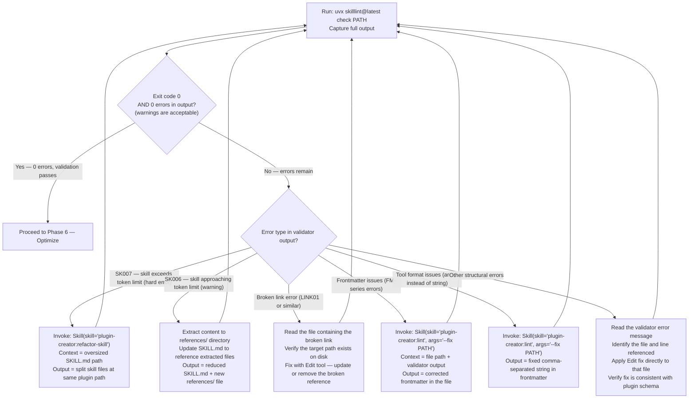
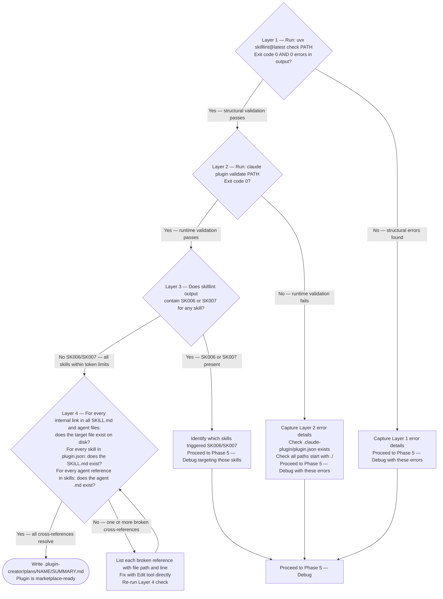

# Plugin Lifecycle — Large Phase Gate Diagrams

These two phase gate diagrams are large enough to live in their own reference file. The orchestrator consults the relevant diagram when entering Phase 5 or Phase 7. All other phase gate diagrams are small enough to remain inline in `SKILL.md`.

Both diagrams are authoritative procedures — execute steps in the exact order shown, including branches, decision points, and stop conditions.

---

## Phase 5 — Debug Error Routing

Load this diagram when entering Phase 5 (Debug). It routes each validator error type to its specific fix and loops back to re-validate.

---

## Phase 7 — Verify 4-Layer Validation Gate

Load this diagram when entering Phase 7 (Verify). It encodes the 4-layer validation gate: structural validation, runtime validation, token complexity, and cross-reference integrity.

