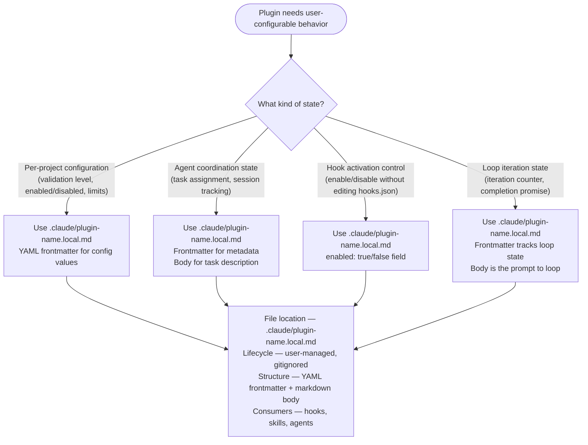
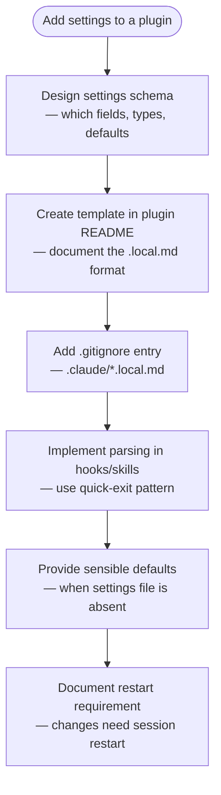

# Plugin Settings Pattern

Plugins store user-configurable settings in `.claude/plugin-name.local.md` files within the project directory. YAML frontmatter provides structured configuration; the markdown body carries prompts or additional context.

## When to Use This Pattern



## File Structure

```markdown
---
enabled: true
setting1: value1
numeric_setting: 42
list_setting: ["item1", "item2"]
---

# Additional Context

Markdown body for prompts, task descriptions,
additional instructions, or documentation.
```

## Reading Settings

### From Hooks (Bash)

The standard pattern for reading settings in hooks follows three steps — check existence, parse frontmatter, extract fields.

```bash
#!/bin/bash
set -euo pipefail

STATE_FILE=".claude/my-plugin.local.md"

# Quick exit if not configured
if [[ ! -f "$STATE_FILE" ]]; then
  exit 0
fi

# Parse YAML frontmatter (between --- markers)
FRONTMATTER=$(sed -n '/^---$/,/^---$/{ /^---$/d; p; }' "$STATE_FILE")

# Extract fields
ENABLED=$(echo "$FRONTMATTER" | grep '^enabled:' | sed 's/enabled: *//' | sed 's/^"\(.*\)"$/\1/')

if [[ "$ENABLED" != "true" ]]; then
  exit 0
fi
```

### From Skills and Agents

Skills and agents read settings with the Read tool, then parse YAML frontmatter inline.

```markdown
Check for plugin settings at `.claude/my-plugin.local.md`.
If present, parse YAML frontmatter and adapt behavior according to:
- enabled field controls whether the plugin is active
- mode field selects processing behavior (strict, standard, lenient)
```

### Extracting the Markdown Body

Content after the closing `---` marker is the body.

```bash
BODY=$(awk '/^---$/{i++; next} i>=2' "$FILE")
```

## Common Implementation Patterns

### Pattern 1 — Temporarily Active Hooks

Control hook activation via settings file instead of editing hooks.json (which requires restart).

```bash
STATE_FILE=".claude/security-scan.local.md"

if [[ ! -f "$STATE_FILE" ]]; then
  exit 0
fi

FRONTMATTER=$(sed -n '/^---$/,/^---$/{ /^---$/d; p; }' "$STATE_FILE")
ENABLED=$(echo "$FRONTMATTER" | grep '^enabled:' | sed 's/enabled: *//')

if [[ "$ENABLED" != "true" ]]; then
  exit 0
fi

# Run hook logic only when enabled
```

### Pattern 2 — Agent State Management

Store agent-specific state and task assignments.

```markdown
---
agent_name: auth-agent
task_number: 3.5
pr_number: 1234
coordinator_session: team-leader
enabled: true
dependencies: ["Task 3.4"]
---

# Task Assignment

Implement JWT authentication for the API.
```

Hooks read this to coordinate agents.

```bash
AGENT_NAME=$(echo "$FRONTMATTER" | grep '^agent_name:' | sed 's/agent_name: *//')
COORDINATOR=$(echo "$FRONTMATTER" | grep '^coordinator_session:' | sed 's/coordinator_session: *//')

tmux send-keys -t "$COORDINATOR" "Agent $AGENT_NAME completed task" Enter
```

### Pattern 3 — Configuration-Driven Behavior

Settings drive validation strictness, file size limits, and allowed extensions.

```bash
LEVEL=$(echo "$FRONTMATTER" | grep '^validation_level:' | sed 's/validation_level: *//')

case "$LEVEL" in
  strict)   ;; # Maximum validation
  standard) ;; # Balanced validation
  lenient)  ;; # Minimal validation
esac
```

## Creating Settings Files



## Best Practices

**File naming** — use `.claude/plugin-name.local.md` format. The `.local` suffix signals user-local, gitignored files.

**Gitignore** — add to project `.gitignore`:

```gitignore
.claude/*.local.md
.claude/*.local.json
```

**Defaults** — provide sensible defaults when the settings file does not exist.

```bash
if [[ ! -f "$STATE_FILE" ]]; then
  ENABLED=true
  MODE=standard
else
  # Parse from file
fi
```

**Validation** — validate field values before use.

```bash
if ! [[ "$MAX" =~ ^[0-9]+$ ]] || [[ $MAX -lt 1 ]] || [[ $MAX -gt 100 ]]; then
  echo "Invalid max_value in settings (must be 1-100)" >&2
  MAX=10
fi
```

**Atomic updates** — use temp file + atomic move to prevent corruption.

```bash
TEMP_FILE="${FILE}.tmp.$$"
sed "s/^field: .*/field: $NEW_VALUE/" "$FILE" > "$TEMP_FILE"
mv "$TEMP_FILE" "$FILE"
```

**Restart requirement** — settings changes require Claude Code session restart. Document this in the plugin README.

## Security Considerations

**Sanitize user input** when writing settings files.

```bash
SAFE_VALUE=$(echo "$USER_INPUT" | sed 's/"/\\"/g')
```

**Validate file paths** stored in settings to prevent path traversal.

```bash
if [[ "$FILE_PATH" == *".."* ]]; then
  echo "Invalid path in settings (path traversal)" >&2
  exit 2
fi
```

**Permissions** — settings files should be readable by user only (`chmod 600`), not committed to git, not shared between users.

## Deep Reference

For detailed parsing techniques (field extraction, body parsing, atomic updates, edge cases, yq integration), read [Parsing Techniques Reference](./references/parsing-techniques.md).

For production examples showing complete settings file lifecycles in real plugins, read [Real-World Examples](./references/real-world-examples.md).

## Related Skills

- For hook authoring patterns that consume settings files, use `/plugin-creator:hooks-guide`
- For component selection guidance (when to use hooks vs skills vs agents), use `/plugin-creator:component-patterns`
- For the legacy commands format that can create settings files, use `/plugin-creator:command-development`

SOURCE: Adapted from Anthropic plugin-dev plugin `skills/plugin-settings/` (8 files, ~545 lines). Accessed 2026-03-24.
