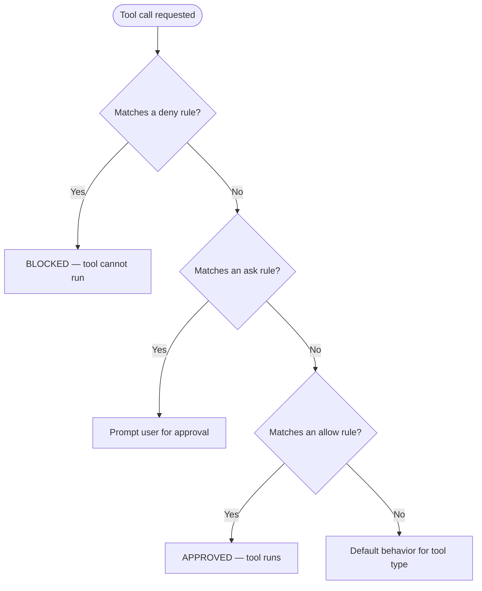

If the user's intent does not match the purpose of this skill, load `plugin-lifecycle` to route to the right skill and process: `Skill(skill="plugin-creator:plugin-lifecycle")`.


# Claude Code Permissions Reference

Claude Code uses a tiered permission system to balance capability and safety. Permissions control which tools Claude can use and what resources they can access.

---

## Permission Tiers

| Tool Type | Examples | Approval Required | "Don't ask again" Scope |
|-----------|----------|-------------------|------------------------|
| Read-only | File reads, Grep, Glob | No | N/A |
| Bash commands | Shell execution | Yes | Permanent per project + command |
| File modification | Edit, Write | Yes | Until session end |

---

## Rule Evaluation Order

Rules evaluate in order: **deny → ask → allow**. First match wins. Deny rules always take precedence.



---

## Permission Modes

Set `defaultMode` in [settings files](https://code.claude.com/docs/en/settings.md):

| Mode | Behavior |
|------|----------|
| `default` | Prompts for permission on first use of each tool |
| `acceptEdits` | Auto-accepts file edit permissions for session |
| `plan` | Read-only — cannot modify files or execute commands |
| `delegate` | Coordination-only for team leads (requires active agent team) |
| `dontAsk` | Auto-denies tools unless pre-approved via `/permissions` or `permissions.allow` |
| `bypassPermissions` | Skips all permission prompts (containers/VMs only) |

**WARNING**: `bypassPermissions` disables all checks. Only use in isolated environments. Administrators can prevent it with `disableBypassPermissionsMode: "disable"` in managed settings.

---

## Permission Rule Syntax

Rules follow the format `Tool` or `Tool(specifier)`.

### Match All Uses

Use tool name without parentheses:

- `Bash` — matches all Bash commands
- `WebFetch` — matches all web fetch requests
- `Read` — matches all file reads

`Bash(*)` is equivalent to `Bash`.

### Tool-Specific Specifiers

#### Bash (Wildcard Patterns)

`*` matches at any position. Space before `*` enforces word boundary.

```json
{
  "permissions": {
    "allow": [
      "Bash(npm run *)",
      "Bash(git commit *)",
      "Bash(git * main)",
      "Bash(* --version)",
      "Bash(* --help *)"
    ],
    "deny": [
      "Bash(git push *)"
    ]
  }
}
```

**Word boundary behavior**:
- `Bash(ls *)` — matches `ls -la` but NOT `lsof` (space enforces boundary)
- `Bash(ls*)` — matches both `ls -la` AND `lsof` (no boundary)

**Shell operator awareness**: Claude Code recognizes shell operators (`&&`, `|`, `;`). A rule like `Bash(safe-cmd *)` will NOT approve `safe-cmd && other-cmd`.

**Caveat**: Bash argument constraint patterns are fragile. For reliable URL filtering, deny `curl`/`wget` and use `WebFetch(domain:...)` instead, or use PreToolUse hooks.

#### Read and Edit (Gitignore Patterns)

Follow [gitignore specification](https://git-scm.com/docs/gitignore):

| Pattern | Meaning | Example |
|---------|---------|---------|
| `//path` | Absolute path from filesystem root | `Read(//Users/alice/secrets/**)` |
| `~/path` | Path from home directory | `Read(~/Documents/*.pdf)` |
| `/path` | Relative to settings file | `Edit(/src/**/*.ts)` |
| `path` or `./path` | Relative to current directory | `Read(*.env)` |

**IMPORTANT**: `/Users/alice/file` is NOT absolute. It is relative to the settings file. Use `//Users/alice/file` for absolute paths.

**Glob behavior**: `*` matches files in a single directory. `**` matches recursively across directories.

#### WebFetch

- `WebFetch(domain:example.com)` — matches requests to example.com

#### MCP

- `mcp__puppeteer` — all tools from the `puppeteer` server
- `mcp__puppeteer__*` — wildcard, same effect
- `mcp__puppeteer__puppeteer_navigate` — specific tool

#### Task (Subagents)

- `Agent(Explore)` — matches Explore subagent
- `Agent(Plan)` — matches Plan subagent
- `Agent(my-custom-agent)` — matches custom agent

Deny specific agents:

```json
{
  "permissions": {
    "deny": ["Agent(Explore)"]
  }
}
```

---

## Managed Settings (Organization Deployment)

Administrators deploy `managed-settings.json` to system directories. These cannot be overridden by user or project settings.

**Locations**:
- macOS: `/Library/Application Support/ClaudeCode/managed-settings.json`
- Linux/WSL: `/etc/claude-code/managed-settings.json`
- Windows: `C:\Program Files\ClaudeCode\managed-settings.json`

These are system-wide paths (not user home directories) requiring administrator privileges.

### Managed-Only Settings

| Setting | Effect |
|---------|--------|
| `disableBypassPermissionsMode` | Set `"disable"` to prevent `bypassPermissions` mode |
| `allowManagedPermissionRulesOnly` | When `true`, only managed settings can define allow/ask/deny rules |
| `allowManagedHooksOnly` | When `true`, only managed and SDK hooks are allowed |
| `strictKnownMarketplaces` | Controls which plugin marketplaces users can add |

---

## Settings Precedence

Highest to lowest priority:

1. Managed settings (system-wide, cannot be overridden)
2. Command line arguments
3. Local project settings (`.claude/settings.local.json`)
4. Shared project settings (`.claude/settings.json`)
5. User settings (`~/.claude/settings.json`)

A permission allowed in user settings but denied in project settings is blocked.

---

## Working Directories

By default, Claude has access to files in the launch directory. Extend access:

- **Startup**: `claude --add-dir <path>`
- **Session**: `/add-dir`
- **Persistent**: add to `additionalDirectories` in settings

Additional directories follow the same permission rules as the original working directory.

---

## Permissions + Sandboxing

Permissions and sandboxing are complementary security layers:

- **Permissions** control which tools Claude can use and which resources they access (all tools)
- **Sandboxing** provides OS-level enforcement restricting Bash filesystem and network access (Bash only)

Use both for defense-in-depth:
- Permission deny rules block Claude from attempting access
- Sandbox restrictions prevent Bash commands from reaching resources outside boundaries
- Filesystem sandbox restrictions use Read/Edit deny rules (not separate sandbox config)
- Network restrictions combine WebFetch permissions with sandbox `allowedDomains`

---

## Manage Permissions

Use `/permissions` during a session to view and manage all permission rules and their source settings files.

### Detailed Reference

For comprehensive rule examples, Bash pattern edge cases, and hook-based permission extension, see `references/permissions-reference.md`.

SOURCE: [Claude Code Permissions Documentation](https://code.claude.com/docs/en/permissions.md) (accessed 2026-02-17)
