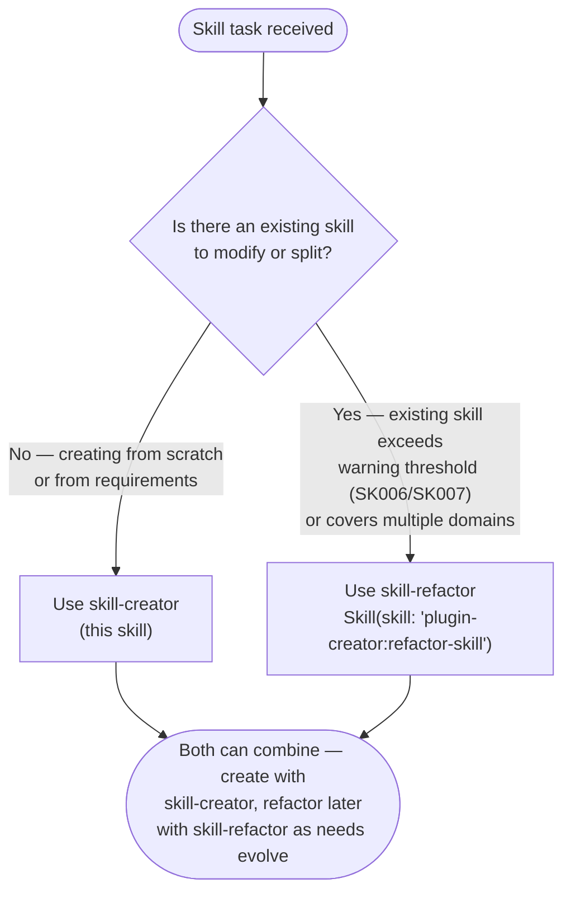
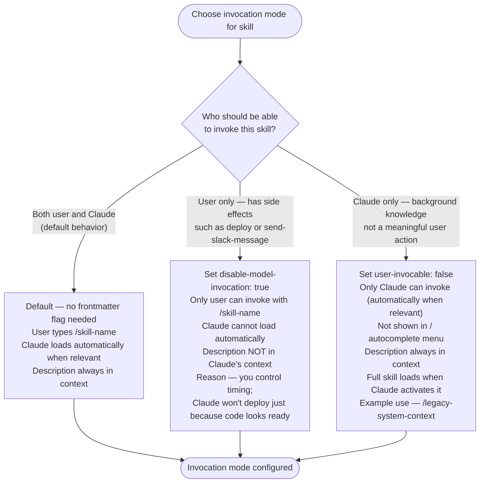
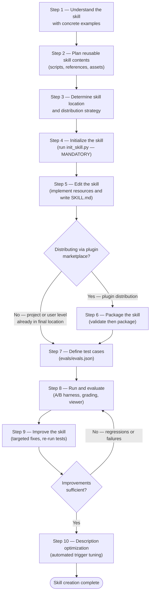
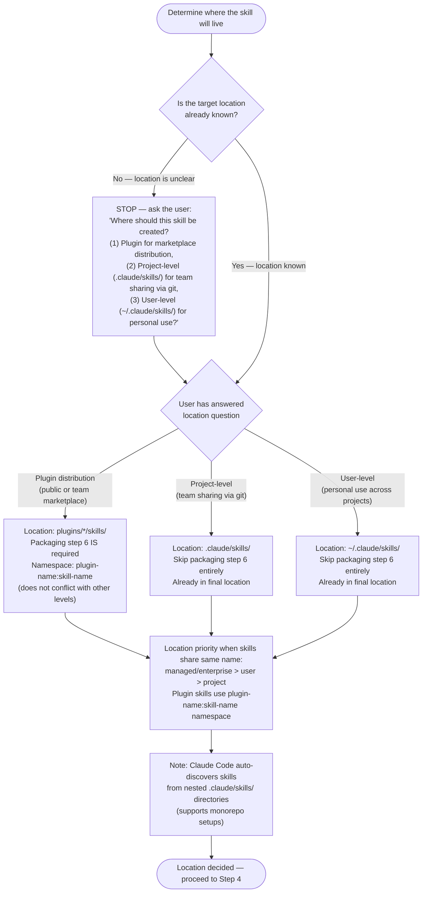
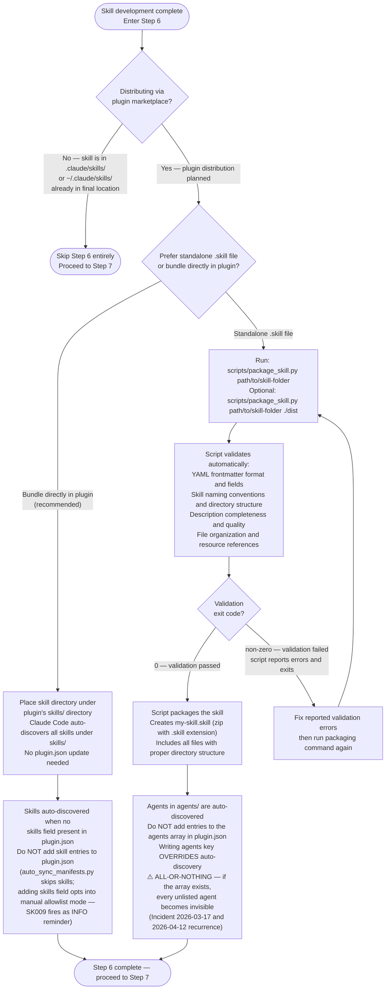

# Skill Creator

## Current Skills Environment

**Existing user-level skills:**
!`python3 -c "import os, pathlib; home = pathlib.Path.home(); skills = home / '.claude' / 'skills'; print('\\n'.join(sorted([d.name for d in skills.iterdir() if d.is_dir()])[:20]) if skills.exists() else 'No user-level skills found')" 2>/dev/null || echo "No user-level skills found"`

**Existing project-level skills:**
!`python3 -c "import os, pathlib; skills = pathlib.Path('.claude/skills'); print('\\n'.join(sorted([d.name for d in skills.iterdir() if d.is_dir()])[:20]) if skills.exists() else 'No project-level skills found')" 2>/dev/null || echo "No project-level skills found"`

**Sample skill descriptions (for pattern reference):**
!`python3 -c "import pathlib, re; dirs = [pathlib.Path.home() / '.claude' / 'skills', pathlib.Path('.claude/skills')]; descs = []; [descs.extend([line.strip() for line in (d / 'SKILL.md').read_text(encoding='utf-8', errors='ignore').splitlines() if line.strip().startswith('description:')][:1]) for base in dirs if base.exists() for d in base.iterdir() if d.is_dir() and (d / 'SKILL.md').exists()]; print('\\n'.join(descs[:10]) if descs else 'No skill descriptions found')" 2>/dev/null || echo "No skill descriptions found"`

**Current directory:**
!`python3 -c "import os; print(os.getcwd())" 2>/dev/null || echo "Unable to determine current directory"`

This skill provides guidance for creating effective skills.

## About Skills

Skills are modular, self-contained packages that extend Claude's capabilities by providing
specialized knowledge, workflows, and tools. Think of them as "onboarding guides" for specific
domains or tasks—they transform Claude from a general-purpose agent into a specialized agent
equipped with procedural knowledge that no model can fully possess.

**This skill is for creating NEW skills from scratch.** For refactoring EXISTING skills (splitting oversized skills, reorganizing multi-domain skills), use the skill-refactor skill:

```
Skill(skill: "plugin-creator:refactor-skill")
```

**When to use skill-creator vs skill-refactor:**



### What Skills Provide

1. Specialized workflows - Multi-step procedures for specific domains
2. Tool integrations - Instructions for working with specific file formats or APIs
3. Domain expertise - Company-specific knowledge, schemas, business logic
4. Bundled resources - Scripts, references, and assets for complex and repetitive tasks

### Auto-Updating Documentation Pattern

Add automated doc updater when skill wraps external docs (API specs, frameworks, CLI refs) that change regularly. Self-maintaining pipeline: download → process → index upstream docs.

**Trigger**: Skill provides access to documentation that updates over time.

**Add after skill creation**: `/plugin-creator:add-doc-updater <skill-path>`
- Collects 6 variables (source URL, local path, cooldown days)
- 5-phase workflow: implementation → review → quality gates → testing → integration

**Candidates**: GitLab CI docs, CLI tools (glab, gh, kubectl), frameworks (React, Django), API specs (OpenAPI)

## Core Principles

### Concise is Key

The context window is a public good. Skills share the context window with everything else Claude needs: system prompt, conversation history, other Skills' metadata, and the actual user request.

**Default assumption: Claude is already very smart.** Only add context Claude doesn't already have. Challenge each piece of information: "Does Claude really need this explanation?" and "Does this paragraph justify its token cost?"

Prefer concise examples over verbose explanations.

For token budget limits, truncation behavior, and fallback strategy, activate the `/plugin-creator:claude-skills-overview-2026` skill — it is the authoritative source for this section.

### Set Appropriate Degrees of Freedom

Match the level of specificity to the task's fragility and variability:

**High freedom (text-based instructions)**: Use when multiple approaches are valid, decisions depend on context, or heuristics guide the approach.

**Medium freedom (pseudocode or scripts with parameters)**: Use when a preferred pattern exists, some variation is acceptable, or configuration affects behavior.

**Low freedom (specific scripts, few parameters)**: Use when operations are fragile and error-prone, consistency is critical, or a specific sequence must be followed.

Think of Claude as exploring a path: a narrow bridge with cliffs needs specific guardrails (low freedom), while an open field allows many routes (high freedom).

### Anatomy of a Skill

Every skill consists of a required SKILL.md file and optional bundled resources:

```
skill-name/
├── SKILL.md (required)
│   ├── YAML frontmatter metadata (required)
│   │   └── name: (recommended — if omitted, uses directory name; required per agentskills.io spec)
│   │   └── description: (recommended)
│   └── Markdown instructions (required)
└── Bundled Resources (optional)
    ├── scripts/          - Executable code (Python/Bash/etc.)
    ├── references/       - Documentation intended to be loaded into context as needed
    └── assets/           - Files used in output (templates, icons, fonts, etc.)
```

#### SKILL.md (required)

Every SKILL.md consists of:

- **Frontmatter** (YAML): Metadata fields like `name`, `description`, `argument-hint`, `allowed-tools`, `model`, `context`, `user-invocable`, `disable-model-invocation`, and `hooks`. The `description` field (or first paragraph if omitted) is what Claude reads to determine when the skill gets used, thus it is very important to be clear and comprehensive in describing what the skill is and when it should be used.
- **Body** (Markdown): Instructions and guidance for using the skill. Only loaded AFTER the skill triggers (if at all).

#### Bundled Resources (optional)

##### Scripts (`scripts/`)

Executable code (Python/Bash/etc.) for tasks that require deterministic reliability or are repeatedly rewritten.

- **When to include**: When the same code is being rewritten repeatedly or deterministic reliability is needed
- **Example**: `scripts/rotate_pdf.py` for PDF rotation tasks
- **Benefits**: Token efficient, deterministic, may be executed without loading into context
- **Note**: Scripts may still need to be read by Claude for patching or environment-specific adjustments

##### References (`references/`)

Documentation and reference material intended to be loaded as needed into context to inform Claude's process and thinking.

- **When to include**: For documentation that Claude should reference while working
- **Examples**: `references/finance.md` for financial schemas, `references/mnda.md` for company NDA template, `references/policies.md` for company policies, `references/api_docs.md` for API specifications
- **Use cases**: Database schemas, API documentation, domain knowledge, company policies, detailed workflow guides
- **Benefits**: Keeps SKILL.md lean, loaded only when Claude determines it's needed
- **Best practice**: If files are large (>10k words), include grep search patterns in SKILL.md
- **Avoid duplication**: Information should live in either SKILL.md or references files, not both. Prefer references files for detailed information unless it's truly core to the skill—this keeps SKILL.md lean while making information discoverable without hogging the context window. Keep only essential procedural instructions and workflow guidance in SKILL.md; move detailed reference material, schemas, and examples to references files.

##### Assets (`assets/`)

Files not intended to be loaded into context, but rather used within the output Claude produces.

- **When to include**: When the skill needs files that will be used in the final output
- **Examples**: `assets/logo.png` for brand assets, `assets/slides.pptx` for PowerPoint templates, `assets/frontend-template/` for HTML/React boilerplate, `assets/font.ttf` for typography
- **Use cases**: Templates, images, icons, boilerplate code, fonts, sample documents that get copied or modified
- **Benefits**: Separates output resources from documentation, enables Claude to use files without loading them into context

#### What to Not Include in a Skill

A skill should only contain essential files that directly support its functionality. Do NOT create extraneous documentation or auxiliary files, including:

- README.md
- INSTALLATION_GUIDE.md
- QUICK_REFERENCE.md
- CHANGELOG.md
- etc.

The skill should only contain the information needed for an AI agent to do the job at hand. It should not contain auxilary context about the process that went into creating it, setup and testing procedures, user-facing documentation, etc. Creating additional documentation files just adds clutter and confusion.

### Advanced Skill Patterns

#### Context Fork (Isolated Execution)

Add `context: fork` to frontmatter when you want a skill to run in isolation without access to conversation history.

**When to use:**

- Skill has explicit, complete instructions that don't need conversation context
- Want to prevent conversation history from affecting skill behavior
- Need predictable, consistent execution independent of what user discussed earlier

**When NOT to use:**

- Skill contains only guidelines (e.g., "use these API conventions") without actionable task
- Need access to conversation context or previous discussion
- Need to delegate to other subagents (Agent tool not available in forked contexts)

**Agent types:**

```yaml
context: fork
agent: Explore  # or Plan, general-purpose, custom-agent-name
```

| Agent             | Model    | Tools                      | Use Case                     |
| ----------------- | -------- | -------------------------- | ---------------------------- |
| `Explore`         | Haiku    | File/web/MCP (read-only)   | Verbatim retrieval only — never analysis or reasoning (~50% hallucination rate on reasoning tasks) |
| `Plan`            | Inherits | File/web/MCP (read-only)   | Research before planning     |
| `general-purpose` | Inherits | File/web/MCP + Bash/system | Complex operations (default) |

**Tool restrictions:**

- Forked contexts have Read, Write, Edit, Grep, Glob, WebSearch, WebFetch, Bash, MCP tools
- **Agent tool is NOT available** - cannot delegate to other subagents
- For hierarchical delegation, parent must run in main context (no `context: fork`)

**SOURCE:** `../claude-skills-overview-2026/SKILL.md` section on Context Fork Behavior.

#### Invocation Control

Control who can invoke your skill:



**SOURCE:** `../claude-skills-overview-2026/SKILL.md` section on Invocation Control.

#### Hooks (Lifecycle Automation)

Skills can define hooks in frontmatter to respond to events during the skill's lifecycle:

**Events:**

- `PreToolUse` - Before tool executes
- `PostToolUse` - After successful execution
- `Stop` - When skill finishes

**Example:**

```yaml
hooks:
  PreToolUse:
    - matcher: "Bash"           # Regex pattern matching tool name
      hooks:
        - type: command
          command: "./scripts/check.sh"
          once: true            # Run only once per session
  PostToolUse:
    - matcher: "Write|Edit"
      hooks:
        - type: command
          command: "./scripts/lint.sh"
  Stop:
    - hooks:
        - type: command
          command: "./scripts/cleanup.sh"
```

**Hook I/O:**

- Receives JSON via stdin (session info, tool name, parameters)
- Exit 0: Success
- Exit 2: Blocking error (prevents tool, shows stderr)
- Other: Non-blocking error

**Complete documentation:** Use `Skill(skill: "plugin-creator:hooks-guide")` for all events, matchers, JSON output control, and examples.

**SOURCE:** Skill /claude-skills-overview-2026

### Progressive Disclosure Design Principle

Skills use a three-level loading system to manage context efficiently:

1. **Metadata (name + description)** - Always in context (~100 words)
2. **SKILL.md body** - When skill triggers (<5k words)
3. **Bundled resources** - As needed by Claude (Unlimited because scripts can be executed without reading into context window)

#### Progressive Disclosure Patterns

Keep SKILL.md lean. Run `uvx skilllint@latest check <skill-path>` to check token complexity. Keep only core workflow and selection guidance in SKILL.md; move variant-specific details into reference files. Reference them from SKILL.md with clear descriptions of when to read each file.

Three patterns: (1) high-level guide with pointers to FORMS.md, REFERENCE.md, etc.; (2) domain-split references (finance.md, sales.md per domain); (3) conditional details (basic inline, advanced via link). Load [workflows.md](./references/workflows.md) for full examples of all three patterns.

Rules: keep references one level deep from SKILL.md. NEVER add ToC, anchor links, or bold/italic for visual emphasis to reference files — Load [ai-audience-writing-rules.md](./references/ai-audience-writing-rules.md).

> **Editing an existing SKILL.md?** Before treating an unrecognized frontmatter key as an error, check whether it is an ecosystem-owned field. The currently known ecosystem-owned key is `mcp:` (owned by OpenCode) — preserve it and all its nested content verbatim. Do not strip, rewrite, or normalize it. For `mcp:` specifically, see the `references/agent-plugin-ecosystem.md` reference (OpenCode SKILL.md Extensions section) for the full schema.

## Skill Creation Process



Follow these steps in order, skipping only if there is a clear reason why they are not applicable.

### Step 1: Understanding the Skill with Concrete Examples

Skip this step only when the skill's usage patterns are already clearly understood. It remains valuable even when working with an existing skill.

To create an effective skill, clearly understand concrete examples of how the skill will be used. This understanding can come from either direct user examples or generated examples that are validated with user feedback.

For example, when building an image-editor skill, relevant questions include:

- "What functionality should the image-editor skill support? Editing, rotating, anything else?"
- "Can you give some examples of how this skill would be used?"
- "I can imagine users asking for things like 'Remove the red-eye from this image' or 'Rotate this image'. Are there other ways you imagine this skill being used?"
- "What would a user say that should trigger this skill?"

To avoid overwhelming users, avoid asking too many questions in a single message. Start with the most important questions and follow up as needed for better effectiveness.

Conclude this step when there is a clear sense of the functionality the skill should support.

### Step 2: Planning the Reusable Skill Contents

To turn concrete examples into an effective skill, analyze each example by:

1. Considering how to execute on the example from scratch
2. Identifying what scripts, references, and assets would be helpful when executing these workflows repeatedly

Example: When building a `pdf-editor` skill to handle queries like "Help me rotate this PDF," the analysis shows:

1. Rotating a PDF requires re-writing the same code each time
2. A `scripts/rotate_pdf.py` script would be helpful to store in the skill

Example: When designing a `frontend-webapp-builder` skill for queries like "Build me a todo app" or "Build me a dashboard to track my steps," the analysis shows:

1. Writing a frontend webapp requires the same boilerplate HTML/React each time
2. An `assets/hello-world/` template containing the boilerplate HTML/React project files would be helpful to store in the skill

Example: When building a `big-query` skill to handle queries like "How many users have logged in today?" the analysis shows:

1. Querying BigQuery requires re-discovering the table schemas and relationships each time
2. A `references/schema.md` file documenting the table schemas would be helpful to store in the skill

To establish the skill's contents, analyze each concrete example to create a list of the reusable resources to include: scripts, references, and assets.

### Step 3: Determine Skill Location and Distribution Strategy



**SOURCE:** `../claude-skills-overview-2026/SKILL.md` section on Directory Structure and Location Priority.

For capability restrictions per destination (plugin/project/user/headless/fork), load [destination-capabilities.md](./references/destination-capabilities.md).

### Step 4: Initializing the Skill

**CRITICAL: This is the MANDATORY first step for creating ANY skill. Do NOT skip this step.**

**For ALL skills (plugin, project, and user):**

Run the `init_skill.py` script. This script generates a complete template skill directory with:

- Proper SKILL.md frontmatter with TODO placeholders
- Guidance on skill structure patterns
- Example resource directories (`scripts/`, `references/`, `assets/`)
- Example files demonstrating best practices

**Usage:**

```bash
# The script has executable permissions and a shebang - run it directly
${CLAUDE_PLUGIN_ROOT}/skills/skill-creator/scripts/init_skill.py <skill-name> --path <output-directory>
```

> Run scripts using `uv run` when a shebang invocation fails due to missing dependencies. If `uv` is not available, read `.claude/rules/uv-run-fallback.md` for install instructions and pip fallback procedure.

**Examples:**

```bash
# Plugin skill
${CLAUDE_PLUGIN_ROOT}/skills/skill-creator/scripts/init_skill.py my-new-skill --path plugins/my-plugin/skills

# Project skill
${CLAUDE_PLUGIN_ROOT}/skills/skill-creator/scripts/init_skill.py my-skill --path .claude/skills

# User skill
${CLAUDE_PLUGIN_ROOT}/skills/skill-creator/scripts/init_skill.py my-skill --path ~/.claude/skills
```

**What the script does:**

- Validates skill name (lowercase, hyphens, max 40 chars)
- Creates skill directory at specified path
- Generates SKILL.md template with proper frontmatter and TODO placeholders
- Creates `scripts/`, `references/`, `assets/` directories
- Adds example files in each directory with guidance comments
- Sets executable permissions on example scripts
- Prints next steps

**IMPORTANT:** Do NOT manually create skill directories. The script provides essential scaffolding, validation, and examples that manual creation misses.

**Only skip if:** The skill directory already exists and you're iterating on an existing skill.

After initialization, customize or remove the generated SKILL.md and example files as needed.

### Step 5: Edit the Skill

When editing the (newly-generated or existing) skill, remember that the skill is being created for another instance of Claude to use. Include information that would be beneficial and non-obvious to Claude. Consider what procedural knowledge, domain-specific details, or reusable assets would help another Claude instance execute these tasks more effectively.

#### Learn Proven Design Patterns

Consult these helpful guides based on your skill's needs:

- **Multi-step processes**: Load [workflows.md](./references/workflows.md) for sequential workflows and conditional logic
- **Output formats, examples, anti-patterns, and quality standards**: Load [best-practices.md](../agentskills/references/best-practices.md)
- **Upstream best practices (evaluation-first, MCP tool qualification, script error handling, plan-validate-execute)**: Load [best-practices-upstream.md](./references/best-practices-upstream.md)

These files contain established best practices for effective skill design.

- **Official specification**: Load [claude-code-skills-official.md](./references/claude-code-skills-official.md) for the authoritative source on frontmatter fields, discovery rules, invocation control, and budget limits

#### Start with Reusable Skill Contents

To begin implementation, start with the reusable resources identified above: `scripts/`, `references/`, and `assets/` files. Note that this step may require user input. For example, when implementing a `brand-guidelines` skill, the user may need to provide brand assets or templates to store in `assets/`, or documentation to store in `references/`.

**Documentation-wrapping skills**: If the skill provides access to external docs (API specs, framework guides, CLI references), add automated updater BEFORE finalizing implementation:

```bash
/plugin-creator:add-doc-updater {skill-path}
```

This creates self-maintaining doc pipeline: download → process → index with cooldown enforcement.

Added scripts must be tested by actually running them to ensure there are no bugs and that the output matches what is expected. If there are many similar scripts, only a representative sample needs to be tested to ensure confidence that they all work while balancing time to completion.

Any example files and directories not needed for the skill should be deleted. The initialization script creates example files in `scripts/`, `references/`, and `assets/` to demonstrate structure, but most skills won't need all of them.

#### Update SKILL.md

Orchestrator role in Step 5: write YAML frontmatter only, pass file paths to the sub-agent, verify output after completion.

**Writing Guidelines:** Always use imperative/infinitive form.

##### The only audience is an AI agent — scan for human-facing drift before finishing

Every sentence in a skill body must be either a command the agent executes or knowledge the agent recalls. Before marking a skill done, scan for these anti-patterns and fix each one:

| Anti-pattern trigger | What it signals | Fix |
|---|---|---|
| "Open a new terminal" / "Click X" / "Navigate to Y" | Action only a human can take | Replace with the equivalent agent action: `export PATH=...`, `source ~/.bashrc`. If no direct equivalent is known, research how to achieve the same outcome programmatically — use a subagent if available, otherwise research and test directly. Do not document the human step as a dead end |
| Troubleshooting table with causes and fixes | Unverified guesses presented as facts | Remove entirely unless each row was derived from an actual observed failure — state the observed evidence, not a theory |
| "You should..." / "Consider..." / "It is recommended..." | Passive advice to a human reader | Rewrite as an imperative command or delete |
| Platform-specific steps with no prior environment check | Assumes an environment that may differ | Precede with a detection command (`echo $MSYSTEM`, `uname`, etc.) and branch on its output |
| Subprocess check that inherits the parent process's PATH | False positive — finds a tool via parent env, not the target shell's env | Use an environment-isolated check (e.g., `[Environment]::GetEnvironmentVariable('PATH','User')` reads the Windows registry directly) |
| "Install X, then verify" with no observed output shown | Gives steps without confirming they work | Run the steps, capture the actual output, include that output as the expected result |

These patterns appear when skill content is drafted from training data or general knowledge rather than from executing the steps in the actual environment. The fix in every case is the same: run the command, observe the output, write what you observed.

##### Frontmatter

Write the YAML frontmatter. All fields are optional, but `description` is strongly recommended:

- `name`: Optional. The skill name (defaults to directory name if omitted). Lowercase letters, numbers, and hyphens only. Max 64 characters.
- `description`: Optional but strongly recommended. This is the primary triggering mechanism for your skill, and helps Claude understand when to use the skill. If omitted, uses the first paragraph of markdown content.
  - Include both what the Skill does and specific triggers/contexts for when to use it.
  - Include all "when to use" information here - Not in the body. The body is only loaded after triggering, so "When to Use This Skill" sections in the body are not helpful to Claude.
  - Max 1024 characters.
  - **CRITICAL:** Do NOT use YAML multiline indicators (`>-`, `|-`, `|`) - they are broken and will display as ">-" instead of your text. Use single-line quoted strings instead.
  - Example description for a `docx` skill: "Comprehensive document creation, editing, and analysis with support for tracked changes, comments, formatting preservation, and text extraction. Use when Claude needs to work with professional documents (.docx files) for: (1) Creating new documents, (2) Modifying or editing content, (3) Working with tracked changes, (4) Adding comments, or any other document tasks"
- `argument-hint`: Optional. Hint shown during autocomplete to indicate expected arguments. Example: `[issue-number]` or `[filename] [format]`.
- `allowed-tools`: Optional. Lists tools Claude can use without asking permission when this skill is active, and restricts Claude to only those tools. Also reduces context size by limiting included tool definitions. When omitted, the skill inherits all tool capabilities from the parent agent. (comma-separated). Example: `Read, Grep, Glob, Bash(npm run:*)`
- `model`: Optional. Model to use when this skill is active. Options: `claude-opus-4-5-20251101`, `claude-sonnet-4-20250514`, `opus`, `sonnet`, `haiku`
- `context`: Optional. Set to `fork` to run in a forked subagent context for isolation. See advanced patterns below.
- `agent`: Optional. Which subagent type to use when `context: fork` is set. Options: `Explore`, `Plan`, `general-purpose`, or custom agent name.
- `user-invocable`: Optional. Set to `false` to hide from the `/` menu. Use for background knowledge users shouldn't invoke directly. Default: `true`.
- `disable-model-invocation`: Optional. Set to `true` to prevent Claude from automatically loading this skill. Use for workflows you want to trigger manually with `/name`. Default: `false`. **Note:** This field has no effect in `-p` (headless/Agent SDK CLI) mode — ALL skill invocations via `/skill-name` are unavailable in `-p` mode regardless of this setting. Skills used in automation must embed their full workflow in the prompt. See `../claude-skills-overview-2026/resources/headless-agent-sdk.md`.
- `hooks`: Optional. Hooks scoped to this skill's lifecycle. See hooks documentation for configuration format.

**Multi-runtime scaffold** — when a skill targets multiple runtimes, combine portable fields with runtime-specific extensions. Fields not recognized by a runtime are silently ignored:

```yaml
---
name: my-skill
description: Does something useful
mcp:
  server-name:
    command: npx
    args: ["-y", "some-mcp-package"]
---
```

Here `mcp:` is an OpenCode-only extension — Claude Code ignores it. Use this pattern to ship a single SKILL.md that works on both runtimes without branching.

**Complete field reference:** See `../claude-skills-overview-2026/SKILL.md` for definitive schema documentation, or the `references/claude-code-skills-official.md` for the authoritative source specification.

##### Body

Write instructions for using the skill and its bundled resources.

For advanced body features (string substitutions, dynamic context injection, extended thinking), activate the `/plugin-creator:claude-skills-overview-2026` skill.

### Step 6: Packaging a Skill (OPTIONAL — Plugin Distribution Only)



See [claude-plugins-reference-2026](../claude-plugins-reference-2026/SKILL.md) for plugin creation documentation.

### Steps 7-10: Evaluate, Improve, and Optimize

After creating the skill, test it with real prompts, grade results with the A/B evaluation harness, iterate on failures, and optimize the description for triggering accuracy.

**Read `references/evaluation-and-optimization.md`** for the complete workflow covering:

- **Step 7** — Define test cases (`evals/evals.json`)
- **Step 8** — Run A/B evaluation (parallel with-skill vs baseline runs, grading via `@plugin-creator:grader`, viewer via `eval-viewer/generate_review.py`)
- **Step 9** — Improve the skill (failure mode taxonomy, iteration loop, blind comparison via `@plugin-creator:comparator` and `@plugin-creator:analyzer`)
- **Step 10** — Description optimization (automated trigger tuning via `scripts/run_loop.py` with train/test split)

Load [schemas.md](./references/schemas.md) for evals.json and grading.json formats.

## Reference Files

| Directory | Contents |
|-----------|----------|
| `@plugin-creator:grader` | Assertion grading — evaluates eval outputs against expectations |
| `@plugin-creator:comparator` | Blind A/B comparison — evaluates two skill versions without knowing which is which |
| `@plugin-creator:analyzer` | Post-hoc analysis — explains why the winning version won and generates improvement suggestions |
| `references/` | `references/schemas.md` (JSON schemas), `references/evaluation-and-optimization.md` (Steps 7-10), `references/claude-code-skills-official.md` (spec), `references/workflows.md` (patterns) |
| `eval-viewer/` | `viewer.html` (interactive eval viewer), `generate_review.py` (HTML generator) |
| `assets/` | `eval_review.html` (trigger eval review template) |
| `scripts/` | `init_skill.py`, `package_skill.py`, `quick_validate.py`, `run_eval.py`, `run_loop.py`, `improve_description.py`, `generate_report.py`, `aggregate_benchmark.py` |
