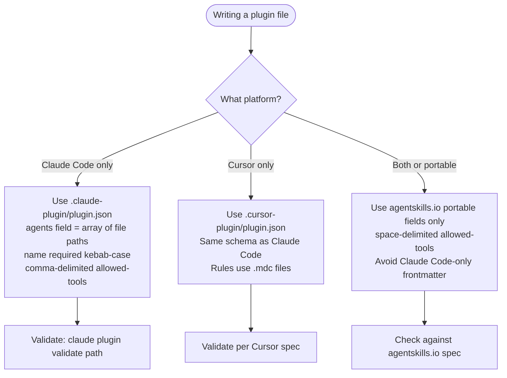

<!-- Migrated from skills/agent-plugin-ecosystem/ — pure reference content -->

# Agent Plugin Ecosystem

This skill provides verified ecosystem facts for agents writing plugin manifests, skill files, and agent files. When loaded, use it to produce output that targets the correct schema and platform — and to avoid writing files that silently fail validation on a different vendor.

## Plugin Bundle Systems

Two production plugin bundle systems exist as of 2026-02-26. They share near-identical schemas.

### Claude Code (Anthropic)

- Manifest location: `.claude-plugin/plugin.json`
- Required field: `name` (kebab-case only)
- Component fields: `skills`, `agents`, `commands`, `hooks`, `mcpServers`, `lspServers`, `outputStyles`
- `agents` must be an array of individual file paths — not a directory string
- All paths relative, starting with `./`
- Official docs: <https://code.claude.com/docs/en/plugins-reference.md>

### Cursor (launched 2026-02-17)

- Manifest location: `.cursor-plugin/plugin.json`
- Same required fields and SemVer versioning as Claude Code
- Component types: Rules (`.mdc` files), Skills (`SKILL.md`), Agents, Commands, Hooks, MCP Servers
- Spec repo: <https://github.com/cursor/plugins>
- Structurally parallel to Claude Code — intentional design

**Key difference between the two:** Cursor has Rules (`.mdc` files); Claude Code does not. Otherwise the schemas are near-identical.

## SKILL.md Portability Standard (agentskills.io)

The `SKILL.md` format is a cross-vendor open standard. Confirmed adopters as of 2026-02-26: Claude Code, Cursor, VS Code Copilot (v1.109, January 2026), Gemini CLI, OpenAI Codex, LM-Kit.NET.

Portable frontmatter fields (all vendors): `name`, `description`, `license`, `compatibility`, `metadata`, `allowed-tools`

Claude Code-only extensions (other vendors ignore these fields): `argument-hint`, `model`, `context`, `agent`, `user-invocable`, `disable-model-invocation`, `hooks`

**Critical portability gap — `allowed-tools` delimiter:**

- agentskills.io spec: space-delimited — `allowed-tools: Read Grep Glob`
- Claude Code: comma-delimited — `allowed-tools: Read, Grep, Glob`

A skill using space-delimited `allowed-tools` is cross-vendor portable. A skill using comma-delimited is Claude Code-specific. When writing a skill intended for multiple platforms, use the space-delimited form.

Spec URL: <https://agentskills.io/specification>

## Cross-Vendor Standardization Status

The **Agentic AI Foundation (AAIF)** — launched December 2026 under the Linux Foundation — stewards MCP (tool connectivity) and AGENTS.md (project instructions). Founding members include Anthropic, OpenAI, Google, Microsoft, AWS, Bloomberg, and Cloudflare.

AAIF does NOT yet steward a plugin bundle standard. Claude Code and Cursor schemas converged independently. The next likely venue for plugin bundle standardization is the MCP Dev Summit (April 2-3, 2026, NYC).

No unified plugin bundle standard exists as of 2026-02-26. Write to the platform-specific schema for the target system. Write to agentskills.io portable fields when targeting multiple vendors.

AAIF site: <https://aaif.io/>

## OpenCode SKILL.md Extensions

OpenCode supports two mechanisms for attaching MCP servers to a skill. Both are specific to the OpenCode runtime — other vendors ignore these fields.

### `mcp:` frontmatter field

A skill can declare MCP servers directly in SKILL.md frontmatter under the `mcp:` key. Each entry names a server and provides its launch configuration.

**stdio server (process-based):**

```yaml
---
name: my-skill
description: Does something
mcp:
  server-name:
    command: npx
    args: ["-y", "some-mcp-package"]
    env:
      KEY: value
---
```

**HTTP server (SSE-based):**

```yaml
mcp:
  server-name:
    url: https://mcp.example.com/sse
    headers:
      Authorization: "Bearer token"
```

### `mcp.json` sidecar file

An alternative to frontmatter: place an `mcp.json` file next to `SKILL.md` in the same directory.

```json
{ "mcpServers": { "server-name": { "command": "npx", "args": ["-y", "pkg"] } } }
```

**Precedence:** `mcp.json` takes precedence over frontmatter `mcp:` if both are present.

### Lifecycle

MCP servers declared via either mechanism use idle-timeout pooling:

- Server starts on first tool call
- Terminates after 5 minutes idle
- Tears down on session end
- Pool key: `sessionID:skillName:serverName`

### Portability note

The `mcp:` frontmatter key is an OpenCode extension. Claude Code and Cursor do not define this field — they ignore it. AmpCode compatibility with inline `mcp:` frontmatter is unverified. When writing skills targeting multiple platforms, the `mcp:` block is silently inert outside OpenCode.

The `skilllint` FM009 guard treats `mcp:` as an ecosystem-owned key and skips rewriting its sub-keys (e.g., `command: npx -y server`) to avoid corrupting OpenCode skill definitions.

SOURCE: oh-my-opencode source `/src/features/opencode-skill-loader/skill-mcp-config.ts`, <https://github.com/code-yeongyu/oh-my-opencode> (accessed 2026-03-06).

## Writing for the Correct Target



## Self-Update Protocol

When making changes that affect ecosystem facts — new vendor adopters, schema changes, new fields, updated spec URLs — update this file and cite the source URL and access date inline.

Reference URLs to monitor for changes:

- <https://agentskills.io/specification>
- <https://code.claude.com/docs/en/plugins-reference.md>
- <https://cursor.com/docs/plugins/building>
- <https://github.com/cursor/plugins>
- <https://aaif.io/>

SOURCE: Research conducted 2026-02-26. Cursor plugin launch date from <https://cursor.com/changelog> (2026-02-17). AAIF membership from <https://aaif.io/> (2026-02-26). agentskills.io adopter list from <https://agentskills.io/specification> (2026-02-26).
