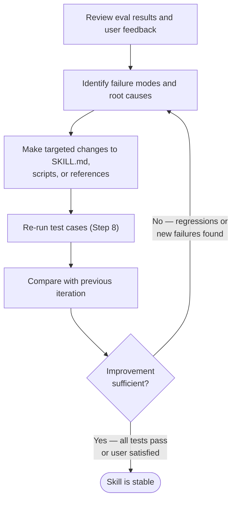

# Skill Evaluation and Optimization

Post-creation workflow for testing, improving, and optimizing skills using A/B evaluation, grading, and description tuning.

**SOURCE:** Adapted from the official Anthropic skill-creator ([anthropics/skills](https://github.com/anthropics/skills)) with additions for this repository's conventions. Accessed 2026-03-06.

## Table of Contents

- [Development Order: Evaluate Before You Document](#development-order-evaluate-before-you-document)
- [Step 7: Test Cases](#step-7-test-cases)
- [Step 8: Running and Evaluating Test Cases](#step-8-running-and-evaluating-test-cases)
- [Step 9: Improving the Skill](#step-9-improving-the-skill)
- [Claude A / Claude B Collaborative Authoring](#claude-a--claude-b-collaborative-authoring)
- [Advanced: Blind Comparison](#advanced-blind-comparison)
- [Step 10: Description Optimization](#step-10-description-optimization)
- [Reference Files](#reference-files)

## Development Order: Evaluate Before You Document

Create evaluations **before** writing extensive documentation. This ensures your skill solves real problems rather than documenting imagined ones.

**Self-review gate — challenge every token before writing:**

- "Does Claude really need this explanation?"
- "Can I assume Claude knows this?"
- "Does this paragraph justify its token cost?"

The context window is a public good shared with conversation history, other skills, and the actual task. Only add context Claude doesn't already have.

**Evaluation-driven development sequence:**

1. Run Claude on representative tasks without a skill — document specific failures or missing context
2. Create evaluations that test those gaps
3. Establish a baseline (measure Claude's performance without the skill)
4. Write minimal instructions to address the gaps and pass evaluations
5. Iterate: run evals, compare against baseline, refine

SOURCE: Anthropic skill-authoring best practices (docs.anthropic.com, accessed 2026-03-23)

## Step 7: Test Cases

After writing the skill draft, come up with 2-3 realistic test prompts — the kind of thing a real user would actually say. Share them with the user: "Here are a few test cases I'd like to try. Do these look right, or do you want to add more?" Then run them.

Save test cases to `evals/evals.json`. Don't write assertions yet — just the prompts. You'll draft assertions in the next step while the runs are in progress.

```json
{
  "skill_name": "example-skill",
  "evals": [
    {
      "id": 1,
      "prompt": "User's task prompt",
      "expected_output": "Description of expected result",
      "files": []
    }
  ]
}
```

See `schemas.md` for the full schema (including the `assertions` field, which you'll add later).

### Cross-Model Testing

Test your skill with Haiku, Sonnet, **and** Opus before publishing. Skill effectiveness depends on the underlying model — instructions that work on Opus may not provide enough guidance for Haiku.

**What to check per model:**

- **Claude Haiku** (fast, economical): Does the skill provide enough guidance? Haiku needs more explicit direction.
- **Claude Sonnet** (balanced): Is the skill clear and efficient?
- **Claude Opus** (powerful reasoning): Does the skill avoid over-explaining? Opus needs less hand-holding.

If you plan to use a skill across multiple models, aim for instructions that work acceptably across all of them.

SOURCE: Anthropic skill-authoring best practices (docs.anthropic.com, accessed 2026-03-23)

Skills with objectively verifiable outputs (file transforms, data extraction, code generation, fixed workflow steps) benefit from test cases. Skills with subjective outputs (writing style, art) often don't need them. Suggest the appropriate default based on the skill type, but let the user decide.

> Scripts in this section use `uv run` — if `uv` is not installed, read `.claude/rules/uv-run-fallback.md` for install instructions and pip fallback procedure.

## Step 8: Running and Evaluating Test Cases

This section is one continuous sequence — don't stop partway through.

Put results in `<skill-name>-workspace/` as a sibling to the skill directory. Within the workspace, organize results by iteration (`iteration-1/`, `iteration-2/`, etc.) and within that, each test case gets a directory (`eval-0/`, `eval-1/`, etc.). Don't create all of this upfront — just create directories as you go.

### Step 8a: Spawn all runs (with-skill AND baseline) in the same turn

For each test case, launch TWO parallel runs:

- **with-skill**: `claude -p "{prompt}" --allowedTools "..." --permission-mode acceptEdits`
- **without-skill (baseline)**: Same prompt, same tools, but WITHOUT the skill installed

Use `--output-format stream-json` and `--verbose` to capture full transcripts. Run all test cases in parallel using the Agent tool.

Save outputs:

```text
iteration-1/
  eval-0/
    with-skill/transcript.json
    without-skill/transcript.json
  eval-1/
    ...
```

### Step 8b: While runs are in progress, draft assertions

While waiting for runs to complete, write assertions for each test case. Good assertions test meaningful outcomes — they should be hard to satisfy without actually doing the work correctly.

Add assertions to `evals/evals.json`:

```json
{
  "assertions": [
    {
      "type": "file_exists",
      "path": "output/report.md"
    },
    {
      "type": "file_contains",
      "path": "output/report.md",
      "pattern": "Summary"
    },
    {
      "type": "custom",
      "description": "Report includes at least 3 sections with headers"
    }
  ]
}
```

### Step 8c: As runs complete, capture timing data

Record execution time and token usage for each run. Save to the eval directory as `metrics.json`.

### Step 8d: Grade, aggregate, and launch the viewer

1. For each completed eval, spawn the **grader agent** (read `agents/grader.md`):

   ```text
   Task is grading eval results with subagent_type="general-purpose"
   Context to include in the prompt: agents/grader.md, evals/evals.json (assertions),
     iteration-N/eval-M/with-skill/transcript.json, iteration-N/eval-M/without-skill/transcript.json
   Output: iteration-N/eval-M/grading.json
   ```

2. Aggregate all grading results using the benchmark script:

   ```bash
   uv run scripts/aggregate_benchmark.py iteration-1/
   ```

3. Generate the eval viewer for the user to review:

   ```bash
   uv run eval-viewer/generate_review.py --static iteration-1/eval-review.html iteration-1/
   ```

   Open the HTML file so the user can see real examples before you attempt any improvements.

**IMPORTANT:** Generate the eval viewer BEFORE evaluating results yourself. Get examples in front of the user as soon as possible.

### Step 8e: Read the feedback

Check for `feedback.json` from the viewer's "Submit All Reviews" button. The user may have flagged specific issues, approved results, or added notes. Incorporate this feedback into your improvement plan.

**Team feedback (optional but valuable):** Share the skill with teammates and have them try it with real tasks — not test scenarios. Ask: Does the skill activate when expected? Are the instructions clear? What was confusing? Team feedback surfaces blind spots that your own usage patterns won't reveal. Incorporate before the next iteration.

SOURCE: Anthropic skill-authoring best practices (docs.anthropic.com, accessed 2026-03-23)

## Step 9: Improving the Skill

### How to think about improvements

The most common failure modes and what to do about them:

**Wrong approach taken.** The skill chose strategy A when strategy B was clearly better. Fix: add decision guidance for when to use which approach. Don't just add rules — add the reasoning, so the skill can generalize.

**Missing information.** The skill didn't know about a constraint, API, or pattern it needed. Fix: add the missing knowledge to a reference file and point to it from SKILL.md.

**Correct approach but poor execution.** The skill knew what to do but made errors in the details — wrong API call, missing edge case, formatting issues. Fix: add a script for the deterministic/error-prone parts, or add concrete examples showing the correct pattern.

**Did something unnecessary.** The skill did extra work that wasn't needed or actively harmful. Fix: add explicit guidance about what NOT to do and why.

**Script failure mode — no voodoo constants:** Every value (timeouts, limits, thresholds) in a script must have a comment explaining why that value was chosen. Unexplained numeric or string constants are a reliability failure mode — future authors cannot know whether the value was deliberate or arbitrary.

SOURCE: Anthropic skill-authoring best practices (docs.anthropic.com, accessed 2026-03-23)

**For each issue, consider:**

- Is this a knowledge gap (add reference)?
- Is this a reliability gap (add script)?
- Is this a judgment gap (add decision guidance)?
- Is this a scope gap (add boundaries)?

### Observing Navigation Behavior

As you iterate, pay attention to how Claude actually navigates the skill in practice. Watch for these signals:

- **Unexpected exploration paths:** Claude reads files in an order you didn't anticipate — your structure may not be as intuitive as you thought
- **Missed connections:** Claude fails to follow references to important files — your links may need to be more explicit or prominent
- **Overreliance on certain sections:** Claude repeatedly reads the same file — consider whether that content should be in the main SKILL.md instead
- **Ignored content:** Claude never accesses a bundled file — it may be unnecessary or poorly signaled in the main instructions

Iterate based on these observations rather than assumptions. The `name` and `description` fields in frontmatter are particularly critical — Claude uses them when deciding whether to trigger the skill. Make sure they clearly describe what the skill does and when it should be used.

SOURCE: Anthropic skill-authoring best practices (docs.anthropic.com, accessed 2026-03-23)

### The iteration loop



## Claude A / Claude B Collaborative Authoring

The most effective skill development loop uses two Claude instances: one to write and refine the skill (Claude A), and a separate fresh instance to test it (Claude B). Claude A understands agent needs; Claude B reveals gaps through real usage.

Claude models understand the skill format and structure natively — you don't need special prompts or a "writing skills" skill. Simply ask Claude to create a skill.

### 7-Step Creation Workflow

1. **Complete a task without a skill:** Work through a problem with Claude A using normal prompting. Notice what context you repeatedly provide.
2. **Identify the reusable pattern:** After completing the task, identify what context would be useful for similar future tasks.
3. **Ask Claude A to create a skill:** "Create a skill that captures the pattern we just used. Include the relevant schemas, naming conventions, and key rules."
4. **Review for conciseness:** Check that Claude A hasn't added unnecessary explanations. Ask: "Remove the explanation about X — Claude already knows that."
5. **Improve information architecture:** Ask Claude A to organize content more effectively: "Move the schema to a separate reference file."
6. **Test on similar tasks:** Use the skill with Claude B (a fresh instance with the skill loaded) on related use cases. Observe whether Claude B finds the right information and applies rules correctly.
7. **Iterate based on observation:** If Claude B struggles or misses something, return to Claude A with specifics: "Claude B forgot to filter by date for Q4 — should we add a section about date filtering patterns?"

### 6-Step Iteration Loop

When improving an existing skill, alternate between:

- **Working with Claude A** — the expert who helps refine the skill
- **Testing with Claude B** — the agent using the skill to perform real work
- **Observing Claude B's behavior** — bringing insights back to Claude A

1. Use the skill in real workflows — give Claude B actual tasks, not test scenarios
2. Observe Claude B's behavior — note where it struggles, succeeds, or makes unexpected choices
3. Return to Claude A for improvements — share the current SKILL.md and describe what you observed
4. Review Claude A's suggestions — reorganize to make rules more prominent, use stronger language ("MUST filter" vs "always filter"), or restructure workflows
5. Apply and test changes — update the skill with Claude A's refinements, then test again with Claude B
6. Repeat based on usage — each iteration improves the skill based on real agent behavior, not assumptions

**Why this approach works:** Claude A understands agent needs, you provide domain expertise, Claude B reveals gaps through real usage, and iterative refinement improves skills based on observed behavior rather than assumptions.

SOURCE: Anthropic skill-authoring best practices (docs.anthropic.com, accessed 2026-03-23)

## Advanced: Blind Comparison

For significant skill changes, use blind A/B comparison to avoid confirmation bias. Spawn the **comparator agent** (read `agents/comparator.md`) with outputs from both versions. The comparator doesn't know which version is "old" or "new" — it evaluates purely on quality.

Then spawn the **analyzer agent** (read `agents/analyzer.md`) to understand WHY the winner won, producing actionable improvement suggestions.

## Step 10: Description Optimization

The description field in SKILL.md frontmatter is the primary mechanism that determines whether Claude invokes a skill. After creating or improving a skill, offer to optimize the description for better triggering accuracy.

### How skill triggering works

Claude sees all skill descriptions in the `<available_skills>` block. When a user message comes in, Claude reads the descriptions and decides which (if any) skills to invoke. The description must contain enough signal for Claude to make the right call — invoke when relevant, skip when not.

A good description balances:

- **Precision**: Doesn't trigger on unrelated requests
- **Recall**: Triggers on all relevant requests
- **Specificity**: Distinguishes this skill from similar ones

### Step 10a: Generate trigger eval queries

Create an eval set with positive (should trigger) and negative (should NOT trigger) queries:

```json
[
  {"query": "Create a new skill for handling PDF files", "should_trigger": true},
  {"query": "How do I rotate a PDF?", "should_trigger": false},
  {"query": "Build a slash command for deployment", "should_trigger": true},
  {"query": "What's the weather today?", "should_trigger": false}
]
```

Aim for 15-20 queries minimum, roughly 60% positive and 40% negative. Include edge cases — queries that are close to the boundary.

### Step 10b: Review with user

Present the eval set to the user for review using the HTML template:

1. Read the template from `assets/eval_review.html`
2. Replace the placeholders:
   - `__EVAL_DATA_PLACEHOLDER__` with the JSON array of eval items
   - `__SKILL_NAME_PLACEHOLDER__` with the skill's name
   - `__SKILL_DESCRIPTION_PLACEHOLDER__` with the skill's current description
3. Write to a temp file and open it
4. The user can edit queries, toggle should-trigger, add/remove entries, then click "Export Eval Set"

This step matters — bad eval queries lead to bad descriptions.

### Step 10c: Run the optimization loop

Tell the user: "This will take some time — I'll run the optimization loop in the background and check on it periodically."

Save the eval set to the workspace, then run in the background:

```bash
uv run scripts/run_loop.py \
  --eval-set <path-to-trigger-eval.json> \
  --skill-path <path-to-skill> \
  --model <model-id-powering-this-session> \
  --max-iterations 5 \
  --verbose
```

Use the model ID from your system prompt (the one powering the current session) so the triggering test matches what the user actually experiences.

While it runs, periodically tail the output to give the user updates on which iteration it's on and what the scores look like.

This handles the full optimization loop automatically. It splits the eval set into 60% train and 40% held-out test, evaluates the current description (running each query 3 times to get a reliable trigger rate), then calls Claude with extended thinking to propose improvements based on what failed. It re-evaluates each new description on both train and test, iterating up to 5 times. When it's done, it opens an HTML report in the browser showing the results per iteration and returns JSON with `best_description` — selected by test score rather than train score to avoid overfitting.

### Step 10d: Apply the result

Review the `best_description` from the optimization output. Update the SKILL.md frontmatter with the optimized description. Run `quick_validate.py` to confirm it's valid.

## Reference Files

The `agents/` directory contains instructions for specialized subagents. Read them when you need to spawn the relevant subagent.

- `../agents/grader.md` — How to evaluate assertions against outputs
- `../agents/comparator.md` — How to do blind A/B comparison between two outputs
- `../agents/analyzer.md` — How to analyze why one version beat another

The `references/` directory has additional documentation:

- `schemas.md` — JSON structures for evals.json, grading.json, etc.
- `claude-code-skills-official.md` — Official Claude Code skills specification
- `workflows.md` — Workflow design patterns for multi-step skills

The `eval-viewer/` directory contains the interactive eval review viewer:

- `eval-viewer/viewer.html` — Interactive HTML viewer for eval results
- `eval-viewer/generate_review.py` — Generates standalone HTML review from eval data

The `assets/` directory contains templates:

- `assets/eval_review.html` — HTML template for reviewing and editing trigger eval sets
