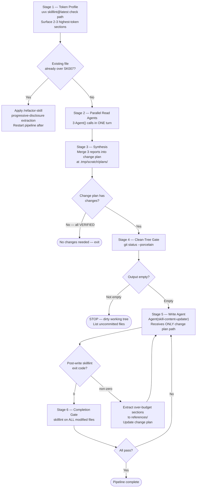

<sync_target>$1</sync_target>
<invocation_args>$ARGUMENTS</invocation_args>

## Argument Contract

| Input | Resolution |
|---|---|
| Path to a `SKILL.md` file | One pipeline for that skill |
| Path to a skill directory containing `SKILL.md` | One pipeline for that skill |
| Path to a plugin directory containing `skills/` | Glob `skills/*/SKILL.md` → one pipeline per skill |
| Anything else or empty | STOP — report ambiguity, ask for a skill path |

## Pipeline



## Stage Definitions

**Stage 1 — Token Profile**

Run `uvx skilllint@latest check <skill-path>` on the EXISTING file. Read the output and surface the 2–3 highest-token sections. This establishes the budget baseline before any edits.

Pre-write SK007 branch: if the existing file is already over SK007, apply `/plugin-creator:refactor-skill` (progressive-disclosure extraction) before making content changes. Restart the pipeline after the refactor completes.

**Stage 2 — Parallel Read Agents**

Dispatch exactly 3 `Agent()` calls in ONE turn (not sequential, not `TeamCreate`):

1. `Agent(subagent_type="plugin-creator:skill-auditor")` — input: `<skill-path>`; output: `.tmp/scratch/reports/skill-sync-{slug}-completeness-YYYYMMDD.md` (read-only)
2. `plugin-creator:skill-content-updater` (read role) — upstream drift scan; fetches SOURCE: URLs; output: drift report with NEW/STALE/VERIFIED/UNVERIFIABLE verdicts per claim
3. `general-purpose` — structure validation; checks progressive disclosure, frontmatter schema, broken reference links; output: structure report

Each agent writes its report to `.tmp/scratch/reports/`. Report formats: [./references/report-formats.md](./references/report-formats.md)

**Stage 3 — Synthesis**

Orchestrator reads all three reports and writes a change plan to `.tmp/scratch/plans/skill-sync-{slug}-YYYYMMDD.md`.

If all verdicts are VERIFIED and no structural issues found: write a "no changes needed" change plan and skip Stages 4–6.

Change plan format and synthesis precedence rules: [./references/change-plan-format.md](./references/change-plan-format.md)

**Stage 4 — Clean-Tree Gate**

```bash
git status --porcelain
```

If output is not empty: STOP. List the uncommitted files. Report to the user. Do not proceed until the tree is clean.

**Stage 5 — Schema-Aware Write Agent**

Dispatch one `Agent(subagent_type="plugin-creator:skill-content-updater")` in write role. Pass ONLY the change plan path — not the three read reports.

After the agent returns, run `uvx skilllint@latest check <modified-skill-path>`. If non-zero: extract the over-budget sections to `references/`, update the change plan with the extraction directive, and re-dispatch the write agent.

URL fetch behavior for the drift scan: [./references/url-fetch-spec.md](./references/url-fetch-spec.md)

**Stage 6 — Completion Gate**

Run `uvx skilllint@latest check` on every file modified in Stage 5. All must exit 0. If any fail: return to Stage 5 with a targeted remediation change plan.
