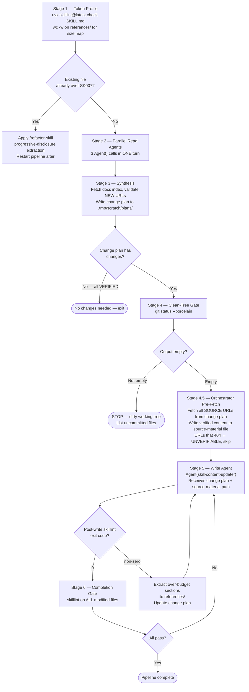

<sync_target>$1</sync_target>
<invocation_args>$ARGUMENTS</invocation_args>

## Argument Contract

| Input | Resolution |
|---|---|
| Path to a `SKILL.md` file | One pipeline for that skill |
| Path to a skill directory containing `SKILL.md` | One pipeline for that skill |
| Path to a plugin directory containing `skills/` | Glob `skills/*/SKILL.md` → one pipeline per skill |
| Anything else or empty | STOP — report ambiguity, ask for a skill path |

## Pipeline



## Stage Definitions

**Stage 1 — Token Profile**

Run `uvx skilllint@latest check <skill-path>/SKILL.md` (target the file, not the directory — passing a directory silently reports "Total files: 0" and exits 0 without validating anything). Note whether it passes or fails SK007.

To identify the largest reference files before adding content, run `wc -w <skill-path>/references/*.md | sort -rn | head -5` and surface the top 3 by word count. This indicates where budget pressure is highest.

Pre-write SK007 branch: if the existing SKILL.md is already over SK007, apply `/plugin-creator:refactor-skill` (progressive-disclosure extraction) before making content changes. Restart the pipeline after the refactor completes.

**Stage 2 — Parallel Read Agents**

Dispatch exactly 3 `Agent()` calls in ONE turn (not sequential, not `TeamCreate`):

1. `Agent(subagent_type="plugin-creator:skill-auditor")` — input: `<skill-path>`; output: `.tmp/scratch/reports/skill-sync-{slug}-completeness-YYYYMMDD.md` (read-only)
2. `plugin-creator:skill-content-updater` (read role) — upstream drift scan; output: drift report with NEW/STALE/VERIFIED/UNVERIFIABLE verdicts per claim
3. `general-purpose` — structure validation; checks progressive disclosure, frontmatter schema, broken reference links; output: structure report

Each agent writes its report to `.tmp/scratch/reports/`. Report formats: [./references/report-formats.md](./references/report-formats.md)

**Note on drift scanner URL fetching:** The `skill-content-updater` agent fetches the SOURCE: citation URLs already present in the skill, as defined in [./references/url-fetch-spec.md](./references/url-fetch-spec.md). Do not instruct it to fetch an external docs index — that is the `skill-sync-source-validator` agent's responsibility in Stage 4.5.

**Stage 3 — Synthesis**

Orchestrator reads all three reports and writes the change plan to `.tmp/scratch/plans/skill-sync-{slug}-YYYYMMDD.md`.

If all verdicts are VERIFIED and no structural issues found: write a "no changes needed" change plan and skip Stages 4–6.

Change plan format and synthesis precedence rules: [./references/change-plan-format.md](./references/change-plan-format.md)

**Stage 4 — Clean-Tree Gate**

```bash
git status --porcelain
```

If output is not empty: STOP. List the uncommitted files. Report to the user. Do not proceed until the tree is clean.

**Stage 4.5 — Source Validation Agent**

Dispatch `Agent(subagent_type="plugin-creator:skill-sync-source-validator")`. Pass the change plan path.

The agent validates and pre-fetches all source content before the write agent runs, keeping URL fetching out of the write agent's context and providing a structured fallback chain when primary fetch methods fail. It handles:
- Validating all NEW URLs against the docs index (`llms.txt` / sitemap) — downgrades fabricated URLs to UNVERIFIABLE directly in the change plan file
- Pre-fetching content for every SOURCE URL using the priority fetch chain defined in [./references/url-fetch-spec.md](./references/url-fetch-spec.md)
- Writing `.tmp/scratch/fetched/source-material-YYYYMMDD.md` with verified content per change plan entry
- Updating the change plan header with the source-material file path

**Stage 5 — Schema-Aware Write Agent**

Dispatch one `Agent(subagent_type="plugin-creator:skill-content-updater")` in write role. Pass the change plan path. The change plan header now contains the source-material file path — the write agent reads from that file and does not need to fetch any URLs.

After the agent returns, run `uvx skilllint@latest check <modified-skill-path>/SKILL.md`. If non-zero: extract the over-budget sections to `references/`, update the change plan with the extraction directive, and re-dispatch the write agent.

**Stage 6 — Completion Gate**

Run `uvx skilllint@latest check` on every file modified in Stage 5. All must exit 0. If any fail: return to Stage 5 with a targeted remediation change plan.
