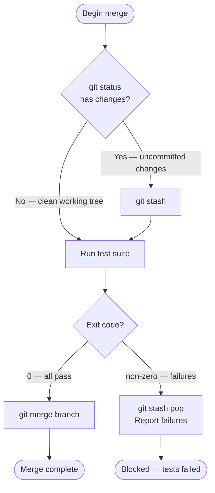
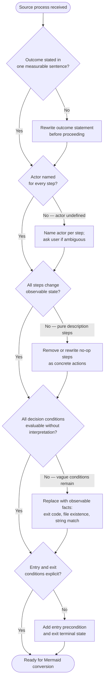

<p align="center">
  
</p>

# process-siren

Prose workflows mislead AI agents. "Handle the usual cases" is not a condition an agent can
evaluate. This plugin converts bullet steps, ASCII art, markdown tables, and prose workflows
into precise Mermaid diagrams — structural process definitions that AI agents can follow
without interpretation.

## The Problem

AI agents reading prose instructions in SKILL.md, CLAUDE.md, and agent files must guess:

- "Then..." — how many steps? in what order?
- "If appropriate..." — appropriate by what observable fact?
- "Handle the usual cases" — which cases? what is usual?
- "When done..." — done by what signal?

Mermaid flowcharts eliminate these ambiguities. Every branch is an explicit labeled edge. Every
decision is a diamond node with an observable condition. Every path ends at a named terminal
state. An agent following a Mermaid diagram traces exactly one path without inferring anything.

## Before and After

**Before** (prose that fails AI agents):

```
1. Check for uncommitted changes
2. If yes, stash them before proceeding
3. Run the test suite
4. If tests pass, merge the branch
5. If tests fail, restore the stash and report errors
```

**After** (Mermaid — every path is unambiguous):



The correctness test: can an AI agent follow exactly one path without any interpretation? If
yes, the conversion is correct.

## What's Inside

| Component | Name | Activates on |
|-----------|------|--------------|
| Agent | `process-siren` | Mermaid conversion requests for AI-facing documents |
| Skill | `mermaids-treasure` | Mermaid syntax reference — flowcharts, sequences, state diagrams, ER, Gantt, and more |
| Skill | `improve-processes` | Process quality methodology — triage and improve before converting |
| Skill | `woo-sailor` | Bulk conversion — given a file or directory, convert all prose workflows |

## Quick Start

```bash
/plugin marketplace add Jamie-BitFlight/claude_skills
/plugin install process-siren@jamie-bitflight-skills
```

## Usage

### Convert a section in a file

```
@process-siren Convert the "Verification Decision Flow" section in .claude/CLAUDE.md to a Mermaid flowchart.
```

### Convert standalone prose

Paste the process directly:

```
@process-siren Convert this to a Mermaid diagram:

1. Check if the branch has uncommitted changes
2. If yes, stash changes before proceeding
3. Run the test suite
4. If tests pass, merge the branch
5. If tests fail, restore the stash and report errors
```

### Convert a whole file or directory

```
/process-siren:woo-sailor plugins/my-plugin/skills/my-skill/SKILL.md
/process-siren:woo-sailor plugins/my-plugin/  --dry-run
```

`--dry-run` reports what would be converted without writing any files. `--report` produces the
same output plus a structured audit of findings.

### Run a quality audit before converting

```
/process-siren:improve-processes
```

Paste or reference the process you want audited. The skill runs a triage checklist and surfaces
gaps — abstract verbs, unevaluable conditions, missing entry/exit states, undefined actors —
before you ask for a conversion.

## How the Agent Works

When you invoke `@process-siren`, the agent:

1. Inventories every step, condition, and terminal state in the source
2. Selects the diagram type that best preserves the original structure
3. Drafts the diagram — descriptive node labels, evaluable diamond conditions, outcome-labeled edges
4. Validates Mermaid syntax using the bundled MCP server (`.mcp.json`)
5. Verifies that every item from the source inventory appears in the diagram
6. Replaces the content in-place (when given a file path) or returns the diagram source

If the source has no identifiable discrete steps, subjective conditions, undefined actors, or
missing terminal states, the agent surfaces those gaps and asks for clarification before
converting. It does not invent structure.

### MCP Server Integration

The plugin registers a Mermaid diagram validation MCP server (defined in `.mcp.json`) that
provides real-time syntax checking during conversion. This prevents incomplete or malformed
Mermaid syntax from entering the codebase. The server runs automatically — no configuration
needed.

## Quality Gate — The Triage Protocol

The `improve-processes` skill runs automatically when a source process shows structural
problems:



## When Not to Use It

- **Single-step instructions with no branching** — prose is fine; a diagram adds noise without
  value
- **Reference tables** — flat data belongs in a table, not a flowchart
- **Narrative explanations** — background context for human readers does not need to be a
  diagram

## Requirements

- Claude Code v2.0+
- Node.js (for the bundled `mcp-mermaid` MCP server, installed via `npx` on first use)

---

> **The Ancient Woe**
>
> *A frustrated King screaming commands at an army of literal-minded clay golems. The King yells, "Defend the gates if appropriate," and the golems freeze, for they cannot evaluate what "appropriate" means! The King writes, "Handle the usual cases," and the golems do nothing, for "usual" is a human ghost they cannot perceive!*

> **The Bard's Decree**
>
> *"Banish the treacherous fog of human prose! Artificial minds cannot infer thy vague poetry! Thou must draw the Mermaid's map: explicit branching paths, absolute diamond decision gates rooted only in observable facts, and clearly named terminal states! Let the improve-processes skill audit thy commands, stripping away abstract verbs until a mere novice could follow thy logic cold in five minutes!"*
