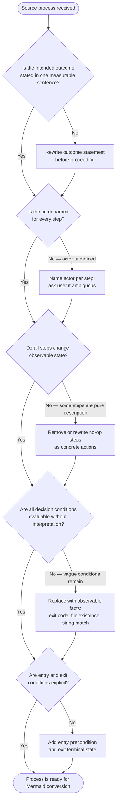

<p align="center">
  
</p>

# process-siren

Converts bullet steps, ASCII art, markdown tables, and prose workflows into precise Mermaid diagrams for AI-facing documents.

## Why Install This?

Prose instructions in SKILL.md, CLAUDE.md, and agent files require interpretation. AI agents reading "then handle the usual cases" must guess what "usual" means. "When appropriate" is not a condition an agent can evaluate. "We" is not an actor an agent can route to.

Mermaid flowcharts eliminate this ambiguity entirely. Every branch is an explicit labeled edge. Every decision is a diamond node with an observable condition. Every path ends at a named terminal state. An AI agent following a Mermaid diagram can trace exactly one path without inferring anything.

This plugin provides two components that work together: an agent that performs the conversion with full syntax validation, and a skill that catches process quality problems before they get encoded into a diagram.

## Why Mermaid Over Prose for AI Agents

Prose fails AI agents in four predictable ways:

- "Then..." leaves step count and sequence ambiguous
- "If appropriate..." cannot be evaluated — there is no observable fact to check
- "Handle the usual cases" has undefined scope — the agent must guess
- "When done..." has no structural signal — the agent cannot recognize completion

Mermaid solves each of these at the structural level:

- Arrows define sequence; step count equals node count
- Diamond nodes state the exact observable fact being evaluated (exit code, file existence, string match)
- Every outcome is an explicit labeled edge — nothing is implied
- Terminal states use `([terminal])` node shape — the agent recognizes them by structure, not by reading

The test for a correct conversion: can an AI agent follow exactly one path through the diagram without any interpretation? If yes, the conversion is correct. If the agent must infer or assume anything, the diagram has a fidelity defect.

## What You Get

### process-siren Agent

An agent specialized in Mermaid conversion for AI-facing documents. Invoke it when a section of a SKILL.md, CLAUDE.md, or agent file contains conditional logic, branching decisions, or multi-step sequences expressed as prose or bullets.

The agent handles:

- Bullet-point processes (numbered or unnumbered steps)
- ASCII box-and-arrow diagrams
- Markdown tables that are actually decision trees or routing matrices
- Prose workflow descriptions
- Mixed content in SKILL.md files, CLAUDE.md sections, and agent prompts

For each conversion the agent:

1. Inventories every step, condition, and terminal state in the source
2. Selects the diagram type that best preserves the original structure
3. Drafts the diagram with full annotations — descriptive node labels, evaluable diamond conditions, outcome-labeled edges
4. Validates the Mermaid syntax using the bundled MCP server
5. Verifies that every item from the source inventory appears in the diagram
6. Replaces the original content in-place (when operating on a file) or returns the diagram source

The agent will block and ask for clarification rather than invent structure. If a source has no identifiable discrete steps, subjective conditions, undefined actors, or missing terminal states, the agent surfaces those gaps before converting.

### improve-processes Skill

A process quality methodology skill the process-siren agent loads automatically. It provides triage criteria, a sequential improvement framework, and an excellence checklist drawn from Lean, Six Sigma, BPR, Design Thinking, Systems Thinking, and Theory of Constraints.

With this skill loaded, Claude will evaluate process quality before converting. When a source process shows abstract verbs with no concrete action, conditions that cannot be evaluated, missing entry or exit conditions, undefined actors, or no error paths — Claude will work through a structured triage sequence to clarify the process before encoding it as a diagram.

The improvement framework runs in sequence:

1. Rewrite the outcome as one measurable sentence
2. Replace abstract verbs with concrete actions
3. Add decision gates with explicit conditions
4. Define inputs and outputs for each step
5. Remove steps that do not change state
6. Add at least one correct execution example
7. Add at least one failure example
8. Stress-test edge cases
9. Verify a novice can follow it cold in five minutes
10. Confirm execution can be traced and verified after the fact

You can also invoke `/improve-processes` directly to run this quality check on any process description before asking for a Mermaid conversion.

## When to Use Each Component

**Use the process-siren agent** when you have a workflow, decision tree, or multi-step process in an AI-facing document and want it converted to a precise Mermaid diagram. Delegate to it via the Agent tool or invoke it from the agent menu.

**Use the `/improve-processes` skill** when a process description is ambiguous or incomplete and you want to identify the gaps before converting. The process-siren agent loads this skill automatically, so you only need to invoke it directly if you want a quality audit without conversion.

**Use both together** when you have poorly-structured prose workflows that need both cleanup and conversion in one session — the agent handles the full pipeline.

## Installation

Add the marketplace (one-time setup):

```bash
/plugin marketplace add Jamie-BitFlight/claude_skills
```

Install the plugin:

```bash
/plugin install process-siren@jamie-bitflight-skills
```

## Usage

### Converting a section in a file

Ask the agent to convert a specific section:

```
@process-siren Convert the "Verification Decision Flow" section in .claude/CLAUDE.md to a Mermaid flowchart.
```

### Converting standalone prose

Paste the process description directly and ask for a conversion:

```
@process-siren Convert this to a Mermaid diagram:

1. Check if the branch has uncommitted changes
2. If yes, stash changes before proceeding
3. Run the test suite
4. If tests pass, merge the branch
5. If tests fail, restore the stash and report errors
```

### Running a quality audit first

```
/improve-processes
```

Then paste or reference the process you want audited. Claude will run the triage checklist and surface any gaps before you ask for a conversion.

## How It Works

When you invoke `@process-siren`, the agent first checks whether the source process is ready to convert. If the process has ambiguity or structural gaps, the `improve-processes` skill runs the following triage protocol before generating any Mermaid output:



This diagram was generated by process-siren itself from the `improve-processes` skill source.

## Requirements

- Claude Code v2.0+
- Node.js (for the bundled `mcp-mermaid` MCP server, installed via `npx` on first use)

---

> **The Ancient Woe**
>
> *A frustrated King screaming commands at an army of literal-minded clay golems. The King yells, "Defend the gates if appropriate," and the golems freeze, for they cannot evaluate what "appropriate" means! The King writes, "Handle the usual cases," and the golems do nothing, for "usual" is a human ghost they cannot perceive!*

> **The Bard's Decree**
>
> *"Banish the treacherous fog of human prose! Artificial minds cannot infer thy vague poetry! Thou must draw the Mermaid's map: explicit branching paths, absolute diamond decision gates rooted only in observable facts, and clearly named terminal states! Let the improve-processes skill audit thy commands, stripping away abstract verbs until a mere novice could follow thy logic cold in five minutes!"*
