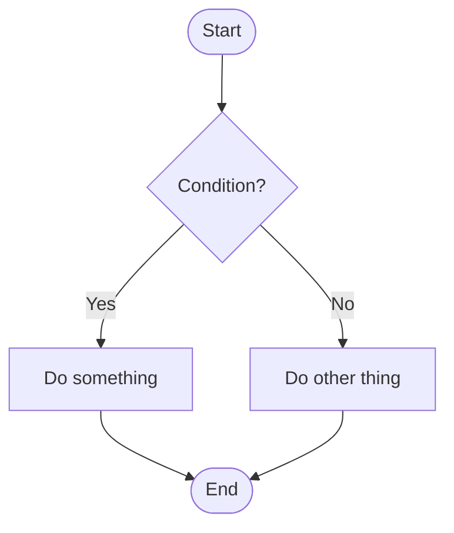
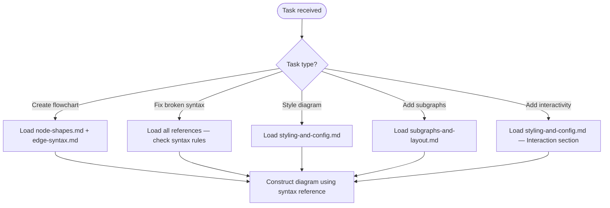

# Mermaid Flowchart Syntax

Complete syntax reference for Mermaid `flowchart` and `graph` diagrams. Enables AI agents to construct valid flowcharts with correct node shapes, edge types, subgraphs, styling, and configuration.

## Scope

TRIGGER: Activate when the user asks to create, fix, or modify a Mermaid flowchart diagram, or when generating Mermaid `flowchart TD/LR/etc.` code.

COVERS:

- Node shapes (classic and v11.3.0+ expanded syntax)
- Edge/link types (solid, dotted, thick, invisible, circle, cross, multi-directional)
- Edge IDs and animations
- Subgraphs and nested direction
- Styling nodes and links with `style`, `classDef`, and CSS classes
- Click interactivity and tooltips
- FontAwesome and custom icon integration
- Renderer and layout configuration

DOES NOT COVER:

- Other Mermaid diagram types (sequence, class, gantt, state, etc.)
- Mermaid.js API or rendering engine internals
- HTML/JavaScript integration beyond click callbacks

## Quick Reference — Common Patterns

**Direction codes:** `TD`/`TB` = top-down, `LR` = left-right, `BT` = bottom-up, `RL` = right-left

**Essential node shapes:**

| Shape | Classic Syntax | v11.3.0+ Syntax |
|-------|---------------|-----------------|
| Rectangle | `A[text]` | `A@{ shape: rect }` |
| Rounded | `A(text)` | `A@{ shape: rounded }` |
| Stadium | `A([text])` | `A@{ shape: stadium }` |
| Diamond | `A{text}` | `A@{ shape: diamond }` |
| Circle | `A((text))` | `A@{ shape: circle }` |
| Database | `A[(text)]` | `A@{ shape: cyl }` |

**Essential edge types:**

| Type | Syntax |
|------|--------|
| Arrow | `A --> B` |
| Arrow + text | `A -->\|text\| B` |
| Dotted arrow | `A -.-> B` |
| Thick arrow | `A ==> B` |
| Open link | `A --- B` |

## Workflow

## Workflows

- [Flowchart Construction Decision Process](./resources/workflows/flowchart-construction.md)

## Reference Files

### Node Shapes

All node shape syntaxes — classic bracket notation and v11.3.0+ `@{ shape: ... }` notation. Includes the complete shape catalog with semantic names, short names, and aliases.
Load when constructing nodes or choosing appropriate shapes for diagram elements.

[node-shapes.md](./references/node-shapes.md)

### Edge Syntax

All edge/link types — solid, dotted, thick, invisible, circle, cross, and multi-directional arrows. Covers edge IDs, animations, text labels, chaining, and the minimum length table.
Load when connecting nodes or styling edges.

[edge-syntax.md](./references/edge-syntax.md)

### Subgraphs and Layout

Subgraph declaration, explicit IDs, nested direction control, direction limitation for external links. Also covers diagram direction codes, Markdown strings, special character escaping, entity codes, and comments.
Load when grouping nodes or controlling layout.

[subgraphs-and-layout.md](./references/subgraphs-and-layout.md)

### Styling and Configuration

Node styling, link styling, classDef, CSS classes, click interactivity, tooltips, FontAwesome icons, custom icons, renderer selection (dagre/elk), and line curve configuration.
Load when styling diagrams or adding interactive elements.

[styling-and-config.md](./references/styling-and-config.md)

## Critical Constraints

- The word `end` in all lowercase breaks flowcharts — capitalize as `End` or `END`
- Starting a node connection with `o` or `x` creates circle/cross edges — add a space or capitalize
- Subgraph direction is ignored when any subgraph node links to an external node
- Click interactivity requires `securityLevel='loose'` — disabled in `strict` mode
- Commas in `stroke-dasharray` must be escaped as `\,` in `classDef` statements

## References

[1] [Mermaid Flowchart Syntax Documentation](https://github.com/mermaid-js/mermaid/blob/develop/packages/mermaid/src/docs/syntax/flowchart.md) (accessed 2026-03-07)

[2] [Mermaid Official Site — Flowchart Syntax](https://mermaid.ai/open-source/syntax/flowchart.html) (accessed 2026-03-07)
