# Mermaid Flowchart Node Shapes Reference

Extracted knowledge atoms for all Mermaid flowchart node shapes, covering basic syntax (nodes, text, direction), classic bracket-based shapes, the expanded `@{ shape: ... }` syntax (v11.3.0+), and special icon/image shapes. Every syntax example is verbatim from the source documentation.

## Table of Contents

- [Basic Syntax](#basic-syntax)
- [Direction](#direction)
- [Classic Node Shapes (Bracket Syntax)](#classic-node-shapes-bracket-syntax)
- [Unicode and Markdown Text](#unicode-and-markdown-text)
- [Expanded Node Shapes v11.3.0+ Syntax](#expanded-node-shapes-v1130-syntax)
- [Expanded Shape Name Table](#expanded-shape-name-table)
- [Special Shapes: Icon](#special-shapes-icon)
- [Special Shapes: Image](#special-shapes-image)
- [Warnings and Constraints](#warnings-and-constraints)

## Basic Syntax

ATOM: A flowchart is declared with the keyword `flowchart` (or `graph`) followed by a direction code.
TYPE: command
SOURCE: flowchart.md:Flowcharts - Basic Syntax

ATOM: A bare node ID with no brackets renders as a rectangle displaying the ID as its text: `id`
TYPE: pattern
SOURCE: flowchart.md:A node (default)

ATOM: A node with text different from its ID uses square brackets: `id1[This is the text in the box]`
TYPE: command
SOURCE: flowchart.md:A node with text

ATOM: If text is set multiple times for the same node ID, the last definition wins.
TYPE: constraint
SOURCE: flowchart.md:A node with text

ATOM: If edges are defined for a node after its text was set, the text definition can be omitted on subsequent references; the previously defined text is reused.
TYPE: constraint
SOURCE: flowchart.md:A node with text

## Direction

ATOM: `flowchart TD` declares top-to-bottom (top-down) orientation.
TYPE: command
SOURCE: flowchart.md:Direction

ATOM: `flowchart TB` declares top-to-bottom orientation (identical to TD).
TYPE: command
SOURCE: flowchart.md:Direction

ATOM: `flowchart BT` declares bottom-to-top orientation.
TYPE: command
SOURCE: flowchart.md:Direction

ATOM: `flowchart RL` declares right-to-left orientation.
TYPE: command
SOURCE: flowchart.md:Direction

ATOM: `flowchart LR` declares left-to-right orientation.
TYPE: command
SOURCE: flowchart.md:Direction

ATOM: The five valid direction codes are: `TB`, `TD`, `BT`, `RL`, `LR`.
TYPE: constraint
SOURCE: flowchart.md:Direction

## Classic Node Shapes (Bracket Syntax)

### Round Edges

ATOM: Round-edged rectangle uses parentheses: `id1(This is the text in the box)`
TYPE: command
SOURCE: flowchart.md:A node with round edges

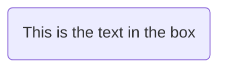

### Stadium

ATOM: Stadium-shaped node (pill shape) uses parentheses wrapping brackets: `id1([This is the text in the box])`
TYPE: command
SOURCE: flowchart.md:A stadium-shaped node

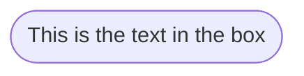

### Subroutine

ATOM: Subroutine-shaped node uses double square brackets: `id1[[This is the text in the box]]`
TYPE: command
SOURCE: flowchart.md:A node in a subroutine shape

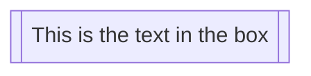

### Cylinder

ATOM: Cylindrical node uses bracket-parenthesis: `id1[(Database)]`
TYPE: command
SOURCE: flowchart.md:A node in a cylindrical shape

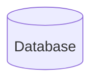

### Circle

ATOM: Circle node uses double parentheses: `id1((This is the text in the circle))`
TYPE: command
SOURCE: flowchart.md:A node in the form of a circle

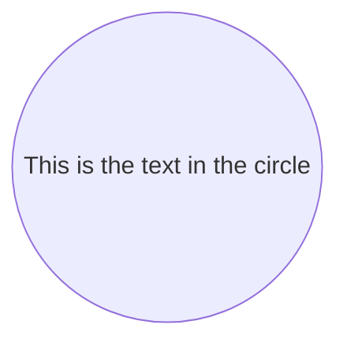

### Asymmetric (Flag/Ribbon)

ATOM: Asymmetric shape (flag/ribbon pointing right) uses `>` and `]`: `id1>This is the text in the box]`
TYPE: command
SOURCE: flowchart.md:A node in an asymmetric shape

ATOM: The asymmetric shape currently only exists as a right-pointing flag; no mirror variant is available.
TYPE: constraint
SOURCE: flowchart.md:A node in an asymmetric shape

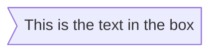

### Rhombus (Diamond)

ATOM: Rhombus (diamond) node uses curly braces: `id1{This is the text in the box}`
TYPE: command
SOURCE: flowchart.md:A node (rhombus)

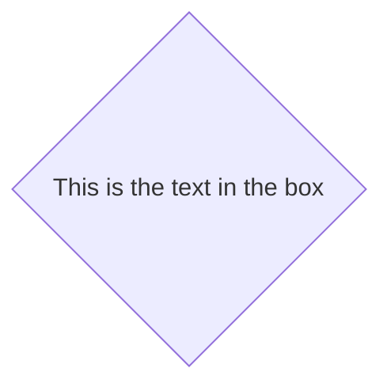

### Hexagon

ATOM: Hexagon node uses double curly braces: `id1{{This is the text in the box}}`
TYPE: command
SOURCE: flowchart.md:A hexagon node

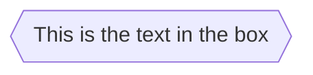

### Parallelogram

ATOM: Parallelogram (lean right) uses `[/ /]`: `id1[/This is the text in the box/]`
TYPE: command
SOURCE: flowchart.md:Parallelogram

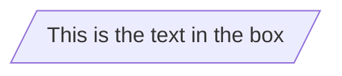

### Parallelogram Alt

ATOM: Parallelogram alt (lean left) uses `[\ \]`: `id1[\This is the text in the box\]`
TYPE: command
SOURCE: flowchart.md:Parallelogram alt

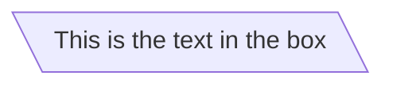

### Trapezoid

ATOM: Trapezoid (base at bottom) uses `[/ \]`: `A[/Christmas\]`
TYPE: command
SOURCE: flowchart.md:Trapezoid

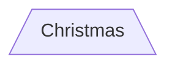

### Trapezoid Alt

ATOM: Trapezoid alt (base at top) uses `[\ /]`: `B[\Go shopping/]`
TYPE: command
SOURCE: flowchart.md:Trapezoid alt

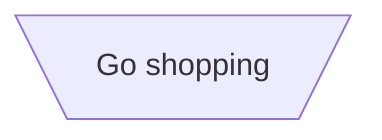

### Double Circle

ATOM: Double circle node uses triple parentheses: `id1(((This is the text in the circle)))`
TYPE: command
SOURCE: flowchart.md:Double circle

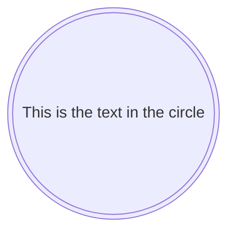

## Unicode and Markdown Text

ATOM: To use Unicode characters in node text, enclose the text in double quotes: `id["This ❤ Unicode"]`
TYPE: command
SOURCE: flowchart.md:Unicode text

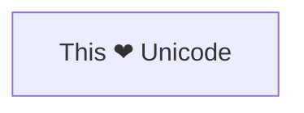

ATOM: To use Markdown formatting in node text, enclose text in double quotes and backticks: `markdown["\`This **is** _Markdown_\`"]`
TYPE: command
SOURCE: flowchart.md:Markdown formatting

ATOM: Markdown text in nodes supports multi-line content by inserting literal newlines inside the backtick-quoted string.
TYPE: pattern
SOURCE: flowchart.md:Markdown formatting

ATOM: Markdown formatting in nodes requires `htmlLabels: false` in the config block when used with certain renderers.
TYPE: constraint
SOURCE: flowchart.md:Markdown formatting

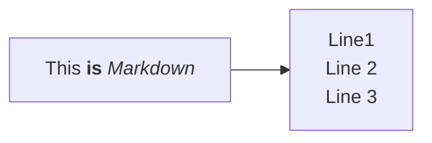

## Expanded Node Shapes v11.3.0+ Syntax

ATOM: Starting in Mermaid v11.3.0, nodes can be defined with the general syntax `A@{ shape: shapeName }` to assign any of 30+ shape types.
TYPE: command
SOURCE: flowchart.md:Expanded Node Shapes in Mermaid Flowcharts (v11.3.0+)

ATOM: The `@{ shape: ... }` syntax creates a node identical to bracket syntax; e.g., `A@{ shape: rect }` renders the same as `A["A"]` or bare `A`.
TYPE: pattern
SOURCE: flowchart.md:Expanded Node Shapes in Mermaid Flowcharts (v11.3.0+)

ATOM: The `label` property in the `@{ }` block sets the display text: `A@{ shape: rect, label: "This is a process" }`
TYPE: parameter
SOURCE: flowchart.md:Process

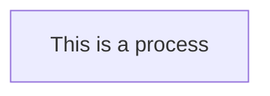

ATOM: Example of using multiple expanded shapes with edges:
TYPE: example
SOURCE: flowchart.md:Example Flowchart with New Shapes

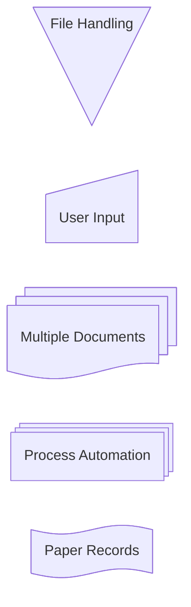

## Expanded Shape Name Table

The complete list of shapes available with `@{ shape: NAME }` syntax (v11.3.0+). The **Short Name** is the canonical value for the `shape:` property. **Aliases** are alternative values that resolve to the same shape.

| Semantic Name | Shape Name | Short Name | Aliases |
|---|---|---|---|
| Process | Rectangle | `rect` | `proc`, `process`, `rectangle` |
| Event | Rounded Rectangle | `rounded` | `event` |
| Terminal Point | Stadium | `stadium` | `pill`, `terminal` |
| Subprocess | Framed Rectangle | `subproc` | `fr-rect`, `framed-rectangle`, `subprocess`, `subroutine` |
| Database | Cylinder | `cyl` | `cylinder`, `database`, `db` |
| Start (Circle) | Circle | `circle` | `circ` |
| Odd | Odd | `odd` | `odd` |
| Decision | Diamond | `diam` | `decision`, `diamond`, `question` |
| Prepare Conditional | Hexagon | `hex` | `hexagon`, `prepare` |
| Data Input/Output (Lean Right) | Lean Right | `lean-r` | `in-out`, `lean-right` |
| Data Input/Output (Lean Left) | Lean Left | `lean-l` | `lean-left`, `out-in` |
| Priority Action | Trapezoid Base Bottom | `trap-b` | `priority`, `trapezoid`, `trapezoid-bottom` |
| Manual Operation | Trapezoid Base Top | `trap-t` | `inv-trapezoid`, `manual`, `trapezoid-top` |
| Stop (Double Circle) | Double Circle | `dbl-circ` | `double-circle` |
| Text Block | Text Block | `text` | |
| Card | Notched Rectangle | `notch-rect` | `card`, `notched-rectangle` |
| Lined/Shaded Process | Lined Rectangle | `lin-rect` | `lin-proc`, `lined-process`, `lined-rectangle`, `shaded-process` |
| Start (Small Circle) | Small Circle | `sm-circ` | `small-circle`, `start` |
| Stop (Framed Circle) | Framed Circle | `framed-circle` | `fr-circ`, `stop` |
| Fork/Join | Filled Rectangle | `fork` | `join` |
| Collate | Hourglass | `hourglass` | `collate` |
| Comment (Left Brace) | Curly Brace | `brace` | `brace-l`, `comment` |
| Comment (Right Brace) | Curly Brace Right | `brace-r` | |
| Comment (Both Braces) | Curly Braces | `braces` | |
| Com Link | Lightning Bolt | `bolt` | `com-link`, `lightning-bolt` |
| Document | Document | `doc` | `document` |
| Delay | Half-Rounded Rectangle | `delay` | `half-rounded-rectangle` |
| Direct Access Storage | Horizontal Cylinder | `h-cyl` | `das`, `horizontal-cylinder` |
| Disk Storage | Lined Cylinder | `lin-cyl` | `disk`, `lined-cylinder` |
| Display | Curved Trapezoid | `curv-trap` | `curved-trapezoid`, `display` |
| Divided Process | Divided Rectangle | `div-rect` | `div-proc`, `divided-process`, `divided-rectangle` |
| Extract | Triangle | `tri` | `extract`, `triangle` |
| Internal Storage | Window Pane | `win-pane` | `internal-storage`, `window-pane` |
| Junction | Filled Circle | `f-circ` | `filled-circle`, `junction` |
| Lined Document | Lined Document | `lin-doc` | `lined-document` |
| Loop Limit | Trapezoidal Pentagon | `notch-pent` | `loop-limit`, `notched-pentagon` |
| Manual File | Flipped Triangle | `flip-tri` | `flipped-triangle`, `manual-file` |
| Manual Input | Sloped Rectangle | `sl-rect` | `manual-input`, `sloped-rectangle` |
| Multi-Document | Stacked Document | `docs` | `documents`, `st-doc`, `stacked-document` |
| Multi-Process | Stacked Rectangle | `st-rect` | `processes`, `procs`, `stacked-rectangle` |
| Paper Tape | Flag | `flag` | `paper-tape` |
| Stored Data | Bow Tie Rectangle | `bow-rect` | `bow-tie-rectangle`, `stored-data` |
| Summary | Crossed Circle | `cross-circ` | `crossed-circle`, `summary` |
| Tagged Document | Tagged Document | `tag-doc` | `tagged-document` |
| Tagged Process | Tagged Rectangle | `tag-rect` | `tag-proc`, `tagged-process`, `tagged-rectangle` |
| Bang | Bang | `bang` | |
| Cloud | Cloud | `cloud` | |

### Individual Expanded Shape Examples

Each shape below shows the exact `@{ shape: ... }` syntax.


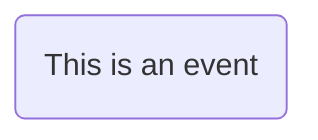

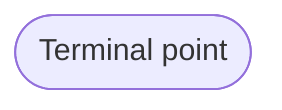

```mermaid
flowchart TD
    A@{ shape: subproc, label: "This is a subprocess" }
```

```mermaid
flowchart TD
    A@{ shape: cyl, label: "Database" }
```

```mermaid
flowchart TD
    A@{ shape: circle, label: "Start" }
```

```mermaid
flowchart TD
    A@{ shape: odd, label: "Odd shape" }
```

```mermaid
flowchart TD
    A@{ shape: diamond, label: "Decision" }
```

```mermaid
flowchart TD
    A@{ shape: hex, label: "Prepare conditional" }
```

```mermaid
flowchart TD
    A@{ shape: lean-r, label: "Input/Output" }
```

```mermaid
flowchart TD
    A@{ shape: lean-l, label: "Output/Input" }
```

```mermaid
flowchart TD
    A@{ shape: trap-b, label: "Priority action" }
```

```mermaid
flowchart TD
    A@{ shape: trap-t, label: "Manual operation" }
```

```mermaid
flowchart TD
    A@{ shape: dbl-circ, label: "Stop" }
```

```mermaid
flowchart TD
    A@{ shape: text, label: "This is a text block" }
```

```mermaid
flowchart TD
    A@{ shape: notch-rect, label: "Card" }
```

```mermaid
flowchart TD
    A@{ shape: lin-rect, label: "Lined process" }
```

```mermaid
flowchart TD
    A@{ shape: sm-circ, label: "Small start" }
```

```mermaid
flowchart TD
    A@{ shape: framed-circle, label: "Stop" }
```

```mermaid
flowchart TD
    A@{ shape: fork, label: "Fork or Join" }
```

```mermaid
flowchart TD
    A@{ shape: hourglass, label: "Collate" }
```

```mermaid
flowchart TD
    A@{ shape: comment, label: "Comment" }
```

```mermaid
flowchart TD
    A@{ shape: brace-r, label: "Comment" }
```

```mermaid
flowchart TD
    A@{ shape: braces, label: "Comment" }
```

```mermaid
flowchart TD
    A@{ shape: bolt, label: "Communication link" }
```

```mermaid
flowchart TD
    A@{ shape: doc, label: "Document" }
```

```mermaid
flowchart TD
    A@{ shape: delay, label: "Delay" }
```

```mermaid
flowchart TD
    A@{ shape: das, label: "Direct access storage" }
```

```mermaid
flowchart TD
    A@{ shape: lin-cyl, label: "Disk storage" }
```

```mermaid
flowchart TD
    A@{ shape: curv-trap, label: "Display" }
```

```mermaid
flowchart TD
    A@{ shape: div-rect, label: "Divided process" }
```

```mermaid
flowchart TD
    A@{ shape: tri, label: "Extract" }
```

```mermaid
flowchart TD
    A@{ shape: win-pane, label: "Internal storage" }
```

```mermaid
flowchart TD
    A@{ shape: f-circ, label: "Junction" }
```

```mermaid
flowchart TD
    A@{ shape: lin-doc, label: "Lined document" }
```

```mermaid
flowchart TD
    A@{ shape: notch-pent, label: "Loop limit" }
```

```mermaid
flowchart TD
    A@{ shape: flip-tri, label: "Manual file" }
```

```mermaid
flowchart TD
    A@{ shape: sl-rect, label: "Manual input" }
```

```mermaid
flowchart TD
    A@{ shape: docs, label: "Multiple documents" }
```

```mermaid
flowchart TD
    A@{ shape: processes, label: "Multiple processes" }
```

```mermaid
flowchart TD
    A@{ shape: flag, label: "Paper tape" }
```

```mermaid
flowchart TD
    A@{ shape: bow-rect, label: "Stored data" }
```

```mermaid
flowchart TD
    A@{ shape: cross-circ, label: "Summary" }
```

```mermaid
flowchart TD
    A@{ shape: tag-doc, label: "Tagged document" }
```

```mermaid
flowchart TD
    A@{ shape: tag-rect, label: "Tagged process" }
```

## Special Shapes: Icon

ATOM: The `icon` shape includes an icon from a registered icon pack in the flowchart node, using syntax: `A@{ icon: "fa:user", form: "square", label: "User Icon", pos: "t", h: 60 }`
TYPE: command
SOURCE: flowchart.md:Icon Shape

ATOM: Icon packs must be registered before use; see Mermaid icon configuration docs.
TYPE: constraint
SOURCE: flowchart.md:Icon Shape

```mermaid
flowchart TD
    A@{ icon: "fa:user", form: "square", label: "User Icon", pos: "t", h: 60 }
```

### Icon Parameters

| Parameter | Required | Description | Values |
|---|---|---|---|
| `icon` | Yes | Icon name from registered icon pack | e.g., `"fa:user"` |
| `form` | No | Background shape behind the icon; if omitted, no background is rendered | `square`, `circle`, `rounded` |
| `label` | No | Text label for the icon; if omitted, no label is displayed | any string |
| `pos` | No | Position of the label relative to the icon; defaults to bottom | `t` (top), `b` (bottom) |
| `h` | No | Height of the icon in pixels; defaults to 48 (minimum) | integer |

## Special Shapes: Image

ATOM: The `image` shape embeds an image in a flowchart node, using syntax: `A@{ img: "https://example.com/image.png", label: "Image Label", pos: "t", w: 60, h: 60, constraint: "off" }`
TYPE: command
SOURCE: flowchart.md:Image Shape

```text
flowchart TD
    A@{ img: "https://example.com/image.png", label: "Image Label", pos: "t", w: 60, h: 60, constraint: "off" }
```

ATOM: To resize an image while preserving aspect ratio, set `h` and `constraint: "on"`; the width adjusts automatically.
TYPE: pattern
SOURCE: flowchart.md:Image Shape

```mermaid
flowchart TD
    A@{ img: "https://mermaid.js.org/favicon.svg", label: "My example image label", pos: "t", h: 60, constraint: "on" }
```

### Image Parameters

| Parameter | Required | Description | Values |
|---|---|---|---|
| `img` | Yes | URL of the image to display | any valid URL string |
| `label` | No | Text label for the image; if omitted, no label is displayed | any string |
| `pos` | No | Position of the label relative to the image; defaults to bottom | `t` (top), `b` (bottom) |
| `w` | No | Width of the image in pixels; defaults to the natural width | integer |
| `h` | No | Height of the image in pixels; defaults to the natural height | integer |
| `constraint` | No | Whether the image constrains the node size and maintains aspect ratio; defaults to `"off"` | `"on"`, `"off"` |

## Warnings and Constraints

ATOM: Using the word "end" in all lowercase as a node name will break the flowchart; capitalize at least one letter (e.g., "End", "END") or use the workaround from GitHub issue #1444.
TYPE: error
SOURCE: flowchart.md:Flowcharts - Basic Syntax

ATOM: Using "o" or "x" as the first letter of a connecting node (e.g., `A---oB`) will create a circle edge or cross edge respectively; add a space before the letter or capitalize it (e.g., `dev--- ops`, `dev---Ops`).
TYPE: error
SOURCE: flowchart.md:Flowcharts - Basic Syntax

ATOM: `flowchart` and `graph` keywords are interchangeable for declaring a flowchart.
TYPE: command
SOURCE: flowchart.md:A node (default)

## References

SOURCE: [Mermaid Flowchart Docs](https://github.com/mermaid-js/mermaid/blob/develop/packages/mermaid/src/docs/syntax/flowchart.md) (accessed 2026-03-07)
