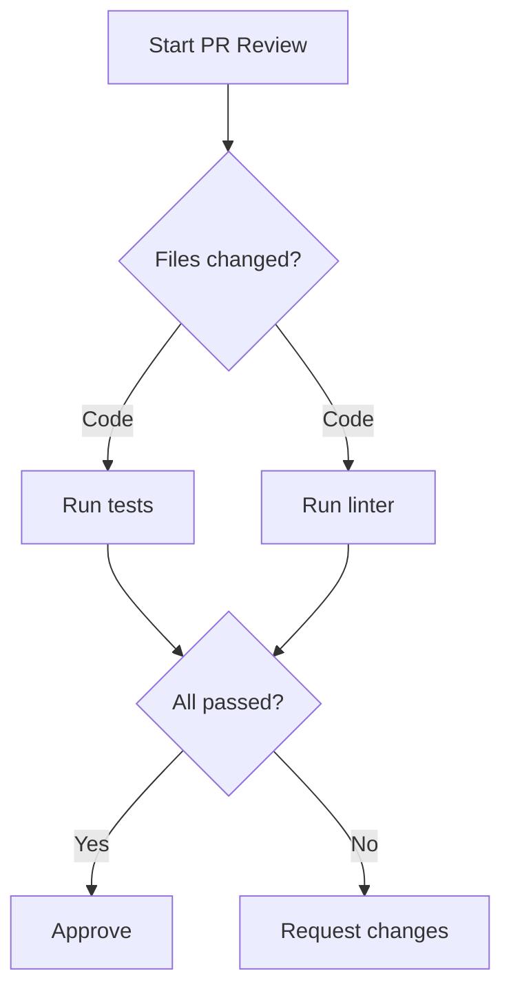

# Prompt Optimization for Claude 4.5

 

Transform negative instructions into positive patterns following Anthropic's official best practices. Optimize CLAUDE.md files and Skills for Claude Code CLI using evidence-based prompt engineering techniques tailored for Claude 4.5 models.

## Features

- **Positive Framing** - Convert prohibitions (NEVER/DON'T) into actionable alternatives
- **Specificity Guidance** - Transform vague instructions into concrete, measurable behaviors
- **Motivation Annotations** - Add "Reason:" explanations to improve generalization
- **Multishot Examples** - Structure examples using `<example>` tags for consistency
- **Claude 4.5 Optimizations** - Leverage parallel tool usage, concise communication, and extended thinking
- **Compression Techniques** - Reduce token count while preserving compliance
- **Verification Checklists** - Validate optimizations against best practices

## Installation

### Prerequisites

- Claude Code CLI version 2.1 or later
- Git (for cloning the plugin)

### Install Plugin

```bash
# Method 1: Manual installation
git clone https://github.com/yourusername/prompt-optimization-claude-45 ~/.claude/plugins/prompt-optimization-claude-45
cc plugin reload

# Method 2: Project-scoped installation
git clone https://github.com/yourusername/prompt-optimization-claude-45 .claude/plugins/prompt-optimization-claude-45
```

## Quick Start

Activate the skill when reviewing or creating CLAUDE.md files or Skills:

```
@prompt-optimization-claude-45

Review this CLAUDE.md for optimization opportunities:
[paste your CLAUDE.md content]
```

Claude will automatically analyze and suggest transformations following Anthropic's best practices.

## Core Principles

### 1. Positive Framing Over Prohibitions

Models attend to key nouns/concepts even in negative statements. "NEVER use cat" still activates "use cat" concept.

| Instead of | Write |
|------------|-------|
| "Never use X" | "Use Y instead [because reason]" |
| "Don't include X" | "Include only Y" |
| "Avoid X" | "Prefer Y because Z" |

### 2. Be Specific Over Vague

From Anthropic's memory best practices: "Use 2-space indentation" > "Format code properly"

### 3. Provide Context and Motivation

Brief "Reason:" annotations help Claude generalize to edge cases.

### 4. Structure with Markdown Headings

Group related instructions under descriptive headings for better attention allocation.

### 5. Front-Load Priorities

Critical instructions placed early receive more attention during generation.

### 6. Use Examples for Complex Behaviors

3-5 diverse examples in `<example>` tags dramatically improve accuracy.

## Usage

The skill activates automatically when you:

- Review or create CLAUDE.md files
- Optimize existing Skills (SKILL.md)
- Convert prohibition lists into positive patterns
- Add motivation to unmotivated rules
- Structure unorganized instructions

### Manual Activation

```
Skill(command: "prompt-optimization-claude-45")
```

### Typical Workflow

1. **Identify** - Scan for prohibition markers (NEVER, DON'T, ❌)
2. **Extract** - Determine desired behavior: "What SHOULD Claude do?"
3. **Motivate** - Add brief "Reason:" annotations
4. **Exemplify** - Provide 2-3 concrete examples
5. **Structure** - Group under descriptive headings
6. **Verify** - Check against optimization checklist

## Key Transformations

### Before: Prohibition List

```markdown
## FORBIDDEN ACTIONS
❌ NEVER use bare python commands
❌ NEVER use cat, head, tail, sed, awk
❌ NEVER state timelines or estimates
```

### After: Positive Tool Table

```markdown
## Tool Selection
| Operation | Tool | Reason |
|-----------|------|--------|
| Run Python | `Bash(uv run ...)` | Manages venv and dependencies |
| Read files | `Read()` | Handles encoding and large files |
| Search files | `Grep()` | Structured matches with context |

## Communication Style
- Lead with observations and findings
- State facts directly
- Acknowledge dependencies when uncertain about duration
```

## Claude 4.5 Specific Optimizations

### Parallel Tool Usage

Structure instructions to enable simultaneous tool calls:

```markdown
## Research Tasks
When investigating an issue:
1. Search codebase for related patterns (Grep)
2. Read relevant configuration files (Read)
3. Check test files for expected behavior (Glob + Read)

Execute independent operations simultaneously for efficiency.
```

### Direct Action Language

Claude 4.5 follows instructions precisely. Be explicit:

| Indirect | Direct |
|----------|--------|
| "Can you suggest changes?" | "Make these changes" |
| "It might be good to..." | "Implement this feature" |

### Extended Thinking Guidance

For complex reasoning tasks:

```markdown
## Complex Analysis
For multi-step problems, think through the full approach before acting.
Consider multiple solutions and select the most robust.
Verify your solution with test cases before declaring complete.
```

## Compression Techniques

When CLAUDE.md or Skill files grow too large, apply density optimizations:

### Phrase Transformations

| Verbose | Compressed |
|---------|------------|
| "You might want to" | Direct imperative |
| "Consider doing X when Y" | "IF Y THEN X" |
| "It's important to remember" | "CONSTRAINT:" |

### Structural Templates

```text
## [Protocol Name]

TRIGGER: [When this applies]

PROCEDURE:
1. [Action]
2. [Action]
3. [Action]

CONSTRAINTS:
- [Required behavior]
- [Required behavior]

OUTPUT: [Expected deliverable]
```

### Mermaid Diagrams for Complex Flows

For workflows with parallel execution and conditional paths, Mermaid diagrams encode logic more clearly than prose:



## Verification Checklist

After optimization, verify:

- [ ] Prohibition markers (NEVER, DON'T, ❌) are used only with explicit absolute examples
- [ ] Each instruction states what TO do
- [ ] Key behaviors have motivations (Reason:)
- [ ] Complex behaviors have 2-3 examples
- [ ] Instructions grouped under descriptive headings
- [ ] Critical behaviors appear early
- [ ] Specific over vague ("2-space indent" not "format properly")
- [ ] Action language is direct ("Make changes" not "Consider making")

## Reference Documentation

The skill includes comprehensive reference materials:

- **[Skill Reference](./docs/skill-reference.md)** - Complete skill documentation
- **[Examples](./docs/examples.md)** - Concrete before/after transformations
- **[References](./docs/references.md)** - Supporting documentation files

### Additional Files

- **context-windows.md** - Token budget management strategies
- **whats-new-claude-4.5.md** - Claude 4.5 model capabilities and changes
- **references/accessing_online_resources.md** - Web resource access patterns

## Troubleshooting

### Skill Not Activating

**Problem**: Claude doesn't use the skill when reviewing CLAUDE.md

**Solution**: Be explicit in your request:
```
@prompt-optimization-claude-45 Review this CLAUDE.md for optimization opportunities
```

### Over-Compression

**Problem**: Compressed instructions reduce compliance

**Solution**: Balance compression with clarity. Keep:
- Exact technical specifications
- 2-3 key examples (not zero)
- Brief motivation annotations

### Too Many Prohibitions Remaining

**Problem**: Still finding NEVER/DON'T after optimization

**Solution**: For each prohibition, ask "What SHOULD Claude do instead?" and replace with positive alternative.

## Contributing

Contributions welcome! When submitting improvements:

1. Follow the skill's own optimization principles
2. Cite Anthropic documentation for new patterns
3. Provide before/after examples
4. Test optimizations on real CLAUDE.md files

## Sources

This skill is based on official Anthropic documentation:

- [Be clear and direct](https://platform.claude.com/docs/en/build-with-claude/prompt-engineering/be-clear-and-direct.md)
- [Use examples (multishot prompting)](https://platform.claude.com/docs/en/build-with-claude/prompt-engineering/multishot-prompting.md)
- [Use XML tags to structure prompts](https://platform.claude.com/docs/en/build-with-claude/prompt-engineering/use-xml-tags.md)
- [Long context tips](https://platform.claude.com/docs/en/build-with-claude/prompt-engineering/long-context-tips.md)
- [Extended thinking tips](https://platform.claude.com/docs/en/build-with-claude/prompt-engineering/extended-thinking-tips.md)
- [What's new in Claude 4.5](https://platform.claude.com/docs/en/about-claude/models/whats-new-claude-4-5.md)
- [Claude Code: Agent Skills](https://code.claude.com/docs/en/skills.md)

## License

Please add a LICENSE file to specify usage terms.

## Credits

Created for Claude Code CLI based on Anthropic's prompt engineering best practices and real-world optimization experience.
