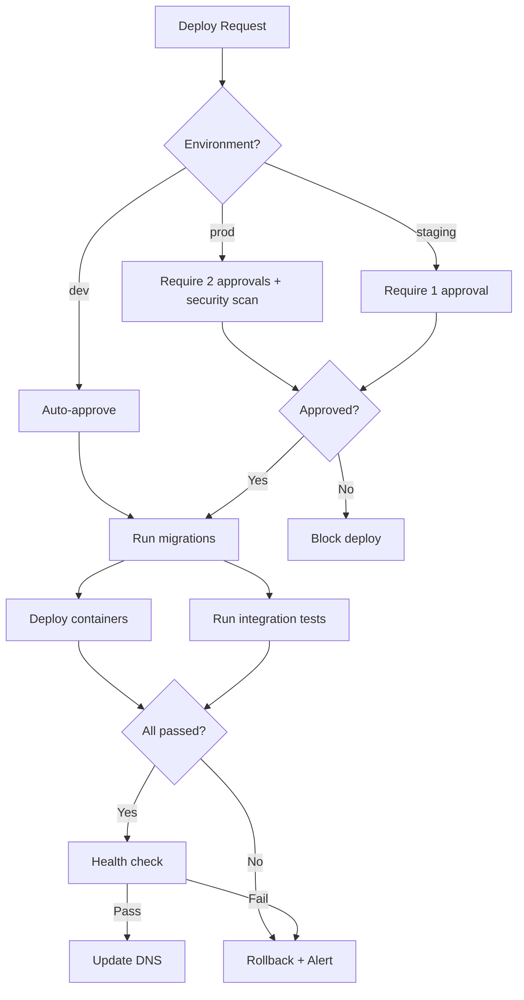

# Usage Examples

Concrete before/after examples demonstrating prompt optimization transformations.

---

## Example 1: Converting Prohibition Lists

**Scenario**: A CLAUDE.md file contains a list of forbidden actions that repeatedly mention the tools we want to avoid.

**Before (Prohibition Pattern)**:

```markdown
## FORBIDDEN ACTIONS

❌ NEVER use bare python commands
❌ NEVER use cat, head, tail, sed, awk
❌ NEVER use echo for file writing
❌ NEVER state timelines or estimates
❌ NEVER use performative gratitude
```

**Problem**: Every prohibition activates the concept we're trying to avoid. "NEVER use cat" still makes the model think about "use cat".

**After (Positive Pattern)**:

```markdown
## Tool Selection

| Operation | Tool | Reason |
|-----------|------|--------|
| Run Python | `Bash(uv run ...)` | Manages venv and dependencies automatically |
| Read files | `Read()` | Handles encoding, large files, binary detection |
| Search files | `Grep()` | Returns structured matches with context |
| Write files | `Write()` | Atomic writes, preserves permissions |

## Communication Style

- Lead with observations and findings
- State facts directly
- Acknowledge dependencies when uncertain about duration
```

**Result**: Instructions focus on what TO do, with clear motivation. No activation of forbidden concepts.

---

## Example 2: Adding Specificity

**Scenario**: Vague quality instructions lead to inconsistent interpretation across different contexts.

**Before (Vague Instructions)**:

```markdown
## Code Quality

Write good code and handle errors properly. Use clear variable names.
Format code correctly according to best practices.
```

**Problem**: Terms like "good", "properly", "clear", "correctly" are subjective and inconsistent.

**After (Specific Instructions)**:

```markdown
## Code Standards

**Error Handling**: Catch exceptions only when you have a specific recovery action. Let all other errors propagate to surface issues early.

<example>
# Good: specific recovery action
try:
    return db.query(User, id)
except ConnectionError:
    return cache.get(f"user:{id}")

# Good: let errors propagate
def process(data):
    return transform(data)  # Errors surface naturally
</example>

**Variable Naming**: Use descriptive names that reveal intent:
- Functions: verb_noun (`calculate_total`, `fetch_user`)
- Variables: noun or adjective_noun (`user`, `active_connections`)
- Booleans: is/has prefix (`is_valid`, `has_permission`)

**Formatting**: Use 2-space indentation for all code blocks.
```

**Result**: Concrete, measurable specifications with examples. No ambiguity.

---

## Example 3: Adding Motivation

**Scenario**: Rules without explanation are brittle—Claude won't generalize to edge cases not explicitly covered.

**Before (Unmotivated Rules)**:

```markdown
## Project Setup

Always use conventional commits.
Run tests before committing.
Use branch names starting with your username.
```

**Problem**: No understanding of WHY these rules exist. Won't adapt to exceptions or edge cases.

**After (Motivated Rules)**:

```markdown
## Project Setup

**Commit Messages**: Use conventional commits format: `type(scope): description`

**Reason**: Enables automated changelog generation and semantic versioning. CI/CD pipeline parses commit types for release automation.

Types: `feat` (minor bump), `fix` (patch bump), `docs`, `style`, `refactor`, `test`, `chore`

**Testing**: Run full test suite before committing.

**Reason**: Catches regressions early. Pre-commit hook blocks commits with failing tests.

**Branch Naming**: Format: `username/type/short-description`

**Reason**: Identifies branch owner quickly. CI permissions are username-based.

<example>
alice/feat/oauth-integration
bob/fix/null-pointer-api
charlie/docs/update-readme
</example>
```

**Result**: Clear understanding of purpose enables generalization to new situations.

---

## Example 4: Structuring with Examples

**Scenario**: Abstract pattern descriptions without examples lead to inconsistent application.

**Before (Abstract Description)**:

```markdown
## API Design

Design RESTful endpoints following best practices. Use appropriate HTTP methods for each operation. Include proper error responses.
```

**Problem**: "Best practices" is vague. What does "proper" mean?

**After (Multishot Examples)**:

```markdown
## API Design

RESTful endpoint patterns with appropriate HTTP methods:

<examples>
<example>
# List resources
GET /api/v1/users
Response: 200 OK with array

# Get single resource
GET /api/v1/users/123
Response: 200 OK with object, or 404 Not Found
</example>

<example>
# Create resource
POST /api/v1/users
Body: {name, email}
Response: 201 Created with Location header, or 400 Bad Request with validation errors
</example>

<example>
# Update resource
PUT /api/v1/users/123
Body: {name, email}
Response: 200 OK with updated object, 404 Not Found, or 400 Bad Request

# Partial update
PATCH /api/v1/users/123
Body: {email}
Response: 200 OK with updated object
</example>

<example>
# Delete resource
DELETE /api/v1/users/123
Response: 204 No Content, or 404 Not Found
</example>
</examples>

**Error Response Format**:
```json
{
  "error": {
    "code": "VALIDATION_ERROR",
    "message": "Invalid email format",
    "field": "email"
  }
}
```
```

**Result**: Clear patterns through diverse examples. Consistent application across endpoints.

---

## Example 5: Claude 4.5 Parallel Tool Usage

**Scenario**: Instructions structured sequentially prevent Claude 4.5 from firing multiple tools simultaneously.

**Before (Sequential Instructions)**:

```markdown
## Investigation Process

When debugging an issue:
1. First, search for error messages in the logs
2. Then, read the source file where the error occurred
3. Next, check the test files for expected behavior
4. Finally, review recent commits that touched this code
```

**Problem**: "First", "Then", "Next", "Finally" suggests sequential execution. Misses Claude 4.5's parallel capability.

**After (Parallel-Enabled Instructions)**:

```markdown
## Investigation Process

When debugging an issue, gather these data points:
1. Error message context from logs (Grep)
2. Source file implementation (Read)
3. Test file expectations (Glob + Read)
4. Recent commit history (Bash)

Execute independent operations simultaneously for efficiency.
Synthesize findings after all data is collected.
```

**Result**: Claude 4.5 fires all four operations in parallel, dramatically reducing investigation time.

---

## Example 6: Direct Action Language for Claude 4.5

**Scenario**: Indirect, polite language doesn't leverage Claude 4.5's instruction-following precision.

**Before (Indirect Language)**:

```markdown
## Code Review

When reviewing pull requests, you might want to consider checking for security issues. It would be great if you could suggest improvements to error handling. Can you also look at test coverage?
```

**Problem**: "might want to", "would be great if", "can you" are tentative. Claude 4.5 follows direct instructions better.

**After (Direct Language)**:

```markdown
## Code Review

When reviewing pull requests:

1. **Security Analysis**
   - Identify SQL injection risks
   - Check authentication bypass paths
   - Verify input validation

2. **Error Handling**
   - Ensure exceptions are caught with specific recovery actions
   - Verify error messages don't leak sensitive data

3. **Test Coverage**
   - Confirm new code has corresponding tests
   - Check edge cases are covered
```

**Result**: Direct imperatives leverage Claude 4.5's precise instruction following.

---

## Example 7: Compression for Large CLAUDE.md

**Scenario**: A CLAUDE.md file has grown to 800 lines, exceeding the 500-line target.

**Before (Verbose Protocol)**:

```markdown
## Drift Audit Updates

When you complete work that resolves any of the items in this audit, you should really make sure to update the file so everyone knows what's been done. First, you need to find the item in the file. Then you should change its status to resolved and add today's date. It would also be really helpful if you could add a note about which file you changed so other team members can verify the fix.
```

**Problem**: 67 words with filler phrases, indirect language, and no structure.

**After (Compressed Protocol)**:

```markdown
## Drift Audit Updates

TRIGGER: Resolved drift item X.Y

PROCEDURE:
1. Edit item X.Y: status → `✅ RESOLVED (YYYY-MM-DD)`
2. Add resolution evidence: file:line
3. Commit: `docs: resolve drift item X.Y`
```

**Result**: 28 words (58% reduction). All essential information preserved. Clear structure.

---

## Example 8: Mermaid Diagrams for Complex Workflows

**Scenario**: A deployment workflow with parallel jobs and conditional paths is difficult to describe clearly in prose.

**Before (Prose Description)**:

```markdown
## Deployment Workflow

When deploying, first check which environment. If it's production, require 2 approvals and run the security scan. If it's staging, only require 1 approval. For dev environments, auto-approve. After getting approval, run database migrations, then deploy the containers. Meanwhile, also run the integration tests. Once the containers are deployed and tests pass, run a health check. If the health check fails, roll back and alert oncall. If it passes, update the DNS to point to the new version.
```

**Problem**: "Meanwhile", "once", "if" create mental overhead. Hard to trace parallel paths and join conditions.

**After (Mermaid Diagram)**:

```markdown
## Deployment Workflow


```

**Result**: Exact logic encoded visually. Easy to trace paths and identify parallel execution.

---

## Example 9: Progressive Disclosure in Skills

**Scenario**: A code review skill has 300 lines of detailed checklists embedded in SKILL.md, making it hard to navigate.

**Before (Monolithic SKILL.md)**:

```markdown
---
name: code-reviewer
description: Review code for best practices, security, and bugs
---

# Code Review Skill

## Security Checklist

1. SQL injection: Check all database queries for parameterization...
   (50 lines of detailed security patterns)

## Performance Checklist

1. N+1 queries: Look for loops that make database calls...
   (50 lines of performance patterns)

## Error Handling Checklist

1. Exception specificity: Verify catches are specific...
   (50 lines of error handling patterns)

(continues for 300 lines)
```

**Problem**: SKILL.md is too long. All details loaded into context whether needed or not.

**After (Progressive Disclosure)**:

```markdown
---
name: code-reviewer
description: Review code for best practices, security issues, and potential bugs. Use when reviewing PRs, analyzing code quality, or checking implementations before merge.
allowed-tools: Read, Grep, Glob
---

# Code Review Skill

## Quick Checklist

1. **Security** - [See security.md](./references/security.md)
   - SQL injection risks
   - Authentication bypass
   - Input validation

2. **Performance** - [See performance.md](./references/performance.md)
   - N+1 queries
   - Memory leaks
   - Blocking operations

3. **Error Handling** - [See error-handling.md](./references/error-handling.md)
   - Exception specificity
   - Error message safety
   - Recovery actions

## Usage

Run full checklist for PRs. For focused reviews, reference specific detail files above.
```

**Files**:
- `references/security.md` (50 lines)
- `references/performance.md` (50 lines)
- `references/error-handling.md` (50 lines)

**Result**: SKILL.md is 30 lines. Detailed patterns loaded on demand. Context efficiency maintained.

---

## Example 10: Verification Checklist Application

**Scenario**: After optimizing a CLAUDE.md file, verify it meets all best practices.

**Optimized CLAUDE.md**:

```markdown
## Tool Selection

| Operation | Tool | Reason |
|-----------|------|--------|
| Run Python | `Bash(uv run ...)` | Manages venv and dependencies |
| Read files | `Read()` | Handles encoding, large files |
| Search files | `Grep()` | Structured matches with context |

## Error Handling

Catch exceptions only when you have a specific recovery action.

<example>
try:
    return db.query(User, id)
except ConnectionError:
    return cache.get(f"user:{id}")
</example>

## Communication Style

- Lead with observations
- State facts directly
- Acknowledge dependencies when uncertain

## Commit Messages

Use conventional commits: `type(scope): description`

**Reason**: Enables automated changelog and semantic versioning.

Types: `feat`, `fix`, `docs`, `refactor`
```

**Verification Checklist**:

- [x] ~~Prohibition markers~~ - None present (used positive patterns)
- [x] ~~States what TO do~~ - All instructions actionable ("Use", "Catch", "Lead with")
- [x] ~~Motivations present~~ - "Reason:" annotations on Tool Selection and Commit Messages
- [x] ~~Examples provided~~ - Error handling has concrete example
- [x] ~~Grouped under headings~~ - Tool Selection, Error Handling, Communication, Commits
- [x] ~~Critical early~~ - Tool Selection appears first (most important)
- [x] ~~Specific over vague~~ - "2-space indent" would be specific; current examples are concrete
- [x] ~~Direct action language~~ - "Use", "Catch", "Lead with" (direct imperatives)

**Result**: Passes all verification criteria. Ready for use.

---

## Quick Reference: Transformation Patterns

| Pattern | Problem | Solution |
|---------|---------|----------|
| "NEVER X" | Activates X concept | "Use Y instead" |
| "Don't do X" | Unclear alternative | "Do Y" with example |
| "Avoid X" | Vague guidance | "Prefer Y because Z" |
| "X is forbidden" | No positive action | Table mapping operations to tools |
| Long prohibition list | Cognitive overload | Positive tool/action table |
| Vague quality terms | Inconsistent results | Concrete examples |
| Missing motivation | Brittle compliance | "Reason:" annotations |
| Abstract patterns | Inconsistent application | 3-5 diverse examples |
| Sequential instructions | Misses parallelism | "Execute independent operations simultaneously" |
| Indirect language | Imprecise following | Direct imperatives |
| Monolithic skill | Context inefficiency | Progressive disclosure with links |
| Prose workflows | Hard to trace logic | Mermaid diagrams |

---

## Summary

These examples demonstrate the core transformations:

1. **Convert prohibitions** → Positive alternatives with reasons
2. **Replace vague terms** → Concrete specifications with examples
3. **Add motivations** → "Reason:" annotations for generalization
4. **Structure examples** → `<example>` tags with 3-5 diverse cases
5. **Enable parallelism** → Identify independent operations for Claude 4.5
6. **Use direct language** → Direct imperatives for precise following
7. **Compress verbosity** → Structural templates (TRIGGER/PROCEDURE/CONSTRAINTS)
8. **Visualize complexity** → Mermaid diagrams for workflows
9. **Progressive disclosure** → Main skill + linked reference files
10. **Verify optimization** → Checklist confirms best practices

Apply these patterns to transform your CLAUDE.md and Skill files into optimized, Claude 4.5-ready configurations.
