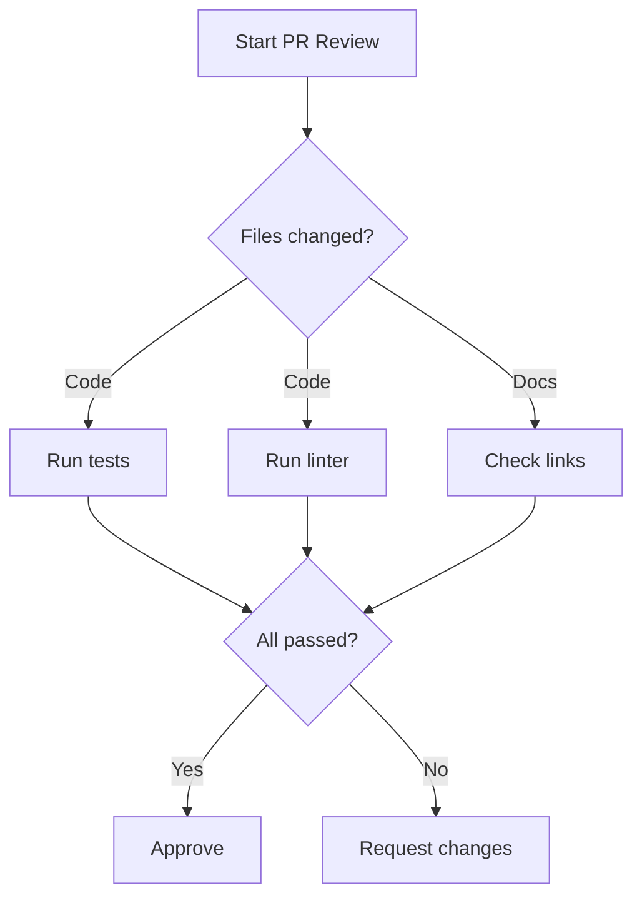

# Skill Reference

Complete documentation for the prompt-optimization-claude-45 skill.

## Overview

The prompt-optimization-claude-45 skill provides comprehensive guidance for optimizing CLAUDE.md files and Agent Skills for Claude Code CLI. It transforms negative instructions into positive patterns, adds motivation annotations, structures examples, and applies compression techniques—all following Anthropic's official prompt engineering best practices.

---

## Skill Metadata

**Location**: `skills/prompt-optimization-claude-45/SKILL.md`

**Name**: `prompt-optimization-claude-45`

**Description**:
> Optimize CLAUDE.md files and Skills for Claude Code CLI. Use when reviewing, creating, or improving system prompts, CLAUDE.md configurations, or Skill files. Transforms negative instructions into positive patterns following Anthropic's official best practices.

**User Invocable**: Yes (default)

**Allowed Tools**: All (inherits from session)

**Model**: Inherits from session

**Context**: Inline (runs in main conversation context)

---

## When to Use

Claude automatically activates this skill when:

- Reviewing existing CLAUDE.md files for optimization
- Creating new CLAUDE.md project instructions
- Optimizing Skill files (SKILL.md)
- Converting prohibition lists into positive patterns
- Adding motivation to unmotivated rules
- Structuring unorganized instructions
- Reducing token count through compression
- Applying Claude 4.5 specific optimizations

Keywords that trigger activation:
- "optimize prompt"
- "review CLAUDE.md"
- "improve skill"
- "transform prohibitions"
- "add motivation"
- "compress instructions"

---

## Activation

### Automatic (Model-Invoked)

Claude decides when to use this skill based on your request:

```
Review this CLAUDE.md for optimization opportunities
```

### Manual (User-Invoked)

Explicitly activate the skill:

```
@prompt-optimization-claude-45
```

Or via Skill tool:

```
Skill(command: "prompt-optimization-claude-45")
```

---

## Core Optimization Principles

The skill applies six evidence-based principles from Anthropic's research:

### 1. Positive Framing Over Prohibitions

**Why**: Models attend to key nouns/concepts even in negative statements. "NEVER use cat" still activates the "use cat" concept during generation. Negation requires an extra logical step that can get lost.

**How**: Replace prohibitions with actionable alternatives.

| Instead of | Write |
|------------|-------|
| "Never use X" | "Use Y instead [because reason]" |
| "Don't include X" | "Include only Y" |
| "Avoid X" | "Prefer Y because Z" |
| "X is forbidden" | "Use Y for this operation" |

### 2. Be Specific Over Vague

**Why**: Vague quality terms ("properly", "good", "correctly") lead to inconsistent interpretation across contexts.

**How**: Provide concrete, measurable specifications.

| Vague | Specific |
|-------|----------|
| "Format code properly" | "Use 2-space indentation for all code" |
| "Write good commit messages" | "Use conventional commits: `type(scope): description`" |
| "Handle errors correctly" | "Catch exceptions only when you have a specific recovery action" |

### 3. Provide Context and Motivation

**Why**: Claude generalizes better when it understands WHY a rule exists. Motivations help apply patterns to edge cases not explicitly covered.

**How**: Add brief "Reason:" annotations after key instructions.

```markdown
## Python Environment
Use `uv run` for all Python execution.
**Reason**: Manages virtual environments and dependencies automatically.
```

### 4. Structure with Markdown Headings

**Why**: Headings create semantic groupings that improve attention allocation during generation.

**How**: Group related instructions under descriptive headings formatted as bullets.

```markdown
## File Operations
- Read files with `Read()` tool (handles encoding, large files)
- Search patterns with `Grep()` tool (returns structured matches)
- Find files with `Glob()` tool (respects gitignore)
```

### 5. Front-Load Priorities

**Why**: Instructions placed early in context receive more attention due to positional bias in attention mechanisms.

**How**: Place critical behaviors at the top of CLAUDE.md or SKILL.md files.

### 6. Use Examples for Complex Behaviors

**Why**: 3-5 diverse, relevant examples (multishot prompting) dramatically improve accuracy and consistency for complex patterns.

**How**: Wrap examples in `<example>` tags for clear boundaries.

```markdown
<examples>
<example>
feat(auth): add OAuth2 support for GitHub login
</example>
<example>
fix(api): handle null response in user endpoint
</example>
</examples>
```

---

## CLAUDE.md Optimization Process

The skill guides you through a 5-step transformation process:

### Step 1: Identify Negative Patterns

Scan for prohibition markers:
- Keywords: "NEVER", "DON'T", "FORBIDDEN", "PROHIBITED", "AVOID", "DO NOT", "MUST NOT"
- Emoji markers: "❌", "⛔", "🚫"

### Step 2: Extract Desired Behavior

For each prohibition, ask: "What SHOULD Claude do instead?"

| Prohibition | Desired Behavior |
|-------------|------------------|
| "Never use bare python commands" | "Run Python with `uv run script.py`" |
| "Don't use cat, head, tail" | "Use `Read()` tool for file content" |
| "Never state timelines" | "Acknowledge dependencies when uncertain" |

### Step 3: Add Motivation

Provide brief reasons for non-obvious rules:

```markdown
## Tool Selection
| Operation | Tool | Reason |
|-----------|------|--------|
| Read files | `Read()` | Handles encoding, large files, binary detection |
| Search patterns | `Grep()` | Returns structured matches with context |
| Run Python | `Bash(uv run ...)` | Manages venv and dependencies correctly |
```

### Step 4: Provide Concrete Examples

Replace abstract descriptions with multishot examples:

```markdown
## Error Handling Pattern

Catch exceptions only when you have a specific recovery action:

<example>
def get_user(id):
    return db.query(User, id)  # Errors surface naturally

def get_user_with_fallback(id):
    try:
        return db.query(User, id)
    except ConnectionError:
        logger.warning("DB unavailable, using cache")
        return cache.get(f"user:{id}")  # Specific recovery
</example>
```

### Step 5: Structure with Headings

Organize instructions into logical groups:

```markdown
## Tool Usage
## Communication Style
## Code Standards
## Verification Process
## Project-Specific Context
```

---

## Claude 4.5 Specific Optimizations

### Direct Action Language

Claude 4.5 follows instructions precisely. Be explicit about actions:

| Indirect | Direct |
|----------|--------|
| "Can you suggest changes?" | "Make these changes" |
| "It might be good to..." | "Implement this feature" |
| "Consider adding..." | "Add X to Y" |

### Parallel Tool Usage

Claude 4.5 fires multiple tool calls simultaneously. Structure instructions to enable this:

```markdown
## Research Tasks
When investigating an issue:
1. Search codebase for related patterns (Grep)
2. Read relevant configuration files (Read)
3. Check test files for expected behavior (Glob + Read)

Execute independent operations simultaneously for efficiency.
```

### Concise Communication

Reinforce Claude 4.5's natural conciseness:

```markdown
## Response Style
- Lead with findings, not process descriptions
- State facts directly without hedging language
- Skip summaries after tool operations unless explicitly requested
- Provide code changes, not descriptions of changes
```

### Extended Thinking Guidance

For complex reasoning tasks:

```markdown
## Complex Analysis
For multi-step problems, think through the full approach before acting.
Consider multiple solutions and select the most robust.
Verify your solution with test cases before declaring complete.
```

---

## Skill File Optimization

### Description Field

The description is critical for skill discovery. Include both WHAT and WHEN:

```yaml
---
name: code-reviewer
description: Review code for best practices, security issues, and potential bugs. Use when reviewing PRs, analyzing code quality, or checking implementations before merge.
---
```

**Template**: `[Action 1], [Action 2]. Use when [situation 1], [situation 2], or when the user mentions [keywords].`

### Tool Restrictions

Use `allowed-tools` for focused skills:

```yaml
---
name: safe-file-reader
description: Read and search files without modifications. Use for code review or analysis tasks requiring read-only access.
allowed-tools: Read, Grep, Glob
---
```

### Progressive Disclosure

Keep SKILL.md focused. Reference supporting files for details using markdown links:

```markdown
# Code Review Skill

## Quick Checklist
1. Security vulnerabilities
2. Error handling
3. Performance concerns
4. Test coverage

For detailed patterns, see [patterns.md](./references/patterns.md).
For security checklist, see [security.md](./references/security.md).
```

---

## Compression Techniques

When CLAUDE.md or Skill files grow too large, apply these density optimizations judiciously—over-compression can reduce compliance.

### Phrase Transformations

| Verbose Pattern | Compressed Form |
|-----------------|-----------------|
| "You might want to" | Direct imperative |
| "Consider doing X when Y" | "IF Y THEN X" |
| "It's important to remember" | "CONSTRAINT:" |
| "One approach is to" | Numbered step |
| "For example, when X happens" | "IF X THEN [action]" |
| "Please make sure to" | Direct imperative |

### Removal Targets

Strip these elements when compressing:
- Greetings and sign-offs
- Meta-commentary about the document itself
- Motivational language ("Great job!", "You've got this!")
- Redundant restatements
- Background context (unless operationally necessary)
- Explanations of concepts Claude already knows

### Preservation Targets

Always keep:
- Exact technical specifications
- File paths and patterns
- Command syntax
- Decision logic flows
- Edge case conditions
- Concrete examples (compress to 2-3, not zero)
- Motivation for non-obvious rules (brief "Reason:" annotations)

### Structural Templates

**Simple Protocol (<50 lines):**

```text
## [Protocol Name]

TRIGGER: [When this applies]

PROCEDURE:
1. [Action]
2. [Action]
3. [Action]

CONSTRAINTS:
- [Required behavior]
- [Required behavior]

OUTPUT: [Expected deliverable]
```

### Density Techniques

- Use glob patterns: `**/*.{ts,js}` not "all TypeScript and JavaScript files"
- Use regex directly: `^ERROR:\s+` not "lines starting with ERROR followed by spaces"
- Reference patterns by name: "conventional commits" not full explanation
- Use tool names directly: `Read()`, `Grep()`, `Glob()`

### Mermaid Diagrams for Complex Flows

For workflows with parallel execution, conditions, and join points, Mermaid diagrams encode exact logic far more clearly than prose:



**Best for**:
- CI/CD pipelines with parallel jobs
- Approval workflows with multiple reviewers
- Error handling with rollback paths
- Any workflow requiring "meanwhile", "concurrently", or "wait for all"

**Why it works**: Claude can trace graph edges precisely. Prose requires mentally reconstructing the DAG.

### Length Targets

| Document Type | Target |
|---------------|--------|
| Single-purpose protocol | <50 lines |
| Agent task instructions | <100 lines |
| Complex workflow | <200 lines |
| Full CLAUDE.md | <500 lines |

### Compression vs. Compliance Tradeoff

**Over-compression risks**:
- Removing motivations reduces generalization to edge cases
- Stripping all examples reduces pattern matching accuracy
- Excessive terseness increases ambiguity

**Balance**: Compress structure and phrasing, preserve motivations and 2-3 key examples.

---

## Verification Checklist

After optimization, the skill verifies:

- [ ] Prohibition markers (NEVER, DON'T, ❌) used only with explicit absolute examples
- [ ] Each instruction states what TO do
- [ ] Key behaviors have motivations (Reason:)
- [ ] Complex behaviors have 2-3 examples
- [ ] Instructions grouped under descriptive headings
- [ ] Critical behaviors appear early
- [ ] Specific over vague ("2-space indent" not "format properly")
- [ ] Action language is direct ("Make changes" not "Consider making")

---

## Verification of Technical Terms

When encountering unique names, tool references, or technical jargon:

1. **NEVER Paraphrase** - Do not reword technical terms you haven't verified. Paraphrasing can break tool calls or mislead the AI.
2. **Verify Official Definitions** - Search for official documentation within Claude Code CLI context.
3. **Use Precise Terminology** - Once verified, use exact terminology from official sources.

**Example**:
- ❌ Incorrect: "Use the web summary tool to get page info" (paraphrased)
- ✅ Correct: "Use `WebFetch` to retrieve specific web content" (verified term)

---

## Reference Files

The skill includes progressive disclosure through reference files:

### context-windows.md
Token budget management strategies and context window optimization techniques.

**Location**: `skills/prompt-optimization-claude-45/context-windows.md`

### whats-new-claude-4.5.md
Claude 4.5 model capabilities, changes from previous versions, and optimization opportunities.

**Location**: `skills/prompt-optimization-claude-45/whats-new-claude-4.5.md`

### references/accessing_online_resources.md
Web resource access patterns for accurate data retrieval (symlinked from agent-orchestration plugin).

**Location**: `skills/prompt-optimization-claude-45/references/accessing_online_resources.md`

---

## Sources

This skill is based on official Anthropic documentation:

- [Be clear and direct](https://platform.claude.com/docs/en/build-with-claude/prompt-engineering/be-clear-and-direct.md)
- [Use examples (multishot prompting)](https://platform.claude.com/docs/en/build-with-claude/prompt-engineering/multishot-prompting.md)
- [Use XML tags to structure prompts](https://platform.claude.com/docs/en/build-with-claude/prompt-engineering/use-xml-tags.md)
- [Chain of thought prompting](https://platform.claude.com/docs/en/build-with-claude/prompt-engineering/chain-of-thought.md)
- [Chain complex prompts](https://platform.claude.com/docs/en/build-with-claude/prompt-engineering/chain-prompts.md)
- [Long context tips](https://platform.claude.com/docs/en/build-with-claude/prompt-engineering/long-context-tips.md)
- [Extended thinking tips](https://platform.claude.com/docs/en/build-with-claude/prompt-engineering/extended-thinking-tips.md)
- [What's new in Claude 4.5](https://platform.claude.com/docs/en/about-claude/models/whats-new-claude-4-5.md)
- [Claude Code: Agent Skills](https://code.claude.com/docs/en/skills.md)
- [Claude Code: Plugins reference](https://code.claude.com/docs/en/plugins-reference.md)
- [Anthropic blog: Prompt engineering best practices](https://www.claude.com/blog/best-practices-for-prompt-engineering)
