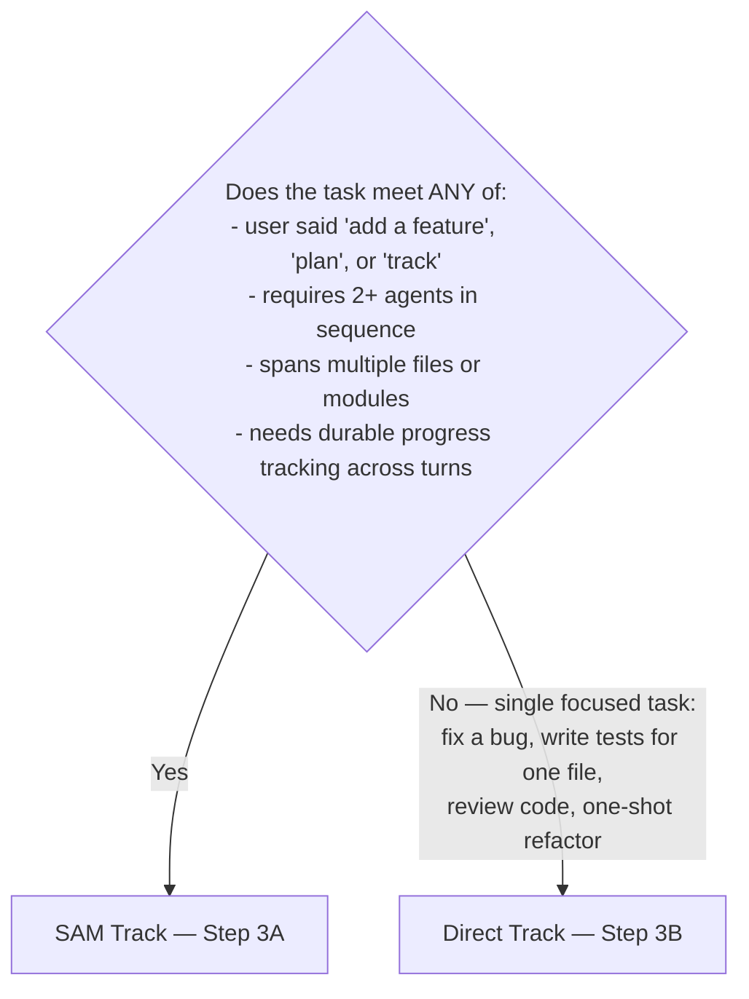
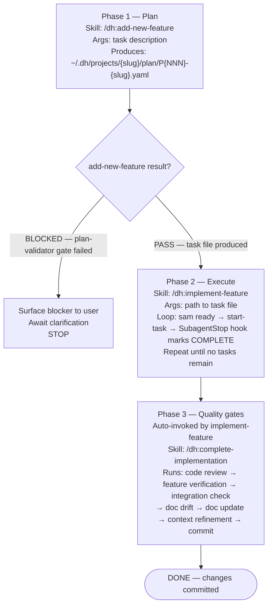

# Orchestrate

Multi-step engineering workflow command.

## Input

Task: $ARGUMENTS

If no argument is supplied, derive the task from the active conversation.

## Step 1 — Read the orchestration guide (MANDATORY)

Read `../python3-core/references/python-development-orchestration.md`.

Do not proceed to Step 2 until this file has been read. It contains agent selection criteria, workflow patterns, quality gates, and multi-agent chaining patterns needed for Step 2.

## Step 2 — Route to track



Then state aloud before the first Agent tool call:

```text
Task: <one sentence>
Track: SAM | Direct
Workflow pattern: <TDD | Feature Addition | Refactoring | Debugging | Code Review>
Agent chain: <AGENT1> → <AGENT2> → ...
```

If you cannot fill in workflow pattern and agent chain from the guide read in Step 1, go back and read it.

## Step 3A — SAM Track



### SAM task creation format (when creating tasks directly)

When `mcp__plugin_dh_sam__sam_create` is called directly (e.g., from `create-feature-task`):

```yaml
title: "<short imperative title>"
description: |
  <what must be true when this task is done>
acceptance_criteria:
  - Given <context>, when <action>, then <observable result>
phases:
  - name: <phase name>
    tasks:
      - <concrete subtask>
```

Update task status with `mcp__plugin_dh_sam__sam_update` as phases complete.

## Step 3B — Direct Track

Classify the task then delegate:

1. Classify the task: feature, refactor, review, debug, packaging, migration, or cleanup
2. Identify project lane: CLI, web, data, library, service, or legacy
3. Identify typing lane from repository constraints and dependencies
4. Choose the minimum set of specialist skills needed
5. Produce a concise execution plan
6. Execute or delegate in the smallest coherent units
7. Run deterministic checks before declaring completion

Agent routing — delegate rather than implement:

- Python code → subagent_type="python-engineering:python-cli-architect"
- Tests → subagent_type="python-engineering:python-pytest-architect"
- Code review → subagent_type="python-engineering:code-reviewer"
- Architecture design → subagent_type="python-engineering:python-cli-design-spec"
- Task breakdown → subagent_type="dh:swarm-task-planner"
- Stdlib-only script → Skill(skill: "python-engineering:python3-stdlib-only")

Each delegation must include:

- Outcomes: what must be true when the agent is done
- Constraints: user requirements, compatibility, scope boundaries
- Known issues: error messages already in context (pass-through, not pre-gathered)
- File paths: where to start looking — not what you found there

Do NOT read source files before delegating. Agents search and read files themselves — pass file paths, not file contents.

### Delegation Rules

- Use specialist skills for guidance
- Use subagents only when the task has separable parallelizable work or needs isolated analysis
- Do not duplicate routing already handled by `python3-core`
- Do not preload unrelated specialists

## Quality Gate

Before reporting done:

1. `uv run prek run --files <modified_files>` — runs linting, formatting, and type checking
   Fallback: `uv run ruff format` and `uv run ruff check --fix` only when no `.pre-commit-config.yaml`
2. `uv run pytest` — all pass, coverage ≥80%
3. Shebang validated on any scripts
