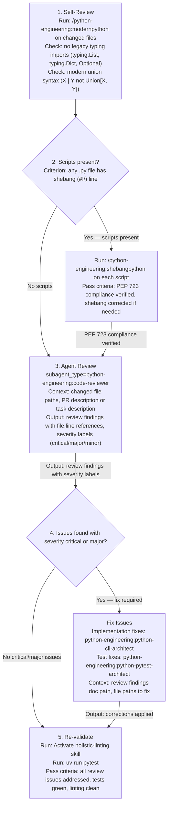
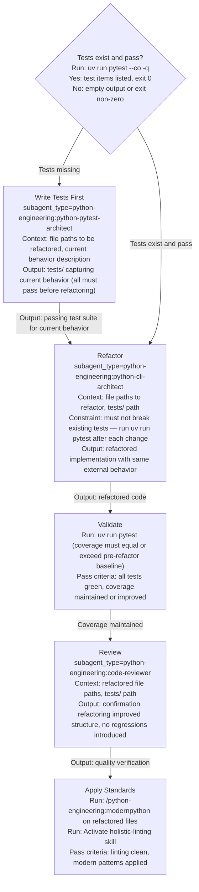
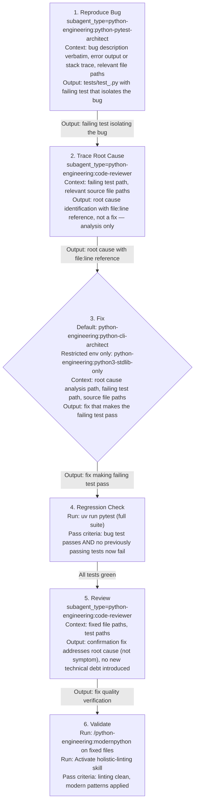
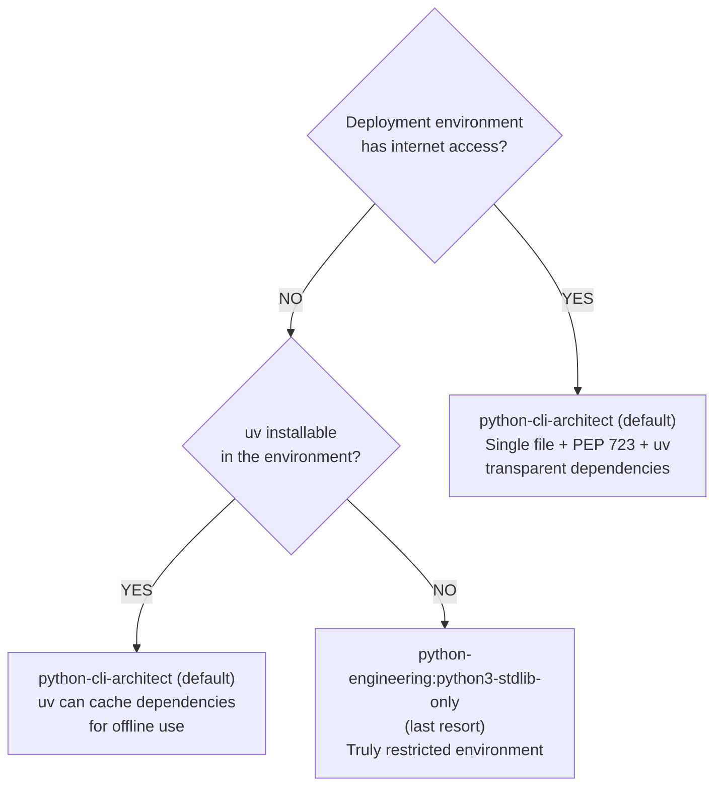

# Python Development Orchestration Guide

Comprehensive guide for orchestrating Python development tasks using specialized agents and commands.

**Quick Reference**: For a concise overview and quick-start examples, see `../SKILL.md`.

## Available Agents and Commands

### Agents (bundled in this plugin)

- **python-cli-architect** — Build modern CLI applications with Typer and Rich (DEFAULT for all Python code)
- **python-engineering:python3-stdlib-only** — Create stdlib-only portable scripts (LAST RESORT for confirmed restricted environments only)
- **python-pytest-architect** — Design comprehensive test suites
- **code-reviewer** — Review Python code for quality and standards
- **python-cli-design-spec** — Design system architecture
- **dh:swarm-task-planner** — Break down tasks into implementation plans

### Commands (in this skill: references/commands/)

- **/python-engineering:modernpython** — Apply Python 3.11+ best practices and modern patterns (reference guide, not automated tool)
- **/python-engineering:shebangpython** — Validate and correct PEP 723 shebang compliance (edits files directly)

- **/python-engineering:uv** — Package management with uv (always use for Python dependency management)

## Delegation Rule

**Context to include in the prompt** means: file paths, outcomes, and user requirements only. Do not pass file contents, summaries, or pre-gathered data — agents discover and read files themselves.

## Core Workflow Patterns

### 1. TDD Workflow (Test-Driven Development)

**When to use**: Building new features, fixing bugs with test coverage

Prose above the diagram carries detail that would clutter the nodes. Before delegating the Design step, verify whether the user has existing architecture docs — if yes, pass those paths instead of creating new architecture.

Before the Implement step, check whether the deployment environment is restricted (no internet, no uv). If yes, use `python-engineering:python3-stdlib-only` instead of `python-engineering:python-cli-architect`.

When the task involves display/output/interaction code, step 1.5 invokes `python-engineering:designing-ui-for-cli` to produce a user-confirmed shape brief before tests are written. The brief inputs the architecture's command tree and outputs surface design (colour strategy, status vocabulary, output hierarchy) that the architect references during step 3. In SAM track, this gate must run during the Plan phase (interactive with user); the Execute phase receives the confirmed brief as a file path — the shape-brief AskUserQuestion cannot block automated execution.

The adversarial design step reads the actual codebase, not the architecture spec, and challenges the approach against real code. It identifies gotchas, alternative approaches, and which specialist skills apply. Pass the architecture file path and affected module paths — the agent reads further from there. It produces a behavioral validation plan (Phases 1–3) that the architect receives alongside the implementation brief.

```mermaid
flowchart TD
    S1["1. Design<br>subagent_type=python-engineering:python-cli-design-spec<br>Context: user requirements, any existing codebase paths<br>Output: component interfaces, module layout, CLI command tree"]
    S2["2. Write Tests<br>subagent_type=python-engineering:python-pytest-architect<br>Context: architecture design file path<br>Output: tests/ directory with failing test suite"]
    S3{"3. Implement<br>Default: python-engineering:python-cli-architect<br>Restricted env only: python-engineering:python3-stdlib-only<br>Context: tests/ path, load python-engineering:typer-and-rich for python-cli-demo.py<br>Output: implementation that makes all tests pass"}
    S4["4. Review<br>subagent_type=python-engineering:code-reviewer<br>Context: implementation file paths, tests/ path<br>Output: review findings with file:line references, improvement suggestions"]
    S5["5. Validate<br>Run: /python-engineering:shebangpython on each script<br>Run: Activate holistic-linting skill<br>Run: uv run pytest (verify >80% coverage)<br>Check: CI config for additional validators<br>Pass criteria: all tests green, linting clean, coverage threshold met"]
    S1Q{"Display, output, or<br>interaction code in scope?"}
    S1B["1.5 UI Design<br>Skill: python-engineering:designing-ui-for-cli<br>Context: architecture file path, surfaces in scope<br>Output: shape brief (user-confirmed)"]
    S1 -->|"Output: interfaces, layout, CLI command tree"| S1Q
    S_AD["Adversarial Solution Design<br>subagent_type=python-engineering:adversarial-solution-design<br>Context: architecture file path, affected module paths<br>Output: solution brief + validation plan + TDD recommendation"]
    S1Q -->|"No"| S_AD
    S1Q -->|"Yes"| S1B
    S1B -->|"Output: confirmed shape brief"| S_AD
    S_AD -->|"Output: solution brief, validation plan"| S2
    S2 -->|"Output: tests/ with failing test suite"| S3
    S3 -->|"Output: implementation making all tests pass"| S4
    S4 -->|"Output: review findings, improvement list"| S5
```

**Example**:

<example>
User: "Build a CLI tool to process CSV files with progress bars"

1. Task is Design with subagent_type="python-engineering:python-cli-design-spec"
   Context to include in the prompt: Design architecture for CSV processing CLI with progress tracking
   Output: Architecture design file with component list, module layout, CLI command tree

2. Task is Write Tests with subagent_type="python-engineering:python-pytest-architect"
   Context to include in the prompt: Path to architecture design file from step 1
   Output: tests/ directory with failing test files

3. Task is Implement with subagent_type="python-engineering:python-cli-architect"
   Context to include in the prompt: tests/ path; instruct agent to load Skill(skill="python-engineering:typer-and-rich") for the python-cli-demo.py reference implementation
   Output: packages/ with implementation that makes all tests pass

4. Task is Review with subagent_type="python-engineering:code-reviewer"
   Context to include in the prompt: packages/ and tests/ file paths
   Output: Review findings with file:line references and improvement list

5. Validate
   /python-engineering:shebangpython packages/csv_processor.py
   Activate holistic-linting skill on packages/ tests/
   uv run pytest — verify all pass, coverage >80%
</example>

### 2. Feature Addition Workflow

**When to use**: Adding new functionality to existing codebase

Before delegating Requirements Gathering, read `git log --oneline -10` and pass the codebase path to the spec-analyst — do not summarize the codebase yourself.

```mermaid
flowchart TD
    S1["1. Requirements Gathering<br>subagent_type=spec-analyst<br>Context: codebase path, user request verbatim<br>Output: requirements doc with acceptance criteria"]
    S2["2. Architecture<br>subagent_type=python-engineering:python-cli-design-spec<br>Context: requirements doc path, existing codebase path<br>Output: design showing integration points with existing code"]
    S3["3. Implementation Planning<br>subagent_type=dh:swarm-task-planner<br>Context: architecture design path, existing test patterns path<br>Output: ordered task list with file targets and acceptance criteria per task"]
    S4{"4. Implement<br>Default: python-engineering:python-cli-architect<br>Restricted env only: python-engineering:python3-stdlib-only<br>Context: task list path, relevant existing file paths<br>Output: new feature implementation in packages/"}
    S5["5. Testing<br>subagent_type=python-engineering:python-pytest-architect<br>Context: new implementation paths, existing test patterns path<br>Output: tests for new feature + integration tests in tests/"]
    S6["6. Review<br>subagent_type=python-engineering:code-reviewer<br>Context: changed file paths, requirements doc path<br>Output: quality assessment against acceptance criteria, improvement list"]
    S7["7. Validate<br>Run: uv run pytest (verify no regressions, >80% coverage)<br>Run: Activate holistic-linting skill<br>Run: /python-engineering:modernpython on changed files<br>Pass criteria: all tests green, no regressions, linting clean"]
    S1 -->|"Output: requirements doc, acceptance criteria"| S2
    S2Q{"Display, output, or<br>interaction code in scope?"}
    S2B["2.5 UI Design<br>Skill: python-engineering:designing-ui-for-cli<br>Context: architecture file path, surfaces in scope<br>Output: shape brief (user-confirmed)"]
    S2 -->|"Output: design with integration points"| S2Q
    S2Q -->|"No"| S3
    S2Q -->|"Yes"| S2B
    S2B -->|"Output: confirmed shape brief"| S3
    S_AD2["Adversarial Solution Design<br>subagent_type=python-engineering:adversarial-solution-design<br>Context: implementation plan path, affected module paths<br>Output: solution brief + validation plan + TDD recommendation"]
    S3 -->|"Output: ordered task list with file targets"| S_AD2
    S_AD2 -->|"Output: solution brief, validation plan"| S4
    S4 -->|"Output: new feature implementation"| S5
    S5 -->|"Output: tests for new feature + integration tests"| S6
    S6 -->|"Output: quality assessment, improvement list"| S7
```

### 3. Code Review Workflow

**When to use**: Before merging changes, during PR review

The shebangpython step applies only when Python scripts are present. Decision criterion: check whether any `.py` files with a shebang line (`#!/`) exist in the changed set.

### 4. Refactoring Workflow

**When to use**: Improving code structure without changing behavior

Decision criterion for "Tests exist?": run `uv run pytest --co -q` — if output lists test items and exit code is 0, tests exist. If exit code is non-zero or output is empty, tests are missing.

### 5. Debugging Workflow

**When to use**: Investigating and fixing bugs

The Reproduce Bug step requires the bug description verbatim and any error output or stack trace. Pass these as file paths or inline in the prompt — do not summarize.

## Agent Selection Guide

### When to Use python-cli-architect

**Use when**:

- **DEFAULT choice for all Python scripts and CLI tools**
- Building command-line applications with rich user interaction
- Need progress bars, tables, colored output
- User-facing CLI tools and automation scripts
- Any script where UX matters (formatted output, progress feedback)
- PEP 723 + uv available (internet access present)

**Characteristics**:

- Uses Typer for CLI framework
- Uses Rich for terminal output
- Focuses on UX and polish
- PEP 723 makes dependencies transparent (single file)
- Better UX than stdlib alternatives
- Works anywhere with Python 3.11+ and internet access

**Complexity Advantage** (IMPORTANT):

- LESS development complexity — libraries handle argument parsing, output formatting, validation
- LESS code to write — Typer CLI boilerplate and Rich formatting come built-in
- Better UX — professional output with minimal effort
- Just as portable — PEP 723 + uv makes single-file scripts with dependencies work seamlessly

**This agent is EASIER to use than stdlib-only approaches. Choose this as the default unless portability restrictions exist.**

**Rich Width Handling**: For Rich Panel/Table width issues in CI/non-TTY environments, load `Skill(skill="python-engineering:typer-and-rich")` for complete solutions including the `get_rendered_width()` helper pattern.

**Example tasks**:

- "Build a CLI tool to manage database backups with progress bars"
- "Create an interactive file browser with color-coded output"
- "Create a script to scan git repositories and show status tree"
- "Build a deployment verification tool with progress bars"

### When to Use python-engineering:python3-stdlib-only

**LAST RESORT** — only for confirmed restricted environments. Ask user first if unclear.

**Use when**:

- **Restricted environment**: No internet access (airgapped, embedded systems)
- **No uv available**: Locked-down systems where uv cannot be installed
- **Hard stdlib-only requirement**: Explicitly requested by user
- **1% case**: Only when deployment environment truly restricts dependencies

**Activation**: `Skill(skill: "python-engineering:python3-stdlib-only")`

**Characteristics**:

- Stdlib only (argparse, pathlib, subprocess)
- Defensive error handling
- Cross-platform compatibility
- No PEP 723 needed — nothing to declare
- Use PEP 723 ONLY if adding external dependencies later
- Ask deployment environment questions before choosing this skill
- This is the EXCEPTION, not the rule

**Complexity Trade-off** (IMPORTANT):

- MORE development complexity — manual implementation of argument parsing, output formatting, validation, error handling
- MORE code to write — build from scratch what libraries provide tested
- Basic UX — limited formatting capabilities
- Maximum portability — the ONLY reason to choose this: runs anywhere Python exists without network access

**This skill is NOT simpler to use — it requires MORE work to build the same functionality. Choose it ONLY for portability, not for simplicity.**

**Note**: Only activate this skill if deployment environment restrictions are confirmed. With PEP 723 + uv, python-cli-architect is preferred for better UX. ASK: "Will this run without internet access or where uv cannot be installed?" See `PEP723.md` for details on when to use inline script metadata.

**Example tasks**:

- "Create a deployment script using only stdlib"
- "Build a config file validator that runs without dependencies"

## Agent Selection Decision Process

### For Scripts and CLI Tools

**Step 1: Default to python-cli-architect**

- Provides better UX (Rich components, progress bars, tables)
- PEP 723 + uv handles dependencies (still single file)
- Works in 99% of scenarios

**Step 2: Only use python-engineering:python3-stdlib-only if:**

- User explicitly states "stdlib only" requirement
- OR deployment environment is confirmed restricted:
  - No internet access (airgapped network, embedded system)
  - uv cannot be installed (locked-down corporate environment)
  - Security policy forbids external dependencies

**Step 3: When uncertain, ASK:**

1. "Where will this script be deployed?"
2. "Does the environment have internet access?"
3. "Can uv be installed in the target environment?"
4. "Is stdlib-only a hard requirement, or would you prefer better UX?"

**Decision Tree**:

If answers indicate normal environment: python-cli-architect

If answers indicate restrictions: python-engineering:python3-stdlib-only

**When in doubt**: Use python-cli-architect. PEP 723 + uv makes single-file scripts with dependencies just as portable as stdlib-only scripts for 99% of deployment scenarios.

### When to Use python-pytest-architect

**Use when**:

- Designing test suites from scratch
- Need comprehensive test coverage strategy
- Implementing advanced testing (property-based, mutation)
- Test architecture decisions

**Characteristics**:

- Modern pytest patterns
- pytest-mock exclusively (never unittest.mock)
- AAA pattern (Arrange-Act-Assert)
- Coverage and mutation testing

**Example tasks**:

- "Design test suite for payment processing module"
- "Create property-based tests for data validation"

### When to Use code-reviewer

**Use when**:

- Reviewing code for quality, patterns, standards
- Post-implementation validation
- Pre-merge code review
- Identifying improvement opportunities

**Characteristics**:

- Checks against modern Python standards
- Identifies anti-patterns
- Suggests improvements
- Validates against project patterns

**Example tasks**:

- "Review this PR for code quality"
- "Check if implementation follows best practices"

## Command Usage Patterns

### /python-engineering:modernpython

Reference guide for Python 3.11+ patterns and PEPs — load for context, not as an automated tool. Pass a file path to focus the guide: `/python-engineering:modernpython packages/mymodule.py`

### /python-engineering:shebangpython

Analyzes imports, corrects shebang, adds/removes PEP 723 metadata, sets execute bit. Apply to individual Python scripts: `/python-engineering:shebangpython scripts/deploy.py`

## Integration with uv Skill

**Always use uv skill for**:

- Package management: `uv add <package>`
- Running scripts: `uv run script.py`
- Running tools: `uv run pytest`, `uv run ruff`
- Creating projects: `uv init`

**Never use**:

- `pip install` (use `uv add`)
- `python -m pip` (use `uv`)
- `pipenv`, `poetry` (use `uv`)

## Quality Gates

**CRITICAL**: The orchestrator MUST instruct agents to use the holistic-linting skill for all code quality checks.

**Every Python development task must pass**:

1. **Code quality**: Activate holistic-linting skill for linting, formatting, and type checking workflows
2. **Tests**: `uv run pytest` (>80% coverage)
3. **Standards**: `/python-engineering:modernpython` for modern patterns
4. **Script compliance**: `/python-engineering:shebangpython` for standalone scripts

**For critical code** (payments, auth, security):

- Coverage: >95%
- Mutation testing: `uv run mutmut run`
- Security scan: `uv run bandit -r packages/`

**CI Compatibility**: After local checks pass, verify CI requirements are met by checking CI config files for additional validators.

## Reference Example

**Complete working example**: Load `Skill(skill="python-engineering:typer-and-rich")` to access `python-cli-demo.py`.

This file demonstrates all modern Python CLI patterns:

- PEP 723 inline script metadata with correct shebang
- Typer + Rich integration (Typer includes Rich, don't add separately)
- Modern Python 3.11+ patterns (StrEnum, Protocol, TypeVar, etc.)
- Proper type annotations with Annotated syntax
- Rich components (Console, Progress, Table, Panel)
- Async processing patterns
- Comprehensive docstrings

Use this as the reference implementation when creating CLI tools.

## Examples of Complete Workflows

Apply the Mermaid workflow diagrams above by substituting concrete file paths, task descriptions, and agent outputs. Each node in the diagram maps directly to one delegation step in the orchestrator's execution.

## Anti-Patterns to Avoid

### Don't: Write Python code as orchestrator

<eg>
❌ Orchestrator writes implementation directly
</eg>

### Do: Delegate to appropriate agent

<eg>
✅ Task is Implement with subagent_type="python-engineering:python-cli-architect" — writes implementation
✅ Task is Review with subagent_type="python-engineering:code-reviewer" — validates it
</eg>

### Don't: Skip validation steps

<eg>
❌ Implement → Done (no tests, no review, no linting)
</eg>

### Do: Follow complete workflow

<eg>
✅ Implement → Test → Review → Validate → Done
</eg>

### Don't: Mix agent contexts

<eg>
❌ Ask python-engineering:python3-stdlib-only to build Typer CLI
❌ Ask python-cli-architect to avoid all dependencies
</eg>

### Do: Choose correct agent for context

<eg>
✅ python-cli-architect for user-facing CLI tools
✅ python-engineering:python3-stdlib-only for stdlib-only scripts
</eg>

## Summary

**Orchestration = Coordination, Not Implementation**

1. Choose the right agent for the task
2. Provide clear inputs (file paths, not file contents)
3. Chain agents for complex workflows (architect → test → implement → review)
4. Always validate with quality gates
5. Use commands for standards checking
6. Integrate with uv skill for package management

**Success = Right agent + File paths as context + Validation gates passed**
