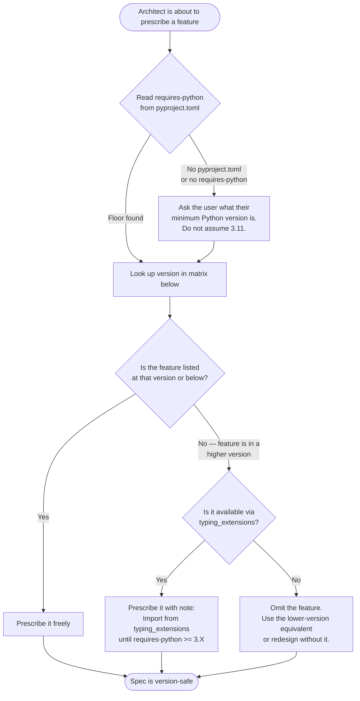

# Python Version Feature Matrix

Given a project's `requires-python` floor, this reference answers: "Which type system and
language features can I prescribe in an architecture spec?"

Read this before finalizing any type annotations, language patterns, or stdlib usage in a
design spec.

## Table of Contents

- [Decision Flowchart](#decision-flowchart)
- [Python 3.11 — Baseline](#python-311--baseline--our-minimum-supported-version)
- [Python 3.12](#python-312)
- [Python 3.13](#python-313)
- [Python 3.14 — Do Not Prescribe](#python-314--in-development--do-not-prescribe)
- [Backport Strategy via typing\_extensions](#backport-strategy-via-typing_extensions)
- [Anti-Patterns](#anti-patterns)

---

## Decision Flowchart



---

## Python 3.11 — Baseline — Our Minimum Supported Version

Any feature listed here may be prescribed without qualification for any project
with `requires-python >= ">=3.11"`.

### Type System

`Self` type (PEP 673) — use for fluent APIs and method chaining where a method returns the
same type as the class.

```python
from typing import Self

class Builder:
    def set_name(self, name: str) -> Self:
        self._name = name
        return self
```

`StrEnum` (PEP 663, stdlib `enum`) — use for finite string value sets such as status codes,
rule IDs, and category constants. Inherits from both `str` and `Enum`, so values compare
equal to plain strings.

```python
from enum import StrEnum

class Status(StrEnum):
    PENDING = "pending"
    COMPLETE = "complete"
    FAILED = "failed"
```

`ExceptionGroup` and `except*` syntax (PEP 654) — use for concurrent error handling where
multiple exceptions from async tasks must be caught and handled individually.

```python
try:
    async with asyncio.TaskGroup() as tg:
        tg.create_task(task_a())
        tg.create_task(task_b())
except* ValueError as eg:
    for exc in eg.exceptions:
        handle_value_error(exc)
```

Exception notes via `e.add_note()` (PEP 678) — use to enrich re-raised exceptions with
contextual information without replacing the original traceback.

```python
except FileNotFoundError as e:
    e.add_note(f"Searched path: {config_path}")
    raise
```

`TypeVarTuple` (PEP 646) — use for variadic generics when a function or class must preserve
the types of a heterogeneous sequence of arguments.

```python
from typing import TypeVarTuple, Unpack

Ts = TypeVarTuple("Ts")

def zip_apply(*fns: Unpack[Ts]) -> tuple[Unpack[Ts]]: ...
```

`LiteralString` (PEP 675) — use to prevent SQL injection and shell injection patterns by
requiring that a string argument be a literal or composed only from literals.

```python
from typing import LiteralString

def execute_query(sql: LiteralString) -> list[dict]: ...
```

`Never` type (PEP 655) — use for functions that unconditionally raise or loop forever,
enabling exhaustiveness checking in `match`/`if-elif` chains.

```python
from typing import Never

def assert_never(value: Never) -> Never:
    raise AssertionError(f"Unexpected value: {value}")
```

`Required` and `NotRequired` for TypedDict (PEP 655) — use to mark individual fields as
required or optional within a `TypedDict` without splitting it into two separate classes.

```python
from typing import TypedDict, Required, NotRequired

class Config(TypedDict):
    name: Required[str]
    timeout: NotRequired[int]
```

### Stdlib

`tomllib` — TOML reading from stdlib (`import tomllib`). Note: use `tomlkit` when the code
must also write or modify TOML, as `tomllib` is read-only. Only choose `tomllib` in
stdlib-only environments.

`asyncio.TaskGroup` — structured concurrency that ensures all tasks in the group are
awaited and any exceptions are collected into an `ExceptionGroup`.

```python
async with asyncio.TaskGroup() as tg:
    result_a = tg.create_task(fetch_a())
    result_b = tg.create_task(fetch_b())
```

`datetime.UTC` — alias for `datetime.timezone.utc`. Use `datetime.now(UTC)` instead of
`datetime.utcnow()` (deprecated since 3.12).

### Patterns

`match`-`case` — available since 3.10, fully mature and recommended from 3.11. Prescribe
freely for structural pattern matching, enum dispatch, and exhaustiveness checking.

Builtin generic types in annotations — `list[str]`, `dict[str, int]`, `tuple[int, ...]`,
`set[str]`, `type[T]`, and `X | None` are available since 3.10 and are the standard form
from 3.11 onward. Do not prescribe `typing.List`, `typing.Dict`, `typing.Optional`, or
`typing.Union` at any version — they are deprecated since 3.10.

---

## Python 3.12

Prescribe these features only when `requires-python >= ">=3.12"`, or via `typing_extensions`
backport where noted.

### Type System

Native generic class syntax (PEP 695) — `class Queue[T]:` replaces `TypeVar("T")` combined
with `Generic[T]`. Cleaner and more readable, but requires 3.12.

```python
# 3.12+ only — do not prescribe for 3.11 floor
class Queue[T]:
    def push(self, item: T) -> None: ...
    def pop(self) -> T: ...
```

`type` statement for type aliases (PEP 695) — `type Vector = list[float]` replaces
`Vector: TypeAlias = list[float]`. Requires 3.12.

```python
# 3.12+ only
type Vector = list[float]
type Matrix = list[Vector]
```

`@override` decorator (PEP 698) — marks methods that are intended to override a parent
method. Type checkers emit an error if the parent does not have a matching method.
Available via `typing_extensions` for 3.11 floors.

```python
from typing import override  # stdlib 3.12+
# from typing_extensions import override  # for 3.11 floor

class Child(Parent):
    @override
    def process(self, value: str) -> str: ...
```

`Unpack[TypedDict]` for typed `**kwargs` (PEP 692) — express the full type of `**kwargs`
using a `TypedDict`. Available via `typing_extensions` for 3.11 floors.

```python
from typing import TypedDict, Unpack  # stdlib 3.12+
# from typing_extensions import TypedDict, Unpack  # for 3.11 floor

class Options(TypedDict):
    timeout: int
    retries: int

def connect(**kwargs: Unpack[Options]) -> None: ...
```

### Stdlib

`itertools.batched(iterable, n)` — yield successive non-overlapping chunks of length `n`.
Requires 3.12.

```python
from itertools import batched

for chunk in batched(records, 100):
    insert_batch(chunk)
```

`pathlib.Path.walk()` — recursive directory traversal. Replaces `os.walk()` with a
`pathlib`-native interface. Requires 3.12.

### Patterns

Improved f-string parsing (PEP 701) — f-strings may now contain any valid Python expression,
including nested quotes and multi-line expressions. This is a parser improvement; no import
required.

---

## Python 3.13

Prescribe these features only when `requires-python >= ">=3.13"`, or via `typing_extensions`
backport where noted.

### Type System

`TypeIs` (PEP 742) — bidirectional type narrowing. Replaces `TypeGuard` for most cases.
`TypeGuard` narrows only the positive (`if`) branch; `TypeIs` narrows both branches.
Available via `typing_extensions` for 3.11 and 3.12 floors.

```python
from typing import TypeIs  # stdlib 3.13+
# from typing_extensions import TypeIs  # for < 3.13 floor

def is_string_list(val: list[object]) -> TypeIs[list[str]]:
    return all(isinstance(x, str) for x in val)

def process(items: list[object]) -> None:
    if is_string_list(items):
        reveal_type(items)  # list[str]
    else:
        reveal_type(items)  # list[object]
```

`ReadOnly` for TypedDict items (PEP 705) — marks individual TypedDict fields as immutable
at the type-checker level. Available via `typing_extensions` for 3.11 and 3.12 floors.

```python
from typing import TypedDict, ReadOnly  # stdlib 3.13+
# from typing_extensions import TypedDict, ReadOnly  # for < 3.13 floor

class Config(TypedDict):
    name: ReadOnly[str]
    debug: bool
```

`@deprecated` decorator (PEP 702) — marks functions and classes as deprecated at the type
system level. Type checkers emit warnings at call sites. Available via `typing_extensions`
for 3.11 and 3.12 floors.

```python
from typing import deprecated  # stdlib 3.13+
# from typing_extensions import deprecated  # for < 3.13 floor

@deprecated("Use new_function() instead.")
def old_function() -> None: ...
```

Type parameter defaults (PEP 696) — `class Queue[T = str]:` specifies the default type when
the type parameter is not supplied. Available via `typing_extensions` for 3.11 and 3.12 floors.

```python
# typing_extensions backport available for < 3.13
from typing import TypeVar
T = TypeVar("T", default=str)  # typing_extensions form for 3.11/3.12
```

### Stdlib

`copy.replace(obj, **changes)` — generic shallow copy with field replacement. Works on
dataclasses, `namedtuple`, `datetime`, and any object implementing `__replace__`. Requires 3.13.

```python
from copy import replace

updated = replace(original_config, timeout=30)
```

`glob.translate(pattern)` — converts a glob pattern string into a compiled regular
expression. Requires 3.13.

---

## Python 3.14 — In Development — Do Not Prescribe

Features below are in development and subject to change before the final release.

Do not prescribe any 3.14-only feature in architecture specs unless the project's
`requires-python` explicitly targets `>=3.14`.

`TypeForm` (PEP 747, if accepted) — allows passing types as first-class values with type
safety. Not finalized; check What's New in Python 3.14 at release.

Template strings (PEP 750) — tagged string literals for safe string construction and
domain-specific embedded languages. Not finalized.

---

## Backport Strategy via `typing_extensions`

When the project floor is below the version where a feature was introduced natively, check
this table before omitting the feature.

The architect must note in the spec: `Import from typing_extensions until requires-python >= 3.X`

| Feature | Native version | Backport available |
|---|---|---|
| `Self` | 3.11 | `typing_extensions` — 3.10+ |
| `Never` | 3.11 | `typing_extensions` — 3.10+ |
| `Required` / `NotRequired` | 3.11 | `typing_extensions` — 3.10+ |
| `LiteralString` | 3.11 | `typing_extensions` — 3.10+ |
| `TypeVarTuple` / `Unpack` | 3.11 | `typing_extensions` — 3.10+ |
| `@override` | 3.12 | `typing_extensions` — 3.10+ |
| `Unpack[TypedDict]` for kwargs | 3.12 | `typing_extensions` — 3.10+ |
| `TypeVar` with `default=` | 3.13 | `typing_extensions` — 3.10+ |
| `TypeIs` | 3.13 | `typing_extensions` — 3.10+ |
| `ReadOnly` (TypedDict) | 3.13 | `typing_extensions` — 3.10+ |
| `@deprecated` | 3.13 | `typing_extensions` — 3.10+ |

Check the `typing_extensions` changelog at release time for newly backported features —
this table is accurate as of 2026-03-23.

---

## Anti-Patterns

The architect must NOT prescribe the following:

**Syntax requiring 3.12+ for a 3.11-floor project:**

```python
# WRONG for requires-python >= ">=3.11"
class Pair[T, U]:  # native generic syntax — 3.12+ only
    ...

type Callback = Callable[[str], None]  # type statement — 3.12+ only
```

**`TypeIs` from `typing` for a sub-3.13 floor:**

```python
# WRONG for requires-python >= ">=3.11"
from typing import TypeIs  # only exists in 3.13+

# CORRECT
from typing_extensions import TypeIs  # with note: until >= 3.13
```

**Deprecated legacy typing forms at any version:**

```python
# WRONG at any version — deprecated since 3.10
from typing import Optional, List, Dict, Union, Tuple

def process(items: List[str], mapping: Dict[str, int]) -> Optional[str]: ...

# CORRECT at any supported version
def process(items: list[str], mapping: dict[str, int]) -> str | None: ...
```

**Free-threaded patterns in production architecture:**

The free-threaded CPython build (`python3.13t`, PEP 703) is experimental. Do not prescribe
it for production architecture decisions regardless of the version floor.

---

SOURCE: <https://realpython.com/python313-new-features/> (accessed 2026-03-23),
Python official What's New docs (<https://docs.python.org/3/whatsnew/>),
typing_extensions documentation (<https://typing-extensions.readthedocs.io/en/latest/>),
PEP index (<https://peps.python.org/>)
