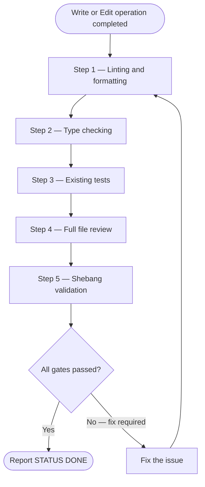

# Task Completion Quality Gate

Run every step below before reporting work complete after any Write or Edit operation.



## Step 1 — Linting and formatting

Detect which hook tool is installed, then run it on every modified file:

```bash
uv run --with prek prek run --files <modified_files>
```

Fallback to ruff only when no `.pre-commit-config.yaml` exists:

```bash
uv run --with ruff ruff format <files>
uv run --with ruff ruff check --fix <files>
```

Fix root causes directly — no `# noqa` suppressions.

### Ruff invocation contexts

```text
Within a project (pyproject.toml present):
  uv run ruff format <file>
  uv run ruff check --fix <file>

Standalone script (no project config):
  uvx ruff check --isolated --select "E,F,UP,B,SIM,I,C90,N,W,PL,PT,RUF" <file>

Uncertain context:
  uv run ruff check --fix <file>
```

## Step 2 — Type checking

Detect the type checker from **what the repository actually runs** (prefer `.pre-commit-config.yaml`, then CI workflow steps), then confirm with `pyproject.toml`. **Do not** choose **mypy**, **basedpyright**, or **pyright** only because config exists in `pyproject.toml` — repos often keep **stub** tables for the IDE while **ty** is the real gate (e.g. `[tool.mypy]` with `exclude = [".*"]`, `[tool.basedpyright]` with `typeCheckingMode = "off"`, plus `[tool.ty]` and pre-commit `id: ty`).

1. **`ty`** — If hooks or CI invoke `ty` / `ty check` (e.g. pre-commit `id: ty`), or `[tool.ty]` is present and no hook/CI step runs mypy, basedpyright, or pyright as the type checker: run **`uv run ty check`** (paths per project; see `/python3-development:ty`).
2. **`mypy`** — If hooks or CI **invoke** `mypy` (e.g. `mirrors-mypy`, `id: mypy`, a workflow step running `mypy`): run **`uv run mypy`** per project config. The mere presence of `[tool.mypy]` or `mypy` in dev dependencies is **not** enough when ty is what pre-commit/CI runs.
3. **`basedpyright`** — When hooks or CI run `basedpyright` / `pyright` analysis via that entrypoint: **`uv run basedpyright`**
4. **`pyright`** — When hooks or CI run **`pyright`** directly: **`uv run pyright`**

If multiple checkers run in CI, run the same set locally. If unclear, inspect hook `entry:` / workflow `run:` lines — not only table headers in `pyproject.toml`.

Zero errors required before continuing.

## Step 3 — Existing tests

```bash
uv run pytest
```

Fix all failures. Minimum 80% coverage. Write missing tests in `tests/test_*.py` following existing project patterns.

## Step 4 — Full file review

Read every file written or edited in full. Verify:

- No truncated sections or incomplete implementations
- Consistent style throughout (naming, indentation, docstring format)
- No missed patterns — compare with similar code in same file/module
- No leftover `TODO` comments that should be implemented

## Step 5 — Shebang validation (standalone scripts only)

For any file with a shebang line:

```text
Skill(skill: "python3-development:shebangpython") on <script_path>
```
