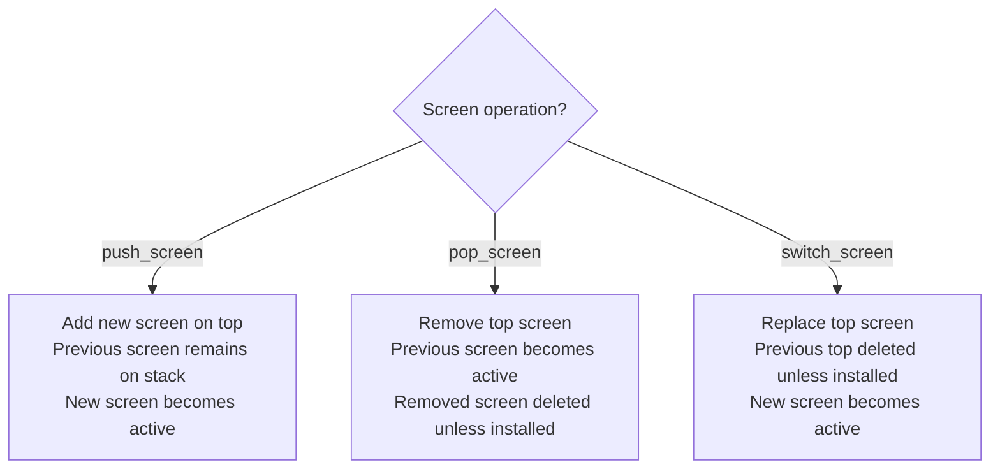

# App and Screens

Core patterns for the Textual `App` class, application lifecycle, and the screen stack API.

## Table of Contents

1. [App Class Basics](#app-class-basics)
2. [Running and Exiting](#running-and-exiting)
3. [App-level CSS](#app-level-css)
4. [Screen Basics](#screen-basics)
5. [Screen Stack API](#screen-stack-api)
6. [Modal Screens](#modal-screens)
7. [Returning Data from Screens](#returning-data-from-screens)
8. [Modes](#modes)
9. [Screen Events](#screen-events)

---

## App Class Basics

Subclass `App` to create a Textual application.

```python
from textual.app import App, ComposeResult
from textual.widgets import Label


class MyApp(App):
    def compose(self) -> ComposeResult:
        yield Label("Hello, World!")


if __name__ == "__main__":
    app = MyApp()
    app.run()
```

- Use `if __name__ == "__main__":` guard so the app can be imported without running.
- `App.compose()` yields widgets that are mounted on the default screen.
- Every widget runs in its own asyncio task.

### Title and subtitle

```python
class MyApp(App):
    TITLE = "My Application"
    SUB_TITLE = "working on file.txt"
```

Set `title` and `sub_title` as class variables (`TITLE`, `SUB_TITLE`) for static values, or as instance attributes for dynamic updates. Changes to `title`/`sub_title` trigger automatic refresh — no explicit `refresh()` call needed.

### ANSI colors

`ansi_color=True` in the `App` constructor preserves terminal ANSI theme colors instead of Textual overriding them. Recommended for inline apps; not recommended for full-screen apps.

---

## Running and Exiting

```python
# Standard full-screen mode
app.run()

# Inline mode (app appears beneath prompt, no full-screen takeover)
app.run(inline=True)  # Added in 0.55.0; not supported on Windows
```

`App.run()` enters application mode. Press `Ctrl+Q` to exit application mode by default.

### Exiting with a return value

```python
from textual.app import App
from textual.widgets import Button


class QuestionApp(App[str]):
    def compose(self) -> ComposeResult:
        yield Button("Yes", id="yes")
        yield Button("No", id="no")

    def on_button_pressed(self, event: Button.Pressed) -> None:
        self.exit(event.button.id)


app = QuestionApp()
result = app.run()  # returns "yes" or "no"
```

- `App[str]` declares the return type; `run()` returns `str | None`.
- `App.exit()` accepts an optional positional value returned by `run()`.

### Return codes

```python
if critical_error:
    self.exit(return_code=4, message="Critical error occurred")
```

```python
if __name__ == "__main__":
    app = MyApp()
    app.run()
    import sys
    sys.exit(app.return_code or 0)
```

- Normal exit: return code `0`.
- Unhandled exception: return code `1`.
- `app.return_code` is `None` until set; call `sys.exit` explicitly to propagate it.

### Suspending the app

```python
from textual.app import App
import subprocess


class MyApp(App):
    def on_button_pressed(self) -> None:
        with self.suspend():
            subprocess.run(["vim", "file.txt"])
```

- `App.suspend()` context manager temporarily leaves application mode.
- Not available with textual-web.
- `action_suspend_process` can bind `Ctrl+Z` for Unix foreground suspension; ignored on Windows and textual-web.

---

## App-level CSS

### External CSS file

```python
class MyApp(App):
    CSS_PATH = "myapp.tcss"  # relative to the .py file
```

- Extension `.tcss` distinguishes Textual CSS from browser CSS.
- Multiple files: `CSS_PATH = ["base.tcss", "theme.tcss"]`
- Run with `textual run myapp.py --dev` to enable live editing without restart.

### Inline CSS

```python
class MyApp(App):
    CSS = """
    Screen {
        background: darkblue;
    }
    Button {
        width: 100%;
    }
    """
```

App-level CSS takes precedence over widget `DEFAULT_CSS`.

---

## Screen Basics

```python
from textual.app import App, ComposeResult
from textual.screen import Screen
from textual.widgets import Label


class MyScreen(Screen):
    def compose(self) -> ComposeResult:
        yield Label("This is a screen")


class MyApp(App):
    SCREENS = {"main": MyScreen}
```

- `Screen` extends from the same base as widgets — it responds to events and composes child widgets.
- Screen dimensions always match the terminal size; you cannot set explicit dimensions on a screen.
- `SCREENS` is a dict mapping name strings to `Screen` classes or instances.

---

## Screen Stack API

Textual maintains a stack of screens. Only the top screen is active and receives input.



```python
# Push: add a screen on top
self.app.push_screen("bsod")           # by name (must be in SCREENS or installed)
self.app.push_screen(BSODScreen())     # by instance

# Pop: remove top screen
self.app.pop_screen()

# Switch: replace top screen
self.app.switch_screen("settings")
```

- The stack must always have at least one screen; `pop_screen` raises `ScreenStackError` if only one screen remains.
- Screens can also be pushed/popped/switched via action strings: `"app.push_screen('bsod')"`, `"app.pop_screen"`, `"app.switch_screen('settings')"`.

### Installing screens dynamically

```python
def on_mount(self) -> None:
    self.app.install_screen(BSODScreen(), name="bsod")
```

Use `SCREENS` for screens that live for the app's entire lifetime. Use `install_screen` for screens added at runtime. Call `uninstall_screen` to remove and clean up an installed screen.

---

## Modal Screens

```python
from textual.screen import ModalScreen
from textual.app import ComposeResult
from textual.widgets import Button, Label


class QuitScreen(ModalScreen):
    def compose(self) -> ComposeResult:
        yield Label("Really quit?")
        yield Button("Quit", id="quit")
        yield Button("Cancel", id="cancel")

    def on_button_pressed(self, event: Button.Pressed) -> None:
        if event.button.id == "quit":
            self.app.exit()
        else:
            self.app.pop_screen()
```

- `ModalScreen` subclass prevents app-level key bindings from firing while the modal is active.
- `ModalScreen` automatically sets a semi-transparent background so the underlying screen shows through.
- Use `ModalScreen` instead of `Screen` to prevent duplicate modal pushes from app-level bindings.

---

## Returning Data from Screens

```python
from textual.screen import ModalScreen


class QuitScreen(ModalScreen[bool]):
    def on_button_pressed(self, event: Button.Pressed) -> None:
        if event.button.id == "quit":
            self.dismiss(True)
        else:
            self.dismiss(False)


class MyApp(App):
    def action_request_quit(self) -> None:
        def check_quit(confirmed: bool) -> None:
            if confirmed:
                self.exit()

        self.push_screen(QuitScreen(), check_quit)
```

- `Screen.dismiss(value)` pops the screen and calls the callback set when it was pushed.
- `ModalScreen[bool]` typing tells the type checker what `dismiss` and the callback receive.

### Awaiting a screen result

```python
from textual import work


class MyApp(App):
    @work
    async def on_mount(self) -> None:
        confirmed = await self.push_screen_wait(QuitScreen())
        if confirmed:
            self.exit()
```

- `push_screen_wait()` pushes a screen and suspends the worker until the screen is dismissed.
- Must be called from a `@work`-decorated method; cannot be called from a regular message handler.

---

## Modes

Modes are named screen stacks. Each mode maintains its own independent stack.

```python
class MyApp(App):
    MODES = {
        "dashboard": DashboardScreen,
        "settings": SettingsScreen,
        "help": HelpScreen,
    }
    DEFAULT_MODE = "dashboard"

    BINDINGS = [
        ("d", "switch_mode('dashboard')", "Dashboard"),
        ("s", "switch_mode('settings')", "Settings"),
        ("h", "switch_mode('help')", "Help"),
    ]
```

- `MODES` maps mode names to screen classes, callables returning screens, or installed screen names.
- `App.switch_mode(name)` switches the active mode; `push_screen`/`pop_screen` affect only the active mode's stack.
- `DEFAULT_MODE` sets the starting mode.

---

## Screen Events

| Event | When sent |
|-------|-----------|
| `ScreenSuspend` | Screen becomes inactive (another screen pushed, or mode switched) |
| `ScreenResume` | Screen becomes active again |

```python
from textual.events import ScreenSuspend, ScreenResume


class MyScreen(Screen):
    def on_screen_suspend(self, event: ScreenSuspend) -> None:
        self.timer.pause()

    def on_screen_resume(self, event: ScreenResume) -> None:
        self.timer.resume()
```
