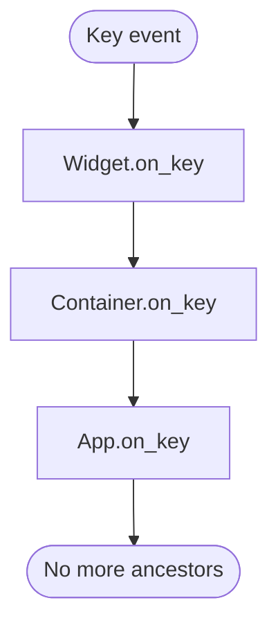

# Events and Actions

Event handling, message system, custom messages, the `@on` decorator, actions, and key bindings.

## Table of Contents

1. [Message Queue](#message-queue)
2. [Event Handler Naming](#event-handler-naming)
3. [The @on Decorator](#the-on-decorator)
4. [Handler Arguments](#handler-arguments)
5. [Async Handlers](#async-handlers)
6. [Event Bubbling](#event-bubbling)
7. [Custom Messages](#custom-messages)
8. [Preventing Messages](#preventing-messages)
9. [Actions](#actions)
10. [Action Namespaces](#action-namespaces)
11. [Key Bindings](#key-bindings)
12. [Dynamic Actions](#dynamic-actions)
13. [Builtin Actions](#builtin-actions)
14. [Common Events Reference](#common-events-reference)

---

## Message Queue

Every `App` and `Widget` has a message queue. Messages are processed one at a time in order. The widget cannot pick up a new message until the current handler returns.

- Slow handlers block the UI. Keep handlers fast (under ~50ms).
- For slow operations (network, disk, CPU), use workers — see `testing-and-workers.md`.
- Textual calls handler methods in *all* base classes automatically (no need for `super()` calls).

---

## Event Handler Naming

Handler methods follow the naming scheme:

```text
on_{namespace}_{message_class_snake_case}
```

Examples:

| Event class | Handler name |
|-------------|--------------|
| `Key` (no namespace) | `on_key` |
| `Button.Pressed` | `on_button_pressed` |
| `Input.Changed` | `on_input_changed` |
| `Switch.Changed` | `on_switch_changed` |
| `TabbedContent.TabActivated` | `on_tabbed_content_tab_activated` |

To check the handler name programmatically:

```python
from textual.widgets import Input
print(Input.Changed.handler_name)  # 'on_input_changed'
```

### Lifecycle event handlers

| Handler | When called |
|---------|-------------|
| `on_mount` | Widget fully mounted and visible |
| `on_unmount` | Widget removed from DOM |
| `on_load` | Before mount; before CSS applied |
| `on_show` | Widget becomes visible |
| `on_hide` | Widget becomes hidden |
| `on_resize` | Widget or terminal resized |
| `on_key` | Key pressed while widget (or descendant) has focus |
| `on_click` | Mouse click on widget |
| `on_focus` | Widget gains focus |
| `on_blur` | Widget loses focus |

---

## The @on Decorator

```python
from textual import on
from textual.widgets import Button


class MyApp(App):
    @on(Button.Pressed, "#bell")
    def ring_bell(self) -> None:
        self.bell()

    @on(Button.Pressed, ".toggle.dark")
    def toggle_dark(self) -> None:
        self.toggle_dark()

    @on(Button.Pressed, "#quit")
    def quit_app(self) -> None:
        self.exit()
```

- `@on(MessageClass)` — matches all messages of that type.
- `@on(MessageClass, "css-selector")` — matches only messages from widgets matching the selector.
- The selector uses the same CSS syntax as `query()`: `#id`, `.class`, `WidgetType`.
- Multiple `@on` decorated handlers for the same message all fire (in definition order), then the naming-convention handler fires last.
- Requires the message to have a `control` property; builtin messages have it; add it to custom messages if needed.

### Matching on arbitrary message attributes

```python
@on(TabbedContent.TabActivated, pane="#home")
def home_tab(self) -> None:
    self.log("Switched back to home tab.")
```

- Keyword arguments match message attributes listed in `Message.ALLOW_SELECTOR_MATCH`.

---

## Handler Arguments

```python
# With event argument — access event data
def on_button_pressed(self, event: Button.Pressed) -> None:
    self.log(f"Button id: {event.button.id}")

# Without argument — when event data is not needed
def on_button_pressed(self) -> None:
    self.bell()

# With @on decorator
@on(Button.Pressed)
def handle_button(self, event: Button.Pressed) -> None:
    self.log(event.button.id)
```

- The positional event argument is optional.
- Textual passes the event only if the handler declares a parameter.

---

## Async Handlers

```python
import asyncio


class MyApp(App):
    async def on_input_changed(self, event: Input.Changed) -> None:
        # This runs concurrently with other processing
        task = asyncio.create_task(self.fetch_definition(event.value))
```

- Prefix handlers with `async` to make them coroutines; Textual awaits them.
- Async handlers enable concurrent processing but still block the widget's queue until the handler returns.
- For long-running async work, use `asyncio.create_task` or `self.run_worker` to avoid blocking.

---

## Event Bubbling

Input events have `bubble = True` — after the target widget's handler runs, the event propagates to its parent, then grandparent, up to the App.



### Stopping bubbling

```python
def on_switch_changed(self, event: Switch.Changed) -> None:
    event.stop()  # prevent further bubbling
    self.post_message(self.BitChanged(event.value))
```

Call `event.stop()` when the widget has handled the event authoritatively and should prevent ancestors from also reacting.

### Preventing default behavior

```python
def on_key(self, event: Key) -> None:
    if event.key == "enter":
        event.prevent_default()  # skip base class on_key handlers
```

Use `prevent_default()` rarely — it disables base class behavior which may include core Textual features.

---

## Custom Messages

```python
from textual.message import Message
from textual.widget import Widget


class ColorButton(Widget):
    class Selected(Message):
        """Posted when the button is clicked."""

        def __init__(self, color: str) -> None:
            super().__init__()
            self.color = color

        @property
        def control(self) -> "ColorButton":
            return self.widget  # required for @on CSS selector matching

    def on_click(self) -> None:
        self.post_message(self.Selected("red"))


class MyApp(App):
    def on_color_button_selected(self, event: ColorButton.Selected) -> None:
        self.screen.styles.background = event.color
```

- Define custom messages as inner classes of the widget that sends them.
- Namespace reduces import requirements and avoids handler name collisions.
- Handler name: `on_{widget_class_snake_case}_{message_class_snake_case}`.
- Add a `control` property if using `@on` CSS selector matching.
- `post_message` is thread-safe.

---

## Preventing Messages

```python
class MyApp(App):
    def on_button_pressed(self, event: Button.Pressed) -> None:
        with self.prevent(Input.Changed):
            self.query_one(Input).value = ""  # won't fire Input.Changed
```

- `widget.prevent(MessageClass)` is a context manager that suppresses messages of that type from being posted.
- Used when updating a child widget's value programmatically and wanting to suppress the resulting change event.

---

## Actions

Action methods are prefixed with `action_`:

```python
class MyApp(App):
    def action_set_background(self, color: str) -> None:
        self.screen.styles.background = color

    def on_key(self, event: Key) -> None:
        if event.key == "r":
            self.action_set_background("red")
```

Action strings map to action methods:

| Action string | Calls |
|---------------|-------|
| `"bell"` | `action_bell()` |
| `"set_background('red')"` | `action_set_background('red')` |
| `"app.set_background('red')"` | `action_set_background('red')` on App |

- Parameters in action strings must be Python literals (strings, numbers, lists, dicts) — not variables.
- Action strings are not `eval`'d — Textual parses them directly.

### Actions in markup links

```python
class MyWidget(Static):
    def render(self) -> str:
        return (
            "[@click=set_background('red')]Red[/] "
            "[@click=set_background('green')]Green[/] "
            "[@click=set_background('blue')]Blue[/]"
        )
```

---

## Action Namespaces

| Namespace prefix | Target |
|-----------------|--------|
| (no prefix) | Current widget or app |
| `app.` | App instance |
| `screen.` | Active screen |
| `focused.` | Currently focused widget |

```python
# In markup — run action on the App, not the widget
"[@click=app.bell]Ring[/]"

# In BINDINGS — switch screen via app action
BINDINGS = [("b", "app.push_screen('bsod')", "BSOD")]
```

---

## Key Bindings

```python
from textual.binding import Binding


class MyApp(App):
    BINDINGS = [
        Binding("r", "set_background('red')", "Red"),
        Binding("g", "set_background('green')", "Green"),
        Binding("ctrl+q", "quit", "Quit"),
        Binding("up,k", "scroll_up", "Scroll up"),  # multiple keys for same action
    ]
```

- `Binding(keys, action, description)` — description appears in the Footer widget.
- Comma-separated keys in the `keys` field bind multiple keys to the same action.
- Key names match those in the `Key` event (`"enter"`, `"escape"`, `"ctrl+c"`, `"f1"`, etc.).
- Run `textual keys` in the terminal to discover key names interactively.

---

## Dynamic Actions

```python
class PagerApp(App):
    page_no: reactive[int] = reactive(0, bindings=True)

    BINDINGS = [
        Binding("n", "next_page", "Next"),
        Binding("p", "prev_page", "Previous"),
    ]

    def check_action(self, action: str, parameters: tuple) -> bool | None:
        if action == "next_page" and self.page_no >= MAX_PAGE:
            return None   # disabled (shown dimmed in footer)
        if action == "prev_page" and self.page_no <= 0:
            return False  # hidden from footer entirely
        return True       # shown and active
```

- `check_action(action, parameters)` gates actions before they run.
- Return `True` — show in footer, run normally.
- Return `False` — hide from footer, prevent running.
- Return `None` — show dimmed in footer, prevent running.
- Setting `bindings=True` on a reactive automatically calls `refresh_bindings()` when it changes.
- Call `self.refresh_bindings()` manually to update the footer when action availability changes.

---

## Builtin Actions

Actions defined on `App` that can be used in `BINDINGS` or markup:

| Action | Effect |
|--------|--------|
| `app.quit` | Exit the application |
| `app.bell` | Ring terminal bell |
| `app.toggle_dark` | Toggle dark/light theme |
| `app.push_screen('name')` | Push named screen |
| `app.pop_screen` | Pop top screen |
| `app.switch_screen('name')` | Switch to named screen |
| `app.switch_mode('name')` | Switch to named mode |
| `app.focus_next` | Focus next focusable widget |
| `app.focus_previous` | Focus previous focusable widget |
| `app.focus('selector')` | Focus widget matching selector |
| `app.add_class('selector', 'cls')` | Add CSS class to widgets |
| `app.remove_class('selector', 'cls')` | Remove CSS class from widgets |
| `app.toggle_class('selector', 'cls')` | Toggle CSS class on widgets |
| `app.screenshot` | Save app screenshot |
| `app.suspend_process` | Suspend to foreground (Unix only) |
| `app.back` | Pop screen or focus previous |

---

## Common Events Reference

| Event | Import | Key attributes |
|-------|--------|----------------|
| `Key` | `textual.events` | `key: str`, `character: str \| None` |
| `Click` | `textual.events` | `x`, `y`, `button`, `shift`, `ctrl`, `meta` |
| `MouseMove` | `textual.events` | `x`, `y`, `offset`, `delta_x`, `delta_y` |
| `MouseDown` | `textual.events` | `x`, `y`, `button` |
| `MouseUp` | `textual.events` | `x`, `y`, `button` |
| `MouseScrollUp` | `textual.events` | `x`, `y` |
| `MouseScrollDown` | `textual.events` | `x`, `y` |
| `Focus` | `textual.events` | — |
| `Blur` | `textual.events` | — |
| `DescendantFocus` | `textual.events` | `widget` |
| `DescendantBlur` | `textual.events` | `widget` |
| `Mount` | `textual.events` | — |
| `Unmount` | `textual.events` | — |
| `Show` | `textual.events` | — |
| `Hide` | `textual.events` | — |
| `Resize` | `textual.events` | `size`, `virtual_size` |
| `Paste` | `textual.events` | `text: str` |
| `Print` | `textual.events` | `text: str`, `stderr: bool` |
| `AppFocus` | `textual.events` | — |
| `AppBlur` | `textual.events` | — |
| `ScreenSuspend` | `textual.events` | — |
| `ScreenResume` | `textual.events` | — |
| `Enter` | `textual.events` | Mouse enters widget |
| `Leave` | `textual.events` | Mouse leaves widget |
