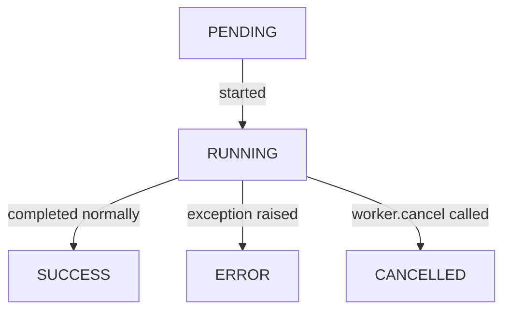

# Testing and Workers

Testing Textual apps with `run_test` and the Pilot API, snapshot testing, and the Worker API for background concurrency.

## Table of Contents

1. [Testing Setup](#testing-setup)
2. [run_test and the Pilot API](#run_test-and-the-pilot-api)
3. [Simulating Key Presses](#simulating-key-presses)
4. [Simulating Clicks](#simulating-clicks)
5. [Pilot Utilities](#pilot-utilities)
6. [Snapshot Testing](#snapshot-testing)
7. [Workers — Motivation](#workers--motivation)
8. [run_worker](#run_worker)
9. [The @work Decorator](#the-work-decorator)
10. [Worker State and Lifecycle](#worker-state-and-lifecycle)
11. [Thread Workers](#thread-workers)
12. [Worker Events](#worker-events)

---

## Testing Setup

Textual uses asyncio internally, so tests must be async:

```toml
# pyproject.toml
[tool.pytest.ini_options]
asyncio_mode = "auto"
```

Or mark each test individually:

```python
import pytest

@pytest.mark.asyncio
async def test_my_app() -> None:
    ...
```

Dependencies: `pytest`, `pytest-asyncio`.

---

## run_test and the Pilot API

```python
from myapp import RGBApp


async def test_key_changes_color() -> None:
    app = RGBApp()
    async with app.run_test() as pilot:
        await pilot.press("r")
        assert app.screen.styles.background == Color.parse("red")


async def test_button_changes_color() -> None:
    app = RGBApp()
    async with app.run_test() as pilot:
        await pilot.click("#red")
        assert app.screen.styles.background == Color.parse("red")
```

- `App.run_test()` is an async context manager; returns a `Pilot` object.
- Runs the app in headless mode — no terminal output but otherwise behaves normally.
- Default terminal size for tests: 80 columns × 24 rows.

### Custom terminal size

```python
async with app.run_test(size=(100, 50)) as pilot:
    ...
```

---

## Simulating Key Presses

```python
await pilot.press("r")                          # single key
await pilot.press("h", "e", "l", "l", "o")     # multiple keys in sequence
await pilot.press("enter")                      # named key
await pilot.press("ctrl+c")                     # modifier + key
await pilot.press("shift+tab")                  # shift modifier
```

- Each string in `press()` is one keypress event.
- Key names match those shown by `textual keys` in the terminal.
- Non-printable key names: `"enter"`, `"escape"`, `"tab"`, `"backspace"`, `"delete"`, `"up"`, `"down"`, `"left"`, `"right"`, `"f1"`–`"f12"`, etc.

---

## Simulating Clicks

```python
# Click a widget by CSS selector
await pilot.click("#my-button")
await pilot.click(Button)                  # by type

# Click screen at absolute coordinates
await pilot.click()                        # (0, 0)
await pilot.click(offset=(10, 5))          # absolute (10, 5)

# Click relative to a widget
await pilot.click(Button, offset=(0, -1))  # 1 row above the button

# Double and triple clicks
await pilot.click(Button, times=2)         # double click
await pilot.click(Button, times=3)         # triple click

# Modifier keys
await pilot.click("#slider", control=True)
await pilot.click("#item", shift=True)
await pilot.click("#item", meta=True)
```

- If another widget is on top of the target, the topmost widget receives the click (matches real user behavior).

### Hover

```python
await pilot.hover("#button")
await pilot.hover(Button, offset=(5, 2))
```

---

## Pilot Utilities

```python
# Wait for all pending messages to be processed
await pilot.pause()

# Wait for a specific delay, then for pending messages
await pilot.pause(delay=0.5)
```

- Call `pause()` when a message needs time to bubble before asserting state.
- Especially important after `post_message` calls or timer-based updates.

---

## Snapshot Testing

Snapshot testing records an SVG screenshot and compares against it in future runs.

### Install

```bash
pip install pytest-textual-snapshot
```

### Write a snapshot test

```python
def test_calculator(snap_compare):
    assert snap_compare("path/to/calculator.py")
```

- `snap_compare` is a pytest fixture from `pytest-textual-snapshot`.
- First run always fails — no baseline to compare against.

### Save the baseline

```bash
pytest --snapshot-update
```

Only run `--snapshot-update` after visually confirming the output looks correct.

### Snapshot test options

```python
# Simulate key presses before snapshot
def test_after_input(snap_compare):
    assert snap_compare("calculator.py", press=["3", ".", "1", "4"])

# Custom terminal size
def test_large_terminal(snap_compare):
    assert snap_compare("calculator.py", terminal_size=(120, 50))

# Run arbitrary pilot code before snapshot
def test_hovered_button(snap_compare):
    async def run_before(pilot) -> None:
        await pilot.hover("#number-5")

    assert snap_compare("calculator.py", run_before=run_before)
```

---

## Workers — Motivation

Any operation taking more than a few milliseconds blocks the message queue and makes the UI unresponsive. Workers run code concurrently while the UI continues processing events.

Common slow operations requiring workers:

- HTTP requests (`httpx`, `urllib`)
- Database queries
- File I/O
- Subprocess calls
- CPU-intensive computation

---

## run_worker

```python
import httpx
from textual.app import App


class WeatherApp(App):
    async def on_input_changed(self, event) -> None:
        self.run_worker(self.update_weather(event.value), exclusive=True)

    async def update_weather(self, city: str) -> None:
        async with httpx.AsyncClient() as client:
            response = await client.get(f"https://wttr.in/{city}?format=2")
        self.query_one("#weather").update(response.text)
```

- `self.run_worker(coroutine_or_callable, exclusive=False)` schedules background work.
- `exclusive=True` cancels any existing workers for the same method before starting the new one — prevents out-of-order responses.
- Returns a `Worker` object (often ignored).

---

## The @work Decorator

```python
from textual import work


class WeatherApp(App):
    async def on_input_changed(self, event) -> None:
        self.update_weather(event.value)  # no await needed

    @work(exclusive=True)
    async def update_weather(self, city: str) -> None:
        async with httpx.AsyncClient() as client:
            response = await client.get(f"https://wttr.in/{city}?format=2")
        self.query_one("#weather").update(response.text)
```

- `@work` converts an `async def` method into a worker-creating function.
- Decorated method becomes a regular (non-async) function — call without `await`.
- Accepts the same parameters as `run_worker`: `exclusive`, `exit_on_error`, `thread`, `name`, `description`.

---

## Worker State and Lifecycle



| State | Meaning |
|-------|---------|
| `PENDING` | Created, not yet started |
| `RUNNING` | Currently executing |
| `SUCCESS` | Completed; `worker.result` contains return value |
| `ERROR` | Raised exception; `worker.error` contains the exception |
| `CANCELLED` | Cancelled before completion |

```python
worker = self.run_worker(self.fetch_data())

# Check later
print(worker.state)   # WorkerState enum
print(worker.result)  # return value (None until SUCCESS)
print(worker.error)   # exception (None unless ERROR)
```

### Cancelling a worker

```python
worker.cancel()
```

Raises `asyncio.CancelledError` inside the coroutine, causing it to exit.

### Worker lifetime

- Workers are tied to the DOM node where they were created (widget, screen, or App).
- If the widget is removed or the screen is popped, its workers are cancelled automatically.
- App exit cancels all running workers.
- All workers are accessible via `app.workers` (a `WorkerManager` instance).

### Error handling

```python
@work(exit_on_error=False)  # don't crash app on worker exception
async def risky_operation(self) -> None:
    ...
```

- Default behavior: unhandled exception in a worker exits the app and prints the traceback.
- `exit_on_error=False` suppresses that — handle the error in the `Worker.StateChanged` event instead.

---

## Thread Workers

For non-async APIs that block (e.g. `urllib`, `sqlite3`):

```python
import urllib.request
from textual import work
from textual.worker import get_current_worker


class WeatherApp(App):
    @work(thread=True, exclusive=True)
    def update_weather(self, city: str) -> None:
        worker = get_current_worker()
        url = f"https://wttr.in/{city}?format=2"
        with urllib.request.urlopen(url) as response:
            data = response.read().decode()
        if not worker.is_cancelled:
            self.app.call_from_thread(self.query_one("#weather").update, data)
```

- `@work(thread=True)` creates a thread worker; the decorated function must be a regular function (not `async def`).
- Applying `@work` without `thread=True` to a regular function raises an exception.
- Thread workers cannot directly call Textual methods — use `App.call_from_thread(fn, *args)` to run UI code from the thread.
- Exception: `post_message` is thread-safe and can be called directly.
- Check `worker.is_cancelled` to handle cancellation gracefully (threads cannot be cancelled the same way as coroutines).

---

## Worker Events

```python
from textual.worker import Worker


class MyApp(App):
    def on_worker_state_changed(self, event: Worker.StateChanged) -> None:
        self.log(f"Worker {event.worker.name}: {event.worker.state}")
        if event.worker.state == WorkerState.SUCCESS:
            self.log(f"Result: {event.worker.result}")
        elif event.worker.state == WorkerState.ERROR:
            self.log(f"Error: {event.worker.error}")
```

- `Worker.StateChanged` is sent to the widget that created the worker when the worker's state changes.
- Handler name: `on_worker_state_changed`.
- `event.worker` is the `Worker` instance that changed state.
- Use state events to get the return value asynchronously without blocking.
