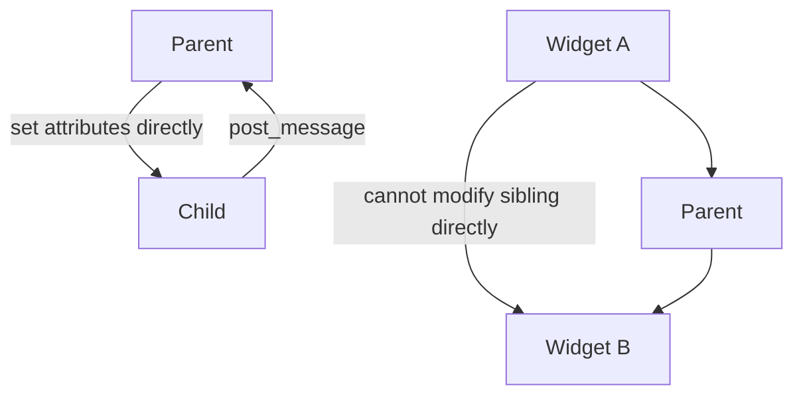

# Widgets

Custom widget creation, builtin widget patterns, the Line API for efficient rendering, and compound widget design.

## Table of Contents

1. [Widget Basics](#widget-basics)
2. [Static Widget](#static-widget)
3. [Default CSS and Scoped CSS](#default-css-and-scoped-css)
4. [Focusability and Key Bindings](#focusability-and-key-bindings)
5. [Rich Renderables](#rich-renderables)
6. [Content Size Overrides](#content-size-overrides)
7. [Tooltips](#tooltips)
8. [Loading State](#loading-state)
9. [Line API](#line-api)
10. [Compound Widgets](#compound-widgets)
11. [Coordinating Widgets — Data Flow](#coordinating-widgets--data-flow)
12. [Builtin Widgets Reference](#builtin-widgets-reference)

---

## Widget Basics

```python
from textual.app import App, ComposeResult
from textual.widget import Widget


class Greeting(Widget):
    def render(self) -> str:
        return "Hello, [b]World[/b]!"


class MyApp(App):
    def compose(self) -> ComposeResult:
        yield Greeting()
```

- `render()` returns content markup; square brackets contain markup tags (e.g. `[b]`, `[red]`).
- Textual calls `render()` to update the content area when state changes.
- Every widget runs in its own asyncio task.

### Mounting widgets at runtime

```python
class MyApp(App):
    def on_key(self) -> None:
        self.mount(Greeting())
```

- `compose()` is preferred for initial layout; `mount()` is for adding widgets in response to events.
- `mount()` is not complete immediately — the next message handler is guaranteed to see the mounted widget.
- To access a newly mounted widget in the same handler, `await` the mount call:

```python
class MyApp(App):
    async def on_key(self) -> None:
        await self.mount(Welcome())
        self.query_one(Button).label = "YES!"  # safe: mount is complete
```

### Border titles

```python
class MyWidget(Widget):
    BORDER_TITLE = "Default Title"

    def on_mount(self) -> None:
        self.border_subtitle = "Status: OK"
```

- `border_title` appears in the top border; `border_subtitle` in the bottom border.
- Titles only display when the widget has a border enabled.
- Titles exceeding widget width are cropped with an ellipsis.
- Set defaults with `BORDER_TITLE`/`BORDER_SUBTITLE` class variables.

---

## Static Widget

```python
from textual.widgets import Static


class HelloStatic(Static):
    GREETINGS = ["Hello", "Hola", "Bonjour"]
    index = 0

    def on_mount(self) -> None:
        self.update(self.GREETINGS[0])

    def on_click(self) -> None:
        self.index = (self.index + 1) % len(self.GREETINGS)
        self.update(self.GREETINGS[self.index])
```

- `Static` caches the render result and exposes `update(content)` instead of `render()`.
- Use `Static` when content updates on events rather than on every render cycle.

### Text links in markup

```python
class MyWidget(Static):
    def render(self) -> str:
        return "Click [@click=app.bell]here[/] to ring the bell"
```

- `@click=<action_string>` in markup creates a clickable link that runs the action.
- Action strings reference the action name without the `action_` prefix.

---

## Default CSS and Scoped CSS

```python
class MyWidget(Widget):
    DEFAULT_CSS = """
    MyWidget {
        background: darkblue;
        padding: 1 2;
        border: round white;
    }
    MyWidget:focus {
        border: round yellow;
    }
    """
    SCOPED_CSS = True  # default; set False to allow DEFAULT_CSS to affect other widgets
```

- `DEFAULT_CSS` bundles CSS with a widget for distribution (e.g. via PyPI).
- `DEFAULT_CSS` is automatically scoped to the widget and its children — prevents breaking unrelated widgets.
- App-level CSS always overrides `DEFAULT_CSS` (lower specificity by design).
- Set `SCOPED_CSS = False` only when the widget intentionally styles widgets outside its subtree.

---

## Focusability and Key Bindings

```python
from textual.app import App, ComposeResult
from textual.widget import Widget
from textual.binding import Binding


class Counter(Widget):
    can_focus = True

    BINDINGS = [
        Binding("up,k", "change_count(1)", "Increment"),
        Binding("down,j", "change_count(-1)", "Decrement"),
    ]

    count = 0

    def render(self) -> str:
        return str(self.count)

    def action_change_count(self, delta: int) -> None:
        self.count += delta
        self.refresh()
```

- `can_focus = True` class variable allows the widget to receive input focus.
- Focus is given by clicking the widget or pressing `Tab`/`Shift+Tab`.
- `BINDINGS` is a list of `Binding(keys, action, description)` tuples.
- Action methods must be named `action_<name>` — the `action_` prefix is mandatory.
- Bindings are active when the widget or a descendant has focus.

---

## Rich Renderables

```python
from rich.table import Table
from textual.widget import Widget


class FizzBuzzWidget(Widget):
    def render(self) -> Table:
        table = Table("Number", "Fizz", "Buzz")
        for n in range(1, 16):
            table.add_row(
                str(n),
                "Fizz" if n % 3 == 0 else "",
                "Buzz" if n % 5 == 0 else "",
            )
        return table
```

- `render()` can return any Rich renderable (Table, Panel, Syntax, etc.) or a string.
- Textual redraws the entire widget when state changes; for frequently updated or large widgets, prefer the Line API.

---

## Content Size Overrides

```python
from textual.widget import Widget


class FixedWidthWidget(Widget):
    def get_content_width(self, container, viewport) -> int:
        return 50  # force 50 columns wide

    def get_content_height(self, container, viewport, width) -> int:
        return 10  # force 10 rows tall
```

- Textual auto-detects content size from Rich renderables when width/height is `auto`.
- Override `get_content_width()` or `get_content_height()` to force specific dimensions.

---

## Tooltips

```python
class MyApp(App):
    def compose(self) -> ComposeResult:
        btn = Button("Click me")
        btn.tooltip = "This button does something"
        yield btn
```

- Assign a string or any Rich renderable to `widget.tooltip`.
- Tooltip displays when the mouse hovers over the widget.
- Style tooltips by targeting `Tooltip` in CSS.
- Do not rely on tooltips for essential information — keyboard-only users may never see them.

---

## Loading State

```python
from textual.widgets import DataTable


class MyApp(App):
    async def fetch_data(self) -> None:
        table = self.query_one(DataTable)
        table.loading = True
        data = await get_data_from_network()
        table.add_rows(data)
        table.loading = False
```

- Setting `widget.loading = True` replaces the widget with a `LoadingIndicator` animation.
- Reset to `False` to show the widget content again.
- `loading` is a reactive attribute on every widget.

---

## Line API

The Line API renders widgets line-by-line and supports partial refresh — ideal for large or frequently updated widgets.

```python
from textual.app import App, ComposeResult
from textual.widget import Widget
from textual.strip import Strip
from rich.segment import Segment
from rich.style import Style


class CheckerBoard(Widget):
    def render_line(self, y: int) -> Strip:
        segments = []
        for x in range(self.size.width):
            color = "white" if (x + y) % 2 == 0 else "black"
            segments.append(Segment("  ", Style(bgcolor=color)))
        return Strip(segments)
```

- Implement `render_line(y: int) -> Strip` instead of `render()`.
- `y` is the row offset from the top of the widget (0-based).
- `Strip` is a container for `Segment` objects covering one line.
- `Segment(text, style)` — `text` is displayed string, `style` controls colors/bold/etc.

### Scrollable Line API widget

```python
from textual.scroll_view import ScrollView
from textual.geometry import Size


class ScrollableBoard(ScrollView):
    def __init__(self, board_size: int) -> None:
        super().__init__()
        self.board_size = board_size

    def on_mount(self) -> None:
        self.virtual_size = Size(self.board_size * 8, self.board_size * 4)

    def render_line(self, y: int) -> Strip:
        scroll_x, scroll_y = self.scroll_offset
        row = y + scroll_y
        segments = []
        for col in range(self.board_size):
            color = "white" if (col + row) % 2 == 0 else "black"
            segments.append(Segment("  ", Style(bgcolor=color)))
        return Strip(segments).crop(scroll_x, scroll_x + self.size.width)
```

- Extend `ScrollView` instead of `Widget` to add scrolling.
- Set `virtual_size` to the full scrollable content dimensions.
- Add `scroll_offset.y` to `y` to convert widget-relative rows to content-relative rows.
- Call `strip.crop(x_start, x_end)` to trim to the visible horizontal range.
- `Strip` objects are immutable — methods return new strips.

### Component classes

```python
class CheckerBoard(Widget):
    COMPONENT_CLASSES = {"checkerboard--white-square", "checkerboard--black-square"}

    DEFAULT_CSS = """
    CheckerBoard .checkerboard--white-square { background: white; }
    CheckerBoard .checkerboard--black-square { background: black; }
    """

    def render_line(self, y: int) -> Strip:
        white_style = self.get_component_rich_style("checkerboard--white-square")
        black_style = self.get_component_rich_style("checkerboard--black-square")
        ...
```

- `COMPONENT_CLASSES` declares CSS class names that can be used in `DEFAULT_CSS` and overridden by app CSS.
- Convention: prefix component class names with the widget name and two hyphens (e.g. `checkerboard--white-square`).
- `get_component_rich_style(class_name)` returns a Rich `Style` object from the resolved CSS.

### Partial refresh

```python
from textual.geometry import Region


def watch_cursor_square(self, old: tuple, new: tuple) -> None:
    old_region = self.get_square_region(old)
    new_region = self.get_square_region(new)
    self.refresh(old_region)
    self.refresh(new_region)
```

- Pass `Region` objects to `widget.refresh()` to update only specific cells.
- Textual combines overlapping regions into the minimum number of non-overlapping updates.

---

## Compound Widgets

A compound widget contains child widgets and uses `compose()` instead of `render()`.

```python
from textual.app import ComposeResult
from textual.widget import Widget
from textual.widgets import Input, Label


class InputWithLabel(Widget):
    def __init__(self, label: str, placeholder: str = "") -> None:
        super().__init__()
        self._label = label
        self._placeholder = placeholder

    def compose(self) -> ComposeResult:
        yield Label(self._label)
        yield Input(placeholder=self._placeholder)
```

- Compound widgets expose a `compose()` that yields child widgets.
- They can be used anywhere a regular widget is used.
- Styling targets the compound widget's class name, children's class names, or IDs.

---

## Coordinating Widgets — Data Flow

The recommended data flow pattern is **attributes down, messages up**:



- To update a child: get a reference and set its attributes or call its methods directly.
- To update a parent or sibling: call `self.post_message(MyWidget.MyMessage(...))`.
- Siblings cannot be modified directly — send a message to the parent, which then updates both.

### Defining a custom message

```python
from textual.message import Message
from textual.widget import Widget


class BitSwitch(Widget):
    class BitChanged(Message):
        def __init__(self, value: int) -> None:
            super().__init__()
            self.value = value

    def on_switch_changed(self, event) -> None:
        event.stop()  # prevent Switch.Changed from bubbling further
        self.post_message(self.BitChanged(event.value))
```

- Define custom messages as inner classes of the widget — reduces imports and namespaces the handler name.
- Call `event.stop()` to prevent the source event from continuing to bubble.
- `post_message` is thread-safe and can be called from thread workers.

---

## Builtin Widgets Reference

| Widget | Import | Purpose |
|--------|--------|---------|
| `Button` | `textual.widgets` | Clickable button; fires `Button.Pressed` |
| `Input` | `textual.widgets` | Single-line text input; fires `Input.Changed`, `Input.Submitted` |
| `TextArea` | `textual.widgets` | Multi-line editor with syntax highlighting |
| `MaskedInput` | `textual.widgets` | Input with format mask |
| `Select` | `textual.widgets` | Drop-down selection |
| `Switch` | `textual.widgets` | Toggle switch; fires `Switch.Changed` |
| `Checkbox` | `textual.widgets` | Checkbox; fires `Checkbox.Changed` |
| `RadioButton` | `textual.widgets` | Radio button |
| `RadioSet` | `textual.widgets` | Group of radio buttons |
| `DataTable` | `textual.widgets` | Scrollable table with Line API; handles millions of rows |
| `Tree` | `textual.widgets` | Expandable tree view |
| `DirectoryTree` | `textual.widgets` | File system browser |
| `ListView` | `textual.widgets` | Scrollable list of `ListItem` widgets |
| `OptionList` | `textual.widgets` | List with selectable options |
| `SelectionList` | `textual.widgets` | Multi-select list |
| `Label` | `textual.widgets` | Static text label |
| `Static` | `textual.widgets` | Updateable static content |
| `Markdown` | `textual.widgets` | Renders Markdown content |
| `MarkdownViewer` | `textual.widgets` | Markdown with navigation |
| `RichLog` | `textual.widgets` | Append-only rich text log |
| `Log` | `textual.widgets` | Plain text log |
| `ProgressBar` | `textual.widgets` | Progress indicator |
| `LoadingIndicator` | `textual.widgets` | Animated loading spinner |
| `Sparkline` | `textual.widgets` | Inline sparkline chart |
| `Digits` | `textual.widgets` | Large digit display |
| `Header` | `textual.widgets` | Docked top header (shows title/subtitle) |
| `Footer` | `textual.widgets` | Docked bottom footer (shows key bindings) |
| `Rule` | `textual.widgets` | Horizontal divider |
| `Placeholder` | `textual.widgets` | Development placeholder widget |
| `Toast` | `textual.widgets` | Temporary notification popup |
| `Collapsible` | `textual.widgets` | Expandable/collapsible section |
| `TabbedContent` | `textual.widgets` | Tab panes with `TabbedContent.TabActivated` |
| `Tabs` | `textual.widgets` | Tab bar |
| `ContentSwitcher` | `textual.widgets` | Show/hide child widgets by ID |
| `Vertical` | `textual.containers` | Vertical layout container |
| `Horizontal` | `textual.containers` | Horizontal layout container |
| `Grid` | `textual.containers` | Grid layout container |
| `ScrollableContainer` | `textual.containers` | Scrollable container |
| `VerticalScroll` | `textual.containers` | Vertical scroll container |
| `HorizontalScroll` | `textual.containers` | Horizontal scroll container |
| `Center` | `textual.containers` | Centers child widgets horizontally |
| `Middle` | `textual.containers` | Centers child widgets vertically |
