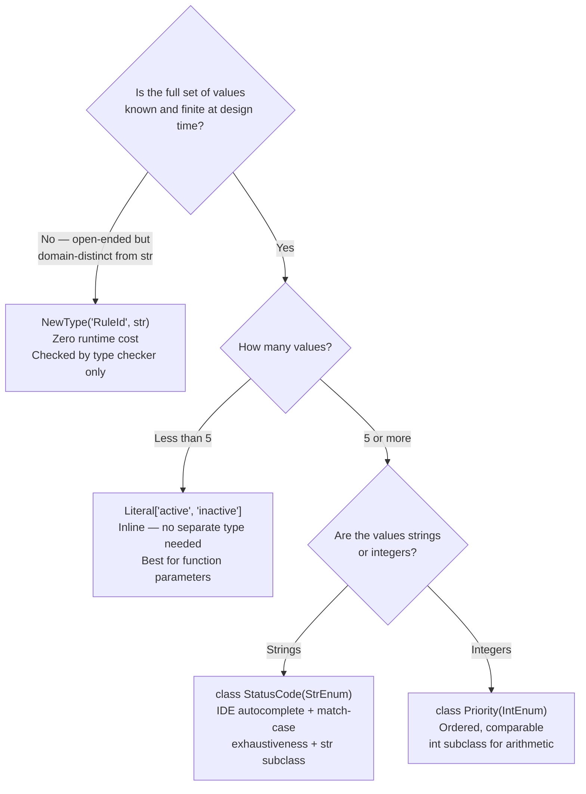
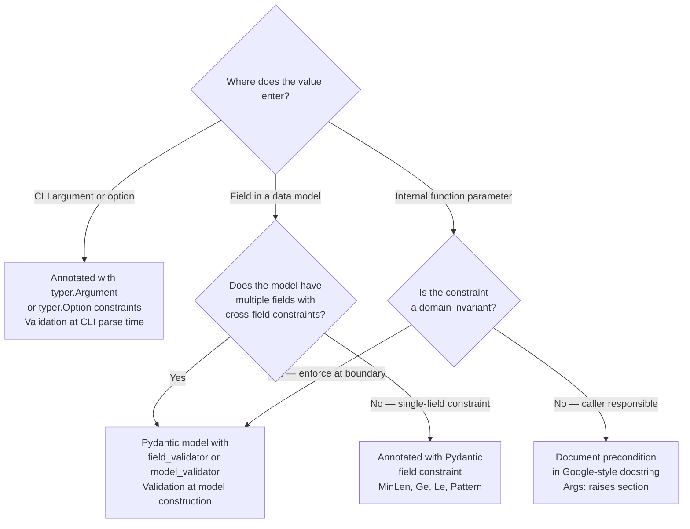
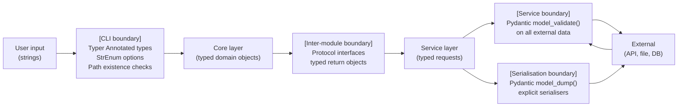

# Type System Design Patterns

Architecture-level reference for the `python-cli-design-spec` agent. Covers WHAT type system
decisions to make and WHERE to apply them during specification — not how to implement them.

## Table of Contents

- [1. Type System Audit Checklist](#1-type-system-audit-checklist)
- [2. Domain Identifier Patterns](#2-domain-identifier-patterns)
- [3. Annotated Types for Parameter Validation](#3-annotated-types-for-parameter-validation)
- [4. Boundary Validation Design](#4-boundary-validation-design)
- [5. Anti-Patterns to Flag in Architecture Specs](#5-anti-patterns-to-flag-in-architecture-specs)
- [6. Type Contract Template](#6-type-contract-template)

---

## 1. Type System Audit Checklist

Run this checklist against every component interface in the spec before finalising it.

### Step 1 — Identify domain-specific identifiers

Scan every interface for values drawn from a known finite set:

- Rule IDs (e.g., `"E001"`, `"W042"`)
- Status codes (e.g., `"active"`, `"pending"`, `"archived"`)
- Config keys and categories
- Error codes
- Operation or command names
- Event types

Each of these is a candidate for a strong domain type. Record the set name, the values (or
the pattern if open-ended), and every interface that produces or consumes it.

### Step 2 — Identify boundary crossing points

Mark every location where data crosses a trust or format boundary:

- CLI input (user-supplied string) entering the core layer
- Core output entering a service (API call, file write)
- External API response entering internal models
- File or database read entering the type system
- Serialisation: internal model written to JSON / TOML / YAML

Each crossing point requires an explicit validation decision in the spec.

### Step 3 — Flag weak types

Scan every function signature and data model for:

| Weak type | Replace with |
|---|---|
| `Any` | `Protocol`, `Generic[T]`, or specific union |
| `object` | `Protocol` for structural typing |
| `dict[str, Any]` | `TypedDict` or Pydantic model |
| Bare `str` for a domain identifier | `StrEnum`, `NewType`, or `Literal` |
| `cast()` calls | Redesign types so cast is unnecessary |
| `**kwargs: Any` | `TypedDict` with `Unpack` (PEP 692) or explicit params |

### Step 4 — Prescribe the replacement

For each flagged type, the spec must state:

- Which strong type mechanism to use (see Section 2)
- Where the value is created and where it is validated
- How it serialises (if it crosses a serialisation boundary)

---

## 2. Domain Identifier Patterns

### Decision Flowchart



### StrEnum — preferred for string domain identifiers

Use when the set of valid string values is known at design time and has five or more members.

Properties that make it the right choice for specs:

- `StrEnum` is a `str` subclass — serialises to JSON without custom encoders
- `match-case` on a `StrEnum` value is exhaustive-checked by type checkers
- IDE autocomplete surfaces every valid value at call sites
- Typer accepts `StrEnum` as a CLI option type directly, producing validated input

Spec guidance: define one `StrEnum` per domain concept. Do not reuse a status enum across
unrelated domains — create separate types even if the string values overlap.

### NewType — for open-ended but domain-distinct identifiers

Use when the set of values is not known at design time (e.g., user-defined rule IDs loaded
from config) but the domain requires distinguishing the identifier from a bare `str`.

```python
# Interface pattern — not implementation
RuleId = NewType("RuleId", str)

def get_rule(rule_id: RuleId) -> Rule: ...
```

`NewType` has zero runtime cost. The type checker rejects a bare `str` where `RuleId` is
required. The spec must define where `RuleId` values are created (the single construction
site) to preserve the invariant.

### Literal — for small fixed sets in function parameters

Use for two to four known values that appear only in one function's parameter. Avoids
creating a named type for a localised constraint.

```python
# Interface pattern
def set_verbosity(level: Literal["quiet", "normal", "verbose"]) -> None: ...
```

When the same literal set appears in more than one signature, promote it to `StrEnum`.

### IntEnum — for ordered integer domains

Use for priority levels, severity ranks, or any domain where arithmetic or ordering on the
values is meaningful. `IntEnum` is an `int` subclass, so comparison and arithmetic work
without conversion.

---

## 3. Annotated Types for Parameter Validation

`typing.Annotated` attaches runtime-evaluable constraints to a type. The spec must decide
which validation mechanism is appropriate at each interface.

### Decision: Annotated vs validator function vs Pydantic model



### Constraint patterns for specs

Spec the constraint by stating the type and the validator — not the implementation:

- String with minimum length: `Annotated[str, MinLen(1)]`
- Integer with bounds: `Annotated[int, Ge(0), Le(100)]`
- Path that must exist at runtime: `Annotated[Path, typer.Argument(exists=True)]`
- String matching a domain pattern (e.g., `XX-NNN`): `Annotated[str, AfterValidator(validate_rule_id)]`
- Port number: `Annotated[int, Ge(1), Le(65535)]`

### When to use AfterValidator

Prescribe `AfterValidator` when:

- The constraint requires logic beyond a simple bound or length check
- The constraint references external state (e.g., registry lookup)
- The domain rule cannot be expressed as a Pydantic built-in constraint

The spec must define what `validate_rule_id` checks — not how it is written.

### Annotated at the CLI boundary vs the model boundary

- **CLI boundary**: use `Annotated` with `typer.Option` / `typer.Argument` — Typer enforces
  at parse time, before the core layer is invoked
- **Model boundary**: use `Annotated` fields in a Pydantic model — enforced at
  `model_validate()` when external data enters the system
- Do not double-validate the same constraint at both boundaries unless the data can arrive
  via both paths independently

---

## 4. Boundary Validation Design

### Validation points in a standard CLI architecture



### CLI boundary — user input entering the core layer

The spec must require:

- `StrEnum` values for options with a known set of choices (Typer renders them as
  `[choice1|choice2|...]` in help automatically)
- `Annotated[Path, typer.Argument(exists=True)]` for path inputs that must exist
- Numeric bounds via `Annotated[int, typer.Option(min=N, max=M)]`
- No raw `str` for domain identifiers — convert at the CLI boundary, not inside the core

The CLI layer must not pass unvalidated strings to the core. The core receives typed objects.

### Service boundary — external data entering internal models

The spec must require `model_validate()` at every point where data arrives from:

- HTTP API responses
- File reads (JSON, TOML, YAML)
- Database query results
- Environment variables (use `pydantic-settings`)
- Subprocess output parsed as structured data

Never construct an internal model by passing raw dict values to a typed constructor.
`model_validate(raw_dict)` is the correct entry point.

### Serialisation boundary — internal models written to external targets

The spec must require explicit serialisation:

- `model.model_dump()` for JSON-compatible output
- `model.model_dump(mode="json")` when datetime and UUID fields must be string-serialised
- Custom `model_serializer` for types that need non-default representation (e.g., `Path`
  serialised as a POSIX string, `StrEnum` member serialised as its value)

### Inter-module boundary — core talking to services

Spec the interface as a `Protocol` with typed method signatures. The core depends on the
Protocol; the service implements it. This boundary does not require runtime validation
because both sides are Python code under the same type checker — it requires correct type
annotations so the type checker enforces the contract statically.

---

## 5. Anti-Patterns to Flag in Architecture Specs

The following patterns must not appear in a spec without an explicit, written justification.
If the architect finds one of these in a proposed interface, it must be replaced or the
spec must document why the weak type is genuinely unavoidable.

### `Any` in interface signatures

`Any` disables type checking for every caller and callee that touches it. Replace with:

- `Protocol` when the type is unknown but its behaviour is known
- `Generic[T]` when the type varies but is constrained
- A union of concrete types when the set of possibilities is known

### `dict[str, Any]`

Represents unstructured data. Replace with:

- `TypedDict` when the keys and value types are known but the object is not a class
- A Pydantic model when validation, serialisation, or cross-field constraints are needed
- `dict[str, SpecificType]` when all values share a type

### `cast()`

A `cast()` call is a type system gap — it tells the checker "trust me" without proof. The
spec must redesign the types so the checker can verify the claim independently. Common
causes:

- Returning `Any` from a function that should return a specific type — fix the return type
- Narrowing a union without a proper guard — add a `TypeGuard` function or `isinstance` check
- External data assigned to a typed variable — use `model_validate()` instead

### Bare `str` for domain identifiers

A bare `str` parameter named `status` or `rule_id` is an invitation for callers to pass
invalid values. Prescribe `StrEnum`, `NewType`, or `Literal` depending on the domain
(see Section 2).

### `object` as a parameter type

`object` is the root of the type hierarchy — it accepts everything and guarantees nothing.
Use `Protocol` to describe the operations the function requires, or a specific type.

### `**kwargs: Any`

Untyped keyword expansion hides the actual interface. Prescribe `TypedDict` with `Unpack`
(PEP 692) to make the keyword names and types explicit in the signature.

---

## 6. Type Contract Template

Include one Type Contract section in the spec for every domain identifier that crosses more
than one layer or boundary. Copy and complete this template:

```markdown
## Type Contract: {IdentifierName}

- **Definition**: The Python type used to represent this identifier
  (e.g., `class RuleId(StrEnum)`, `RuleId = NewType("RuleId", str)`)

- **Creation**: Where and how instances are created
  (e.g., `RuleRegistry.parse(raw: str) -> RuleId`, Typer CLI option of type `RuleId`)

- **Validation**: The runtime check that a value is a valid instance
  (e.g., membership in `RULE_REGISTRY`, regex match against `[A-Z]{1,3}-[0-9]{3}`)

- **Consumption**: All code paths that accept this type
  (list every function signature and data model field that uses this type)

- **Serialisation**: How the type round-trips through JSON / TOML / YAML
  (e.g., `StrEnum` serialises as its string value; no custom serialiser needed)

- **Invariant**: The property that must hold at every boundary
  (e.g., "every `RuleId` value has a corresponding entry in `RULE_REGISTRY`")
```

### When a Type Contract is required

Write a Type Contract for an identifier when any of the following are true:

- The identifier crosses the CLI → core boundary
- The identifier is stored in or loaded from a file or external API
- More than two functions in different modules accept it as a parameter
- The identifier has an invariant that must be maintained across layers (e.g., registry
  membership, pattern conformance)

When a Type Contract is NOT required:

- The identifier is used only within a single function
- It is a plain return value with no downstream validation requirement
- It is a standard library type with well-understood semantics (`Path`, `datetime`, `UUID`)
