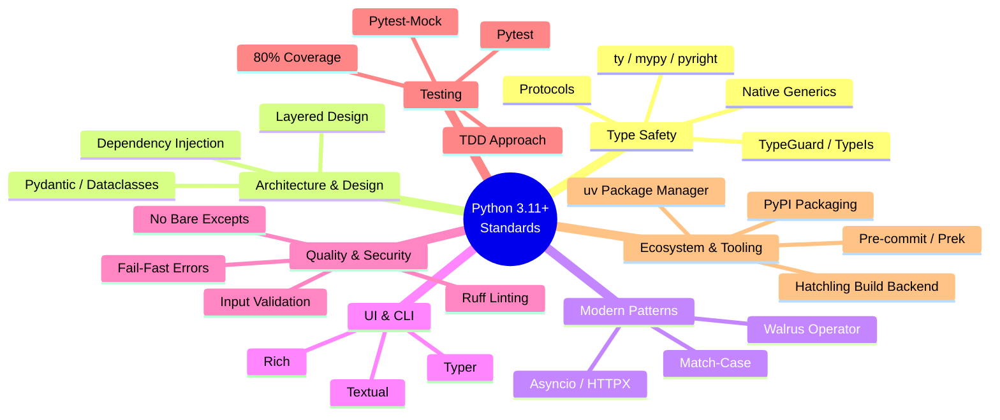

# Python 3 Development Standards & Workflows

This document centralizes the shared Python 3.11+ development standards, quality expectations, and workflows used across all Python agents and skills (including `code-reviewer`, `stinkysnake`, `snakepolish`, and `python3-review`).

## 1. Shared Development Standards

### 1.1 Type Safety & Modern Patterns
- **Native Types**: Use Python 3.11+ native type hints (e.g., `list[str]`, `dict[str, int]`, `str | None`) instead of legacy `typing` imports (`List`, `Dict`, `Optional`, `Union`).
- **Eliminate `Any`**: Replace `Any` with specific types, `TypeVar`, `Generic`, or `Protocol`.
- **Duck Typing**: Use `typing.Protocol` for structural subtyping instead of ABCs where appropriate.
- **Data Structures**: Use `dataclasses` (with `slots=True, frozen=True` when possible), `TypedDict` (with `NotRequired`), or `pydantic` for structured data.
- **Narrowing**: Use `TypeIs` (PEP 742, Python 3.13+) for bidirectional type narrowing. Use `TypeGuard` only when targeting Python < 3.13 without `typing_extensions`.
- **Modern Operators**: Utilize the walrus operator (`:=`) and `match-case` statements where they improve readability.
- **Type Checking (default)**: Use **ty** (Astral) as the primary type checker for new work and greenfield setup. Run `uv run ty check` (paths per project). See the `/python3-development:ty` skill for configuration and CLI reference.
- **Type Checking (existing projects on mypy)**: If **pre-commit, CI, or documented project commands actually run `mypy`**, **do not** force a migration to ty. Run **`uv run mypy`** per `mypy.ini` / `[tool.mypy]` when mypy is the active checker. **Do not** infer mypy from **`[tool.mypy]` alone** — repos may keep that table for IDE or legacy reasons while **ty** is what hooks run. Use `type-safety-mypy.md` for annotation patterns and mypy-specific docs when debugging mypy output.
- **Migrating to ty (IDE coexistence)**: When hooks/CI use **ty** as the real gate, **ty** is treated as meeting the same analysis needs this plugin previously satisfied with **mypy**, **basedpyright**, or **pyright** in CI — do not run those tools in automation in parallel unless the project explicitly chooses to. **IDEs** often start **mypy**, **basedpyright**, or **pyright** when they see config files or dev dependencies, which duplicates **ty** and produces conflicting squiggles. After migrating, **keep stub config** so built-in IDE checkers stay quiet: **`[tool.mypy]`** with **`exclude = [".*"]`** (or equivalent); **`[tool.basedpyright]`** with **`typeCheckingMode = "off"`** (and a comment that **ty** is authoritative); **`[tool.pyright]`** or **`pyrightconfig.json`** set to disable analysis (e.g. **`typeCheckingMode = "off"`**) when the editor respects it. **Do not** delete those tables solely to “clean up.” Detection of which checker **automation** runs must still follow **hooks/CI**, not the mere presence of stub sections. See `../../ty/references/migration-guide.md` (*IDE coexistence: stub legacy checkers*).
- **Other checkers**: When **pre-commit or CI actually runs** **basedpyright** or **pyright** (not merely stub config for the IDE), follow that project’s configuration; **do not** infer primary checker from stub **`[tool.basedpyright]`** / **`pyrightconfig.json`** alone if **ty** is what hooks invoke.
- **TOML**: Use `tomlkit` for TOML read and write (preserves formatting, comments). Use `tomllib` (stdlib) only for stdlib-only scripts.
- **Type Safety Reference**: For comprehensive type safety guidance including Generics, Protocols, TypedDict, Type Narrowing, attrs/dataclasses/pydantic comparison, see `type-safety-mypy.md`. (Filename references mypy docs; patterns apply to ty and other checkers unless a rule is mypy-specific.)
- **Version-Specific Features**: Not all type system features are available at all Python versions. Check the project's `requires-python` floor against the per-version supplements: `python311-features.md`, `python312-features.md`, `python313-features.md`, `python314-features.md`.
- **Version Lifecycle** (SOURCE: <https://devguide.python.org/versions>, accessed 2026-03-23): 3.10 EOL 2026-10, 3.11 security-only until 2027-10, 3.12 security-only until 2028-10, 3.13 bugfix until 2029-10, 3.14 bugfix until 2030-10. When choosing a `requires-python` floor, prefer versions still in bugfix status.

### 1.2 Architecture & Structure
- **Layered Architecture**: Separate concerns into clear boundaries: CLI → Core Logic → Services → Display/UI.
- **Shared Models**: Define data models, constants, and exceptions in a `shared/` or `models/` directory.
- **Dependency Injection**: Use `Protocol` classes to define expected interfaces for external services, allowing easy mocking.
- **Module Hygiene**: Keep functions under 50 lines, avoid deep nesting (>3 levels), prevent circular imports, and define `__all__` in public modules.

### 1.3 Error Handling & Security
- **Fail-Fast**: Catch specific exceptions only when you can recover or add context. Never use bare `except:` or swallow exceptions silently.
- **Contextualize**: Use `e.add_note()` or `raise ... from e` to add context to re-raised exceptions.
- **Security**:
  - Prevent SQL injection (use parameterized queries).
  - Prevent command injection (never use `shell=True` with user input).
  - Validate all external inputs.
  - Never hardcode secrets.

### 1.4 Performance
- **O(1) Lookups**: Use `set` for membership testing instead of `list`.
- **I/O**: Use async patterns (`asyncio`, `httpx`) for I/O-bound operations. Avoid synchronous I/O in async contexts.
- **Caching**: Cache repeated expensive function calls.
- **String Building**: Avoid string concatenation in loops; use `.join()` or list comprehensions.

### 1.6 Script Dependency Trade-offs
Understand the complexity vs portability trade-off when creating Python CLI scripts:

**Scripts with dependencies (Typer + Rich via PEP 723)**:
- **Benefits**: Less development complexity, less code to write, better UX (colors, progress bars), simple to execute (PEP 723 makes it a single-file executable; uv handles dependencies).
- **Trade-off**: Requires network access on first run (to fetch packages).
- **Default recommendation**: Use Typer + Rich with PEP 723 unless you have specific portability requirements that prevent network access.

**stdlib-only scripts**:
- **Benefits**: Maximum portability - Runs on ANY Python installation without network access. Best for air-gapped systems or restricted corporate environments.
- **Trade-offs**: More development complexity (manual argparse, formatting), more code to write and test, basic UX.

### 1.7 UI & CLI (Rich / Typer)
- **Rich Emoji Usage**: In Rich console output, always use Rich emoji tokens (e.g., `:white_check_mark:`) instead of literal Unicode emojis. This ensures cross-platform compatibility, consistent rendering, and markdown-safe alignment.
- **Width Handling**: For Rich table and panel width patterns, use `Measurement.get(console, console.options, renderable)`. See `typer-rich-non-tty-patterns.md` in the `python3-cli` skill for examples.

### 1.8 Exception Handling Pattern
Catch exceptions only when you have a specific recovery action. Let all other errors propagate to the caller.
```python
def get_user_with_handling(id):
    try:
        return db.query(User, id)
    except ConnectionError:
        logger.warning("DB unavailable, using cache")
        return cache.get(f"user:{id}")  # Specific recovery action
```
- **Test-First (TDD)**: Write failing tests against defined interfaces before implementing logic.
- **Framework**: Use `pytest` with `pytest-mock` (avoid `unittest.mock`).
- **Coverage**: Maintain a minimum of 80% test coverage, ensuring edge cases are handled. Critical paths require 95%+ coverage and mutation testing.
- **Test Quality**:
  - Follow the AAA (Arrange-Act-Assert) pattern.
  - Test names must describe behavior, not implementation (e.g., `test_process_payment_when_insufficient_funds_returns_declined`).
  - Tests must be isolated and independent.
- **Test Failure Mindset**: Treat every test failure as a potential bug discovery, not an annoyance. Use a dual-hypothesis approach (Test is wrong vs. Implementation is wrong). Never automatically change a test to match the implementation.
- **Docstrings**: Use Google-style docstrings (Args/Returns/Raises) for all public functions and classes.
- **Sync Docs**: Ensure `CLAUDE.md` and architecture documents are updated when adding new commands or modules.

---

## 2. Python Development Knowledge Graph

This graph illustrates the relationships between our core Python concepts, standards, and the tools we use to enforce them.



---

## 3. Python Development Process Graph

This graph shows the lifecycle of Python development, illustrating exactly **where** and **why** each skill/agent is used in the workflow.

```mermaid
flowchart TD
    %% Define Styles
    classDef trigger fill:#e1f5fe,stroke:#3b82f6,stroke-width:2px;
    classDef plan fill:#fff3e0,stroke:#ff9800,stroke-width:2px;
    classDef implement fill:#e8f5e9,stroke:#4caf50,stroke-width:2px;
    classDef verify fill:#f3e5f5,stroke:#9c27b0,stroke-width:2px;

    %% Nodes
    Start([Feature Request / Tech Debt]) ::: trigger

    subgraph Planning Phase
        DesignSpec[python-cli-design-spec<br/>Create Architecture & Interfaces] ::: plan
        StinkySnake[stinkysnake<br/>Analyze & Plan Refactoring] ::: plan
    end

    subgraph Test-Driven Phase
        TestArch[python-pytest-architect<br/>Write Failing Tests] ::: implement
    end

    subgraph Implementation Phase
        CliArch[python-cli-architect<br/>Implement Core Logic] ::: implement
        SnakePolish[snakepolish<br/>Iterative Implement & Test Loop] ::: implement
    end

    subgraph Verification Phase
        StaticAnalysis[Ruff + type checker<br/>ty default; mypy if configured] ::: verify
        Review[code-reviewer / python3-review<br/>Holistic Quality & Pattern Check] ::: verify
    end

    Done([Ready for Merge]) ::: trigger

    %% Edges
    Start -->|New Feature| DesignSpec
    Start -->|Refactor Legacy| StinkySnake

    DesignSpec --> TestArch
    StinkySnake --> TestArch

    TestArch -->|Tests Fail| CliArch
    TestArch -->|Tests Fail| SnakePolish

    CliArch --> StaticAnalysis
    SnakePolish --> StaticAnalysis

    StaticAnalysis -->|Pass| Review
    StaticAnalysis -->|Fail| CliArch

    Review -->|Issues Found| CliArch
    Review -->|Approved| Done
```

### Workflow Explanations

1. **Planning Phase**:
   - When building something new, `python-cli-design-spec` creates the architecture and defines the interfaces.
   - When fixing technical debt, `stinkysnake` analyzes the codebase, finds `Any` types, and creates a modernization plan.
2. **Test-Driven Phase**:
   - `python-pytest-architect` reads the interfaces/plans and writes tests *first*. These tests will initially fail.
3. **Implementation Phase**:
   - `python-cli-architect` writes the actual code.
   - `snakepolish` is an automated loop that implements code and runs tests iteratively until the tests pass.
4. **Verification Phase**:
   - Automated static analysis: **`ruff`** plus the project's type checker — **ty** by default; **`mypy`** when the repo already configures it (never force migration off mypy).
   - `code-reviewer` (or `python3-review`) performs a holistic, human-like review to ensure the code follows the standards defined in Section 1 (Architecture, Security, Modern Patterns). If it finds issues, it kicks the process back to implementation.

---

## 4. Reviewing and Amending Standards

The standards and graphs in this document are living artifacts. If you discover new best practices, identify missing ecosystem tools, or find that the current standards contradict official Python documentation (PEPs), you MUST update this document.

### Process for Amending Standards
1. **Identify the Gap**:
   - **Trigger**: An agent encounters a recurring failure mode, a new tool is introduced to the ecosystem, or a user explicitly requests a standard update.
   - **Research**: Use the `WebFetch` or `WebSearch` tools to verify the proposed standard against primary sources (e.g., Python PEPs, official library documentation like `docs.pytest.org` or `docs.astral.sh`).
   - **Compare**: Compare the verified best practice against the existing nodes in the Knowledge Graph and the rules in Section 1. If the concept is missing or the existing rule is anti-pattern, a gap is identified.
2. **Update the Text**: Add or modify the relevant bullet points in `Section 1. Shared Development Standards`. Ensure the new rule is concise and actionable.
3. **Update the Knowledge Graph**: If adding a new tool, library, or core concept, add a corresponding node to the Mermaid mindmap in `Section 2. Python Development Knowledge Graph`.
4. **Update the Process Graph**: If adding a new agent or altering the development workflow, update the Mermaid flowchart in `Section 3. Python Development Process Graph` to show exactly where the new step fits into the lifecycle.
5. **Validate**: Ensure that the changes do not introduce contradictions with other rules in this document or the `language-manifest.md`.
