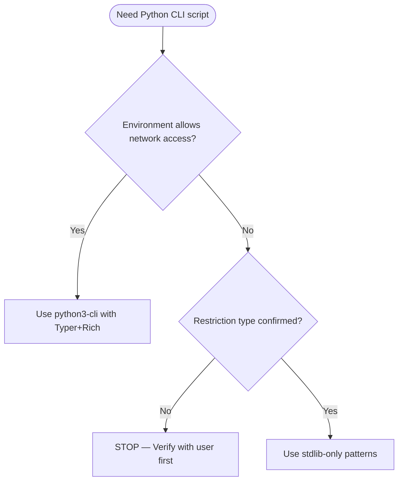

# Constrained / Legacy Environments

Consult `python3-core` for standing defaults.

**This skill is for CONFIRMED constraints only.** Do not assume restrictions. Verify with the user first.



## Required Behavior

- Preserve compatibility before applying modernization patterns
- Prefer stdlib solutions when dependency policy is restrictive
- Choose typing features valid for the project floor
- Make boundary wrappers explicit when Pydantic is unavailable
- Avoid recommending tools or syntax that exceed the project lane

## Stdlib CLI

```python
import argparse

def create_parser() -> argparse.ArgumentParser:
    parser = argparse.ArgumentParser(
        description="Tool description",
        formatter_class=argparse.RawDescriptionHelpFormatter,
    )
    return parser
```

## Stdlib Logging

```python
import logging
from pathlib import Path

def setup_logging(level: str = "INFO", log_file: Path | None = None) -> None:
    handlers: list[logging.Handler] = [logging.StreamHandler()]
    if log_file:
        handlers.append(logging.FileHandler(log_file))
    logging.basicConfig(
        level=getattr(logging, level.upper(), logging.INFO),
        format="%(asctime)s %(name)s %(levelname)s %(message)s",
        handlers=handlers,
    )
```

## Stdlib Config

```python
import json, tomllib
from pathlib import Path

def load_config(path: Path) -> dict[str, object]:
    ext = path.suffix.lower()
    if ext == ".json":
        return json.loads(path.read_text())
    if ext == ".toml":
        return tomllib.loads(path.read_text())
    raise ValueError(f"Unsupported config format: {ext}")
```

## Shebang

Stdlib-only scripts use `#!/usr/bin/env python3` (no PEP 723 metadata — nothing to declare).

## References

- `references/command-execution.md`, `references/type-safety-patterns.md`, `references/typing-strategy.md` — stdlib patterns and compatibility guidance
