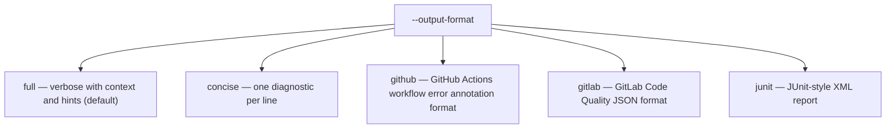

# CLI Reference

Complete command syntax, flags, and subcommands for ty. Load when the user asks how to run ty, what flags are available, or what subcommands exist.

## Table of Contents

1. [Top-Level Commands](#top-level-commands)
2. [ty check — Flags](#ty-check--flags)
3. [ty server](#ty-server)
4. [ty version](#ty-version)
5. [ty generate-shell-completion](#ty-generate-shell-completion)
6. [Exit Codes](#exit-codes)
7. [Quick Invocation Examples](#quick-invocation-examples)

---

## Top-Level Commands

```text
ty <COMMAND>
```

| Command | Purpose |
|---------|---------|
| `ty check` | Check a project for type errors |
| `ty server` | Start the language server |
| `ty version` | Display ty's version |
| `ty help` | Print help message or help for a subcommand |
| `ty generate-shell-completion` | Generate shell completion scripts |

---

## ty check — Flags

```text
ty check [OPTIONS] [PATH]...
```

`PATHS` — list of files or directories to check. Default: the project root.

| Flag | Argument | Description |
|------|----------|-------------|
| `--add-ignore` | — | Adds `ty: ignore` comments to suppress all rule diagnostics |
| `--color` | `auto\|always\|never` | Control when colored output is used. Default: `auto` |
| `--config`, `-c` | `<KEY>=<VALUE>` | TOML key-value pair overriding a specific configuration option. Always takes precedence over config files |
| `--config-file` | `path` | Path to a `ty.toml` file. Not allowed with `pyproject.toml`. Also set via `TY_CONFIG_FILE` env var |
| `--error` | `rule` | Treat the given rule as severity `error`. Use `all` to apply to all rules. Repeatable |
| `--error-on-warning` | — | Use exit code 1 if any warning-level diagnostics exist |
| `--exclude` | `pattern` | Gitignore-style glob patterns to exclude from checking. Repeatable |
| `--exit-zero` | — | Always use exit code 0, even when error-level diagnostics exist |
| `--extra-search-path` | `path` | Additional module-resolution source path. Repeatable. Advanced use only |
| `--force-exclude` | — | Enforce exclusions for paths passed directly on the command line. Use `--no-force-exclude` to disable |
| `--help`, `-h` | — | Print help |
| `--ignore` | `rule` | Disable the rule. Use `all` to apply to all rules. Repeatable |
| `--no-progress` | — | Hide all progress outputs (spinners, progress bars) |
| `--output-format` | `full\|concise\|gitlab\|github\|junit` | Format for diagnostic messages. Also set via `TY_OUTPUT_FORMAT`. Default: `full` |
| `--project` | `project` | Run within the given project directory. Discovers `pyproject.toml` walking up from this dir |
| `--python`, `--venv` | `path` | Path to Python interpreter, venv directory, or `sys.prefix` directory |
| `--python-platform`, `--platform` | `platform` | Target platform for type resolution. Use `all` to make no platform assumptions |
| `--python-version`, `--target-version` | `version` | Python version to assume. Accepts `3.7`–`3.15` |
| `--quiet`, `-q` | — | Quiet output. Use `-qq` for silent output |
| `--respect-ignore-files` | — | Respect `.gitignore` and other standard ignore files. Use `--no-respect-ignore-files` to disable |
| `--typeshed`, `--custom-typeshed-dir` | `path` | Custom directory for stdlib typeshed stubs |
| `--verbose`, `-v` | — | Verbose output. Use `-vv` or `-vvv` for more verbosity |
| `--warn` | `rule` | Treat the given rule as severity `warn`. Use `all` for all rules. Repeatable |
| `--watch`, `-W` | — | Watch files for changes and recheck affected files |

Rule severity flags priority: `--error`, `--warn`, `--ignore` are repeatable; subsequent options override earlier ones.

### --output-format values



---

## ty server

```text
ty server
```

Starts the language server (LSP). Connect with any editor that supports the Language Server Protocol.

---

## ty version

```text
ty version [OPTIONS]
```

| Flag | Argument | Description |
|------|----------|-------------|
| `--output-format` | `text\|json` | Format for version output. Default: `text` |
| `--help`, `-h` | — | Print help |

---

## ty generate-shell-completion

```text
ty generate-shell-completion <SHELL>
```

`SHELL` argument — required. Supported shells: `bash`, `zsh`, `fish`, `elvish`, `powershell`.

Shell setup examples:

```bash
# Bash
echo 'eval "$(ty generate-shell-completion bash)"' >> ~/.bashrc

# Zsh
echo 'eval "$(ty generate-shell-completion zsh)"' >> ~/.zshrc

# fish
echo 'ty generate-shell-completion fish | source' > ~/.config/fish/completions/ty.fish
```

---

## Exit Codes

| Code | Meaning |
|------|---------|
| `0` | No violations with severity `error` or higher were found |
| `1` | Violations with severity `error` or higher were found |
| `2` | Invalid CLI options, invalid configuration, or IO errors |
| `101` | Internal error |

Exit code modifiers:

- `--exit-zero` — always exits with `0` even if violations exist
- `--error-on-warning` — exits with `1` if any `warning`-level violations exist

---

## Quick Invocation Examples

```bash
# Run without installation (latest version)
uvx ty check

# Check the whole project
uv run ty check

# Check a specific file
ty check example.py

# Check specific directories
ty check src scripts/benchmark.py

# Watch mode (incremental)
ty check --watch

# Strict: treat all warnings as errors
ty check --error all

# CI-friendly: GitHub Actions output format
ty check --output-format github

# Override a single config option without modifying config file
ty check --config "terminal.output-format='concise'"

# Target a specific Python version
ty check --python-version 3.11

# Explicit venv path
ty check --python .venv
```
