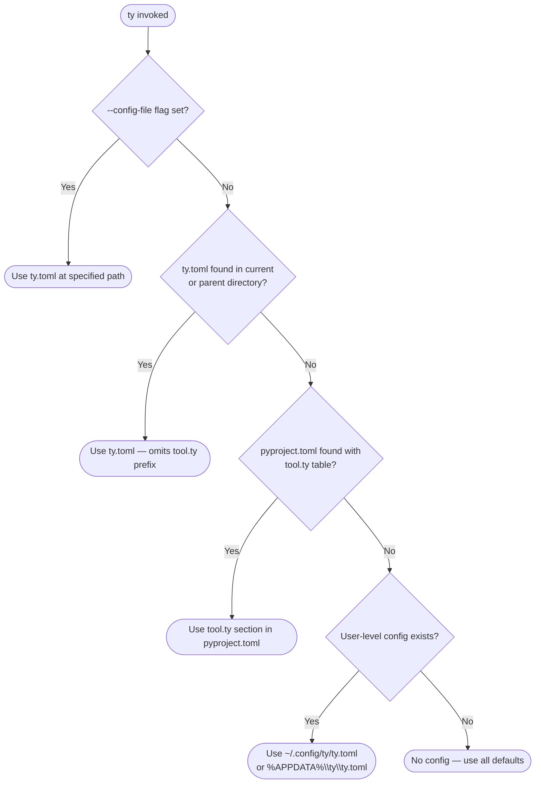

# Configuration Schema

All ty configuration keys, their types, defaults, and valid values. Load when the user asks about ty.toml, pyproject.toml settings, or any configuration option.

## Table of Contents

1. [Configuration File Discovery](#configuration-file-discovery)
2. [rules](#rules)
3. [analysis](#analysis)
4. [environment](#environment)
5. [src](#src)
6. [terminal](#terminal)
7. [overrides](#overrides)
8. [Config Key Override via CLI](#config-key-override-via-cli)

---

## Configuration File Discovery

Config file locations and precedence:



Precedence order (highest to lowest):

1. CLI flags and `--config KEY=VALUE` options
2. `ty.toml` in project directory
3. `[tool.ty]` in `pyproject.toml` (ignored if `ty.toml` is present in same dir)
4. User-level `ty.toml` at `~/.config/ty/ty.toml` (macOS/Linux) or `%APPDATA%\ty\ty.toml` (Windows)

When project and user config are both present, scalar values use project config; arrays are merged (project-level entries appear later in the merged array).

---

## rules

Configures enabled rules and their severity. Keys are rule names or `all`.

```toml
# pyproject.toml
[tool.ty.rules]
possibly-unresolved-reference = "warn"
division-by-zero = "ignore"
all = "error"

# ty.toml
[rules]
possibly-unresolved-reference = "warn"
division-by-zero = "ignore"
```

Valid severity values:

- `"ignore"` — disable the rule
- `"warn"` — enable and report as warning; exit code 0 unless `--error-on-warning`
- `"error"` — enable and report as error; exit code 1 if any emitted

**Type**: `dict[RuleName | "all", "ignore" | "warn" | "error"]`

**Default**: built-in defaults per rule

---

## analysis

### analysis.allowed-unresolved-imports

Suppresses `unresolved-import` diagnostics for matching module glob patterns.

**Default**: `[]`
**Type**: `list[str]`

Glob pattern rules:
- `*` matches zero or more characters except `.`
- `**` matches any number of module components
- Prefix `!` to exclude matching modules
- Later entries take precedence when multiple patterns match

```toml
# pyproject.toml
[tool.ty.analysis]
allowed-unresolved-imports = ["test.**", "!test.foo"]

# ty.toml
[analysis]
allowed-unresolved-imports = ["test.**", "!test.foo"]
```

### analysis.replace-imports-with-any

Replaces imports with `typing.Any` for matching module glob patterns. Suppresses import diagnostics unconditionally, unlike `allowed-unresolved-imports`.

**Default**: `[]`
**Type**: `list[str]`

```toml
[tool.ty.analysis]
replace-imports-with-any = ["pandas.**", "numpy.**"]
```

### analysis.respect-type-ignore-comments

Whether ty respects `type: ignore` comments. Set to `false` to require `ty: ignore` instead.

**Default**: `true`
**Type**: `bool`

```toml
[tool.ty.analysis]
respect-type-ignore-comments = false
```

---

## environment

### environment.extra-paths

User-provided paths that take first priority in module resolution. For modules not installed conventionally.

**Default**: `[]`
**Type**: `list[str]`

```toml
[tool.ty.environment]
extra-paths = ["./shared/my-search-path"]
```

### environment.python

Path to project's Python environment or interpreter for resolving third-party imports.

Accepts:
- Python interpreter path: `.venv/bin/python3`
- Virtual environment directory: `.venv`
- System Python `sys.prefix` directory: `/usr`

**Default**: `null` (auto-detected)
**Type**: `str`

```toml
[tool.ty.environment]
python = "./custom-venv-location/.venv"
```

### environment.python-platform

Target platform for type resolution. Affects `sys.platform` specialization.

**Default**: current system platform
**Type**: `"win32" | "darwin" | "android" | "ios" | "linux" | "all" | str`

Using `"all"` makes no platform assumptions.

```toml
[tool.ty.environment]
python-platform = "win32"
```

### environment.python-version

Target Python version for analysis. Format `M.m` (e.g. `"3.12"`).

**Default**: `"3.14"` (fallback; see python-version-resolution workflow)
**Type**: `"3.7" | "3.8" | "3.9" | "3.10" | "3.11" | "3.12" | "3.13" | "3.14" | <major>.<minor>`

```toml
[tool.ty.environment]
python-version = "3.12"
```

### environment.root

Root paths for finding first-party modules. Priority order (first has highest priority).

Auto-detected if unspecified; includes `.`, `./src` (if no `__init__.py`), `./<project-name>` (if `<project-name>/<project-name>` exists), `./python`.

**Default**: `null`
**Type**: `list[str]`

```toml
[tool.ty.environment]
root = ["./src", "./lib", "./vendor"]
```

### environment.typeshed

Custom typeshed directory for stdlib type stubs. Falls back to vendored stubs if unset.

**Default**: `null`
**Type**: `str`

---

## src

### src.exclude

File and directory patterns to exclude from type checking. Gitignore-style syntax.

**Default**: many common directories excluded by default (`.venv/`, `.git/`, `dist/`, `node_modules/`, etc.)
**Type**: `list[str]`

```toml
[tool.ty.src]
exclude = [
    "generated",
    "*.proto",
    "tests/fixtures/**",
    "!tests/fixtures/important.py"
]
```

To re-include a default-excluded directory, prefix with `!`:

```toml
[tool.ty.src]
exclude = ["!dist"]
```

### src.include

Files and directories to include for type checking.

**Default**: `null` (all files)
**Type**: `list[str]`

`exclude` takes precedence over `include`.

```toml
[tool.ty.src]
include = ["src", "tests"]
```

### src.respect-ignore-files

Whether to exclude files listed in `.ignore`, `.gitignore`, `.git/info/exclude`, and global gitignore files.

**Default**: `true`
**Type**: `bool`

### src.root (DEPRECATED)

Use `environment.root` instead.

---

## terminal

### terminal.error-on-warning

Use exit code 1 if any warning-level diagnostics are emitted.

**Default**: `false`
**Type**: `bool`

```toml
[tool.ty.terminal]
error-on-warning = true
```

### terminal.output-format

Format for printing diagnostic messages.

**Default**: `"full"`
**Type**: `full | concise | github | gitlab | junit`

```toml
[tool.ty.terminal]
output-format = "concise"
```

---

## overrides

Per-file rule configuration based on glob patterns. Multiple overrides can match the same file; later overrides take precedence.

```toml
# Relax rules in test files
[[tool.ty.overrides]]
include = ["tests/**", "**/test_*.py"]

[tool.ty.overrides.rules]
possibly-unresolved-reference = "warn"

# Ignore rule in generated files but keep one important file
[[tool.ty.overrides]]
include = ["generated/**"]
exclude = ["generated/important.py"]

[tool.ty.overrides.rules]
possibly-unresolved-reference = "ignore"
```

### overrides.include

Glob patterns of files this override applies to. Default: `["**"]` (all files).
**Type**: `list[str]`

### overrides.exclude

Glob patterns to exclude from this override. Takes precedence over `include` within same override.
**Type**: `list[str]`

### overrides.rules

Rule severity overrides for matching files. Merged with global rules; override rules take precedence for matching files.
**Type**: `dict[RuleName | "all", "ignore" | "warn" | "error"]`

### overrides.analysis

All `analysis.*` keys are also valid under `overrides.analysis` for per-file scope.

---

## Config Key Override via CLI

Any configuration key can be overridden inline without editing the config file:

```bash
ty check --config "terminal.output-format='concise'"
ty check --config "rules.possibly-unresolved-reference='error'"
```

`--config` always takes precedence over all config files.
