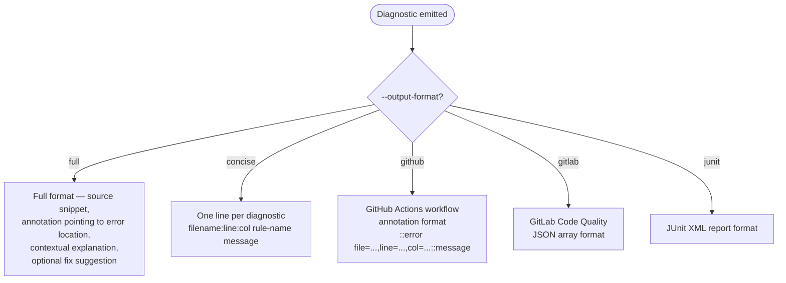

# Rules and Diagnostics

Rule levels, suppression comments, diagnostic output, and the `unused-ignore-comment` rule. Load when the user asks about suppressing errors, configuring rule severity, or interpreting ty diagnostic output.

## Table of Contents

1. [Rule Levels](#rule-levels)
2. [Configuring Rule Levels](#configuring-rule-levels)
3. [Suppression Comments](#suppression-comments)
4. [Standard type-ignore Comments](#standard-type-ignore-comments)
5. [The @no_type_check Decorator](#the-no_type_check-decorator)
6. [Unused Suppression Comments](#unused-suppression-comments)
7. [Diagnostic Output Formats](#diagnostic-output-formats)

---

## Rule Levels

Each rule has one of three severity levels:

| Level | Behavior | Exit code effect |
|-------|----------|-----------------|
| `error` | Reported as error | Exit code 1 if any emitted |
| `warn` | Reported as warning | Exit code 0 (unless `--error-on-warning`) |
| `ignore` | Rule disabled, not reported | No effect |

---

## Configuring Rule Levels

### Via CLI flags

```bash
ty check \
  --warn unused-ignore-comment \
  --ignore redundant-cast \
  --error possibly-missing-attribute \
  --error possibly-missing-import
```

`--warn`, `--error`, `--ignore` flags are repeatable. Subsequent options override earlier ones.

Apply to all rules at once with `all`:

```bash
ty check --error all
ty check --warn all
ty check --ignore all
```

### Via configuration file

```toml
# pyproject.toml
[tool.ty.rules]
unused-ignore-comment = "warn"
redundant-cast = "ignore"
possibly-missing-attribute = "error"
all = "error"

# ty.toml
[rules]
all = "error"
possibly-missing-attribute = "warn"
```

---

## Suppression Comments

### ty: ignore — inline suppression

Add `# ty: ignore[<rule>]` at the end of the offending line:

```python
a = 10 + "test"  # ty: ignore[unsupported-operator]
```

### Multi-line violations

Suppress on the first or last line of the violation:

```python
# On the first line:
sum_three_numbers(  # ty: ignore[missing-argument]
    3,
    2
)

# Or on the last line:
sum_three_numbers(
    3,
    2
)  # ty: ignore[missing-argument]
```

### Multiple rules on one line

Enumerate rule names separated by commas:

```python
sum_three_numbers("one", 5)  # ty: ignore[missing-argument, invalid-argument-type]
```

### Bare ty: ignore (without rule name)

`# ty: ignore` without specifying a rule suppresses all violations on the line. Strongly discouraged — use specific rule names to avoid accidental suppression.

### Coexisting with other suppression comments

```python
result = calculate()  # ty: ignore[invalid-argument-type]  # fmt: skip
result = calculate()  # fmt: off  # ty: ignore[invalid-argument-type]
```

---

## Standard type-ignore Comments

ty respects `type: ignore` comments from PEP 484 by default.

```python
sum_three_numbers("one", 5)  # type: ignore
```

Unlike `ty: ignore`, a `type: ignore[code]` suppresses ALL violations on the line even when a code is specified.

Disable `type: ignore` support by setting:

```toml
[tool.ty.analysis]
respect-type-ignore-comments = false
```

When disabled, `type: ignore` is treated as a normal comment and has no suppression effect.

---

## The @no_type_check Decorator

Suppresses all ty violations inside a function:

```python
from typing import no_type_check

def sum_three_numbers(a: int, b: int, c: int) -> int:
    return a + b + c

@no_type_check
def main():
    sum_three_numbers(1, 2)  # no error for the missing argument
```

Decorating a CLASS with `@no_type_check` is not supported.

---

## Unused Suppression Comments

When the `unused-ignore-comment` rule is enabled, ty reports `ty: ignore` and `type: ignore` comments that do not suppress any violation.

`unused-ignore-comment` violations can ONLY be suppressed with:

```python
# ty: ignore[unused-ignore-comment]
```

Cannot be suppressed with:
- `# ty: ignore` (bare, without rule code)
- `# type: ignore`

---

## Diagnostic Output Formats

ty diagnostics include code snippets, annotations, and contextual explanations.



The `full` format includes:
- Source code context around the error
- Annotation pointing to the specific location
- Reference to related definitions (e.g., TypedDict key definition for a TypedDict error)
- Fix suggestions for known patterns (e.g., correct spelling for misspelled TypedDict keys)
- Reason why a symbol is unavailable (e.g., "tomllib was added in Python 3.11, but your project targets 3.10")
