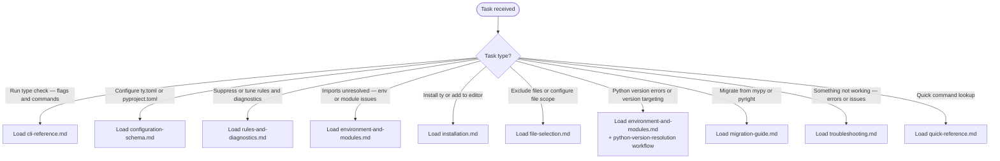

# ty — Python Type Checker

With this skill loaded, Claude can configure ty, run type checks, interpret diagnostics, suppress specific errors, set Python version targets, resolve environment issues, and integrate ty into editors and CI pipelines.

**ty version:**
!`ty --version 2>/dev/null || echo "ty not found in PATH — use 'uvx ty check' or 'uv run ty check'"`

## Scope

TRIGGER: Activate when the user asks about ty — type checking Python code, configuring ty, suppressing type errors, understanding diagnostics, or integrating ty with editors or CI.

COVERS:

- CLI commands and all `ty check` flags
- `ty.toml` and `pyproject.toml` configuration schema (all sections)
- Rule levels (`error`, `warn`, `ignore`) and per-file overrides
- Suppression comments (`ty: ignore`, `type: ignore`, `@no_type_check`)
- Environment and module discovery (virtual environments, PYTHONPATH, Conda)
- Python version resolution and targeting
- File include/exclude patterns and gitignore integration
- All installation methods (uv, pip, pipx, Docker, standalone installer)
- Editor integration (VS Code, Neovim, Zed, PyCharm, any LSP editor)

DOES NOT COVER:

- mypy or pyright configuration (different tools — see migration guide for switching)
- Writing type annotations in Python source code
- ty's internal type system theory (use the ty type system documentation for that)

## Workflow



## Workflows

- `resources/workflows/python-version-resolution.md`
- `resources/workflows/environment-discovery.md`

## Reference Files

### CLI Reference

Complete flag syntax for `ty check`, all subcommands (`ty server`, `ty version`, `ty generate-shell-completion`), output format options, exit codes, and invocation examples.
Load when the user asks how to run ty or what flags to use.

`references/cli-reference.md`

### Configuration Schema

All configuration keys for `ty.toml` and `pyproject.toml [tool.ty]` — `rules`, `analysis`, `environment`, `src`, `terminal`, and `overrides` sections — with types, defaults, and examples.
Load when the user asks about configuration options or wants to set up a ty.toml.

`references/configuration-schema.md`

### Rules and Diagnostics

Rule level semantics (`error`, `warn`, `ignore`), CLI flags for rule severity, inline suppression comments (`ty: ignore`, `type: ignore`), the `@no_type_check` decorator, unused suppression detection, and diagnostic output formats.
Load when the user asks about suppressing errors or tuning rule severity.

`references/rules-and-diagnostics.md`

### Environment and Module Resolution

How ty discovers Python environments (virtual env, Conda, PATH), first-party and third-party module resolution, all environment variables ty reads or defines, and `allowed-unresolved-imports` / `replace-imports-with-any` settings.
Load when the user has unresolved import errors or needs to configure the Python environment.

`references/environment-and-modules.md`

### Installation

All installation methods — `uvx`, `uv add --dev`, `uv tool install`, standalone installer, `pipx`, `pip`, `mise`, Docker, and GitHub Releases — plus shell autocompletion setup and editor integration (VS Code, Neovim, Zed, PyCharm, any LSP editor).
Load when the user asks how to install ty or add it to a project.

`references/installation.md`

### File Selection

How ty discovers Python files, configuring `src.include` and `src.exclude` patterns, the full list of default excluded directories, gitignore integration (`respect-ignore-files`), `--force-exclude` behavior, and virtual environment file handling.
Load when the user asks which files ty checks or how to exclude specific paths.

`references/file-selection.md`

### Migration Guide

Migration from mypy and pyright to ty. Command mapping, configuration translation, error code mapping (mypy codes to ty rule names), suppression comment conversion, behavioral differences, and automated baseline suppression with `--add-ignore`.
Load when the user asks about switching from mypy or pyright to ty.

`references/migration-guide.md`

### Quick Reference

All ty commands, flags, output formats, exit codes, suppression comment syntax, and common configuration patterns in a single lookup card.
Load for quick command lookup or when the user needs a concise reference.

`references/quick-reference.md`

### Troubleshooting

Common issues and solutions: ty not found, config not detected, unresolved imports, Python version mismatches, suppression comments not working, CI integration, editor LSP setup, and performance on large projects.
Load when the user encounters errors or unexpected behavior with ty.

`references/troubleshooting.md`

## Common Errors

**`error[unresolved-import]: Cannot resolve imported module 'X'`** — Add the directory containing module `X` to `[tool.ty.environment] extra-paths` in `pyproject.toml`; run `uv run ty check <path>` to verify; if errors persist, confirm `pyproject.toml` is the config ty is reading (a `ty.toml` in the project root takes precedence and `pyproject.toml` will be ignored).

## Quick Reference

```bash
# Run without install
uvx ty check

# Check project (in uv project)
uv run ty check

# Watch mode
ty check --watch

# Treat all warnings as errors
ty check --error all

# GitHub Actions CI output
ty check --output-format github

# Suppress a specific rule for one file
ty check --ignore unused-ignore-comment

# Target Python 3.11
ty check --python-version 3.11
```
