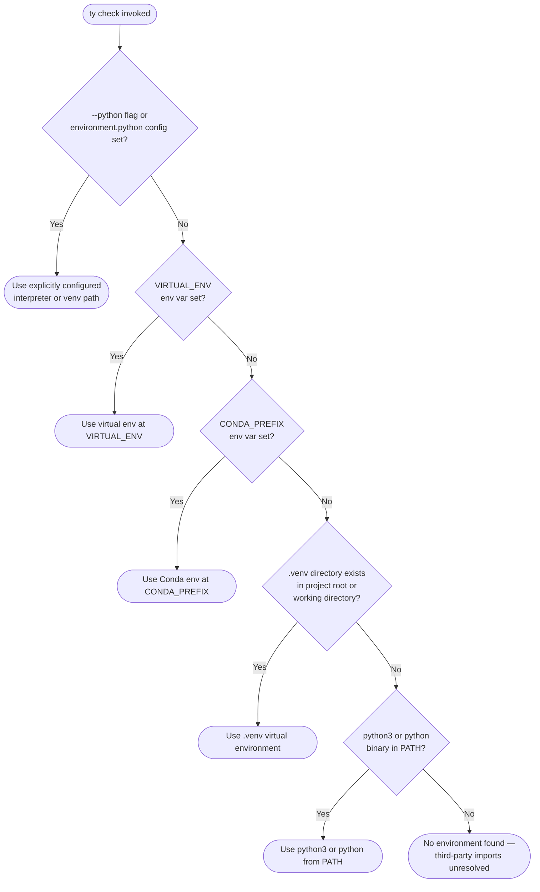

# Environment Discovery

```mermaid
flowchart TD
    Start([ty check invoked]) --> Q1{--python flag or<br>environment.python config set?}
    Q1 -->|Yes| UseExplicit([Use explicitly configured<br>interpreter or venv path])
    Q1 -->|No| Q2{VIRTUAL_ENV<br>env var set?}
    Q2 -->|Yes| UseVirtualEnv([Use virtual env at VIRTUAL_ENV])
    Q2 -->|No| Q3{CONDA_PREFIX<br>env var set?}
    Q3 -->|Yes| UseConda([Use Conda env at CONDA_PREFIX])
    Q3 -->|No| Q4{.venv directory exists<br>in project root or<br>working directory?}
    Q4 -->|Yes| UseDotVenv([Use .venv virtual environment])
    Q4 -->|No| Q5{python3 or python<br>binary in PATH?}
    Q5 -->|Yes| UsePath([Use python3 or python from PATH])
    Q5 -->|No| NoEnv([No environment found —<br>third-party imports unresolved])
```
