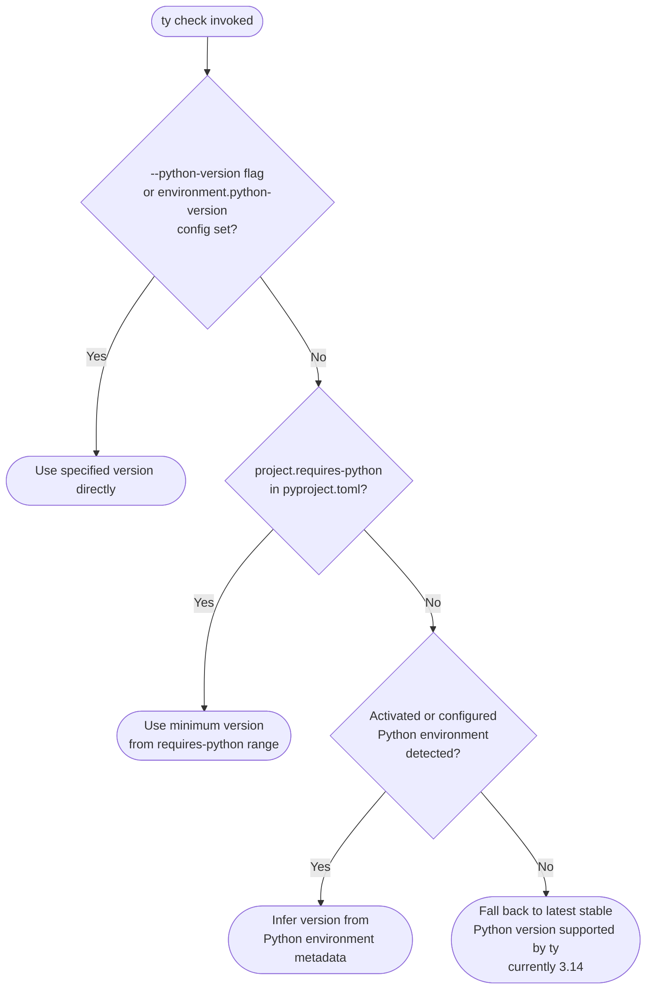

# Python Version Resolution

```mermaid
flowchart TD
    Start([ty check invoked]) --> Q1{--python-version flag<br>or environment.python-version<br>config set?}
    Q1 -->|Yes| UseExplicit([Use specified version directly])
    Q1 -->|No| Q2{project.requires-python<br>in pyproject.toml?}
    Q2 -->|Yes| UseRequires([Use minimum version<br>from requires-python range])
    Q2 -->|No| Q3{Activated or configured<br>Python environment<br>detected?}
    Q3 -->|Yes| InferVenv([Infer version from<br>Python environment metadata])
    Q3 -->|No| Fallback([Fall back to latest stable<br>Python version supported by ty<br>currently 3.14])
```
