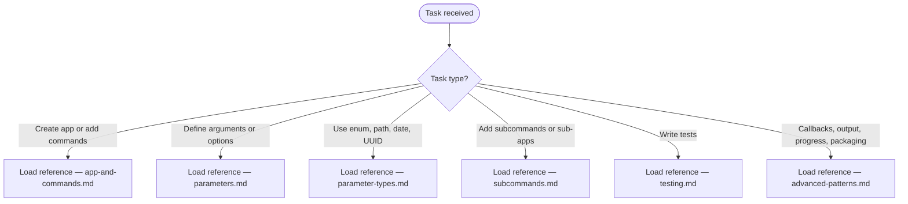

# Typer Knowledge

Build CLI applications with Typer by annotating Python functions. Typer converts type annotations into validated CLI parameters with auto-generated help text.

**Typer version:**
!`python -c "import typer; print(typer.__version__)" 2>/dev/null || echo "not found in PATH"`

## Scope

Consult `python-engineering:python3-core` for standing defaults (architecture, typing, testing, CLI rules).

TRIGGER: Activate when the user asks about building CLIs with Typer, defining CLI arguments or options, composing subcommands, testing CLI apps, or using Typer features like prompts, enums, progress bars, or autocompletion.

COVERS:

- App creation with `typer.Typer()` and `typer.run()`
- CLI arguments (`typer.Argument()`) and options (`typer.Option()`)
- Parameter types — enums, paths, numbers, dates, UUIDs, custom
- Subcommand composition with `app.add_typer()`
- Testing with `typer.testing.CliRunner`
- Output, colors, progress bars, callbacks, and autocompletion

DOES NOT COVER:

- Click internals beyond what Typer exposes
- Rich library beyond `typer.echo` / `typer.style`
- FastAPI or other web frameworks

## Workflow



## Reference Files

### App and Commands

Core patterns for creating Typer apps, registering commands with `@app.command()`, configuring multi-command apps, and controlling command naming and help text.
Load when creating a new app, adding commands, or configuring app-level behavior.

`../python3-cli/references/typer-app-and-commands.md`

### Parameters

Complete reference for CLI arguments and CLI options — `typer.Argument()`, `typer.Option()`, defaults, required vs optional, help text, prompts, password input, option names, environment variable bindings, multiple values, bool flags, and version options.
Load when defining any CLI parameter or controlling how input is received.

`../python3-cli/references/typer-parameters.md`

### Parameter Types

Type annotations Typer understands — `str`, `int`, `float`, `bool`, `enum.Enum`, `Literal`, `pathlib.Path`, file objects, `datetime`, `UUID`, and custom Click `ParamType` subclasses.
Load when restricting parameter values to a set, validating paths, parsing dates, or implementing custom types.

`../python3-cli/references/typer-parameter-types.md`

### Subcommands

Composing multiple `typer.Typer()` instances with `app.add_typer()` to create nested command hierarchies. Covers single-file and multi-file patterns, naming, help text, and callback overrides.
Load when adding sub-apps, creating command groups, or building git-style multi-level command trees.

`../python3-cli/references/typer-subcommands.md`

### Testing

Testing Typer apps with pytest and `typer.testing.CliRunner`. Covers invoking the app in tests, checking exit codes and output, simulating prompt input, and testing bare functions.
Load when writing tests for any Typer CLI.

`../python3-cli/references/typer-testing.md`

### Advanced Patterns

Context (`typer.Context`), eager callbacks, `typer.echo`/`typer.secho`/`typer.style`, progress bars, `typer.Exit`/`typer.Abort`, `typer.confirm`, autocompletion setup, packaging with `pyproject.toml`, and `typer.launch`.
Load when implementing version flags, colored output, progress reporting, shell completion, or packaging a CLI as a distributable tool.

`../python3-cli/references/typer-advanced-patterns.md`

## Quick Reference

```python
import typer
from typing import Annotated

app = typer.Typer()

@app.command()
def main(
    name: str,                                          # required argument
    count: Annotated[int, typer.Option()] = 1,          # optional option
    formal: bool = False,                               # --formal / --no-formal
):
    """Greet NAME."""
    for _ in range(count):
        greeting = f"Good day, {name}." if formal else f"Hello {name}"
        typer.echo(greeting)

if __name__ == "__main__":
    app()
```

```console
$ python main.py Alice --count 2 --formal
Good day, Alice.
Good day, Alice.
```
